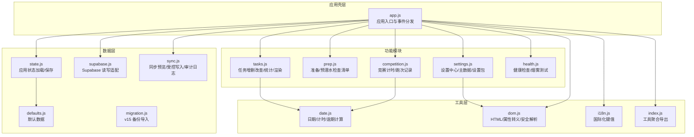
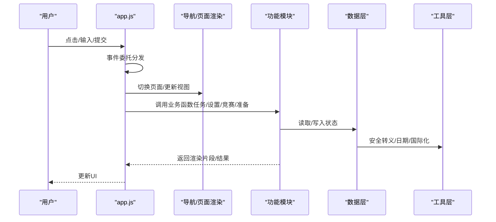
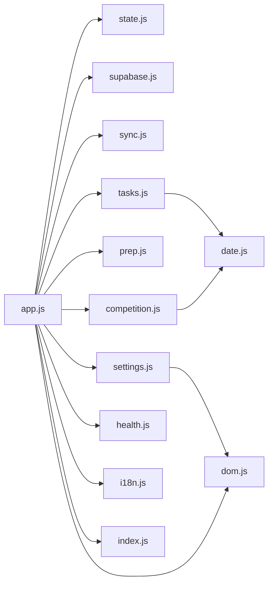
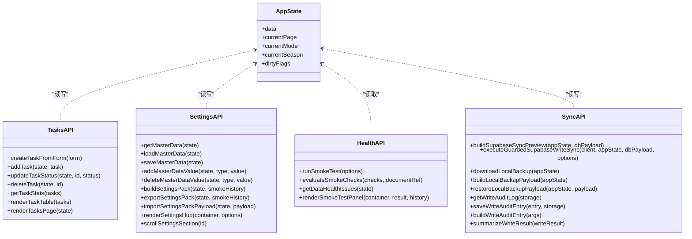

# API参考文档

<cite>
**本文档引用的文件**
- [app.js](file://v16/src/app.js)
- [README.md](file://v16/README.md)
- [state.js](file://v16/src/data/state.js)
- [defaults.js](file://v16/src/data/defaults.js)
- [migration.js](file://v16/src/data/migration.js)
- [supabase.js](file://v16/src/data/supabase.js)
- [sync.js](file://v16/src/data/sync.js)
- [tasks.js](file://v16/src/features/tasks.js)
- [settings.js](file://v16/src/features/settings.js)
- [competition.js](file://v16/src/features/competition.js)
- [prep.js](file://v16/src/features/prep.js)
- [health.js](file://v16/src/features/health.js)
- [dom.js](file://v16/src/utils/dom.js)
- [date.js](file://v16/src/utils/date.js)
- [i18n.js](file://v16/src/utils/i18n.js)
- [index.js](file://v16/src/utils/index.js)
- [MIGRATION_MANIFEST.md](file://v16/MIGRATION_MANIFEST.md)
</cite>

## 目录
1. [简介](#简介)
2. [项目结构](#项目结构)
3. [核心组件](#核心组件)
4. [架构总览](#架构总览)
5. [详细组件分析](#详细组件分析)
6. [依赖关系分析](#依赖关系分析)
7. [性能考虑](#性能考虑)
8. [故障排除指南](#故障排除指南)
9. [结论](#结论)
10. [附录](#附录)

## 简介
本文件为 ROV 任务管理 v16 的全面 API 参考文档，覆盖状态管理、功能模块与工具函数的公共接口、事件处理机制、数据传递格式、调用关系、参数校验与错误处理，并提供使用示例与代码片段路径。文档同时包含版本兼容性与废弃功能迁移指南，帮助开发者准确、完整地使用该系统的 API。

## 项目结构
v16 采用本地优先（local-first）单页应用架构，按职责拆分为 data、features、utils 三层：
- data：默认数据、状态持久化、Supabase 读取与同步、迁移与回滚
- features：页面与工作流模块（任务、准备检查、竞赛计时、设置中心、健康检查）
- utils：通用工具（DOM 安全、日期时间、国际化等）

图表来源
- [app.js:1-402](file://v16/src/app.js#L1-L402)
- [state.js:1-45](file://v16/src/data/state.js#L1-L45)
- [defaults.js:1-46](file://v16/src/data/defaults.js#L1-L46)
- [migration.js:1-100](file://v16/src/data/migration.js#L1-L100)
- [supabase.js](file://v16/src/data/supabase.js)
- [sync.js:1-341](file://v16/src/data/sync.js#L1-L341)
- [tasks.js:1-112](file://v16/src/features/tasks.js#L1-L112)
- [settings.js:1-592](file://v16/src/features/settings.js#L1-L592)
- [competition.js:1-68](file://v16/src/features/competition.js#L1-L68)
- [prep.js:1-58](file://v16/src/features/prep.js#L1-L58)
- [health.js:1-127](file://v16/src/features/health.js#L1-L127)
- [dom.js:1-21](file://v16/src/utils/dom.js#L1-L21)
- [date.js:1-55](file://v16/src/utils/date.js#L1-L55)
- [i18n.js](file://v16/src/utils/i18n.js)
- [index.js:1-3](file://v16/src/utils/index.js#L1-L3)

章节来源
- [README.md:1-68](file://v16/README.md#L1-L68)
- [MIGRATION_MANIFEST.md:1-76](file://v16/MIGRATION_MANIFEST.md#L1-L76)

## 核心组件
本节概述应用的核心 API 暴露点与控制流。

- 应用命名空间与入口
  - 全局挂载 window.ROV_V16，包含 state、render、save、smoke 等方法，用于外部脚本或调试访问。
  - 事件委托在 appRoot 上统一处理，包括页面切换、定时器控制、设置中心操作、表单提交与变更、文件导入等。
- 状态管理
  - 应用状态键名、初始状态构建、localStorage 加载与保存。
  - 脏标志（dirtyFlags）用于标记数据变更，便于选择性持久化。
- 数据健康与烟雾测试
  - 健康检查汇总数据问题；烟雾测试运行与历史记录持久化。
- 同步与审计
  - 同步预览（dry-run）、受控写入（create/update upsert，禁用删除）、Schema 探测与字段白名单过滤、写入审计日志。

章节来源
- [app.js:179-187](file://v16/src/app.js#L179-L187)
- [app.js:189-393](file://v16/src/app.js#L189-L393)
- [state.js:4-44](file://v16/src/data/state.js#L4-L44)
- [health.js:27-54](file://v16/src/features/health.js#L27-L54)

## 架构总览
下图展示从用户交互到数据层的调用链路与模块边界：

图表来源
- [app.js:104-131](file://v16/src/app.js#L104-L131)
- [tasks.js:84-112](file://v16/src/features/tasks.js#L84-L112)
- [settings.js:156-537](file://v16/src/features/settings.js#L156-L537)
- [competition.js:38-67](file://v16/src/features/competition.js#L38-L67)
- [prep.js:25-57](file://v16/src/features/prep.js#L25-L57)
- [dom.js:1-21](file://v16/src/utils/dom.js#L1-L21)
- [date.js:1-55](file://v16/src/utils/date.js#L1-L55)

## 详细组件分析

### 状态管理 API
- 存储键与初始状态
  - APP_STATE_STORAGE_KEY：应用状态存储键
  - createInitialState：基于默认状态构造初始应用状态
- 加载与保存
  - loadAppState：从 localStorage 加载并合并默认状态
  - saveAppState：保存当前状态至 localStorage，并清空脏标志
- 默认数据
  - DEFAULT_STATE：包含种子任务、成员、检查清单、装备等默认值

章节来源
- [state.js:4-44](file://v16/src/data/state.js#L4-L44)
- [defaults.js:1-46](file://v16/src/data/defaults.js#L1-L46)

### 功能模块 API

#### 任务管理模块（tasks.js）
- 表单到任务对象转换
  - createTaskFromForm(FormData) → 任务对象
- 任务 CRUD 与状态更新
  - addTask(state, task)：添加任务并标记脏
  - updateTaskStatus(state, id, status)：更新任务状态并标记脏
  - deleteTask(state, id)：删除任务并返回是否变更
- 统计与渲染
  - getTaskStats(tasks)：返回总数/开放/完成/逾期/阻塞
  - renderTaskTable(tasks)：生成表格 HTML
  - renderTasksPage(state)：生成任务页面 HTML
- 参数与返回值
  - 所有函数均接收 state 对象作为首参，返回布尔或数组/对象
  - 渲染函数返回字符串 HTML 片段

章节来源
- [tasks.js:5-17](file://v16/src/features/tasks.js#L5-L17)
- [tasks.js:19-37](file://v16/src/features/tasks.js#L19-L37)
- [tasks.js:39-48](file://v16/src/features/tasks.js#L39-L48)
- [tasks.js:50-82](file://v16/src/features/tasks.js#L50-L82)
- [tasks.js:84-112](file://v16/src/features/tasks.js#L84-L112)

#### 准备检查清单模块（prep.js）
- 检查项切换
  - toggleChecklistItem(state, listName, id)：切换指定清单项并标记脏
- 渲染
  - renderChecklist(listName, items)：生成清单 HTML
  - renderPrepCenter(state)：生成准备中心页面 HTML

章节来源
- [prep.js:5-11](file://v16/src/features/prep.js#L5-L11)
- [prep.js:13-23](file://v16/src/features/prep.js#L13-L23)
- [prep.js:25-57](file://v16/src/features/prep.js#L25-L57)

#### 竞赛计时模块（competition.js）
- 创建跑次
  - createMissionRun(state, elapsedSeconds)：从界面输入收集分数与备注，生成跑次并插入列表
- 渲染
  - renderRunHistory(runs)：跑次历史卡片列表
  - renderCompetitionCenter(state, timer)：生成竞赛中心页面 HTML

章节来源
- [competition.js:6-19](file://v16/src/features/competition.js#L6-L19)
- [competition.js:21-36](file://v16/src/features/competition.js#L21-L36)
- [competition.js:38-67](file://v16/src/features/competition.js#L38-L67)

#### 设置中心模块（settings.js）
- 主数据管理
  - getMasterData(state)：获取去重排序后的主数据
  - loadMasterData(state) / saveMasterData(state)：按赛季键持久化主数据
  - addMasterDataValue(state, type, value) / deleteMasterDataValue(state, type, value)：增删主数据项
- 设置包导入/导出
  - buildSettingsPack(state, smokeHistory)：构建设置包负载
  - exportSettingsPack(state, smokeHistory)：下载设置包文件
  - importSettingsPackPayload(state, payload)：导入设置包负载（支持 v15 主数据）
- 设置中心渲染
  - renderSettingsHub(container, options)：渲染设置中心页面与各面板
  - getSettingsCenterStats(...)：汇总数据/健康/审计等统计
  - scrollSettingsSection(id)：滚动到指定面板
- 常量
  - MASTER_DATA_TYPES：主数据类型枚举
  - MASTER_DATA_STORAGE_PREFIX：主数据存储键前缀
  - SETTINGS_PACK_TYPE：设置包类型标识

章节来源
- [settings.js:7-28](file://v16/src/features/settings.js#L7-L28)
- [settings.js:34-52](file://v16/src/features/settings.js#L34-L52)
- [settings.js:54-77](file://v16/src/features/settings.js#L54-L77)
- [settings.js:79-105](file://v16/src/features/settings.js#L79-L105)
- [settings.js:107-119](file://v16/src/features/settings.js#L107-L119)
- [settings.js:121-146](file://v16/src/features/settings.js#L121-L146)
- [settings.js:148-154](file://v16/src/features/settings.js#L148-L154)
- [settings.js:156-537](file://v16/src/features/settings.js#L156-L537)

#### 健康与烟雾测试模块（health.js）
- 烟雾测试
  - runSmokeTest(options)：执行检查并可选持久化
  - runV16ScaffoldSmokeTest(options)：v16 烟雾测试封装
  - evaluateSmokeChecks(checks, documentRef)：评估元素存在性
  - getSmokeTestLog(storage) / saveSmokeTestResult(result, storage)：历史记录存取
- 数据健康
  - getDataHealthIssues(state)：检查角色/任务类型/装备分类一致性与缺失问题
- 渲染
  - renderSmokeTestPanel(container, result, history)：渲染烟雾测试面板
  - renderSmokeTestSummaryHtml(result)：摘要 HTML

章节来源
- [health.js:14-54](file://v16/src/features/health.js#L14-L54)
- [health.js:56-84](file://v16/src/features/health.js#L56-L84)
- [health.js:96-122](file://v16/src/features/health.js#L96-L122)
- [health.js:124-126](file://v16/src/features/health.js#L124-L126)

### 工具函数 API

#### DOM 与安全（dom.js）
- escapeHtml(value)：HTML 转义
- escapeAttr(value)：属性转义
- safeJsonParse(raw, fallback)：安全 JSON 解析

章节来源
- [dom.js:1-21](file://v16/src/utils/dom.js#L1-L21)

#### 日期与计时（date.js）
- todayDateString(date)：今日日期字符串
- toDateInputValue(date)：日期输入值格式
- getWeekStart(date)：周起始日期
- getTaskDueInfo(task, today)：任务到期信息（天数）
- isOverdue(due, now)：是否逾期
- getOverdueDays(due, today)：逾期天数
- formatMissionTime(seconds)：竞赛计时格式化

章节来源
- [date.js:1-55](file://v16/src/utils/date.js#L1-L55)

#### 国际化（i18n.js）
- 提供 t() 键值翻译与 setLocale() 语言切换（由 app.js 在点击事件中调用）

章节来源
- [app.js:36](file://v16/src/app.js#L36)
- [app.js:190-195](file://v16/src/app.js#L190-L195)

### 数据与同步 API

#### 迁移（migration.js）
- importV15BackupPayload(appState, payload)：导入 v15 备份负载，规范化为 v16 结构
- summarizeV15Backup(payload)：统计导入条目数量
- 常量：V15_BACKUP_TYPE

章节来源
- [migration.js:75-99](file://v16/src/data/migration.js#L75-L99)
- [migration.js:60-73](file://v16/src/data/migration.js#L60-L73)
- [migration.js:3](file://v16/src/data/migration.js#L3)

#### Supabase 适配（supabase.js）
- 读取只读数据、探测 Schema、客户端创建与应用
- 与 app.js 事件绑定配合使用（加载只读、Schema 探测、受控写入）

章节来源
- [app.js:226-241](file://v16/src/app.js#L226-L241)
- [app.js:201-212](file://v16/src/app.js#L201-L212)
- [app.js:262-298](file://v16/src/app.js#L262-L298)

#### 同步与审计（sync.js）
- 配置
  - SYNC_TABLE_MAP：本地数据键到数据库表映射
  - WRITE_TABLE_WHITELIST：允许写入的表集合
  - WRITE_SCHEMA：静态字段白名单
- 预览
  - buildSupabaseSyncPreview(appState, dbPayload)：构建同步预览（dry-run），返回 create/update/remove 统计与详情
- 受控写入
  - executeGuardedSupabaseWriteSync(client, appState, dbPayload, options)：执行受控写入（仅 upsert，禁用删除），支持 Schema 白名单过滤与字段裁剪
  - validateRowsForSchema(table, rows, schemaStatus)：校验字段合法性
  - filterRowForSchema(table, row, schemaStatus)：按 Schema 过滤字段
- 备份与回滚
  - buildLocalBackupPayload(appState)：构建本地备份负载
  - restoreLocalBackupPayload(appState, payload)：从本地备份恢复
  - downloadLocalBackup(appState)：下载本地备份文件
- 审计日志
  - getWriteAuditLog(storage) / saveWriteAuditEntry(entry, storage)：审计日志读写
  - buildWriteAuditEntry({preview, writeResult, postWritePreview, tables})：构建审计条目
  - summarizeWriteResult(writeResult)：汇总写入结果

章节来源
- [sync.js:1-17](file://v16/src/data/sync.js#L1-L17)
- [sync.js:150-178](file://v16/src/data/sync.js#L150-L178)
- [sync.js:221-284](file://v16/src/data/sync.js#L221-L284)
- [sync.js:180-219](file://v16/src/data/sync.js#L180-L219)
- [sync.js:190-205](file://v16/src/data/sync.js#L190-L205)
- [sync.js:300-317](file://v16/src/data/sync.js#L300-L317)
- [sync.js:319-340](file://v16/src/data/sync.js#L319-L340)
- [sync.js:286-298](file://v16/src/data/sync.js#L286-L298)

### 事件处理机制与数据传递
- 页面切换与渲染
  - app.js 监听 [data-page] 点击，调用 showPage 并保存状态后重新渲染
- 表单提交
  - 任务表单提交触发 createTaskFromForm 与 addTask，随后持久化与渲染
- 状态变更
  - 任务状态选择、检查项切换、定时器控制等通过事件委托触发对应函数，更新 state 后持久化与渲染
- 设置中心操作
  - 加载只读数据、Schema 探测、构建同步预览、执行受控写入、导入/导出设置包、v15 备份导入、本地回滚等均通过 data-action 与 data-* 属性驱动

章节来源
- [app.js:141-145](file://v16/src/app.js#L141-L145)
- [app.js:346-352](file://v16/src/app.js#L346-L352)
- [app.js:354-364](file://v16/src/app.js#L354-L364)
- [app.js:214-217](file://v16/src/app.js#L214-L217)
- [app.js:226-241](file://v16/src/app.js#L226-L241)
- [app.js:243-261](file://v16/src/app.js#L243-L261)
- [app.js:262-298](file://v16/src/app.js#L262-L298)
- [app.js:300-307](file://v16/src/app.js#L300-L307)
- [app.js:365-393](file://v16/src/app.js#L365-L393)

### 使用示例与代码片段路径
- 添加任务
  - 步骤：表单提交 → createTaskFromForm → addTask → 保存状态 → 渲染
  - 示例路径：[表单提交处理:346-352](file://v16/src/app.js#L346-L352)，[任务创建:5-17](file://v16/src/features/tasks.js#L5-L17)，[添加任务:19-22](file://v16/src/features/tasks.js#L19-L22)
- 更新任务状态
  - 步骤：选择框变更 → updateTaskStatus → 保存状态 → 渲染
  - 示例路径：[变更监听:354-358](file://v16/src/app.js#L354-L358)，[更新状态:24-30](file://v16/src/features/tasks.js#L24-L30)
- 删除任务
  - 步骤：点击删除 → deleteTask → 保存状态 → 渲染
  - 示例路径：[删除监听:327-331](file://v16/src/app.js#L327-L331)，[删除任务:32-37](file://v16/src/features/tasks.js#L32-L37)
- 导入 v15 备份
  - 步骤：选择文件 → FileReader → JSON.parse → importV15BackupPayload → 保存状态 → 渲染
  - 示例路径：[文件导入监听:365-393](file://v16/src/app.js#L365-L393)，[导入实现:75-99](file://v16/src/data/migration.js#L75-L99)
- 受控写入同步
  - 步骤：构建预览 → 下载本地备份 → 执行受控写入 → 保存审计日志 → 重新加载只读并生成后写预览
  - 示例路径：[构建预览:243-261](file://v16/src/app.js#L243-L261)，[执行写入:262-298](file://v16/src/app.js#L262-L298)，[写入实现:221-284](file://v16/src/data/sync.js#L221-L284)，[审计条目:319-340](file://v16/src/data/sync.js#L319-L340)

章节来源
- [app.js:346-352](file://v16/src/app.js#L346-L352)
- [tasks.js:5-17](file://v16/src/features/tasks.js#L5-L17)
- [tasks.js:24-37](file://v16/src/features/tasks.js#L24-L37)
- [app.js:327-331](file://v16/src/app.js#L327-L331)
- [app.js:365-393](file://v16/src/app.js#L365-L393)
- [migration.js:75-99](file://v16/src/data/migration.js#L75-L99)
- [app.js:243-261](file://v16/src/app.js#L243-L261)
- [app.js:262-298](file://v16/src/app.js#L262-L298)
- [sync.js:221-284](file://v16/src/data/sync.js#L221-L284)
- [sync.js:319-340](file://v16/src/data/sync.js#L319-L340)

### 参数验证与错误处理
- 参数校验
  - 任务状态更新：查找任务存在性校验
  - 主数据增删：类型存在性与非空校验
  - 受控写入：确认文本匹配、禁用删除、Schema 字段白名单校验
- 错误处理
  - 安全 JSON 解析失败时返回默认值
  - 写入失败时记录错误消息并保存审计日志
  - UI 中对异常进行提示（alert）

章节来源
- [tasks.js:24-30](file://v16/src/features/tasks.js#L24-L30)
- [settings.js:54-77](file://v16/src/features/settings.js#L54-L77)
- [sync.js:228-234](file://v16/src/data/sync.js#L228-L234)
- [sync.js:134-148](file://v16/src/data/sync.js#L134-L148)
- [dom.js:14-20](file://v16/src/utils/dom.js#L14-L20)
- [app.js:209-211](file://v16/src/app.js#L209-L211)
- [app.js:292-297](file://v16/src/app.js#L292-L297)

### 版本兼容性与废弃功能迁移指南
- v15 备份导入
  - 支持导入 v15 系统备份 JSON，映射任务、成员、检查清单、预潜水检查清单、跑次、装备、笔记与策略等字段
  - 迁移后保留当前赛季与主数据
- v16 本地回滚
  - 从 rov_v16_local_backup JSON 恢复本地状态，不涉及数据库写入
- 迁移清单
  - v16 迁移清单记录了模块所有权与提取状态，包含烟雾测试、受控写入、Schema 探测、审计日志等完成情况

章节来源
- [migration.js:75-99](file://v16/src/data/migration.js#L75-L99)
- [sync.js:190-205](file://v16/src/data/sync.js#L190-L205)
- [MIGRATION_MANIFEST.md:48-76](file://v16/MIGRATION_MANIFEST.md#L48-L76)

## 依赖关系分析

图表来源
- [app.js:1-36](file://v16/src/app.js#L1-L36)
- [tasks.js:1-4](file://v16/src/features/tasks.js#L1-L4)
- [settings.js:1-3](file://v16/src/features/settings.js#L1-L3)
- [competition.js:1-4](file://v16/src/features/competition.js#L1-L4)
- [prep.js:1-4](file://v16/src/features/prep.js#L1-L4)
- [health.js:1-2](file://v16/src/features/health.js#L1-L2)
- [dom.js:1-3](file://v16/src/utils/dom.js#L1-L3)
- [date.js:1-55](file://v16/src/utils/date.js#L1-L55)
- [i18n.js](file://v16/src/utils/i18n.js)
- [index.js:1-3](file://v16/src/utils/index.js#L1-L3)

## 性能考虑
- 渲染优化
  - 仅在状态变更时保存与渲染，利用脏标志减少不必要的持久化与重绘
- 计算优化
  - 任务统计与逾期计算在前端完成，建议在大数据集时考虑虚拟滚动与分页
- 同步策略
  - 受控写入仅 upsert，避免删除带来的复杂性与风险；Schema 白名单过滤减少无效字段传输
- 存储策略
  - 烟雾测试与审计日志限制历史长度，避免无限增长

## 故障排除指南
- 烟雾测试失败
  - 检查页面元素是否存在；查看最新烟雾测试结果与历史记录
  - 示例路径：[运行烟雾测试:37-54](file://v16/src/features/health.js#L37-L54)，[渲染面板:96-122](file://v16/src/features/health.js#L96-L122)
- 只读加载失败
  - 查看 dbStatus.error 字段；确认 Supabase 连接与权限
  - 示例路径：[加载只读数据:226-241](file://v16/src/app.js#L226-L241)
- 同步预览异常
  - 确认已先加载只读数据；检查预览错误信息
  - 示例路径：[构建预览:243-261](file://v16/src/app.js#L243-L261)，[预览实现:150-178](file://v16/src/data/sync.js#L150-L178)
- 受控写入失败
  - 确认确认文本、禁用删除、Schema 白名单；查看审计日志中的 droppedFields 与错误详情
  - 示例路径：[执行写入:262-298](file://v16/src/app.js#L262-L298)，[写入实现:221-284](file://v16/src/data/sync.js#L221-L284)，[审计日志:300-317](file://v16/src/data/sync.js#L300-L317)

章节来源
- [health.js:37-54](file://v16/src/features/health.js#L37-L54)
- [health.js:96-122](file://v16/src/features/health.js#L96-L122)
- [app.js:226-241](file://v16/src/app.js#L226-L241)
- [app.js:243-261](file://v16/src/app.js#L243-L261)
- [sync.js:150-178](file://v16/src/data/sync.js#L150-L178)
- [app.js:262-298](file://v16/src/app.js#L262-L298)
- [sync.js:221-284](file://v16/src/data/sync.js#L221-L284)
- [sync.js:300-317](file://v16/src/data/sync.js#L300-L317)

## 结论
v16 通过清晰的模块划分与严格的受控写入策略，提供了安全、可审计且易于扩展的任务管理能力。开发者可通过本文档快速定位 API 使用方式、参数与返回值、事件处理流程与错误处理策略，并结合迁移清单与示例路径高效集成与维护系统。

## 附录

### 类关系图（代码级）

图表来源
- [state.js:6-14](file://v16/src/data/state.js#L6-L14)
- [tasks.js:5-112](file://v16/src/features/tasks.js#L5-L112)
- [settings.js:23-537](file://v16/src/features/settings.js#L23-L537)
- [health.js:14-122](file://v16/src/features/health.js#L14-L122)
- [sync.js:150-340](file://v16/src/data/sync.js#L150-L340)