# Supabase集成API

<cite>
**本文档引用的文件**
- [supabase.js](file://v16/src/data/supabase.js)
- [sync.js](file://v16/src/data/sync.js)
- [state.js](file://v16/src/data/state.js)
- [app.js](file://v16/src/app.js)
- [settings.js](file://v16/src/features/settings.js)
- [defaults.js](file://v16/src/data/defaults.js)
</cite>

## 目录
1. [简介](#简介)
2. [项目结构](#项目结构)
3. [核心组件](#核心组件)
4. [架构概览](#架构概览)
5. [详细组件分析](#详细组件分析)
6. [依赖关系分析](#依赖关系分析)
7. [性能考虑](#性能考虑)
8. [故障排除指南](#故障排除指南)
9. [结论](#结论)

## 简介

ROV任务管理v16项目的Supabase集成API提供了完整的数据库操作能力，包括只读数据加载、受保护的写入同步和数据同步预览功能。该系统采用安全的增量同步策略，确保本地数据与云端数据库保持一致，同时提供完整的审计日志和回滚机制。

系统支持以下主要功能：
- **只读数据加载**：从Supabase数据库批量获取所有表的数据
- **受保护写入同步**：基于白名单的增量写入，防止意外删除
- **数据同步预览**：在执行实际写入前提供详细的差异分析
- **安全审计日志**：记录所有写入操作的历史和结果
- **Schema探测**：动态检测数据库列的存在性

## 项目结构

Supabase集成API位于`v16/src/data/`目录下，主要包含以下文件：

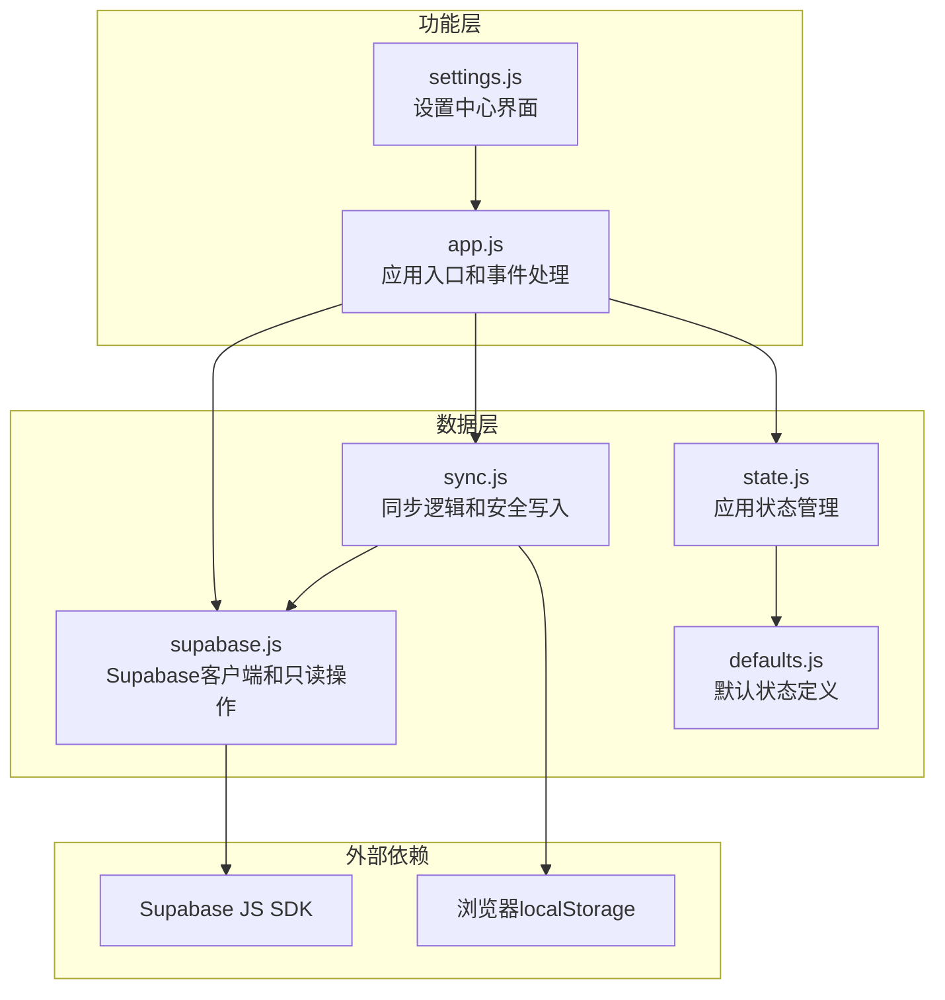

**图表来源**
- [supabase.js:1-157](file://v16/src/data/supabase.js#L1-L157)
- [sync.js:1-341](file://v16/src/data/sync.js#L1-L341)
- [app.js:1-402](file://v16/src/app.js#L1-L402)

**章节来源**
- [supabase.js:1-157](file://v16/src/data/supabase.js#L1-L157)
- [sync.js:1-341](file://v16/src/data/sync.js#L1-L341)
- [state.js:1-45](file://v16/src/data/state.js#L1-L45)

## 核心组件

### Supabase客户端配置

系统使用集中式的Supabase配置常量：

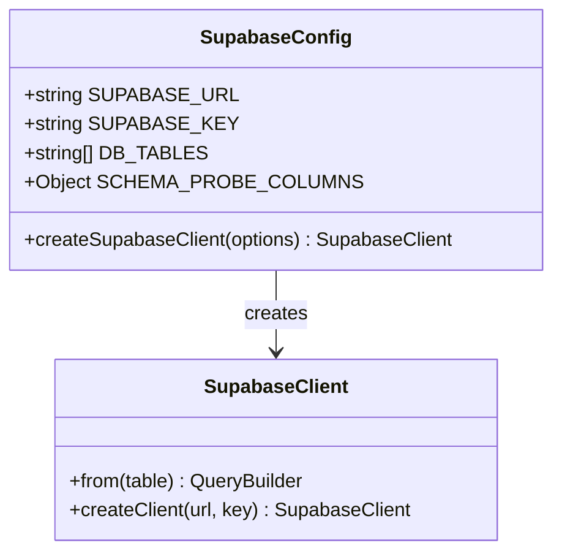

**图表来源**
- [supabase.js:1-29](file://v16/src/data/supabase.js#L1-L29)

### 数据库表映射

系统支持以下数据库表的同步：

| 表名 | 同步键 | 用途 |
|------|--------|------|
| tasks | id | 任务列表 |
| members | id | 团队成员 |
| checklist_items | item_id | 任务检查清单 |
| predive_checklist_items | item_id | 出发前检查清单 |
| intel | id | 智能信息 |
| notes | id | 备注信息 |
| strategy_items | id | 战略项目 |
| mission_runs | id | 任务运行记录 |

**章节来源**
- [supabase.js:4-13](file://v16/src/data/supabase.js#L4-L13)
- [sync.js:1-7](file://v16/src/data/sync.js#L1-L7)

## 架构概览

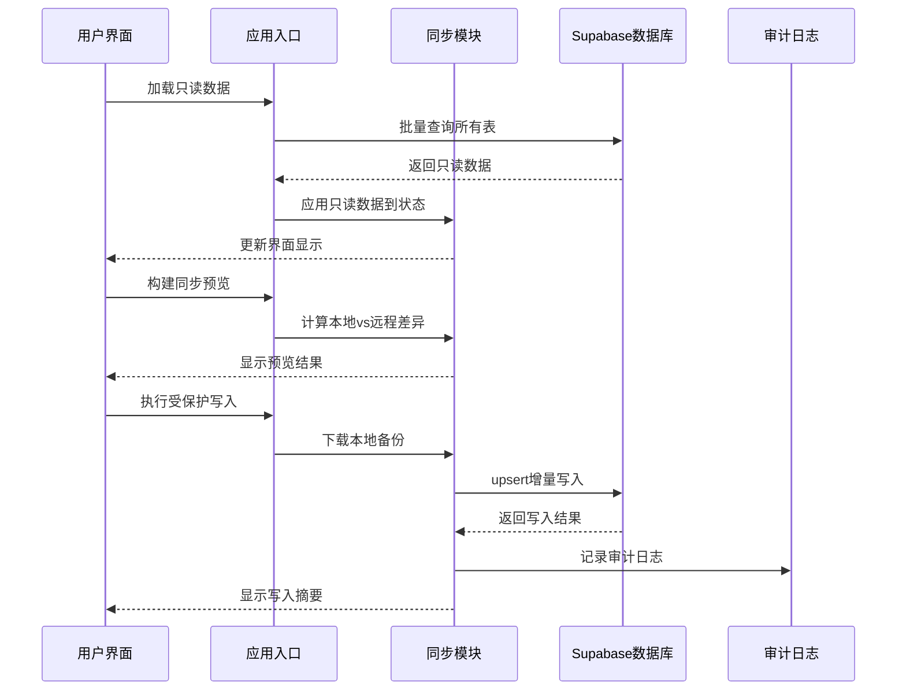

**图表来源**
- [app.js:226-299](file://v16/src/app.js#L226-L299)
- [sync.js:221-284](file://v16/src/data/sync.js#L221-L284)

## 详细组件分析

### 只读数据加载系统

#### createSupabaseClient()函数

负责创建Supabase客户端实例：

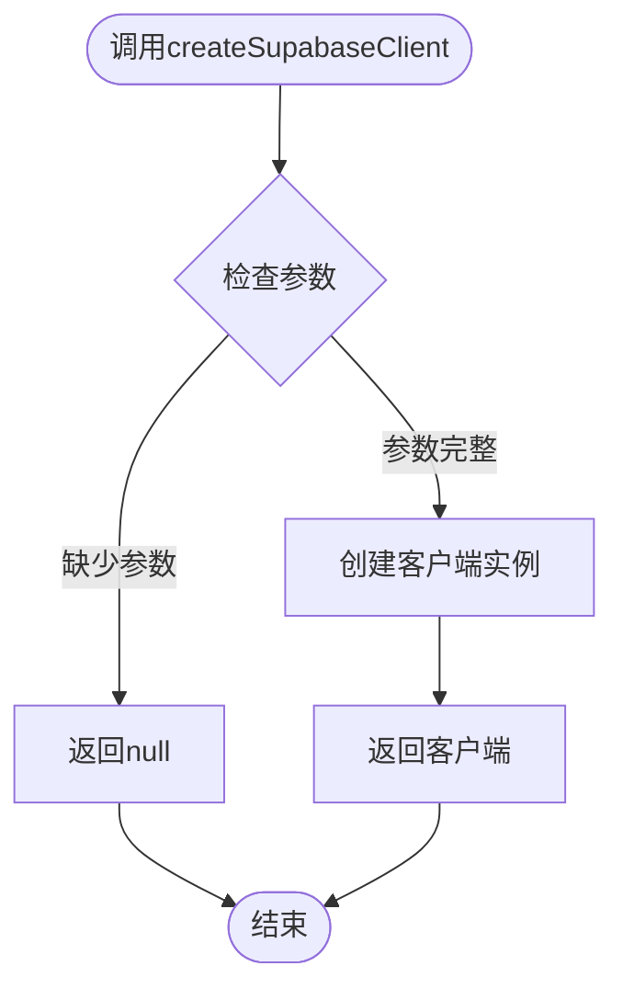

**图表来源**
- [supabase.js:26-29](file://v16/src/data/supabase.js#L26-L29)

#### loadSupabaseReadOnly()函数

实现并发的多表数据加载：

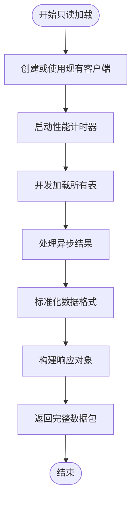

**图表来源**
- [supabase.js:79-121](file://v16/src/data/supabase.js#L79-L121)

#### applySupabaseReadOnlyData()函数

将只读数据应用到应用状态：

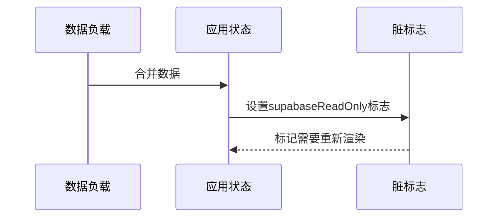

**图表来源**
- [supabase.js:123-129](file://v16/src/data/supabase.js#L123-L129)

**章节来源**
- [supabase.js:26-129](file://v16/src/data/supabase.js#L26-L129)

### 同步预览系统

#### buildSupabaseSyncPreview()函数

计算本地数据与远程数据的差异：

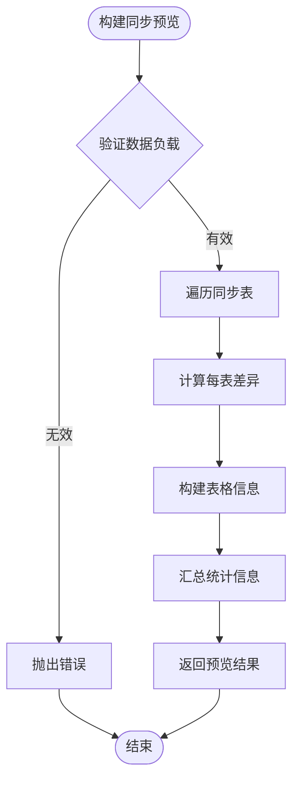

**图表来源**
- [sync.js:150-178](file://v16/src/data/sync.js#L150-L178)

**章节来源**
- [sync.js:150-178](file://v16/src/data/sync.js#L150-L178)

### 受保护写入同步系统

#### executeGuardedSupabaseWriteSync()函数

实现安全的增量写入同步：

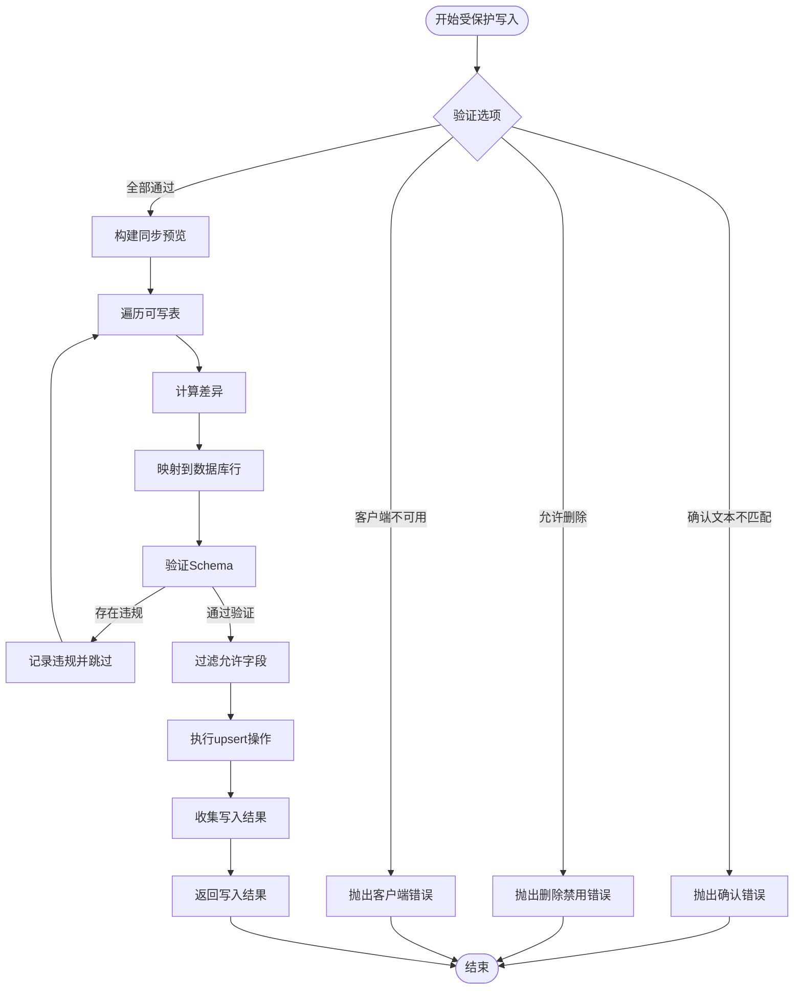

**图表来源**
- [sync.js:221-284](file://v16/src/data/sync.js#L221-L284)

#### 核心同步参数配置

| 参数名称 | 类型 | 默认值 | 描述 |
|----------|------|--------|------|
| confirmText | string | '' | 必须与WRITE_CONFIRM_TEXT匹配才能启用写入 |
| tables | Array<string> | WRITE_TABLE_WHITELIST | 允许写入的表列表 |
| allowDelete | boolean | false | 是否允许删除操作（始终为false） |
| schemaStatus | object | null | Schema探测状态 |

**章节来源**
- [sync.js:221-284](file://v16/src/data/sync.js#L221-L284)

### 数据标准化和验证系统

#### 数据规范化函数

系统为不同表类型提供专门的数据规范化函数：

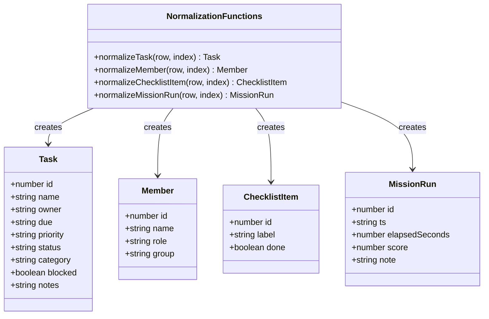

**图表来源**
- [supabase.js:31-70](file://v16/src/data/supabase.js#L31-L70)

**章节来源**
- [supabase.js:31-70](file://v16/src/data/supabase.js#L31-L70)

### Schema探测和验证系统

#### probeSupabaseSchema()函数

动态探测数据库Schema兼容性：

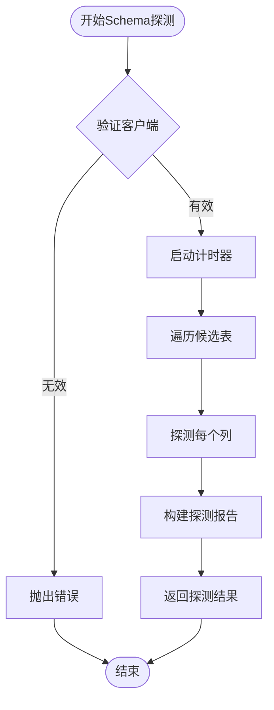

**图表来源**
- [supabase.js:131-156](file://v16/src/data/supabase.js#L131-L156)

#### Schema验证规则

| 表名 | 允许字段 | 验证方式 |
|------|----------|----------|
| tasks | id, name, owner, due, priority, status, cat | 静态+动态组合验证 |
| members | id, name, role | 静态+动态组合验证 |
| checklist_items | item_id, label, done, order_index | 动态验证 |
| predive_checklist_items | item_id, label, done, order_index | 动态验证 |

**章节来源**
- [supabase.js:131-156](file://v16/src/data/supabase.js#L131-L156)
- [sync.js:12-17](file://v16/src/data/sync.js#L12-L17)

### 审计日志系统

#### 写入审计日志

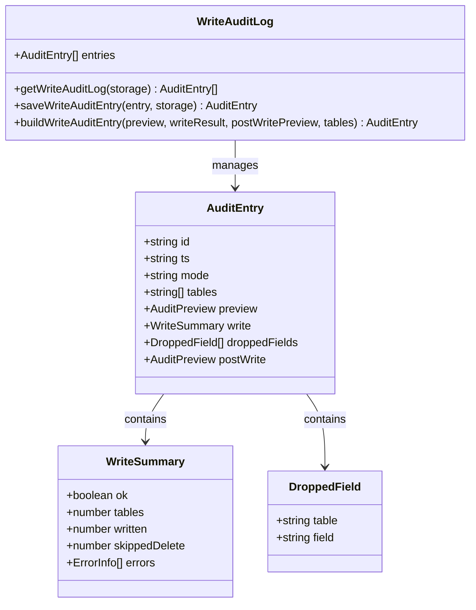

**图表来源**
- [sync.js:300-340](file://v16/src/data/sync.js#L300-L340)

**章节来源**
- [sync.js:300-340](file://v16/src/data/sync.js#L300-L340)

## 依赖关系分析

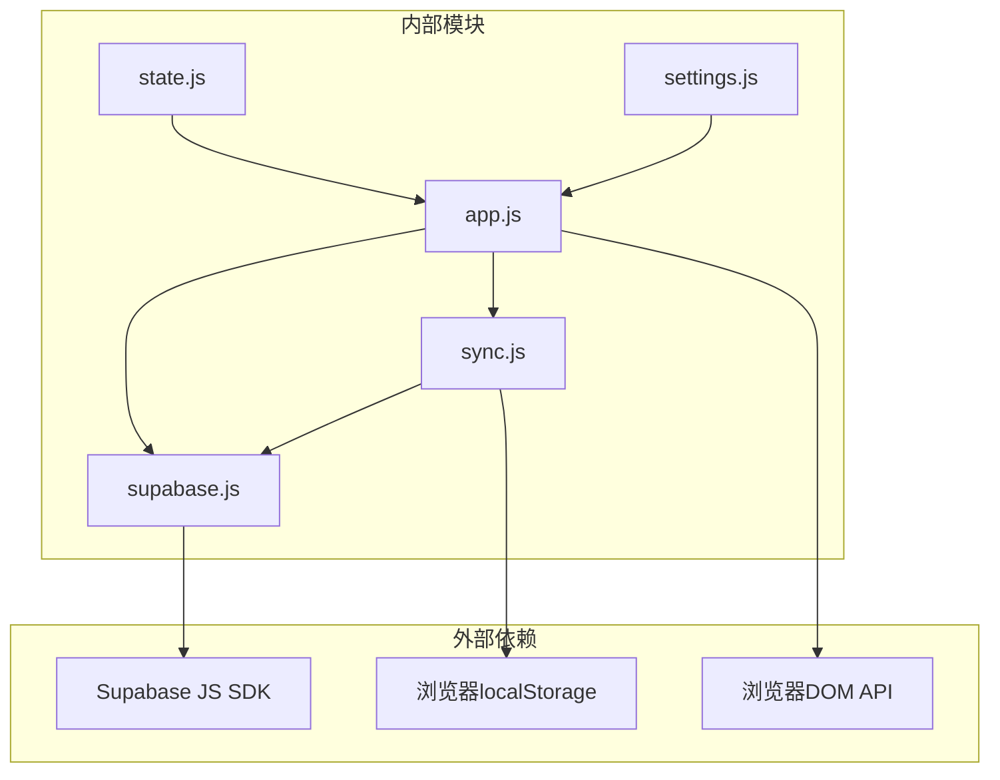

**图表来源**
- [supabase.js:1-157](file://v16/src/data/supabase.js#L1-L157)
- [sync.js:1-341](file://v16/src/data/sync.js#L1-L341)
- [app.js:1-402](file://v16/src/app.js#L1-L402)

### 模块间耦合度分析

| 模块 | 耦合关系 | 影响范围 |
|------|----------|----------|
| supabase.js | 低耦合 | 独立的数据库访问层 |
| sync.js | 中等耦合 | 依赖supabase.js和应用状态 |
| app.js | 高耦合 | 依赖所有其他模块 |
| settings.js | 中等耦合 | 仅依赖app.js的状态 |

**章节来源**
- [app.js:1-14](file://v16/src/app.js#L1-L14)

## 性能考虑

### 并发优化策略

1. **批量只读加载**：使用`Promise.allSettled`并发查询所有表，提升加载效率
2. **增量同步**：只传输差异数据，减少网络开销
3. **Schema缓存**：探测结果缓存在应用状态中，避免重复查询

### 内存管理

1. **数据规范化**：统一数据格式，减少内存占用
2. **审计日志限制**：最多保存20条审计记录
3. **状态持久化**：智能的脏标志管理，避免不必要的重渲染

### 错误处理策略

1. **渐进式失败**：单表失败不影响整体操作
2. **详细错误信息**：提供具体的错误上下文
3. **优雅降级**：在部分功能失效时保持基本功能

## 故障排除指南

### 常见问题及解决方案

#### 连接问题

**症状**：`Supabase client is unavailable`
**原因**：客户端初始化失败或配置错误
**解决**：
1. 检查SUPABASE_URL和SUPABASE_KEY配置
2. 确认Supabase JS SDK已正确加载
3. 验证网络连接和防火墙设置

#### Schema不匹配

**症状**：`Schema validation failed: 字段名`
**原因**：数据库列不存在或权限不足
**解决**：
1. 使用`probeSupabaseSchema()`检查Schema状态
2. 在数据库中添加缺失的列
3. 检查用户权限设置

#### 写入冲突

**症状**：写入操作被拒绝
**原因**：字段不在允许列表内或违反约束
**解决**：
1. 检查WRITE_SCHEMA配置
2. 验证数据格式和类型
3. 确认onConflict处理逻辑

#### 审计日志问题

**症状**：审计日志为空或异常
**原因**：localStorage存储限制或序列化错误
**解决**：
1. 清理localStorage中的旧数据
2. 检查浏览器隐私模式设置
3. 验证JSON序列化兼容性

**章节来源**
- [sync.js:228-233](file://v16/src/data/sync.js#L228-L233)
- [supabase.js:131-156](file://v16/src/data/supabase.js#L131-L156)

## 结论

ROV任务管理v16项目的Supabase集成API设计精良，实现了以下关键特性：

1. **安全性优先**：通过白名单验证和受保护写入机制，确保数据完整性
2. **用户体验**：提供详细的同步预览和审计日志，增强透明度
3. **性能优化**：采用并发加载和增量同步策略，提升系统响应速度
4. **错误处理**：完善的错误捕获和恢复机制，保证系统稳定性

该系统为ROV任务管理提供了可靠的云端数据同步能力，支持团队协作和数据备份需求。通过持续监控和维护，可以进一步优化性能和扩展新功能。