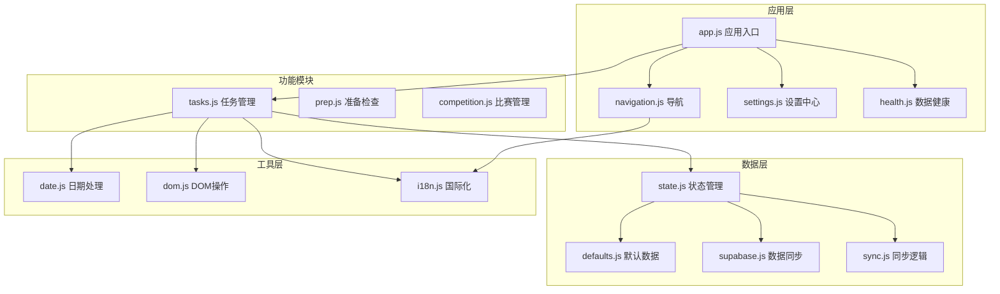
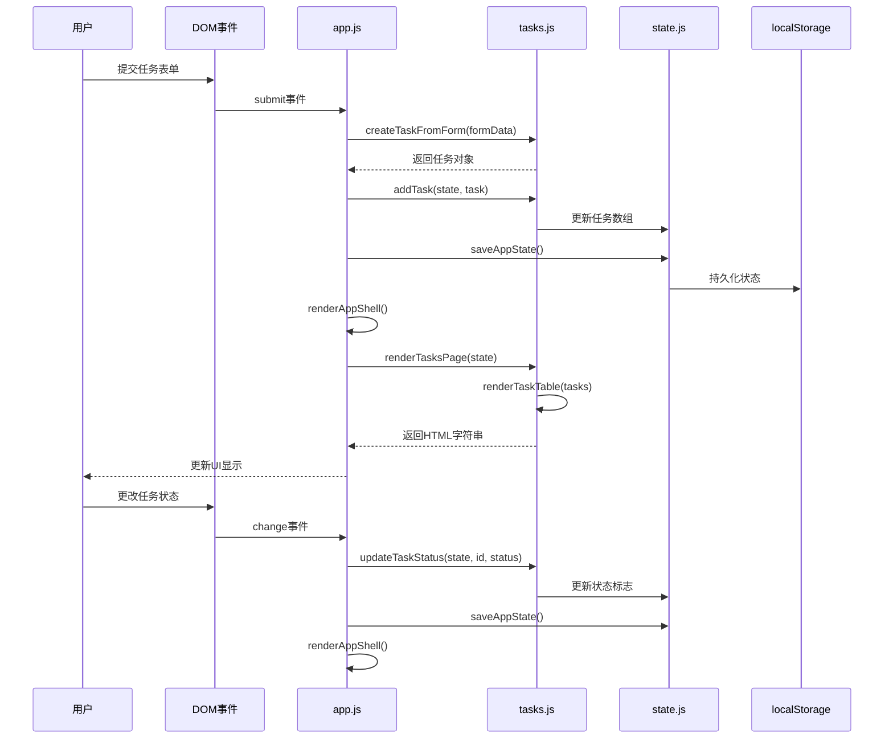
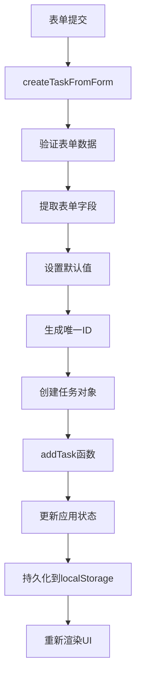
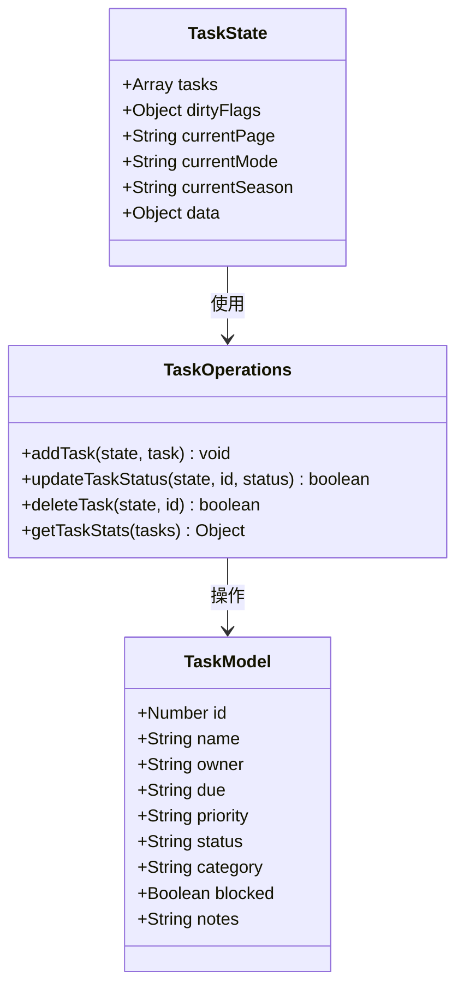
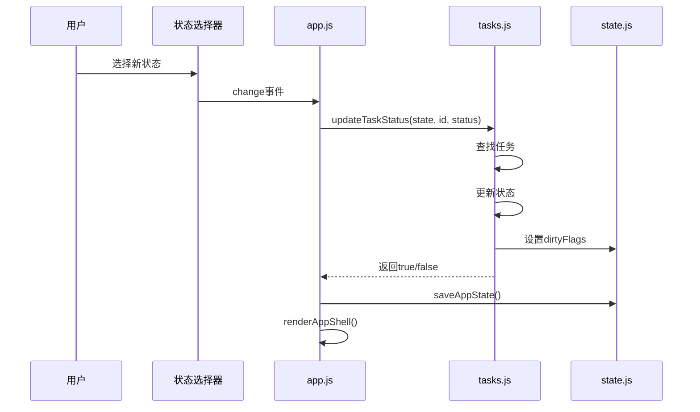
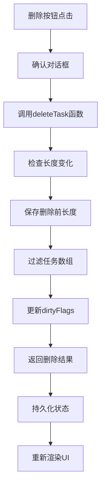
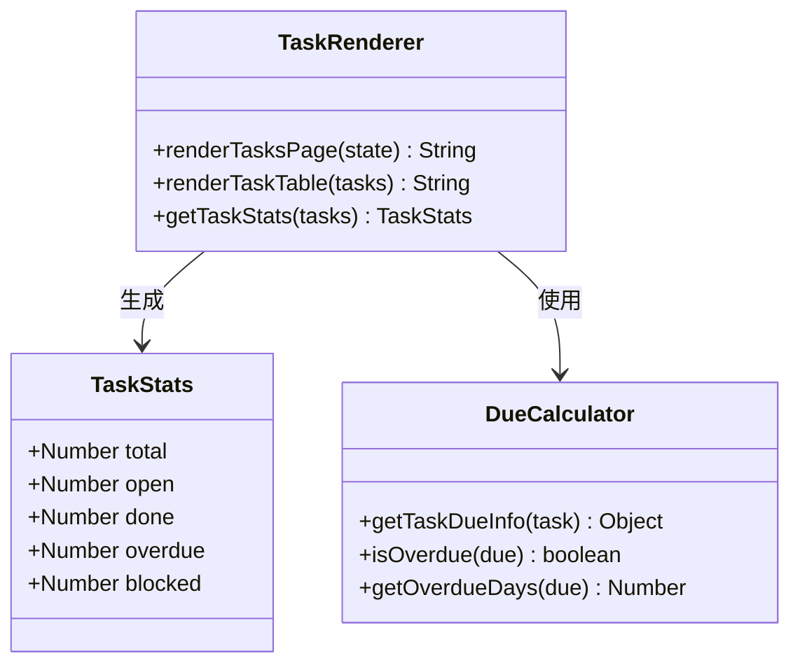
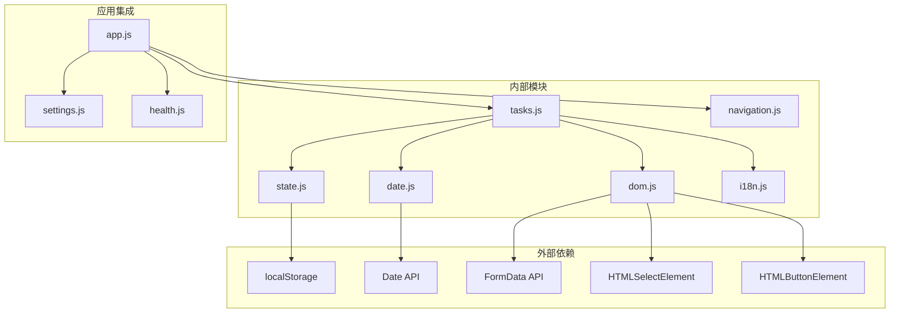

# 任务管理模块API

<cite>
**本文档引用的文件**
- [tasks.js](file://v16/src/features/tasks.js)
- [state.js](file://v16/src/data/state.js)
- [defaults.js](file://v16/src/data/defaults.js)
- [app.js](file://v16/src/app.js)
- [date.js](file://v16/src/utils/date.js)
- [dom.js](file://v16/src/utils/dom.js)
- [i18n.js](file://v16/src/utils/i18n.js)
- [navigation.js](file://v16/src/features/navigation.js)
- [settings.js](file://v16/src/features/settings.js)
- [health.js](file://v16/src/features/health.js)
- [README.md](file://v16/README.md)
</cite>

## 目录
1. [简介](#简介)
2. [项目结构](#项目结构)
3. [核心组件](#核心组件)
4. [架构概览](#架构概览)
5. [详细组件分析](#详细组件分析)
6. [依赖分析](#依赖分析)
7. [性能考虑](#性能考虑)
8. [故障排除指南](#故障排除指南)
9. [结论](#结论)
10. [附录](#附录)

## 简介
ROV任务管理v16项目的任务管理模块是一个完整的本地优先任务管理系统，提供了任务的创建、状态更新、删除和UI渲染功能。该模块采用模块化设计，与状态管理、国际化、日期处理等辅助模块紧密集成，支持localStorage持久化和Supabase数据库同步。

## 项目结构
任务管理模块位于`v16/src/features/tasks.js`，是ROV任务管理v16项目的核心功能模块之一。该项目遵循清晰的分层架构：



**图表来源**
- [app.js:1-402](file://v16/src/app.js#L1-L402)
- [tasks.js:1-112](file://v16/src/features/tasks.js#L1-L112)
- [state.js:1-45](file://v16/src/data/state.js#L1-L45)

**章节来源**
- [README.md:1-68](file://v16/README.md#L1-L68)
- [app.js:1-402](file://v16/src/app.js#L1-L402)

## 核心组件
任务管理模块包含以下核心组件：

### 任务数据模型
任务对象具有以下结构：
- `id`: 唯一标识符（自动生成）
- `name`: 任务名称（必填）
- `owner`: 负责人
- `due`: 截止日期
- `priority`: 优先级（High/Medium/Low）
- `status`: 状态（Open/In Progress/Done）
- `category`: 分类
- `blocked`: 是否阻塞
- `notes`: 备注

### 状态枚举
- **状态**: Open, In Progress, Done
- **优先级**: High, Medium, Low
- **阻塞状态**: blocked布尔值

### 主要API函数
1. `createTaskFromForm()`: 从表单创建任务
2. `addTask()`: 添加任务到状态
3. `updateTaskStatus()`: 更新任务状态
4. `deleteTask()`: 删除任务
5. `renderTasksPage()`: 渲染任务页面
6. `renderTaskTable()`: 渲染任务表格

**章节来源**
- [tasks.js:5-17](file://v16/src/features/tasks.js#L5-L17)
- [tasks.js:19-37](file://v16/src/features/tasks.js#L19-L37)
- [tasks.js:84-112](file://v16/src/features/tasks.js#L84-L112)

## 架构概览
任务管理模块采用事件驱动的架构模式，通过DOM事件监听器响应用户交互：



**图表来源**
- [app.js:346-352](file://v16/src/app.js#L346-L352)
- [app.js:354-359](file://v16/src/app.js#L354-L359)
- [tasks.js:19-37](file://v16/src/features/tasks.js#L19-L37)

## 详细组件分析

### 任务创建与表单处理
任务创建流程通过表单提交事件触发：



**图表来源**
- [tasks.js:5-17](file://v16/src/features/tasks.js#L5-L17)
- [tasks.js:19-22](file://v16/src/features/tasks.js#L19-L22)

#### 表单字段映射
| 表单字段 | 任务属性 | 默认值 | 必填 |
|---------|---------|--------|------|
| name | name | 'Untitled task' | 是 |
| owner | owner | 'Unassigned' | 否 |
| due | due | '' | 否 |
| priority | priority | 'Medium' | 否 |
| status | status | 'Open' | 否 |
| category | category | 'General' | 否 |
| blocked | blocked | false | 否 |
| notes | notes | '' | 否 |

**章节来源**
- [tasks.js:5-17](file://v16/src/features/tasks.js#L5-L17)
- [app.js:346-352](file://v16/src/app.js#L346-L352)

### 任务状态管理
任务状态管理采用简单直接的方法：



**图表来源**
- [state.js:6-14](file://v16/src/data/state.js#L6-L14)
- [tasks.js:19-48](file://v16/src/features/tasks.js#L19-L48)

#### 状态更新流程
状态更新通过选择器事件处理：



**图表来源**
- [app.js:354-359](file://v16/src/app.js#L354-L359)
- [tasks.js:24-30](file://v16/src/features/tasks.js#L24-L30)

**章节来源**
- [tasks.js:24-30](file://v16/src/features/tasks.js#L24-L30)
- [app.js:354-359](file://v16/src/app.js#L354-L359)

### 任务删除功能
任务删除采用过滤方式实现：



**图表来源**
- [app.js:327-331](file://v16/src/app.js#L327-L331)
- [tasks.js:32-37](file://v16/src/features/tasks.js#L32-L37)

**章节来源**
- [tasks.js:32-37](file://v16/src/features/tasks.js#L32-L37)
- [app.js:327-331](file://v16/src/app.js#L327-L331)

### 任务统计与UI渲染
任务统计功能提供实时数据分析：



**图表来源**
- [tasks.js:39-48](file://v16/src/features/tasks.js#L39-L48)
- [tasks.js:50-82](file://v16/src/features/tasks.js#L50-L82)

#### 统计指标计算
| 指标 | 计算公式 | 用途 |
|------|----------|------|
| 总任务数 | tasks.length | 整体规模 |
| 开放任务数 | filter(status !== 'Done') | 进行中工作量 |
| 完成任务数 | total - open | 已完成工作量 |
| 超期任务数 | open.filter(isOverdue) | 逾期风险 |
| 阻塞任务数 | open.filter(blocked) | 关键路径 |

**章节来源**
- [tasks.js:39-48](file://v16/src/features/tasks.js#L39-L48)
- [tasks.js:50-82](file://v16/src/features/tasks.js#L50-L82)

### 页面渲染架构
任务页面采用卡片式布局设计：

```mermaid
graph TB
subgraph "任务页面结构"
Page[page-tasks 容器]
TopBar[顶部栏]
StatsCard[统计卡片]
FormCard[任务表单卡片]
TableCard[任务表格卡片]
end
subgraph "统计信息"
OpenTasks[开放任务: {stats.open}]
OverdueTasks[超期任务: {stats.overdue}]
BlockedTasks[阻塞任务: {stats.blocked}]
end
subgraph "表单字段"
NameInput[任务名称]
OwnerInput[负责人]
DueDate[截止日期]
PrioritySelect[优先级]
CategorySelect[分类]
StatusSelect[状态]
BlockedCheckbox[阻塞标记]
SubmitButton[添加任务]
end
Page --> TopBar
Page --> StatsCard
Page --> FormCard
Page --> TableCard
TopBar --> OpenTasks
TopBar --> OverdueTasks
TopBar --> BlockedTasks
FormCard --> NameInput
FormCard --> OwnerInput
FormCard --> DueDate
FormCard --> PrioritySelect
FormCard --> CategorySelect
FormCard --> StatusSelect
FormCard --> BlockedCheckbox
FormCard --> SubmitButton
```

**图表来源**
- [tasks.js:84-112](file://v16/src/features/tasks.js#L84-L112)

**章节来源**
- [tasks.js:84-112](file://v16/src/features/tasks.js#L84-L112)

## 依赖分析
任务管理模块的依赖关系如下：



**图表来源**
- [tasks.js:1-4](file://v16/src/features/tasks.js#L1-L4)
- [app.js:1-36](file://v16/src/app.js#L1-L36)

### 核心依赖关系
1. **状态管理依赖**: 任务操作直接修改`state.data.tasks`数组
2. **国际化依赖**: 所有UI文本通过`i18n.js`的`t()`函数获取
3. **日期处理依赖**: 使用`date.js`提供的日期计算函数
4. **安全渲染依赖**: 使用`dom.js`的`escapeHtml()`防止XSS攻击

**章节来源**
- [tasks.js:1-4](file://v16/src/features/tasks.js#L1-L4)
- [app.js:1-36](file://v16/src/app.js#L1-L36)

## 性能考虑
任务管理模块在设计时考虑了以下性能优化：

### 内存管理
- **数组操作**: 使用`unshift()`和`filter()`进行O(n)操作
- **状态标志**: 通过`dirtyFlags`避免不必要的重渲染
- **字符串转义**: 在渲染时统一进行HTML转义，减少重复计算

### 渲染优化
- **条件渲染**: 当无任务时显示友好提示而非空表格
- **懒加载**: 仅在需要时计算过期天数和统计信息
- **事件委托**: 使用事件冒泡机制减少事件监听器数量

### 存储优化
- **增量持久化**: 仅在状态变更时保存到localStorage
- **结构化克隆**: 使用`structuredClone()`确保数据完整性

## 故障排除指南

### 常见问题及解决方案

#### 1. 任务无法保存
**症状**: 添加任务后刷新页面任务消失
**原因**: localStorage访问权限问题或存储空间不足
**解决方案**:
- 检查浏览器隐私设置
- 清理localStorage缓存
- 确认浏览器支持localStorage

#### 2. 状态更新失败
**症状**: 更改任务状态后UI不更新
**原因**: 事件监听器未正确绑定或ID匹配失败
**解决方案**:
- 检查控制台错误日志
- 验证任务ID格式
- 确认事件委托选择器正确

#### 3. 表单验证问题
**症状**: 表单提交后出现意外行为
**原因**: FormData对象处理或默认值设置问题
**解决方案**:
- 检查表单字段名称一致性
- 验证必填字段处理
- 确认数据类型转换

**章节来源**
- [dom.js:14-20](file://v16/src/utils/dom.js#L14-L20)
- [app.js:346-352](file://v16/src/app.js#L346-L352)

### 调试技巧
1. **状态检查**: 使用`console.log(appState.data.tasks)`查看当前状态
2. **事件追踪**: 在事件处理器中添加`console.log()`输出
3. **错误捕获**: 包装异步操作使用try-catch块

## 结论
ROV任务管理v16项目的任务管理模块展现了优秀的模块化设计和用户体验。通过清晰的职责分离、完善的错误处理和友好的用户界面，该模块为ROV团队提供了可靠的本地优先任务管理解决方案。模块的事件驱动架构和状态管理模式确保了系统的可维护性和扩展性。

## 附录

### API参考

#### createTaskFromForm(form)
- **参数**: `FormData`对象
- **返回值**: 任务对象
- **功能**: 从表单数据创建任务对象
- **复杂度**: O(1)

#### addTask(state, task)
- **参数**: `state`对象, `task`对象
- **返回值**: `void`
- **功能**: 将任务添加到状态管理
- **复杂度**: O(1)

#### updateTaskStatus(state, id, status)
- **参数**: `state`对象, `id`数字, `status`字符串
- **返回值**: `boolean`
- **功能**: 更新指定任务的状态
- **复杂度**: O(n)

#### deleteTask(state, id)
- **参数**: `state`对象, `id`数字
- **返回值**: `boolean`
- **功能**: 删除指定ID的任务
- **复杂度**: O(n)

#### renderTasksPage(state)
- **参数**: `state`对象
- **返回值**: HTML字符串
- **功能**: 渲染完整的任务页面
- **复杂度**: O(n)

#### renderTaskTable(tasks)
- **参数**: `tasks`数组
- **返回值**: HTML字符串
- **功能**: 渲染任务表格
- **复杂度**: O(n)

### 最佳实践

1. **数据验证**: 始终验证输入数据的有效性
2. **错误处理**: 实现全面的错误捕获和用户反馈
3. **性能监控**: 监控大型任务集的渲染性能
4. **状态同步**: 确保本地状态与UI保持一致
5. **国际化**: 支持多语言环境下的文本显示

### 集成指南

任务模块与系统其他模块的集成点：
- **状态管理**: 通过`state.js`的`saveAppState()`持久化
- **导航系统**: 通过`navigation.js`的`showPage()`切换页面
- **国际化**: 通过`i18n.js`的`t()`函数获取本地化文本
- **数据健康**: 通过`health.js`的`getDataHealthIssues()`检查数据完整性

**章节来源**
- [app.js:38-64](file://v16/src/app.js#L38-L64)
- [navigation.js:3-6](file://v16/src/features/navigation.js#L3-L6)
- [i18n.js:214-216](file://v16/src/utils/i18n.js#L214-L216)