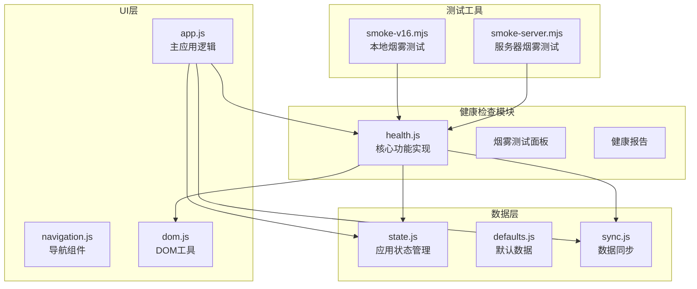
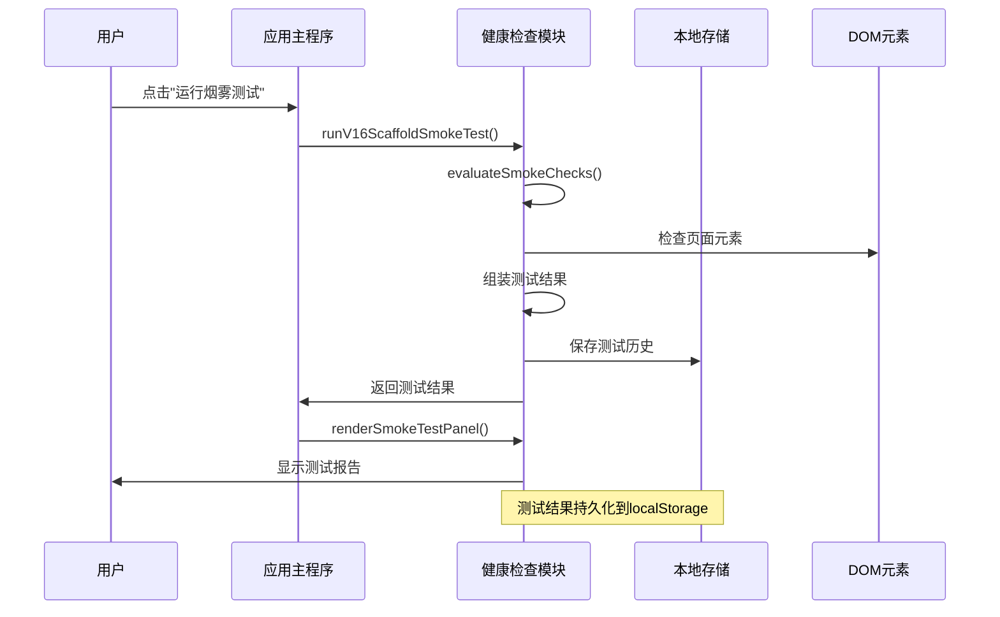
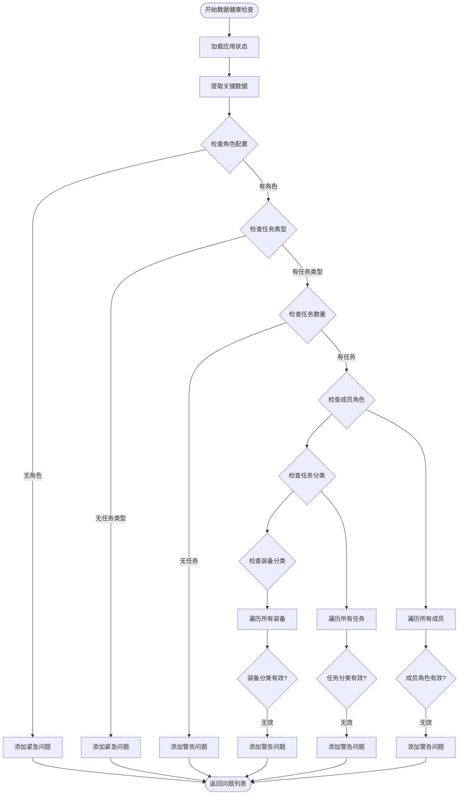
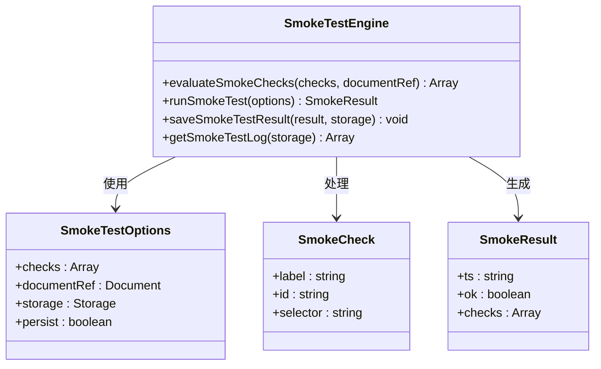
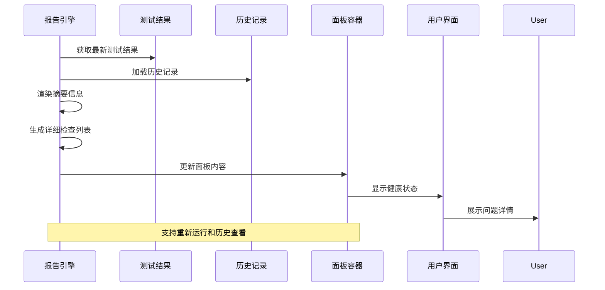
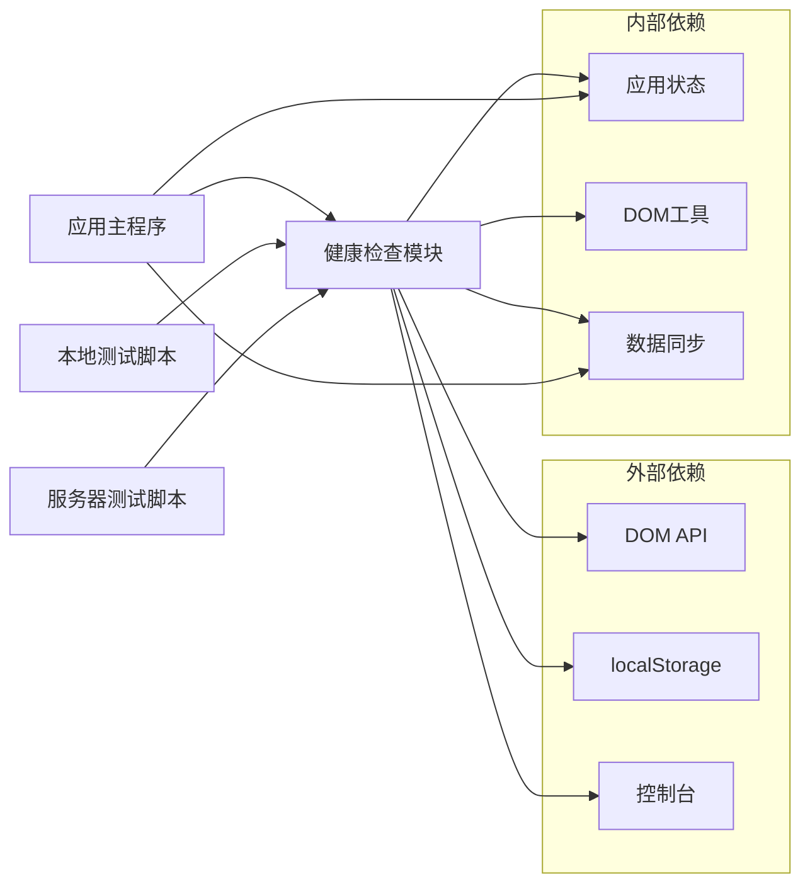

# 健康检查模块API

<cite>
**本文档引用的文件**
- [health.js](file://v16/src/features/health.js)
- [app.js](file://v16/src/app.js)
- [sync.js](file://v16/src/data/sync.js)
- [state.js](file://v16/src/data/state.js)
- [defaults.js](file://v16/src/data/defaults.js)
- [dom.js](file://v16/src/utils/dom.js)
- [navigation.js](file://v16/src/features/navigation.js)
- [README.md](file://v16/README.md)
- [smoke-v16.mjs](file://v16/smoke-v16.mjs)
- [smoke-server.mjs](file://v16/smoke-server.mjs)
</cite>

## 目录
1. [简介](#简介)
2. [项目结构](#项目结构)
3. [核心组件](#核心组件)
4. [架构概览](#架构概览)
5. [详细组件分析](#详细组件分析)
6. [依赖关系分析](#依赖关系分析)
7. [性能考虑](#性能考虑)
8. [故障排除指南](#故障排除指南)
9. [结论](#结论)
10. [附录](#附录)

## 简介

ROV任务管理v16项目的健康检查模块是一个关键的质量保证系统，负责监控应用的数据完整性、页面元素可用性和整体运行状态。该模块提供了三个核心功能：数据健康检查、烟雾测试执行和问题诊断机制。

健康检查模块的主要目标是确保应用在启动时能够检测到潜在的问题，并为用户提供清晰的问题报告和修复建议。通过集成数据同步和错误处理系统，该模块能够在用户界面中实时显示健康状态，并提供历史记录追踪功能。

## 项目结构

健康检查模块位于`v16/src/features/`目录下，与应用的其他功能模块并列组织。该模块的设计遵循了单一职责原则，专注于健康检查和诊断功能。

**图表来源**
- [health.js:1-127](file://v16/src/features/health.js#L1-L127)
- [app.js:1-402](file://v16/src/app.js#L1-L402)

**章节来源**
- [health.js:1-127](file://v16/src/features/health.js#L1-L127)
- [app.js:1-402](file://v16/src/app.js#L1-L402)

## 核心组件

健康检查模块包含以下核心组件：

### 数据健康检查器
负责分析应用状态中的数据完整性问题，包括角色配置、任务类型和装备分类的有效性检查。

### 烟雾测试引擎
执行自动化测试以验证应用的关键功能和页面元素的存在性。

### 健康报告渲染器
将检查结果格式化为用户友好的界面组件，支持历史记录查看和重新运行功能。

**章节来源**
- [health.js:56-84](file://v16/src/features/health.js#L56-L84)
- [health.js:14-25](file://v16/src/features/health.js#L14-L25)
- [health.js:96-122](file://v16/src/features/health.js#L96-L122)

## 架构概览

健康检查模块采用分层架构设计，各组件之间通过明确定义的接口进行交互。

**图表来源**
- [app.js:133-139](file://v16/src/app.js#L133-L139)
- [health.js:37-54](file://v16/src/features/health.js#L37-L54)

## 详细组件分析

### 数据健康检查算法

数据健康检查算法通过分析应用状态中的关键数据结构来识别潜在问题。

**图表来源**
- [health.js:56-84](file://v16/src/features/health.js#L56-L84)

#### 算法复杂度分析
- 时间复杂度：O(n + m + p)，其中n是成员数量，m是任务数量，p是装备数量
- 空间复杂度：O(k)，其中k是发现的问题数量

#### 关键检查点
1. **角色配置完整性**：确保至少有一个有效的角色配置
2. **任务类型有效性**：验证任务分类是否在主数据中定义
3. **成员角色一致性**：检查成员的角色是否存在于主数据中
4. **任务分类有效性**：验证任务的分类字段是否有效
5. **装备分类一致性**：确保装备的分类在主数据中存在

**章节来源**
- [health.js:56-84](file://v16/src/features/health.js#L56-L84)
- [defaults.js:39-45](file://v16/src/data/defaults.js#L39-L45)

### 烟雾测试执行机制

烟雾测试通过检查关键DOM元素的存在性和页面功能的可用性来验证应用的基本运行状态。

**图表来源**
- [health.js:14-54](file://v16/src/features/health.js#L14-L54)
- [health.js:27-35](file://v16/src/features/health.js#L27-L35)

#### 测试配置选项
- **checks**: 自定义检查项数组，默认使用预定义的检查清单
- **documentRef**: 用于测试的文档对象，默认使用全局document
- **storage**: 存储后端，默认使用localStorage
- **persist**: 是否保存测试结果到历史记录

#### 默认检查项
1. 应用根元素存在性检查
2. 各个页面的DOM元素检查
3. 特定功能区域的可见性检查

**章节来源**
- [health.js:3-12](file://v16/src/features/health.js#L3-L12)
- [health.js:37-54](file://v16/src/features/health.js#L37-L54)

### 健康报告生成系统

健康报告系统负责将检查结果转换为用户友好的界面组件，并提供历史记录功能。

**图表来源**
- [health.js:86-122](file://v16/src/features/health.js#L86-L122)

#### 报告组件结构
1. **标题栏**：显示"v16烟雾测试"标题和操作按钮
2. **摘要信息**：显示测试状态和时间戳
3. **详细列表**：逐项显示每个检查的结果
4. **历史记录**：显示最近的测试历史（最多10次）

**章节来源**
- [health.js:86-122](file://v16/src/features/health.js#L86-L122)

## 依赖关系分析

健康检查模块与其他系统组件的依赖关系如下：

**图表来源**
- [health.js:1-3](file://v16/src/features/health.js#L1-L3)
- [app.js:16-21](file://v16/src/app.js#L16-L21)

### 关键依赖点

1. **DOM API依赖**：用于检查页面元素的存在性和可访问性
2. **localStorage依赖**：用于持久化测试历史和配置
3. **应用状态依赖**：用于数据健康检查和状态分析
4. **工具函数依赖**：用于安全的HTML转义和JSON解析

**章节来源**
- [health.js:1-3](file://v16/src/features/health.js#L1-L3)
- [dom.js:1-21](file://v16/src/utils/dom.js#L1-L21)

## 性能考虑

健康检查模块在设计时充分考虑了性能优化：

### 时间复杂度优化
- 数据健康检查：O(n + m + p)，线性时间复杂度，适合大数据集
- 烟雾测试：O(c)，c为检查项数量，通常很小常数
- 历史记录：O(h)，h为历史记录数量，限制在10条以内

### 内存使用优化
- 使用Set数据结构进行快速查找操作
- 限制历史记录数量，避免内存泄漏
- 按需渲染，不阻塞主线程

### 缓存策略
- DOM查询结果不缓存，确保检查的实时性
- 历史记录定期清理，保持最佳性能

## 故障排除指南

### 常见问题及解决方案

#### 数据健康检查失败
**症状**：应用仪表板显示健康问题警告
**可能原因**：
1. 主数据配置不完整
2. 成员角色未正确设置
3. 任务分类不在主数据中

**解决步骤**：
1. 检查主数据设置中心的配置
2. 确保所有必需的角色和任务类型都已定义
3. 验证现有数据是否符合新的配置要求

#### 烟雾测试失败
**症状**：烟雾测试面板显示失败状态
**可能原因**：
1. 页面元素ID或类名变更
2. JavaScript模块加载失败
3. DOM结构改变

**解决步骤**：
1. 运行本地烟雾测试脚本验证基础功能
2. 检查浏览器控制台是否有JavaScript错误
3. 验证关键DOM元素是否存在

#### 历史记录丢失
**症状**：烟雾测试历史记录不完整
**可能原因**：
1. localStorage空间不足
2. 浏览器隐私设置阻止存储
3. 数据被意外清除

**解决步骤**：
1. 检查浏览器存储使用情况
2. 确认localStorage功能正常
3. 重新运行烟雾测试恢复历史记录

**章节来源**
- [health.js:27-35](file://v16/src/features/health.js#L27-L35)
- [smoke-v16.mjs:98-111](file://v16/smoke-v16.mjs#L98-L111)

## 结论

ROV任务管理v16项目的健康检查模块是一个设计精良的质量保证系统，它通过数据健康检查、烟雾测试和问题诊断机制确保应用的稳定性和可靠性。模块采用模块化设计，与应用的其他组件紧密集成，同时保持良好的独立性。

该模块的主要优势包括：
- **全面的检查覆盖**：从数据完整性到页面功能的全方位验证
- **用户友好**：提供清晰的问题报告和修复建议
- **可扩展性**：支持自定义检查项和配置选项
- **性能优化**：高效的算法和内存使用策略

通过持续的健康检查和问题追踪，该模块为ROV任务管理系统的稳定运行提供了重要保障。

## 附录

### API参考

#### getDataHealthIssues(state)
**功能**：分析应用状态中的数据完整性问题
**参数**：
- `state`：应用状态对象，包含data属性
**返回值**：问题数组，每个问题包含level、title和detail属性
**使用场景**：仪表板显示、数据迁移前验证

#### getSmokeTestLog(storage)
**功能**：获取烟雾测试历史记录
**参数**：
- `storage`：存储后端，默认localStorage
**返回值**：测试结果数组，最多10条记录
**使用场景**：渲染烟雾测试面板、历史记录分析

#### renderSmokeTestPanel(container, result, history)
**功能**：渲染烟雾测试面板
**参数**：
- `container`：DOM容器元素
- `result`：当前测试结果
- `history`：历史记录数组
**返回值**：无
**使用场景**：设置中心显示、手动测试结果展示

### 配置选项

#### 烟雾测试配置
- **自定义检查项**：通过checks参数传入
- **文档对象**：通过documentRef参数指定
- **存储位置**：通过storage参数配置
- **持久化开关**：通过persist参数控制

#### 数据健康检查配置
- **主数据来源**：从state.data.masterData获取
- **检查范围**：自动扫描所有相关数据集合
- **问题级别**：紧急问题和警告问题区分

### 测试用例

#### 数据健康检查测试
1. 角色配置为空的场景
2. 任务类型配置缺失的场景
3. 成员角色与主数据不匹配的场景
4. 任务分类无效的场景
5. 装备分类不一致的场景

#### 烟雾测试测试
1. 所有关键DOM元素存在的场景
2. 页面功能正常响应的场景
3. JavaScript错误的异常处理
4. 异步操作完成后的状态验证

**章节来源**
- [health.js:56-84](file://v16/src/features/health.js#L56-L84)
- [health.js:27-35](file://v16/src/features/health.js#L27-L35)
- [health.js:96-122](file://v16/src/features/health.js#L96-L122)