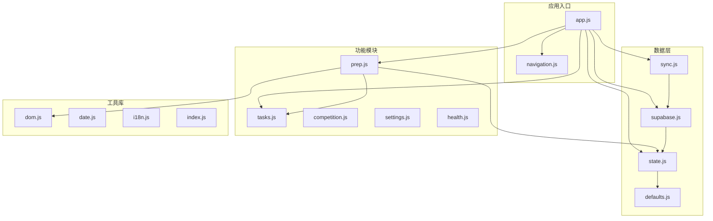
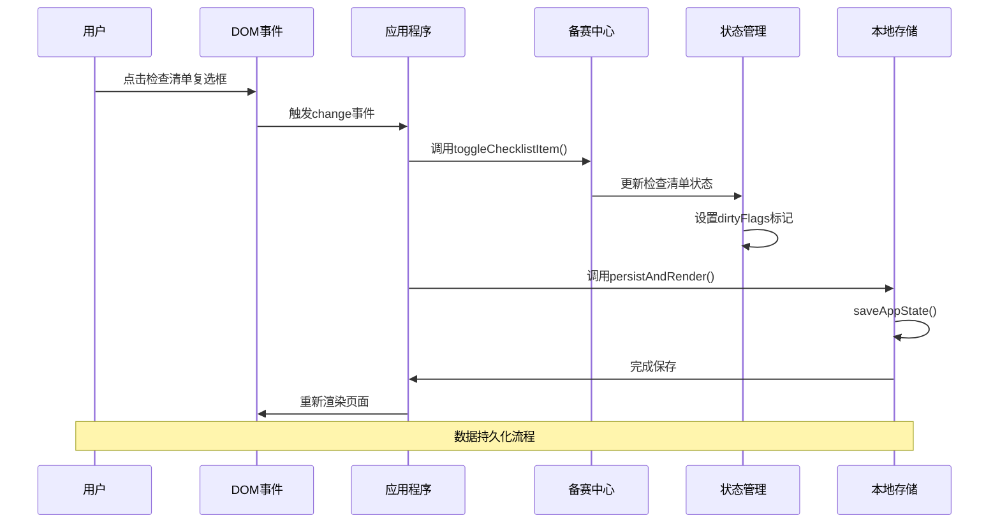
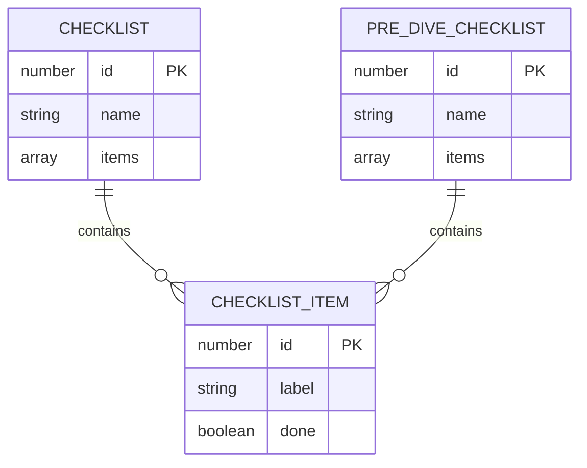
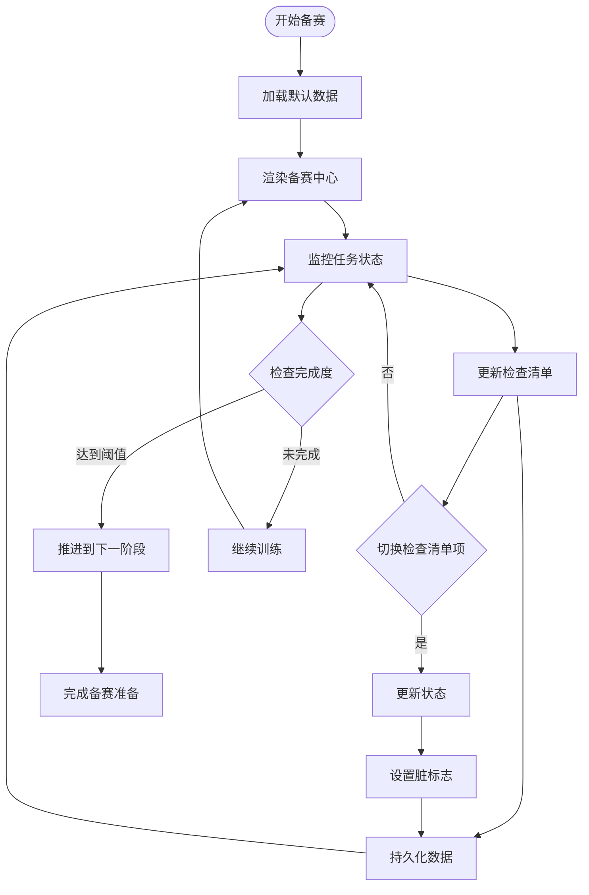
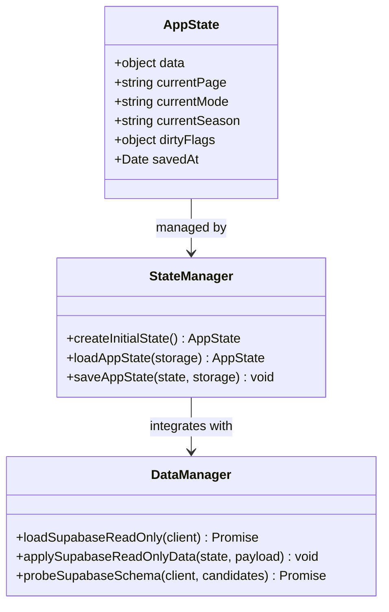
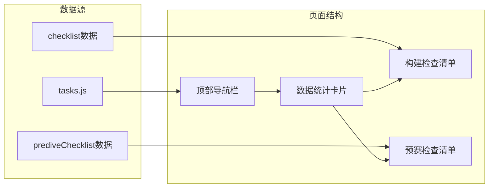
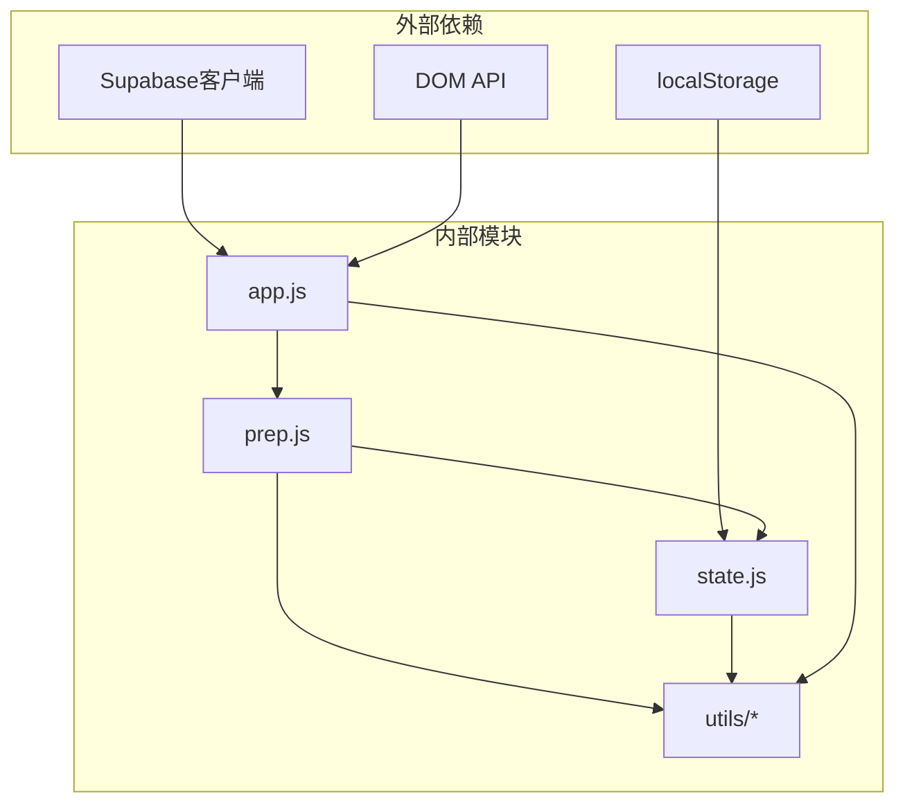

# 备赛管理中心API

<cite>
**本文档引用的文件**
- [prep.js](file://v16/src/features/prep.js)
- [state.js](file://v16/src/data/state.js)
- [app.js](file://v16/src/app.js)
- [dom.js](file://v16/src/utils/dom.js)
- [supabase.js](file://v16/src/data/supabase.js)
- [sync.js](file://v16/src/data/sync.js)
- [defaults.js](file://v16/src/data/defaults.js)
- [tasks.js](file://v16/src/features/tasks.js)
- [navigation.js](file://v16/src/features/navigation.js)
- [README.md](file://v16/README.md)
- [MIGRATION_MANIFEST.md](file://v16/MIGRATION_MANIFEST.md)
</cite>

## 目录
1. [简介](#简介)
2. [项目结构](#项目结构)
3. [核心组件](#核心组件)
4. [架构概览](#架构概览)
5. [详细组件分析](#详细组件分析)
6. [依赖关系分析](#依赖关系分析)
7. [性能考虑](#性能考虑)
8. [故障排除指南](#故障排除指南)
9. [结论](#结论)
10. [附录](#附录)

## 简介

ROV任务管理v16项目的备赛管理中心API是一个专为ROV（水下机器人）竞赛团队设计的本地优先应用程序。该系统提供了完整的备赛项目管理功能，包括检查清单管理、预赛准备流程跟踪、任务状态监控和数据持久化。

备赛管理中心的核心目标是帮助竞赛团队：
- 管理备赛阶段的各项准备工作
- 跟踪检查清单完成状态
- 协调预赛前的各项准备工作
- 维护完整的备赛数据历史
- 实现与主数据系统的安全集成

## 项目结构

ROV任务管理v16采用模块化架构设计，将功能按职责分离到不同的模块中：

**图表来源**
- [app.js:1-402](file://v16/src/app.js#L1-L402)
- [prep.js:1-58](file://v16/src/features/prep.js#L1-L58)
- [state.js:1-45](file://v16/src/data/state.js#L1-L45)

**章节来源**
- [README.md:10-26](file://v16/README.md#L10-L26)
- [MIGRATION_MANIFEST.md:13-29](file://v16/MIGRATION_MANIFEST.md#L13-L29)

## 核心组件

备赛管理中心API的核心组件包括以下三个主要函数：

### renderPrepCenter() 函数
`renderPrepCenter()` 是备赛管理中心的主要渲染函数，负责生成备赛中心页面的HTML内容。

**函数签名**: `renderPrepCenter(state)`

**参数配置**:
- `state`: 应用程序状态对象，包含完整的数据模型
  - `state.data`: 包含所有业务数据的对象
  - `state.currentPage`: 当前页面标识符
  - `state.currentMode`: 当前操作模式
  - `state.currentSeason`: 当前赛季信息

**返回值**:
- 返回一个字符串，包含完整的HTML结构用于页面渲染

**功能特性**:
- 显示任务统计信息（开放任务数、阻塞任务数）
- 展示检查清单完成进度
- 渲染构建检查清单
- 渲染预赛检查清单
- 提供卡片式数据概览

### toggleChecklistItem() 函数
`toggleChecklistItem()` 用于切换检查清单项目的完成状态。

**函数签名**: `toggleChecklistItem(state, listName, id)`

**参数配置**:
- `state`: 应用程序状态对象
- `listName`: 检查清单名称，支持 'checklist' 和 'prediveChecklist'
- `id`: 检查清单项的唯一标识符

**返回值**:
- 布尔值：成功更新返回 `true`，失败返回 `false`

**功能特性**:
- 切换指定检查清单项的完成状态
- 更新脏标志以触发数据持久化
- 支持两种检查清单类型

### renderChecklist() 函数
`renderChecklist()` 用于渲染单个检查清单的HTML结构。

**函数签名**: `renderChecklist(listName, items)`

**参数配置**:
- `listName`: 检查清单名称
- `items`: 检查清单项数组，每个项包含 `id` 和 `label` 字段

**返回值**:
- 返回检查清单的HTML字符串

**章节来源**
- [prep.js:5-57](file://v16/src/features/prep.js#L5-L57)

## 架构概览

备赛管理中心API采用事件驱动的架构模式，通过DOM事件处理用户交互：

**图表来源**
- [app.js:354-364](file://v16/src/app.js#L354-L364)
- [prep.js:5-11](file://v16/src/features/prep.js#L5-L11)
- [state.js:35-44](file://v16/src/data/state.js#L35-L44)

**章节来源**
- [app.js:104-131](file://v16/src/app.js#L104-L131)
- [state.js:16-44](file://v16/src/data/state.js#L16-L44)

## 详细组件分析

### 检查清单数据结构

检查清单使用标准化的数据结构来确保一致性和可扩展性：

**图表来源**
- [defaults.js:19-27](file://v16/src/data/defaults.js#L19-L27)
- [supabase.js:54-60](file://v16/src/data/supabase.js#L54-L60)

检查清单数据结构包含以下字段：
- `id`: 唯一标识符，用于定位特定的检查清单项
- `label`: 显示标签，描述检查清单项的具体内容
- `done`: 布尔值，表示该项是否已完成

**章节来源**
- [defaults.js:19-27](file://v16/src/data/defaults.js#L19-L27)
- [supabase.js:54-60](file://v16/src/data/supabase.js#L54-L60)

### 备赛项目管理流程

备赛项目管理遵循标准化的工作流程：

**图表来源**
- [prep.js:25-57](file://v16/src/features/prep.js#L25-L57)
- [tasks.js:39-48](file://v16/src/features/tasks.js#L39-L48)

### 预赛准备流程

预赛准备流程包含多个关键步骤：

1. **任务统计分析**: 计算开放任务数量和阻塞任务数量
2. **检查清单进度跟踪**: 监控构建检查清单和预赛检查清单的完成进度
3. **数据概览展示**: 通过卡片式布局展示关键指标
4. **实时状态更新**: 响应用户交互即时更新界面状态

**章节来源**
- [prep.js:25-57](file://v16/src/features/prep.js#L25-L57)

### 数据持久化机制

备赛管理中心实现了完整的数据持久化策略：

**图表来源**
- [state.js:6-44](file://v16/src/data/state.js#L6-L44)
- [supabase.js:79-129](file://v16/src/data/supabase.js#L79-L129)

**章节来源**
- [state.js:6-44](file://v16/src/data/state.js#L6-L44)
- [app.js:60-64](file://v16/src/app.js#L60-L64)

### 备赛中心页面渲染

备赛中心页面采用响应式网格布局设计：

**图表来源**
- [prep.js:25-57](file://v16/src/features/prep.js#L25-L57)
- [tasks.js:39-48](file://v16/src/features/tasks.js#L39-L48)

**章节来源**
- [prep.js:25-57](file://v16/src/features/prep.js#L25-L57)

## 依赖关系分析

备赛管理中心API的依赖关系体现了清晰的模块化设计：

**图表来源**
- [app.js:1-13](file://v16/src/app.js#L1-L13)
- [prep.js:1-3](file://v16/src/features/prep.js#L1-L3)

**章节来源**
- [app.js:1-36](file://v16/src/app.js#L1-L36)
- [prep.js:1-3](file://v16/src/features/prep.js#L1-L3)

## 性能考虑

备赛管理中心API在设计时充分考虑了性能优化：

### 内存管理
- 使用结构化克隆避免深拷贝开销
- 智能脏标志系统减少不必要的持久化操作
- 事件委托机制降低内存占用

### 渲染优化
- 模板字符串渲染减少DOM操作次数
- 条件渲染避免不必要元素的创建
- 批量更新策略提升响应速度

### 数据访问优化
- 缓存常用数据查询结果
- 懒加载非关键功能模块
- 异步数据加载避免阻塞主线程

## 故障排除指南

### 常见问题及解决方案

**检查清单状态无法切换**
- 检查DOM事件绑定是否正确
- 验证状态对象中的检查清单数据完整性
- 确认dirtyFlags标记是否正常设置

**数据持久化失败**
- 检查localStorage可用性
- 验证JSON序列化过程
- 确认存储键名一致性

**页面渲染异常**
- 检查模板字符串语法
- 验证escapeHtml函数调用
- 确认CSS类名正确性

**章节来源**
- [app.js:354-393](file://v16/src/app.js#L354-L393)
- [dom.js:1-21](file://v16/src/utils/dom.js#L1-L21)

## 结论

ROV任务管理v16项目的备赛管理中心API展现了优秀的软件工程实践：

### 设计优势
- **模块化架构**: 清晰的功能分离便于维护和扩展
- **事件驱动模式**: 响应式的用户交互体验
- **数据持久化**: 安全可靠的状态管理
- **国际化支持**: 双语界面适应不同用户需求

### 技术特色
- **本地优先**: 减少对外部服务的依赖
- **安全集成**: 与主数据系统的受控连接
- **可视化反馈**: 直观的数据概览和进度跟踪
- **错误处理**: 完善的异常处理和恢复机制

### 最佳实践建议
1. **代码组织**: 保持模块间的低耦合高内聚
2. **数据一致性**: 确保检查清单状态的原子性更新
3. **用户体验**: 提供及时的操作反馈和状态指示
4. **性能监控**: 持续关注渲染性能和内存使用情况

## 附录

### API使用示例

**基本使用流程**:
1. 初始化应用程序状态
2. 加载默认数据
3. 渲染备赛中心页面
4. 处理用户交互事件
5. 持久化状态变更

**集成要点**:
- 确保DOM事件正确绑定到相应的处理函数
- 验证状态对象的完整性和一致性
- 实施适当的错误处理和回退机制

### 版本兼容性

备赛管理中心API与v15版本保持向后兼容，支持从旧版本的数据迁移：

- 支持v15系统备份JSON导入
- 兼容现有的任务和成员数据格式
- 保留检查清单和预赛检查清单的结构

**章节来源**
- [README.md:27-44](file://v16/README.md#L27-L44)
- [MIGRATION_MANIFEST.md:58-76](file://v16/MIGRATION_MANIFEST.md#L58-L76)