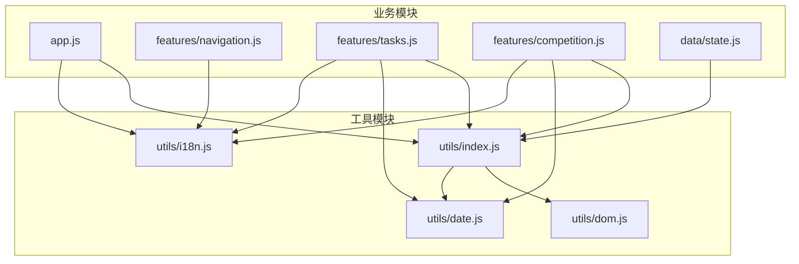
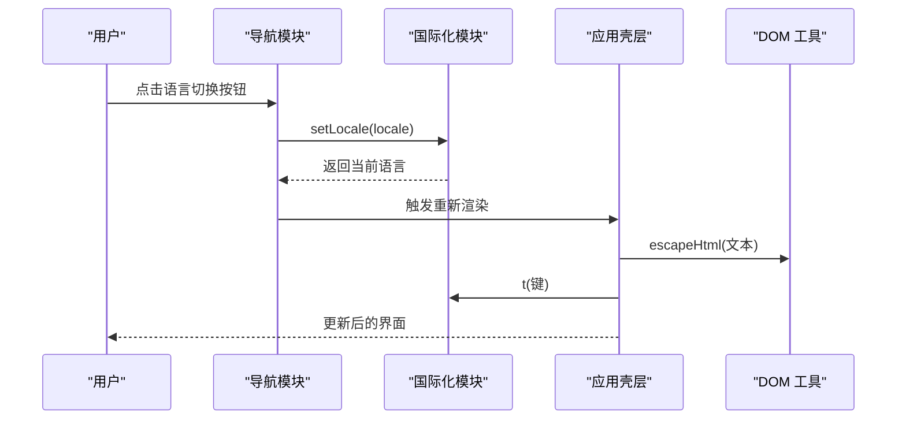
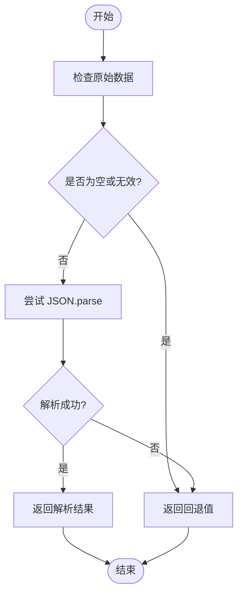
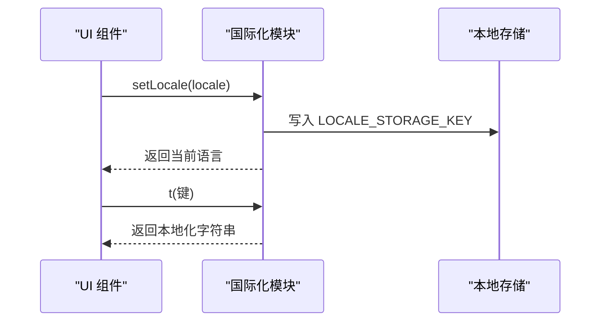
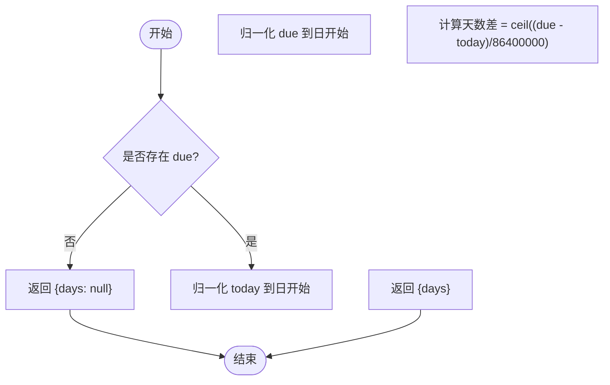
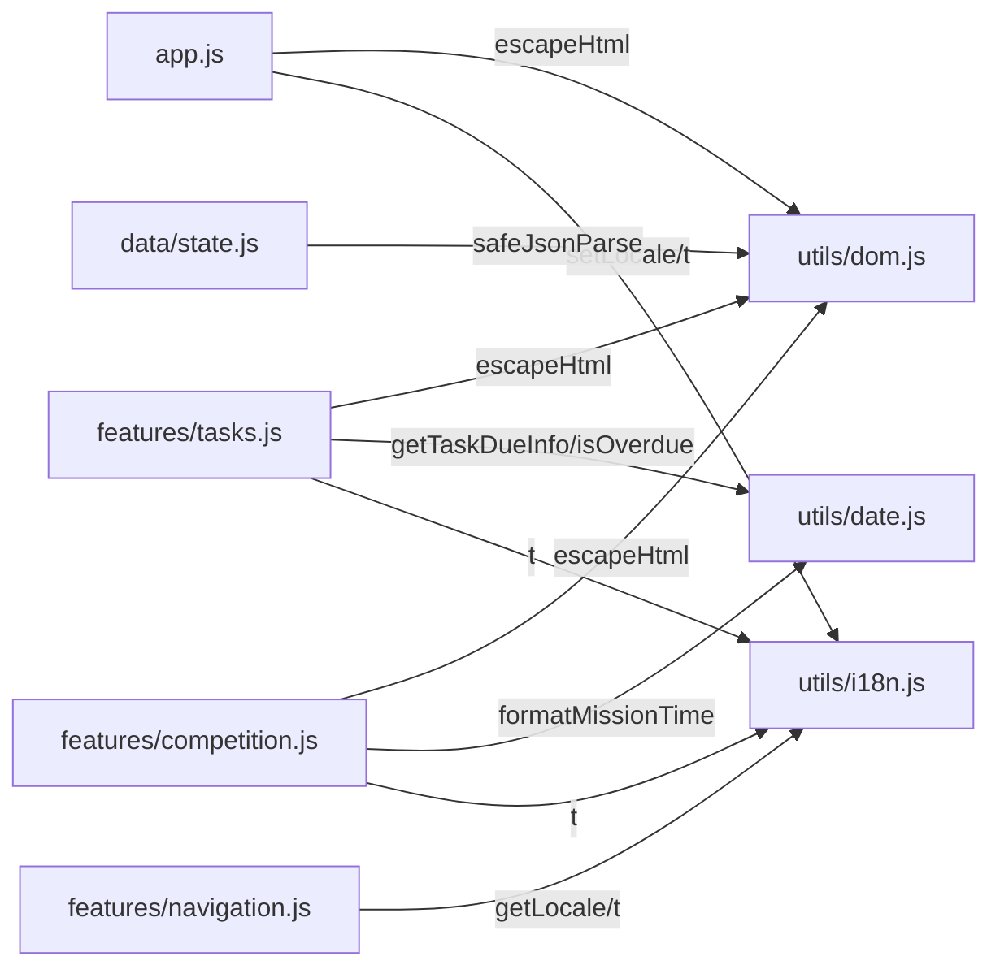

# 工具函数API

<cite>
**本文档引用的文件**
- [v16/src/utils/index.js](file://v16/src/utils/index.js)
- [v16/src/utils/dom.js](file://v16/src/utils/dom.js)
- [v16/src/utils/i18n.js](file://v16/src/utils/i18n.js)
- [v16/src/utils/date.js](file://v16/src/utils/date.js)
- [v16/src/utils/README.md](file://v16/src/utils/README.md)
- [v16/src/app.js](file://v16/src/app.js)
- [v16/src/features/tasks.js](file://v16/src/features/tasks.js)
- [v16/src/features/competition.js](file://v16/src/features/competition.js)
- [v16/src/features/navigation.js](file://v16/src/features/navigation.js)
- [v16/src/data/state.js](file://v16/src/data/state.js)
</cite>

## 目录
1. [简介](#简介)
2. [项目结构](#项目结构)
3. [核心组件](#核心组件)
4. [架构总览](#架构总览)
5. [详细组件分析](#详细组件分析)
6. [依赖分析](#依赖分析)
7. [性能考虑](#性能考虑)
8. [故障排除指南](#故障排除指南)
9. [结论](#结论)
10. [附录](#附录)

## 简介
本文件为 ROV 任务管理 v16 项目的工具函数 API 参考文档，聚焦以下核心工具函数：
- DOM 安全与数据解析：escapeHtml()、escapeAttr()、safeJsonParse()
- 国际化字符串处理：getLocale()、setLocale()、t()
- 日期与时间格式化：todayDateString()、toDateInputValue()、getWeekStart()、getTaskDueInfo()、isOverdue()、getOverdueDays()、formatMissionTime()

文档将详细说明每个函数的参数、返回值、使用场景、实现细节、最佳实践、性能考量以及在应用架构中的复用模式，并通过图示展示调用流程与依赖关系。

## 项目结构
工具函数集中位于 v16/src/utils 目录，采用按功能分模块的组织方式：
- index.js：导出 DOM 与数据解析相关工具（作为统一入口）
- dom.js：HTML/属性转义与安全 JSON 解析
- i18n.js：多语言字符串表、当前语言状态与翻译函数
- date.js：日期输入格式化、周起始、任务到期信息、计时器格式化等

图表来源
- [v16/src/utils/index.js:1-3](file://v16/src/utils/index.js#L1-L3)
- [v16/src/utils/dom.js:1-21](file://v16/src/utils/dom.js#L1-L21)
- [v16/src/utils/i18n.js:1-217](file://v16/src/utils/i18n.js#L1-L217)
- [v16/src/utils/date.js:1-55](file://v16/src/utils/date.js#L1-L55)
- [v16/src/app.js:34-36](file://v16/src/app.js#L34-L36)
- [v16/src/features/tasks.js:1-3](file://v16/src/features/tasks.js#L1-L3)
- [v16/src/features/competition.js:1-3](file://v16/src/features/competition.js#L1-L3)
- [v16/src/features/navigation.js:1-2](file://v16/src/features/navigation.js#L1-L2)
- [v16/src/data/state.js:1-2](file://v16/src/data/state.js#L1-L2)

章节来源
- [v16/src/utils/README.md:1-7](file://v16/src/utils/README.md#L1-L7)
- [v16/src/utils/index.js:1-3](file://v16/src/utils/index.js#L1-L3)

## 核心组件
本节对四个核心工具函数进行深入分析，包括 DOM 安全、国际化与日期时间处理。

- escapeHtml(value)
  - 功能：将字符串中的特殊字符转义为对应的 HTML 实体，防止 XSS 注入与模板渲染错误
  - 参数：value（任意类型，最终以字符串形式处理）
  - 返回值：转义后的字符串
  - 使用场景：所有用户输入或动态内容插入到 innerHTML 前
  - 复杂度：O(n)，n 为字符串长度
  - 最佳实践：在渲染任何非纯静态文本前调用；避免对已转义的内容重复转义
  - 典型调用位置：导航栏按钮文本、任务表格单元格、仪表盘摘要等

- setLocale(locale)
  - 功能：设置当前语言（仅接受 'en' 或 'zh'），并持久化到本地存储
  - 参数：locale（字符串，'en' 或 'zh'）
  - 返回值：实际生效的语言代码
  - 使用场景：用户切换界面语言
  - 复杂度：O(1)
  - 最佳实践：与 getLocale 配合使用；切换后触发重新渲染
  - 典型调用位置：导航栏语言切换按钮事件

- t(key)
  - 功能：根据当前语言返回对应键值的本地化字符串，若不存在则回退到英文或键名本身
  - 参数：key（字符串，国际化键）
  - 返回值：本地化字符串
  - 使用场景：所有 UI 文案的统一获取
  - 复杂度：O(1)
  - 最佳实践：文案键应保持稳定；避免在运行时拼接键名
  - 典型调用位置：页面标题、按钮文本、提示信息等

- formatDate()（注：仓库中未发现名为 formatDate 的函数，但存在多个日期处理函数）
  - 推荐替代：根据用途选择合适函数
    - 日期输入框值：toDateInputValue()
    - 日期字符串（YYYY-MM-DD）：todayDateString()
    - 任务到期天数：getTaskDueInfo()
    - 是否逾期：isOverdue()
    - 逾期天数：getOverdueDays()
    - 计时器显示：formatMissionTime()

章节来源
- [v16/src/utils/dom.js:1-8](file://v16/src/utils/dom.js#L1-L8)
- [v16/src/utils/i18n.js:202-216](file://v16/src/utils/i18n.js#L202-L216)
- [v16/src/utils/date.js:1-55](file://v16/src/utils/date.js#L1-L55)

## 架构总览
工具函数在整个应用中的作用与复用模式如下：
- 统一入口：通过 utils/index.js 汇总导出 DOM 与数据解析工具，便于集中导入与维护
- 业务解耦：UI 渲染层通过 t() 获取文案，通过 escapeHtml() 保证安全输出，通过 date 工具处理时间逻辑
- 状态持久化：国际化语言状态通过 setLocale() 写入本地存储，重启后恢复
- 数据安全：safeJsonParse() 在加载应用状态时提供容错解析，避免异常导致崩溃

图表来源
- [v16/src/features/navigation.js:21-36](file://v16/src/features/navigation.js#L21-L36)
- [v16/src/utils/i18n.js:208-216](file://v16/src/utils/i18n.js#L208-L216)
- [v16/src/app.js:189-195](file://v16/src/app.js#L189-L195)
- [v16/src/utils/dom.js:1-8](file://v16/src/utils/dom.js#L1-L8)

## 详细组件分析

### DOM 安全与数据解析工具
- escapeHtml(value)
  - 实现要点：逐字符替换 &、<、>、"、' 为 HTML 实体
  - 复杂度：O(n)
  - 使用建议：在插入 innerHTML 前调用；与模板字符串配合时确保变量已转义
  - 典型调用位置：任务列表、仪表盘摘要、按钮文本等

- escapeAttr(value)
  - 实现要点：对属性值进行引号与反斜杠转义，避免注入
  - 复杂度：O(n)
  - 使用建议：用于 data-* 属性值或内联事件参数

- safeJsonParse(raw, fallback)
  - 实现要点：包裹 JSON.parse 并捕获异常，返回回退值
  - 复杂度：O(n)
  - 使用建议：加载本地存储或外部数据时使用，避免解析失败导致崩溃
  - 典型调用位置：应用状态加载与保存

图表来源
- [v16/src/utils/dom.js:14-20](file://v16/src/utils/dom.js#L14-L20)
- [v16/src/data/state.js:16-33](file://v16/src/data/state.js#L16-L33)

章节来源
- [v16/src/utils/dom.js:1-21](file://v16/src/utils/dom.js#L1-L21)
- [v16/src/data/state.js:1-45](file://v16/src/data/state.js#L1-L45)

### 国际化工具
- LOCALE_STORAGE_KEY
  - 作用：本地存储键名，用于持久化语言偏好
  - 默认值：初始化为 'zh'

- getLocale()
  - 返回：当前语言代码（'en' 或 'zh'）

- setLocale(locale)
  - 行为：规范化为 'en' 或 'zh'，写入本地存储并返回
  - 注意：不会自动触发重渲染，需由调用方触发

- t(key)
  - 行为：优先返回当前语言对应键值，否则回退到英文，最后回退到键名本身
  - 字符串表：包含应用标题、导航、任务、竞赛、设置等键

图表来源
- [v16/src/utils/i18n.js:1-217](file://v16/src/utils/i18n.js#L1-L217)
- [v16/src/features/navigation.js:21-36](file://v16/src/features/navigation.js#L21-L36)

章节来源
- [v16/src/utils/i18n.js:1-217](file://v16/src/utils/i18n.js#L1-L217)
- [v16/src/features/navigation.js:1-37](file://v16/src/features/navigation.js#L1-L37)

### 日期与时间处理工具
- todayDateString(date)
  - 功能：返回 ISO 日期字符串（YYYY-MM-DD）
  - 用途：表单默认日期输入值

- toDateInputValue(date)
  - 功能：将日期对象格式化为 input[type=date] 的值
  - 用途：表单日期字段默认值

- getWeekStart(date)
  - 功能：返回指定日期所在周的周一（周起始）
  - 用途：统计与报表按周分组

- getTaskDueInfo(task, today)
  - 功能：计算任务到期日与今天之间的天数差（向上取整）
  - 用途：任务列表显示剩余天数

- isOverdue(due, now)
  - 功能：判断截止日期是否已过（按日粒度）
  - 用途：高亮逾期任务

- getOverdueDays(due, today)
  - 功能：计算逾期天数（取整且不小于 0）
  - 用途：统计逾期数量

- formatMissionTime(seconds)
  - 功能：将秒数格式化为 HH:mm:ss 或 mm:ss
  - 用途：竞赛计时器显示

图表来源
- [v16/src/utils/date.js:21-28](file://v16/src/utils/date.js#L21-L28)

章节来源
- [v16/src/utils/date.js:1-55](file://v16/src/utils/date.js#L1-L55)
- [v16/src/features/tasks.js:50-82](file://v16/src/features/tasks.js#L50-L82)
- [v16/src/features/competition.js:21-36](file://v16/src/features/competition.js#L21-L36)

## 依赖分析
- 导入关系
  - app.js：导入 escapeHtml、setLocale、t
  - features/tasks.js：导入 escapeHtml、getTaskDueInfo、isOverdue、todayDateString、t
  - features/competition.js：导入 escapeHtml、formatMissionTime、t
  - features/navigation.js：导入 getLocale、t
  - data/state.js：导入 safeJsonParse
  - utils/index.js：统一导出 dom.js 与 date.js 工具

- 耦合与内聚
  - 工具模块内聚性高，职责单一
  - 业务模块通过统一入口导入，降低跨模块耦合
  - 国际化与 DOM 安全在多处复用，形成横切关注点

图表来源
- [v16/src/app.js:34-36](file://v16/src/app.js#L34-L36)
- [v16/src/features/tasks.js:1-3](file://v16/src/features/tasks.js#L1-L3)
- [v16/src/features/competition.js:1-3](file://v16/src/features/competition.js#L1-L3)
- [v16/src/features/navigation.js:1-1](file://v16/src/features/navigation.js#L1-L1)
- [v16/src/data/state.js:1-2](file://v16/src/data/state.js#L1-L2)
- [v16/src/utils/index.js:1-3](file://v16/src/utils/index.js#L1-L3)

章节来源
- [v16/src/app.js:34-36](file://v16/src/app.js#L34-L36)
- [v16/src/features/tasks.js:1-3](file://v16/src/features/tasks.js#L1-L3)
- [v16/src/features/competition.js:1-3](file://v16/src/features/competition.js#L1-L3)
- [v16/src/features/navigation.js:1-1](file://v16/src/features/navigation.js#L1-L1)
- [v16/src/data/state.js:1-2](file://v16/src/data/state.js#L1-L2)
- [v16/src/utils/index.js:1-3](file://v16/src/utils/index.js#L1-L3)

## 性能考虑
- 字符串转义
  - escapeHtml/escapeAttr：线性复杂度 O(n)，在高频渲染中建议缓存或批量处理
  - 对于大量文本，可考虑在构建阶段预转义或使用虚拟 DOM 机制减少直接 innerHTML 操作

- JSON 解析
  - safeJsonParse：异常捕获带来常数级开销，适合在数据来源不可信时使用
  - 建议在应用启动时一次性解析，避免在渲染循环中频繁调用

- 国际化
  - t() 查询为哈希表查找 O(1)，成本极低
  - 语言切换后应批量更新 UI，避免多次重渲染

- 日期计算
  - 任务到期计算涉及日期对象构造与比较，通常可忽略
  - 计时器每秒更新时，formatMissionTime 为纯数学运算，开销很小

- 存储与持久化
  - setLocale 写入本地存储为同步操作，影响较小
  - 应用状态保存建议节流或防抖，避免频繁写入

## 故障排除指南
- 国际化文案缺失
  - 现象：显示为键名而非本地化文本
  - 排查：确认键是否存在于当前语言表；检查 t() 调用是否传入正确键
  - 处理：在 STRINGS 中添加缺失键或回退逻辑

- 语言切换无效
  - 现象：点击语言按钮后界面未变化
  - 排查：确认 setLocale() 是否被调用；检查是否手动触发了重新渲染
  - 处理：在事件回调中调用 setLocale() 后触发 renderAppShell()

- XSS 注入风险
  - 现象：用户输入出现在页面中导致样式或脚本异常
  - 排查：确认所有动态内容是否经过 escapeHtml() 处理
  - 处理：在插入 innerHTML 前统一调用 escapeHtml()

- 日期显示异常
  - 现象：日期输入框默认值不正确或格式不符
  - 排查：确认传入参数类型与范围；检查 toDateInputValue() 的输入
  - 处理：确保传入 Date 对象或可解析字符串；必要时先转换为 Date

- JSON 解析失败
  - 现象：应用启动时报错或状态丢失
  - 排查：检查本地存储中保存的数据格式；确认 safeJsonParse() 的回退值
  - 处理：清理损坏数据或提供更严格的校验

章节来源
- [v16/src/utils/i18n.js:208-216](file://v16/src/utils/i18n.js#L208-L216)
- [v16/src/utils/dom.js:1-21](file://v16/src/utils/dom.js#L1-L21)
- [v16/src/utils/date.js:1-55](file://v16/src/utils/date.js#L1-L55)
- [v16/src/data/state.js:16-33](file://v16/src/data/state.js#L16-L33)

## 结论
ROV 任务管理 v16 的工具函数体系以“安全、简洁、可复用”为核心设计原则：
- DOM 安全工具保障了渲染输出的安全性
- 国际化工具提供了稳定的多语言支持与持久化能力
- 日期时间工具覆盖了常见的时间计算与格式化需求
- 统一入口与清晰的导入关系降低了模块间的耦合度

通过遵循本文档的最佳实践与使用指南，开发者可以在保证安全性的同时提升开发效率，并在需要时轻松扩展新的工具函数。

## 附录
- 扩展指南
  - 新增 DOM 工具：在 utils/dom.js 中添加并导出，同时在 utils/index.js 中汇总
  - 新增国际化键：在 i18n.js 的 STRINGS 中添加对应语言的键值
  - 新增日期工具：在 utils/date.js 中添加并导出，注意保持纯函数特性
  - 新增工具函数命名规范：使用动词短语，如 formatXxx、getXxx、isXxx
  - 新增工具函数测试：为关键工具编写单元测试，覆盖边界条件与异常路径

- 常见使用场景
  - 表单提交：先 escapeHtml() 转义，再进行数据校验与保存
  - 本地存储：使用 safeJsonParse() 容错解析，避免异常中断
  - 日期输入：使用 toDateInputValue() 设置默认值，使用 todayDateString() 生成今日日期
  - 文案显示：统一通过 t() 获取，避免硬编码字符串