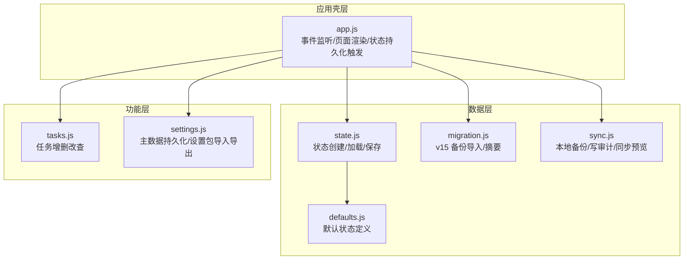
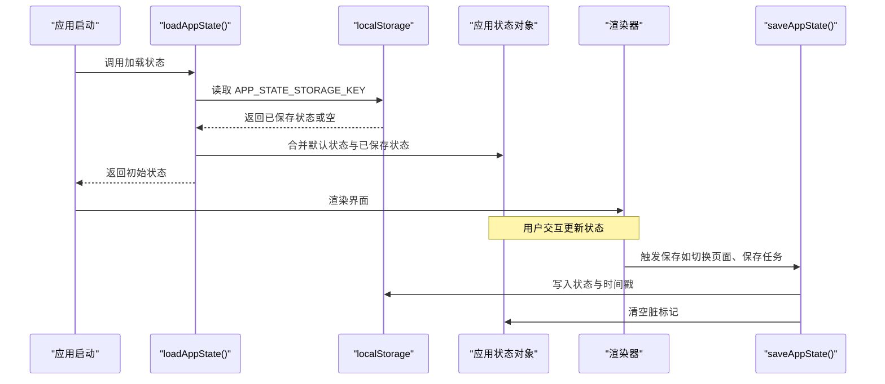
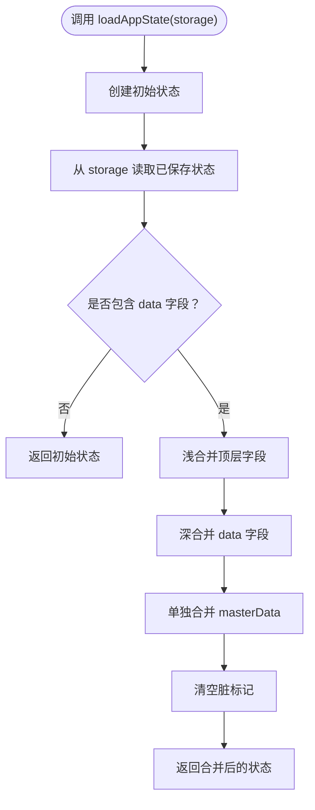
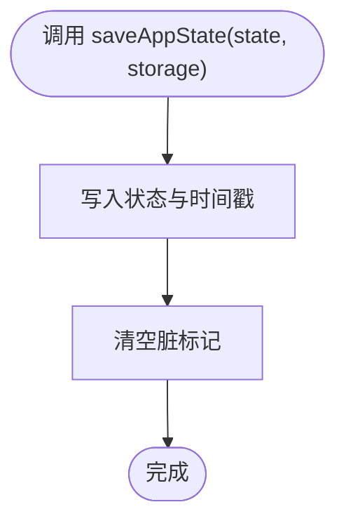
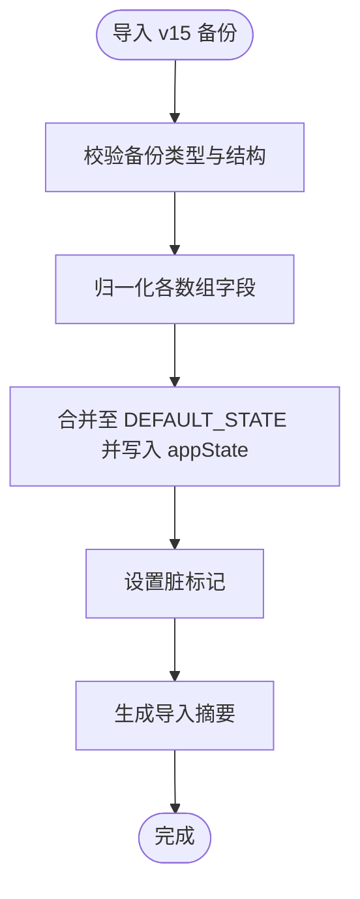
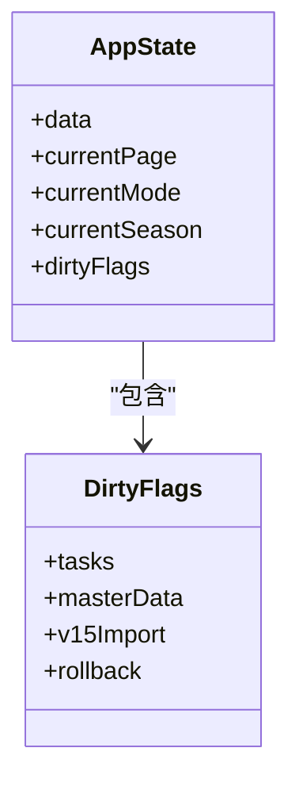
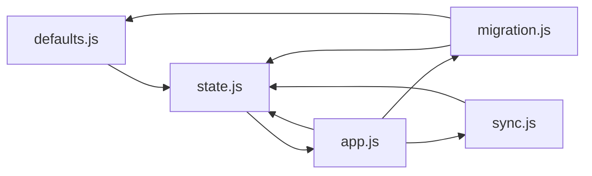

# 状态管理API

<cite>
**本文引用的文件**
- [state.js](file://v16/src/data/state.js)
- [defaults.js](file://v16/src/data/defaults.js)
- [migration.js](file://v16/src/data/migration.js)
- [sync.js](file://v16/src/data/sync.js)
- [app.js](file://v16/src/app.js)
- [tasks.js](file://v16/src/features/tasks.js)
- [settings.js](file://v16/src/features/settings.js)
- [README.md](file://v16/README.md)
- [MIGRATION_MANIFEST.md](file://v16/MIGRATION_MANIFEST.md)
</cite>

## 目录
1. [简介](#简介)
2. [项目结构](#项目结构)
3. [核心组件](#核心组件)
4. [架构总览](#架构总览)
5. [详细组件分析](#详细组件分析)
6. [依赖分析](#依赖分析)
7. [性能考虑](#性能考虑)
8. [故障排除指南](#故障排除指南)
9. [结论](#结论)
10. [附录](#附录)

## 简介
本文件为 ROV 任务管理 v16 的状态管理 API 参考文档，聚焦于应用状态的数据结构、默认值配置、持久化与迁移机制，以及 loadAppState()、saveAppState() 等核心状态操作函数的参数、返回值与使用方法。文档还涵盖状态验证规则、错误处理策略、状态操作示例与最佳实践，并解释状态管理在整体应用架构中的作用及与各模块的交互关系。

## 项目结构
v16 将状态管理拆分为独立模块：
- 数据层：默认状态、本地存储键、迁移与同步工具
- 功能层：任务、准备检查清单、竞赛计时、设置中心等页面逻辑
- 应用壳层：事件分发、页面渲染、状态持久化触发点

图表来源
- [state.js:1-45](file://v16/src/data/state.js#L1-L45)
- [defaults.js:1-46](file://v16/src/data/defaults.js#L1-L46)
- [migration.js:1-100](file://v16/src/data/migration.js#L1-L100)
- [sync.js:1-341](file://v16/src/data/sync.js#L1-L341)
- [app.js:1-402](file://v16/src/app.js#L1-L402)
- [tasks.js:1-112](file://v16/src/features/tasks.js#L1-L112)
- [settings.js:1-200](file://v16/src/features/settings.js#L1-L200)

章节来源
- [README.md:1-68](file://v16/README.md#L1-L68)
- [MIGRATION_MANIFEST.md:1-76](file://v16/MIGRATION_MANIFEST.md#L1-L76)

## 核心组件
本节概述状态管理的核心 API 与数据结构，重点说明 loadAppState()、saveAppState() 的职责与行为。

- 状态存储键
  - APP_STATE_STORAGE_KEY：localStorage 中的应用状态键名，用于持久化与恢复。
- 默认状态
  - DEFAULT_STATE：包含任务、成员、检查清单、预下潜清单、情报、笔记、附件、策略、练习赛、正式赛、装备项与主数据等字段的种子数据。
- 初始状态工厂
  - createInitialState()：基于 DEFAULT_STATE 构造初始应用状态，包含当前页、模式、赛季与空的脏标记集合。
- 加载状态
  - loadAppState(storage)：从指定存储（默认 localStorage）读取已保存状态；若无保存或数据不完整，则回退到初始状态并保留 masterData 的合并结果。
- 保存状态
  - saveAppState(state, storage)：将当前状态写入存储，包含 data、currentPage、currentMode、currentSeason 与保存时间戳；同时清空脏标记集合。

章节来源
- [state.js:4-44](file://v16/src/data/state.js#L4-L44)
- [defaults.js:1-46](file://v16/src/data/defaults.js#L1-L46)

## 架构总览
状态管理贯穿应用生命周期：启动时加载状态，用户交互后更新状态并在合适时机持久化。迁移与同步工具通过状态作为输入，生成备份、执行受控写入并记录审计日志。

图表来源
- [state.js:16-44](file://v16/src/data/state.js#L16-L44)
- [app.js:38-64](file://v16/src/app.js#L38-L64)

## 详细组件分析

### 状态数据结构与默认值
- 结构组成
  - data：包含任务、成员、检查清单、预下潜清单、情报、笔记、附件、策略、练习赛、正式赛、装备项与主数据。
  - currentPage/currentMode/currentSeason：UI 当前页、工作模式与赛季标识。
  - dirtyFlags：脏标记集合，用于指示哪些子域发生变更。
- 默认值来源
  - DEFAULT_STATE 提供种子数据，确保新用户或首次运行具备合理初始值。
- 主数据合并策略
  - loadAppState() 在合并时保留已保存的 masterData，避免覆盖用户自定义主数据。

章节来源
- [state.js:6-14](file://v16/src/data/state.js#L6-L14)
- [state.js:23-32](file://v16/src/data/state.js#L23-L32)
- [defaults.js:1-46](file://v16/src/data/defaults.js#L1-L46)

### loadAppState() 详解
- 参数
  - storage：可选的存储实现，默认使用 localStorage。
- 行为
  - 创建初始状态。
  - 从存储读取已保存状态并安全解析。
  - 若未找到 data 字段，直接返回初始状态。
  - 合并策略：
    - 浅合并：顶层字段（data、currentPage、currentMode、currentSeason）以已保存为准。
    - 深合并：data 内部字段按层级合并，masterData 单独处理以保留用户自定义值。
  - 合并后清空脏标记。
- 返回值
  - 返回合并后的应用状态对象。

图表来源
- [state.js:16-33](file://v16/src/data/state.js#L16-L33)

章节来源
- [state.js:16-33](file://v16/src/data/state.js#L16-L33)

### saveAppState() 详解
- 参数
  - state：要保存的应用状态对象。
  - storage：可选的存储实现，默认使用 localStorage。
- 行为
  - 将 state.data、currentPage、currentMode、currentSeason 与保存时间戳写入存储。
  - 清空 state.dirtyFlags。
- 返回值
  - 无返回值（void）。

图表来源
- [state.js:35-44](file://v16/src/data/state.js#L35-L44)

章节来源
- [state.js:35-44](file://v16/src/data/state.js#L35-L44)

### 迁移机制（v15 备份导入）
- 入口
  - importV15BackupPayload(appState, payload)：校验备份类型并进行字段归一化与映射。
- 归一化策略
  - 对任务、成员、检查清单、装备项、正式赛运行等数组进行标准化，确保字段存在且类型正确。
- 合并策略
  - 仅对已存在的字段进行合并，未提供的字段保持默认值。
  - 更新当前赛季与脏标记，便于后续持久化。
- 摘要
  - summarizeV15Backup(payload)：统计导入的各类条目数量与赛季信息。

图表来源
- [migration.js:75-99](file://v16/src/data/migration.js#L75-L99)
- [migration.js:60-73](file://v16/src/data/migration.js#L60-L73)

章节来源
- [migration.js:1-100](file://v16/src/data/migration.js#L1-L100)

### 状态持久化与脏标记
- 脏标记的作用
  - 标识哪些子域发生过变更，便于决定是否需要持久化或显示“未保存”提示。
- 使用场景
  - 任务模块：新增、更新状态、删除任务均会设置对应脏标记。
  - 设置模块：主数据增删改会设置脏标记。
- 持久化时机
  - 页面切换、保存任务、加载只读数据库、执行受控写入等关键动作后调用 saveAppState()。

图表来源
- [tasks.js:19-37](file://v16/src/features/tasks.js#L19-L37)
- [settings.js:54-77](file://v16/src/features/settings.js#L54-L77)
- [app.js:60-64](file://v16/src/app.js#L60-L64)

章节来源
- [tasks.js:19-37](file://v16/src/features/tasks.js#L19-L37)
- [settings.js:47-52](file://v16/src/features/settings.js#L47-L52)
- [app.js:60-64](file://v16/src/app.js#L60-L64)

### 数据验证与错误处理
- 安全解析
  - safeJsonParse()：在解析存储数据时捕获异常，避免因格式错误导致崩溃。
- 迁移校验
  - importV15BackupPayload()：若 payload 不符合类型或缺少必要字段，抛出错误。
- 同步预览
  - buildSupabaseSyncPreview()：若未先加载只读数据库，抛出错误以防止误用。
- 受控写入
  - executeGuardedSupabaseWriteSync()：要求确认文本、禁止删除、校验表/字段白名单、过滤 schema 未确认字段，并记录审计日志。
- 错误处理策略
  - 统一使用 try/catch 包裹异步流程，向用户展示可读错误信息。
  - 对于 schema 探测失败或字段不匹配，记录 droppedFields 以便审计。

章节来源
- [state.js:18](file://v16/src/data/state.js#L18)
- [migration.js:76-78](file://v16/src/data/migration.js#L76-L78)
- [sync.js:150-153](file://v16/src/data/sync.js#L150-L153)
- [sync.js:221-234](file://v16/src/data/sync.js#L221-L234)
- [sync.js:244-254](file://v16/src/data/sync.js#L244-L254)
- [app.js:244-259](file://v16/src/app.js#L244-L259)
- [app.js:295-297](file://v16/src/app.js#L295-L297)

### 状态操作示例与最佳实践
- 示例：页面切换时保存状态
  - 步骤：调用 setPage() -> showPage() -> saveAppState() -> renderAppShell()。
  - 最佳实践：在每次影响状态的关键交互后统一调用 saveAppState()，确保用户不会丢失数据。
- 示例：导入 v15 备份
  - 步骤：选择文件 -> FileReader 读取 -> JSON.parse -> importV15BackupPayload() -> persistAndRender()。
  - 最佳实践：在执行受控写入前先下载本地备份，以便回滚。
- 示例：执行受控写入
  - 步骤：构建同步预览 -> 下载本地备份 -> 执行 guarded 写入 -> 记录审计日志 -> 重新加载只读数据。
  - 最佳实践：严格遵循确认文本、表白名单与字段白名单，避免误删与字段不匹配。

章节来源
- [app.js:141-145](file://v16/src/app.js#L141-L145)
- [app.js:374-383](file://v16/src/app.js#L374-L383)
- [app.js:262-299](file://v16/src/app.js#L262-L299)

## 依赖分析
状态管理模块之间的耦合关系如下：
- state.js 依赖 defaults.js 提供默认状态。
- app.js 依赖 state.js 进行状态加载与保存，并在多个事件处理器中触发保存。
- migration.js 依赖 defaults.js 与 state.js 的合并策略。
- sync.js 依赖 state.js 的数据结构进行备份、预览与审计。

图表来源
- [state.js:1-2](file://v16/src/data/state.js#L1-L2)
- [app.js:1-13](file://v16/src/app.js#L1-L13)
- [migration.js:1](file://v16/src/data/migration.js#L1)
- [sync.js:1-17](file://v16/src/data/sync.js#L1-L17)

章节来源
- [state.js:1-2](file://v16/src/data/state.js#L1-L2)
- [app.js:1-13](file://v16/src/app.js#L1-L13)
- [migration.js:1](file://v16/src/data/migration.js#L1)
- [sync.js:1-17](file://v16/src/data/sync.js#L1-L17)

## 性能考虑
- 存储读写
  - 使用结构化克隆与 JSON 序列化，避免深层拷贝开销过大。
  - 仅在必要时写入存储，减少频繁 IO。
- 合并策略
  - 浅合并顶层字段，深合并 data 字段，降低复杂度。
- 脏标记
  - 通过脏标记减少不必要的持久化，提升交互响应速度。
- 同步预览
  - 预览阶段不写入数据库，仅计算差异，避免网络延迟影响用户体验。

## 故障排除指南
- 加载状态失败
  - 现象：页面空白或默认状态未生效。
  - 排查：检查 APP_STATE_STORAGE_KEY 是否存在，确认 safeJsonParse 解析是否成功。
- 迁移失败
  - 现象：导入 v15 备份时报错。
  - 排查：确认 payload 类型为 v15 备份，且包含 state 字段；检查字段归一化是否成功。
- 受控写入失败
  - 现象：执行 guarded 写入时报错或被拒绝。
  - 排查：确认输入确认文本、表白名单与字段白名单；检查 schema 探测结果；查看 droppedFields 与审计日志。
- 持久化未生效
  - 现象：刷新后状态丢失。
  - 排查：确认 saveAppState() 是否在关键交互后被调用；检查存储权限与容量。

章节来源
- [state.js:18](file://v16/src/data/state.js#L18)
- [migration.js:76-78](file://v16/src/data/migration.js#L76-L78)
- [sync.js:228-234](file://v16/src/data/sync.js#L228-L234)
- [app.js:60-64](file://v16/src/app.js#L60-L64)

## 结论
v16 的状态管理以 localStorage 为核心，结合默认状态、迁移与受控同步机制，实现了安全、可追溯且易于扩展的状态持久化方案。通过脏标记与统一的保存触发点，保证了用户数据的可靠性；通过 schema 探测与字段白名单，降低了写入风险。建议在后续迭代中继续完善主数据的版本控制与回滚能力，并增强状态快照与增量备份功能。

## 附录
- 常用术语
  - 脏标记：指示状态子域是否发生变更的布尔标志集合。
  - 受控写入：要求确认文本、禁止删除、白名单过滤与审计记录的写入流程。
  - schema 探测：通过只读查询检测数据库实际存在的字段，用于动态过滤写入字段。
- 相关文件
  - [state.js](file://v16/src/data/state.js)
  - [defaults.js](file://v16/src/data/defaults.js)
  - [migration.js](file://v16/src/data/migration.js)
  - [sync.js](file://v16/src/data/sync.js)
  - [app.js](file://v16/src/app.js)
  - [tasks.js](file://v16/src/features/tasks.js)
  - [settings.js](file://v16/src/features/settings.js)
  - [README.md](file://v16/README.md)
  - [MIGRATION_MANIFEST.md](file://v16/MIGRATION_MANIFEST.md)