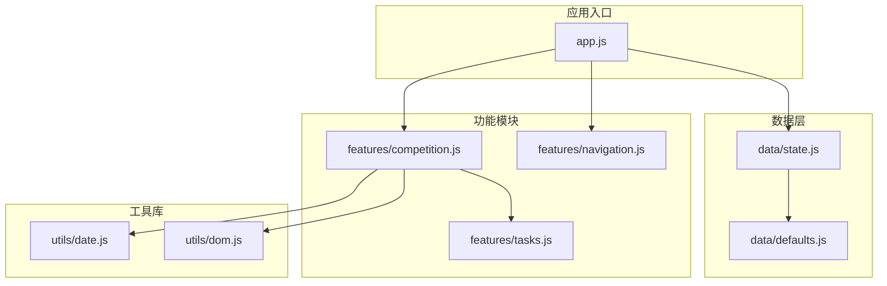
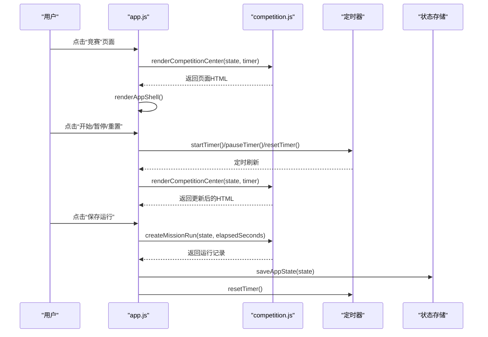
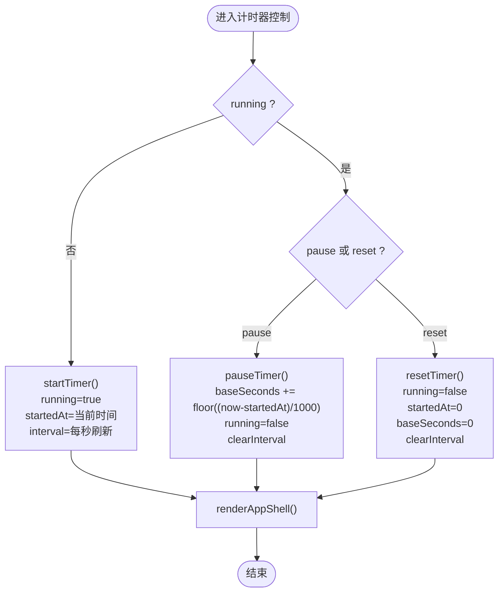
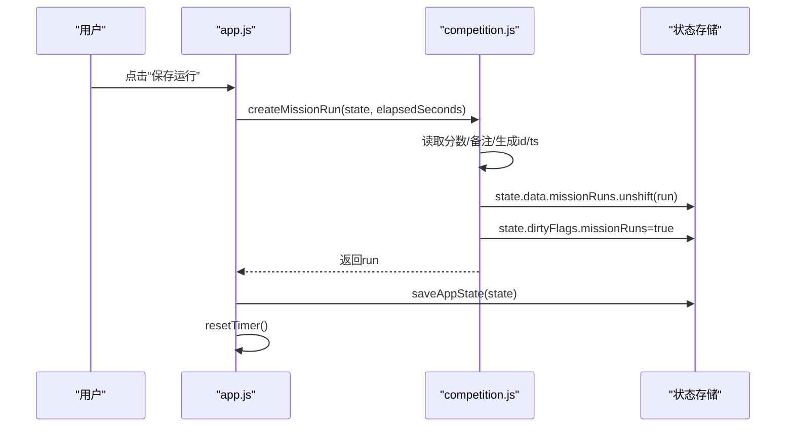
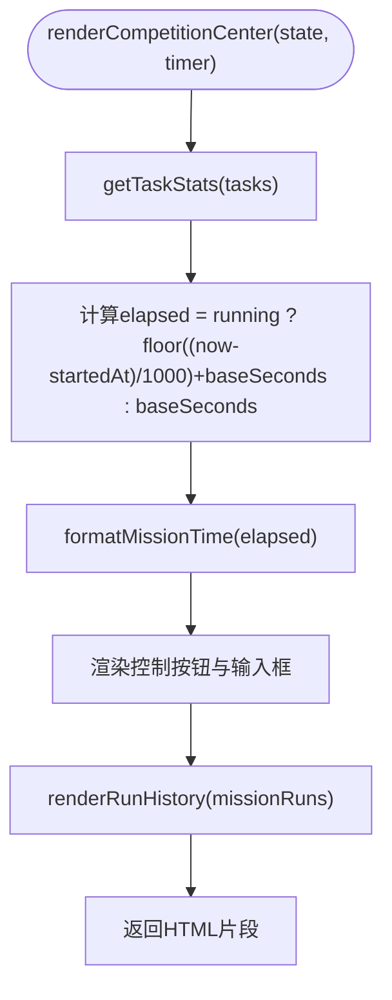
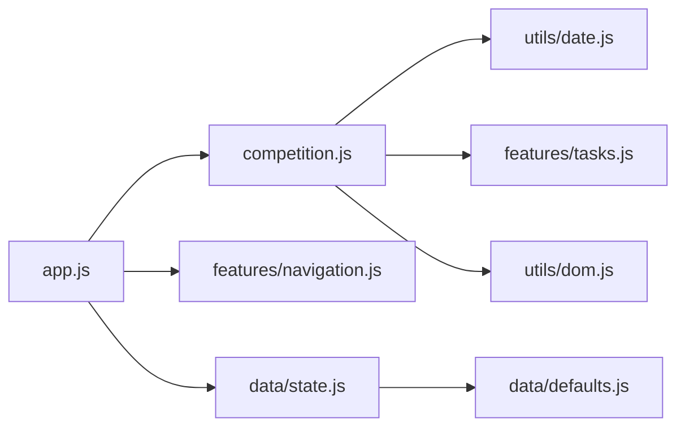

# 竞赛指挥模块API

<cite>
**本文引用的文件**
- [v16/src/features/competition.js](file://v16/src/features/competition.js)
- [v16/src/app.js](file://v16/src/app.js)
- [v16/src/data/state.js](file://v16/src/data/state.js)
- [v16/src/data/defaults.js](file://v16/src/data/defaults.js)
- [v16/src/utils/date.js](file://v16/src/utils/date.js)
- [v16/src/features/tasks.js](file://v16/src/features/tasks.js)
- [v16/src/features/navigation.js](file://v16/src/features/navigation.js)
- [v16/src/utils/dom.js](file://v16/src/utils/dom.js)
- [v16/README.md](file://v16/README.md)
</cite>

## 目录
1. [简介](#简介)
2. [项目结构](#项目结构)
3. [核心组件](#核心组件)
4. [架构总览](#架构总览)
5. [详细组件分析](#详细组件分析)
6. [依赖关系分析](#依赖关系分析)
7. [性能考量](#性能考量)
8. [故障排除指南](#故障排除指南)
9. [结论](#结论)
10. [附录](#附录)

## 简介
本文件为 ROV 任务管理 v16 项目的竞赛指挥模块 API 参考文档，聚焦以下目标：
- 记录竞赛中心渲染函数 renderCompetitionCenter() 的参数、返回值与使用方法
- 详解运行记录创建函数 createMissionRun() 的参数、返回值与使用场景
- 深入说明实时计时器实现、运行记录创建与竞赛数据管理
- 解释计时器状态管理、时间计算逻辑与运行历史记录的数据结构
- 提供竞赛指挥的完整工作流程与 UI 交互示例
- 阐述竞赛模块与全局状态管理、定时器系统的集成关系

## 项目结构
竞赛指挥模块位于 features 子目录，配合全局状态管理与工具库共同构成完整的本地优先单页应用。关键文件与职责如下：
- features/competition.js：竞赛中心页面渲染、运行记录创建与历史展示
- app.js：全局状态、定时器生命周期、事件处理与页面渲染调度
- data/state.js：应用状态初始化、加载与持久化
- data/defaults.js：默认数据结构（含 missionRuns）
- utils/date.js：时间格式化与任务到期计算
- features/tasks.js：任务统计（用于竞赛中心摘要）
- features/navigation.js：导航栏与页面切换
- utils/dom.js：HTML 转义与安全解析

图表来源
- [v16/src/app.js:1-402](file://v16/src/app.js#L1-L402)
- [v16/src/features/competition.js:1-68](file://v16/src/features/competition.js#L1-L68)
- [v16/src/data/state.js:1-45](file://v16/src/data/state.js#L1-L45)
- [v16/src/data/defaults.js:1-46](file://v16/src/data/defaults.js#L1-L46)
- [v16/src/utils/date.js:1-55](file://v16/src/utils/date.js#L1-L55)
- [v16/src/features/tasks.js:1-112](file://v16/src/features/tasks.js#L1-L112)
- [v16/src/features/navigation.js:1-37](file://v16/src/features/navigation.js#L1-L37)
- [v16/src/utils/dom.js:1-21](file://v16/src/utils/dom.js#L1-L21)

章节来源
- [v16/README.md:1-68](file://v16/README.md#L1-L68)
- [v16/src/app.js:1-402](file://v16/src/app.js#L1-L402)

## 核心组件
本节对竞赛指挥模块的关键函数进行深入分析，包括参数、返回值、内部逻辑与调用关系。

- renderCompetitionCenter(state, timer)
  - 功能：渲染竞赛中心页面，包含实时计时器、控制按钮、分数与备注输入、运行历史展示
  - 参数
    - state：应用全局状态对象，包含 data.missionRuns、data.tasks 等
    - timer：定时器对象，包含 running、startedAt、baseSeconds、interval
  - 返回值：字符串形式的 HTML 片段，作为页面内容插入 DOM
  - 内部逻辑要点
    - 计算当前已用秒数：若计时器运行中，则为 (当前时间 - 启动时间)/1000 + baseSeconds；否则为 baseSeconds
    - 获取任务统计信息用于页面摘要
    - 使用 formatMissionTime 对秒数进行格式化显示
    - 历史记录通过 renderRunHistory 渲染，最多展示最近 8 条
  - 使用方法：在 app.js 中根据当前页面切换到竞赛中心时调用，随后由 renderAppShell 统一挂载到页面

- createMissionRun(state, elapsedSeconds)
  - 功能：创建一条新的运行记录并加入 missionRuns 列表
  - 参数
    - state：应用全局状态对象
    - elapsedSeconds：以秒为单位的累计时间（通常来自定时器）
  - 返回值：新创建的运行记录对象
  - 内部逻辑要点
    - 从页面输入框读取分数与备注（带 trim 与默认值处理）
    - 生成唯一 id（时间戳）与 ISO 时间戳 ts
    - 将运行记录插入 missionRuns 数组开头
    - 设置 dirtyFlags.missionRuns 为 true，标记需要持久化
  - 使用方法：在用户点击“保存运行”后调用，随后重置计时器并保存状态

- renderRunHistory(runs)
  - 功能：渲染运行历史列表
  - 参数：runs 为 missionRuns 数组
  - 返回值：字符串形式的 HTML 片段
  - 内部逻辑要点
    - 若数组为空，返回提示文本
    - 否则最多取前 8 条，逐条渲染时间、日期、备注与分数
    - 使用 escapeHtml 进行安全转义，防止 XSS

章节来源
- [v16/src/features/competition.js:6-68](file://v16/src/features/competition.js#L6-L68)
- [v16/src/utils/date.js:46-55](file://v16/src/utils/date.js#L46-L55)
- [v16/src/features/tasks.js:39-48](file://v16/src/features/tasks.js#L39-L48)
- [v16/src/utils/dom.js:1-21](file://v16/src/utils/dom.js#L1-L21)

## 架构总览
竞赛指挥模块与全局状态、定时器系统的关系如下：

图表来源
- [v16/src/app.js:104-187](file://v16/src/app.js#L104-L187)
- [v16/src/app.js:147-177](file://v16/src/app.js#L147-L177)
- [v16/src/app.js:332-343](file://v16/src/app.js#L332-L343)
- [v16/src/features/competition.js:38-67](file://v16/src/features/competition.js#L38-L67)

## 详细组件分析

### 实时计时器实现
计时器为全局对象，包含运行状态、启动时间与累计秒数，并通过 window.setInterval 控制每秒刷新页面。

- 关键字段
  - running：布尔值，表示是否正在计时
  - startedAt：数字，毫秒级时间戳，记录上次开始计时的时间点
  - baseSeconds：数字，秒级累计时间，用于暂停后保留已计时长
  - interval：定时器句柄，用于清理
- 行为
  - startTimer：设置 running=true，记录 startedAt，每秒刷新一次
  - pauseTimer：计算本次已计时长并累加到 baseSeconds，停止定时器
  - resetTimer：清空 running、startedAt、baseSeconds，停止定时器
  - currentElapsedSeconds：统一计算当前已用秒数的便捷函数

图表来源
- [v16/src/app.js:147-177](file://v16/src/app.js#L147-L177)

章节来源
- [v16/src/app.js:49-54](file://v16/src/app.js#L49-L54)
- [v16/src/app.js:147-177](file://v16/src/app.js#L147-L177)

### 运行记录创建与持久化
运行记录创建流程如下：

图表来源
- [v16/src/app.js:339-343](file://v16/src/app.js#L339-L343)
- [v16/src/features/competition.js:6-19](file://v16/src/features/competition.js#L6-L19)
- [v16/src/data/state.js:35-44](file://v16/src/data/state.js#L35-L44)

章节来源
- [v16/src/features/competition.js:6-19](file://v16/src/features/competition.js#L6-L19)
- [v16/src/data/state.js:35-44](file://v16/src/data/state.js#L35-L44)

### 竞赛中心页面渲染
竞赛中心页面包含以下元素：
- 页面顶部：标题、摘要（任务开放数/阻塞数）
- 主卡片：实时计时显示、控制按钮（开始/暂停/重置）、保存运行按钮
- 输入区：分数输入与备注输入
- 历史记录区：最近 8 条运行记录

图表来源
- [v16/src/features/competition.js:38-67](file://v16/src/features/competition.js#L38-L67)
- [v16/src/features/tasks.js:39-48](file://v16/src/features/tasks.js#L39-L48)
- [v16/src/utils/date.js:46-55](file://v16/src/utils/date.js#L46-L55)

章节来源
- [v16/src/features/competition.js:38-67](file://v16/src/features/competition.js#L38-L67)

### 数据结构与持久化
- 默认状态包含 missionRuns 字段，初始为空数组
- 运行记录对象字段
  - id：数字或字符串，唯一标识
  - ts：ISO 时间戳字符串
  - elapsedSeconds：数字，累计秒数
  - score：数字，分数
  - note：字符串，备注
- 状态持久化
  - 应用状态保存时会写入 data、currentPage、currentMode、currentSeason、savedAt
  - dirtyFlags 在保存后会被清空

章节来源
- [v16/src/data/defaults.js:32-33](file://v16/src/data/defaults.js#L32-L33)
- [v16/src/features/competition.js:9-15](file://v16/src/features/competition.js#L9-L15)
- [v16/src/data/state.js:35-44](file://v16/src/data/state.js#L35-L44)

## 依赖关系分析
竞赛指挥模块的依赖关系如下：

图表来源
- [v16/src/features/competition.js:1-4](file://v16/src/features/competition.js#L1-L4)
- [v16/src/app.js:15-36](file://v16/src/app.js#L15-L36)
- [v16/src/data/state.js:1-2](file://v16/src/data/state.js#L1-L2)
- [v16/src/data/defaults.js:1-1](file://v16/src/data/defaults.js#L1-L1)

章节来源
- [v16/src/features/competition.js:1-4](file://v16/src/features/competition.js#L1-L4)
- [v16/src/app.js:15-36](file://v16/src/app.js#L15-L36)

## 性能考量
- 计时器刷新频率：每秒一次，开销极小，适合浏览器端实时显示
- 历史记录渲染：最多渲染 8 条，DOM 更新成本低
- 状态持久化：仅在用户操作后保存，避免频繁写入
- HTML 转义：所有动态输出均通过 escapeHtml 处理，确保安全且不引入额外性能负担

## 故障排除指南
- 页面未显示竞赛中心
  - 检查当前页面是否为 competition
  - 确认 renderCompetitionCenter 已被调用
- 计时器无法启动/暂停/重置
  - 检查定时器对象字段是否正确更新
  - 确认事件处理器已绑定到对应 data-* 属性
- 保存运行后无记录
  - 检查 createMissionRun 是否成功写入 missionRuns
  - 确认 dirtyFlags.missionRuns 已设置
  - 验证 saveAppState 是否执行
- 历史记录显示异常
  - 检查 renderRunHistory 的输入数组是否为空
  - 确认 escapeHtml 是否正确应用

章节来源
- [v16/src/app.js:104-112](file://v16/src/app.js#L104-L112)
- [v16/src/app.js:332-343](file://v16/src/app.js#L332-L343)
- [v16/src/features/competition.js:21-36](file://v16/src/features/competition.js#L21-L36)

## 结论
竞赛指挥模块通过简洁的函数接口与清晰的状态管理，实现了竞赛计时、运行记录与历史展示的完整闭环。其实时计时器采用轻量级的定时刷新策略，结合安全的 HTML 输出与本地持久化，确保了良好的用户体验与数据安全性。通过与全局状态与导航系统的集成，模块在应用整体架构中扮演着关键角色。

## 附录
- UI 交互示例
  - 打开竞赛中心：点击导航栏“竞赛”按钮
  - 开始计时：点击“开始”，计时器启动，界面每秒刷新
  - 暂停计时：点击“暂停”，累计时间保留
  - 重置计时：点击“重置”，清空累计时间
  - 保存运行：填写分数与备注，点击“保存运行”，记录被添加到历史并重置计时
- 数据结构参考
  - 运行记录对象字段：id、ts、elapsedSeconds、score、note
  - 默认状态 missionRuns：数组，初始为空