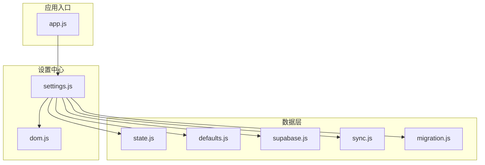
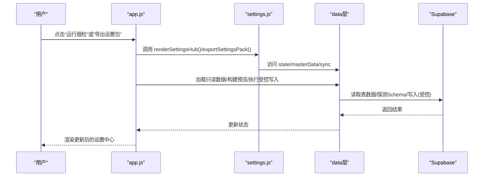
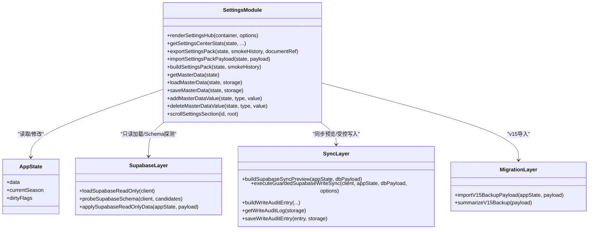

# 设置管理中心API

<cite>
**本文档引用的文件**
- [settings.js](file://v16/src/features/settings.js)
- [supabase.js](file://v16/src/data/supabase.js)
- [sync.js](file://v16/src/data/sync.js)
- [migration.js](file://v16/src/data/migration.js)
- [state.js](file://v16/src/data/state.js)
- [defaults.js](file://v16/src/data/defaults.js)
- [dom.js](file://v16/src/utils/dom.js)
- [app.js](file://v16/src/app.js)
- [README.md](file://v16/README.md)
</cite>

## 目录
1. [简介](#简介)
2. [项目结构](#项目结构)
3. [核心组件](#核心组件)
4. [架构总览](#架构总览)
5. [详细组件分析](#详细组件分析)
6. [依赖关系分析](#依赖关系分析)
7. [性能考量](#性能考量)
8. [故障排除指南](#故障排除指南)
9. [结论](#结论)
10. [附录](#附录)

## 简介
本文件为 ROV 任务管理 v16 项目的设置管理中心 API 参考文档，聚焦以下核心能力：
- 主数据管理：角色、组、任务类型、装备分类的本地存储与编辑
- 设置包导入导出：v16 设置包与 v15 备份的兼容导入，以及当前状态打包导出
- 配置备份与恢复：本地备份 JSON 的生成、导入与回滚
- 设置界面渲染：设置中心页面的卡片化展示与交互
- 数据验证与配置同步：基于 Schema 探测的字段白名单校验、预览与受控写入
- 安全与审计：受控写入（仅 upsert，不删除）、写入审计日志、预写入本地备份
- 与 Supabase 的集成：只读加载、Schema 探测、同步预览与受控写入

## 项目结构
设置管理中心位于 v16/src/features/settings.js，配合数据层（v16/src/data/）中的 supabase.js、sync.js、migration.js、state.js、defaults.js，以及工具层（v16/src/utils/）中的 dom.js 和应用入口（v16/src/app.js）共同构成完整的设置管理能力。

图表来源
- [app.js:1-402](file://v16/src/app.js#L1-L402)
- [settings.js:1-592](file://v16/src/features/settings.js#L1-L592)
- [dom.js:1-21](file://v16/src/utils/dom.js#L1-L21)
- [state.js:1-45](file://v16/src/data/state.js#L1-L45)
- [defaults.js:1-46](file://v16/src/data/defaults.js#L1-L46)
- [supabase.js:1-157](file://v16/src/data/supabase.js#L1-L157)
- [sync.js:1-341](file://v16/src/data/sync.js#L1-L341)
- [migration.js:1-100](file://v16/src/data/migration.js#L1-L100)

章节来源
- [README.md:1-68](file://v16/README.md#L1-L68)
- [app.js:1-402](file://v16/src/app.js#L1-L402)

## 核心组件
- 设置中心渲染器：renderSettingsHub(container, options)
- 主数据管理：getMasterData(state)、loadMasterData(state)、saveMasterData(state)、addMasterDataValue(state,type,value)、deleteMasterDataValue(state,type,value)
- 设置包导入导出：buildSettingsPack(state,smokeHistory)、exportSettingsPack(state,smokeHistory,documentRef)、importSettingsPackPayload(state,payload)
- 统计与概览：getSettingsCenterStats(state,smokeHistory,migrationSummary,dbStatus,syncPreview,writeResult,postWritePreview,schemaStatus,writeAuditLog,rollbackSummary)
- 滚动定位：scrollSettingsSection(id,root)
- 同步与审计：buildSupabaseSyncPreview(appState,dbPayload)、executeGuardedSupabaseWriteSync(client,appState,dbPayload,options)、buildWriteAuditEntry(...)、getWriteAuditLog(storage)

章节来源
- [settings.js:156-592](file://v16/src/features/settings.js#L156-L592)
- [sync.js:150-341](file://v16/src/data/sync.js#L150-L341)

## 架构总览
设置管理中心通过 app.js 的事件处理与状态驱动，调用 settings.js 的渲染与数据管理函数；同时与 data 层协作完成 Supabase 只读加载、Schema 探测、同步预览与受控写入。

图表来源
- [app.js:189-393](file://v16/src/app.js#L189-L393)
- [settings.js:156-592](file://v16/src/features/settings.js#L156-L592)
- [supabase.js:79-157](file://v16/src/data/supabase.js#L79-L157)
- [sync.js:150-341](file://v16/src/data/sync.js#L150-L341)

## 详细组件分析

### 设置中心渲染器 renderSettingsHub
- 功能概述：根据传入的 state 与统计信息，渲染设置中心页面，包含数据概览、Supabase 只读加载、Schema 探测、同步预览、受控写入、审计日志、回滚、v15 导入、设置包导入导出等区域。
- 关键参数：
  - container：DOM 容器元素
  - options：对象，包含 state、smokeHistory、migrationSummary、dbStatus、syncPreview、writeResult、postWritePreview、schemaStatus、writeAuditLog、rollbackSummary
- 返回值：无（直接在容器内渲染 HTML）
- 交互行为：
  - 支持滚动到指定区域（data-action="scroll-to-section"）
  - 触发只读加载、Schema 探测、构建同步预览、执行受控写入等动作
  - 文件下载：导出设置包、导出本地备份
  - 文件上传：导入 v15 备份、导入 v16 回滚备份、导入设置包

章节来源
- [settings.js:156-537](file://v16/src/features/settings.js#L156-L537)
- [app.js:214-393](file://v16/src/app.js#L214-L393)

### 主数据管理
- 主数据类型定义：roles、groups、taskTypes、gearCats
- 基础操作：
  - 获取：getMasterData(state)、getMasterDataStorageKey(season)
  - 加载/保存：loadMasterData(state,storage)、saveMasterData(state,storage)
  - 编辑：addMasterDataValue(state,type,value)、deleteMasterDataValue(state,type,value)
- 存储策略：
  - 使用 localStorage，键名前缀为 rov_v16_master_data_，后缀为当前赛季
  - 值清洗：去除空白、去重、排序
- 与状态集成：
  - 修改后设置 dirtyFlags.masterData = true
  - 渲染时显示总数与各类型数量

章节来源
- [settings.js:4-77](file://v16/src/features/settings.js#L4-L77)
- [settings.js:34-52](file://v16/src/features/settings.js#L34-L52)
- [settings.js:54-77](file://v16/src/features/settings.js#L54-L77)

### 设置包导入导出
- 设置包结构：
  - type: rov_v16_settings_pack 或 rov_settings_pack（兼容 v15）
  - version: 1
  - appVersion: 'v16'
  - season: 当前赛季
  - exportedAt: ISO 时间戳
  - masterData: 主数据集合
  - smokeHistory: 最近的烟检历史（最多 10 条）
- 导出流程：buildSettingsPack -> JSON 字符串 -> Blob -> 下载链接 -> 用户点击下载
- 导入流程：校验 type -> 合并 masterData -> 标记脏位 -> 重新渲染

章节来源
- [settings.js:79-119](file://v16/src/features/settings.js#L79-L119)
- [settings.js:91-105](file://v16/src/features/settings.js#L91-L105)

### 统计与概览 getSettingsCenterStats
- 输入：state、smokeHistory、migrationSummary、dbStatus、syncPreview、writeResult、postWritePreview、schemaStatus、writeAuditLog、rollbackSummary
- 输出：包含任务数、成员数、任务运行数、检查清单项数、装备项数、主数据统计、烟检次数与失败数、迁移/数据库/同步/写入/回滚/模式状态、审计日志摘要等

章节来源
- [settings.js:121-146](file://v16/src/features/settings.js#L121-L146)

### Supabase 集成
- 只读加载：loadSupabaseReadOnly(client) 并行查询多张表，返回加载时间、每表行数与错误信息
- Schema 探测：probeSupabaseSchema 对候选列进行只读探测，计算覆盖率
- 应用只读数据：applySupabaseReadOnlyData 将远程数据合并到本地状态
- 表清单：DB_TABLES 定义了支持的表集合

章节来源
- [supabase.js:79-157](file://v16/src/data/supabase.js#L79-L157)
- [supabase.js:4-13](file://v16/src/data/supabase.js#L4-L13)

### 同步与审计
- 同步预览：buildSupabaseSyncPreview 比较本地与远程数据，输出 create/update/remove 数量与详情
- 受控写入：executeGuardedSupabaseWriteSync
  - 必须输入确认文本：SYNC V16
  - 仅允许白名单表：tasks、members、checklist_items、predive_checklist_items
  - 仅 upsert，不删除
  - 使用 Schema 探测结果过滤字段
  - 写入前自动下载本地备份
  - 成功后重新加载数据库并生成后置预览
- 审计日志：getWriteAuditLog/saveWriteAuditEntry/buildWriteAuditEntry 记录每次受控写入的预览、结果、丢弃字段与后置差异

章节来源
- [sync.js:150-341](file://v16/src/data/sync.js#L150-L341)
- [sync.js:9-17](file://v16/src/data/sync.js#L9-L17)

### v15 备份导入与 v16 回滚
- v15 备份导入：importV15BackupPayload 校验类型、标准化数据、合并到当前状态，支持任务、成员、检查清单、预潜检查清单、任务运行、装备、笔记、策略等
- v16 回滚：restoreLocalBackupPayload 从 rov_v16_local_backup JSON 恢复本地状态，清空同步与回滚脏位

章节来源
- [migration.js:75-99](file://v16/src/data/migration.js#L75-L99)
- [sync.js:180-205](file://v16/src/data/sync.js#L180-L205)

### 界面渲染与交互
- renderMasterDataList(type,label,values)：渲染单个主数据类型的输入框与可删除标签
- scrollSettingsSection(id,root)：滚动到指定设置区域并展开 details
- DOM 安全：escapeHtml 用于防止 XSS

章节来源
- [settings.js:539-591](file://v16/src/features/settings.js#L539-L591)
- [dom.js:1-21](file://v16/src/utils/dom.js#L1-L21)

## 依赖关系分析

图表来源
- [settings.js:156-592](file://v16/src/features/settings.js#L156-L592)
- [state.js:6-44](file://v16/src/data/state.js#L6-L44)
- [supabase.js:79-157](file://v16/src/data/supabase.js#L79-L157)
- [sync.js:150-341](file://v16/src/data/sync.js#L150-L341)
- [migration.js:75-99](file://v16/src/data/migration.js#L75-L99)

## 性能考量
- 并行只读加载：loadSupabaseReadOnly 使用 Promise.allSettled 并行查询多表，减少等待时间
- 本地渲染：设置中心使用字符串拼接渲染，避免复杂虚拟 DOM，适合小规模数据
- 预览与审计：受控写入前先生成预览并下载本地备份，避免大规模写入带来的性能与风险问题
- 字段过滤：根据 Schema 探测结果过滤写入字段，减少无效写入

章节来源
- [supabase.js:79-121](file://v16/src/data/supabase.js#L79-L121)
- [sync.js:221-284](file://v16/src/data/sync.js#L221-L284)

## 故障排除指南
- 导入设置包报错“不是 ROV 设置包”
  - 检查 payload.type 是否为 rov_v16_settings_pack 或 rov_settings_pack
  - 确认 JSON 结构完整且可解析
- 受控写入失败
  - 确认已输入确认文本：SYNC V16
  - 检查白名单表是否勾选
  - 查看审计日志中 droppedFields 与错误信息
  - 确保 Schema 探测已执行，以启用字段过滤
- 只读加载失败
  - 检查 Supabase 凭据与网络连接
  - 查看 dbStatus.error 中的具体错误
- 设置包导出为空
  - 确认当前 season 与 masterData 已保存
  - 检查浏览器下载拦截与文件名生成逻辑

章节来源
- [settings.js:92-94](file://v16/src/features/settings.js#L92-L94)
- [sync.js:228-233](file://v16/src/data/sync.js#L228-L233)
- [supabase.js:80](file://v16/src/data/supabase.js#L80)
- [sync.js:300-317](file://v16/src/data/sync.js#L300-L317)

## 结论
设置管理中心 API 提供了完整的本地优先的数据治理能力：主数据的本地化管理、设置包的跨版本兼容导入导出、Supabase 的只读集成与受控写入、详尽的审计与回滚机制。通过清晰的职责划分与安全门禁（确认文本、白名单、不删除策略），确保在开发与生产环境中的可控演进。

## 附录

### API 定义与参数说明

- renderSettingsHub(container, options)
  - container: HTMLElement
  - options: 包含 state、smokeHistory、migrationSummary、dbStatus、syncPreview、writeResult、postWritePreview、schemaStatus、writeAuditLog、rollbackSummary
  - 返回: 无
  - 作用: 渲染设置中心页面

- exportSettingsPack(state, smokeHistory, documentRef)
  - state: 应用状态
  - smokeHistory: 烟检历史数组
  - documentRef: 可选的 document 引用
  - 返回: payload（设置包对象）
  - 作用: 导出当前状态为设置包 JSON 文件

- importSettingsPackPayload(state, payload)
  - state: 应用状态
  - payload: 设置包 JSON 对象
  - 返回: 合并后的主数据
  - 作用: 导入设置包并合并主数据

- buildSettingsPack(state, smokeHistory)
  - state: 应用状态
  - smokeHistory: 烟检历史数组
  - 返回: 设置包对象（包含 type/version/appVersion/season/exportedAt/masterData/smokeHistory）

- getSettingsCenterStats(...)
  - 输入: 多个统计与状态对象
  - 返回: 综合统计摘要（数据量、主数据总量、烟检情况、迁移/数据库/同步/写入/回滚/模式状态、审计日志摘要）

- loadMasterData(state, storage)
  - storage: localStorage 默认
  - 返回: 合并后的主数据

- saveMasterData(state, storage)
  - 返回: 保存后的主数据

- addMasterDataValue(state, type, value)
  - type: 主数据类型（roles/groups/taskTypes/gearCats）
  - value: 新增值
  - 返回: 布尔（是否成功）

- deleteMasterDataValue(state, type, value)
  - 返回: 布尔（是否成功）

- scrollSettingsSection(id, root)
  - 返回: 布尔（是否找到目标）

- loadSupabaseReadOnly(client)
  - 返回: 包含 loadedAt/loadMs/tables/data 的只读数据对象

- probeSupabaseSchema(client, candidates)
  - 返回: 包含 ts/probeMs/tables 的 Schema 探测结果

- buildSupabaseSyncPreview(appState, dbPayload)
  - 返回: 包含 ts/mode/writable/tables/totalCreate/totalUpdate/totalRemove 的预览对象

- executeGuardedSupabaseWriteSync(client, appState, dbPayload, options)
  - options: confirmText、tables、allowDelete、schemaStatus
  - 返回: 包含 ts/mode/allowDelete/results 的写入结果对象

- buildWriteAuditEntry({ preview, writeResult, postWritePreview, tables })
  - 返回: 审计条目对象（包含 ts/mode/tables/preview/write/postWrite）

- getWriteAuditLog(storage)
  - 返回: 审计日志数组（最多 20 条）

- saveWriteAuditEntry(entry, storage)
  - 返回: 保存后的最新条目

- importV15BackupPayload(appState, payload)
  - 返回: 迁移摘要（包含任务/成员/检查清单/预潜检查清单/任务运行/装备/笔记/策略的数量与导出时间、赛季）

- restoreLocalBackupPayload(appState, payload)
  - 返回: 回滚摘要（包含 restoredAt/exportedAt/season/tasks/members/missionRuns）

章节来源
- [settings.js:156-592](file://v16/src/features/settings.js#L156-L592)
- [supabase.js:79-157](file://v16/src/data/supabase.js#L79-L157)
- [sync.js:150-341](file://v16/src/data/sync.js#L150-L341)
- [migration.js:75-99](file://v16/src/data/migration.js#L75-L99)