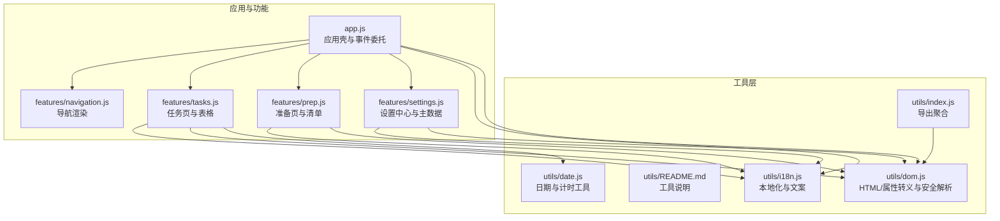
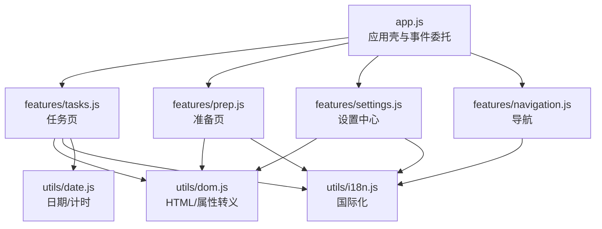
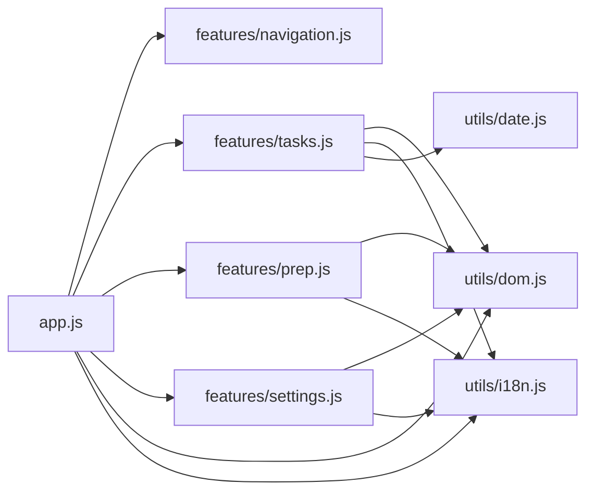

# DOM和通用工具

<cite>
**本文引用的文件**
- [dom.js](file://v16/src/utils/dom.js)
- [index.js](file://v16/src/utils/index.js)
- [README.md](file://v16/src/utils/README.md)
- [app.js](file://v16/src/app.js)
- [tasks.js](file://v16/src/features/tasks.js)
- [prep.js](file://v16/src/features/prep.js)
- [navigation.js](file://v16/src/features/navigation.js)
- [settings.js](file://v16/src/features/settings.js)
- [i18n.js](file://v16/src/utils/i18n.js)
- [date.js](file://v16/src/utils/date.js)
</cite>

## 目录
1. [简介](#简介)
2. [项目结构](#项目结构)
3. [核心组件](#核心组件)
4. [架构总览](#架构总览)
5. [详细组件分析](#详细组件分析)
6. [依赖关系分析](#依赖关系分析)
7. [性能考虑](#性能考虑)
8. [故障排查指南](#故障排查指南)
9. [结论](#结论)
10. [附录](#附录)

## 简介
本文件聚焦于ROV任务管理v16中的DOM操作与通用工具函数，系统阐述HTML转义、属性转义、安全解析与DOM元素渲染的实现方式；详解字符串转义、XSS防护与内容安全策略；总结DOM查询、元素创建与事件绑定的最佳实践；覆盖通用辅助函数（数据校验、类型检查、工具方法）的功能与使用场景，并提供可直接定位到源码位置的示例路径，帮助开发者在项目中正确使用这些工具函数。同时给出性能优化建议、浏览器兼容性说明与错误处理策略。

## 项目结构
v16的工具层位于src/utils目录，包含DOM转义与安全解析、日期格式化、国际化等纯函数工具；页面渲染与事件处理集中在src/app.js以及各功能模块（如tasks、prep、settings、navigation），通过统一的渲染入口与事件委托机制完成DOM更新与交互。

**图表来源**
- [dom.js:1-21](file://v16/src/utils/dom.js#L1-L21)
- [index.js:1-3](file://v16/src/utils/index.js#L1-L3)
- [app.js:1-402](file://v16/src/app.js#L1-L402)
- [tasks.js:1-112](file://v16/src/features/tasks.js#L1-L112)
- [prep.js:1-58](file://v16/src/features/prep.js#L1-L58)
- [settings.js:1-200](file://v16/src/features/settings.js#L1-L200)
- [i18n.js:1-217](file://v16/src/utils/i18n.js#L1-L217)
- [date.js:1-55](file://v16/src/utils/date.js#L1-L55)

**章节来源**
- [README.md:1-7](file://v16/src/utils/README.md#L1-L7)
- [index.js:1-3](file://v16/src/utils/index.js#L1-L3)

## 核心组件
- DOM转义与安全解析
  - HTML文本转义：用于将用户输入或动态内容插入到DOM文本节点或属性值中，防止注入脚本。
  - 属性值转义：用于将动态值插入到HTML属性中，避免引号与反斜杠破坏属性语法。
  - 安全JSON解析：对来自localStorage或文件导入的原始JSON字符串进行容错解析，失败时返回默认值。
- 国际化与文案
  - 文案键到多语言文本的映射，支持简体中文与英文切换。
- 日期与计时
  - 日期输入值格式化、周起始日计算、任务到期信息与超期判断、计时器格式化显示。
- 应用壳与事件委托
  - 统一渲染入口、页面切换、定时器控制、文件读取与导入、写入同步流程等。

**章节来源**
- [dom.js:1-21](file://v16/src/utils/dom.js#L1-L21)
- [i18n.js:1-217](file://v16/src/utils/i18n.js#L1-L217)
- [date.js:1-55](file://v16/src/utils/date.js#L1-L55)
- [app.js:1-402](file://v16/src/app.js#L1-L402)

## 架构总览
应用采用“工具函数层 + 功能模块层 + 应用壳”的分层设计。工具函数提供纯函数能力，功能模块负责页面渲染与业务逻辑，应用壳集中处理事件与状态变更，形成清晰的职责边界与低耦合的调用关系。

**图表来源**
- [app.js:1-402](file://v16/src/app.js#L1-L402)
- [tasks.js:1-112](file://v16/src/features/tasks.js#L1-L112)
- [prep.js:1-58](file://v16/src/features/prep.js#L1-L58)
- [settings.js:1-200](file://v16/src/features/settings.js#L1-L200)
- [navigation.js:1-37](file://v16/src/features/navigation.js#L1-L37)
- [dom.js:1-21](file://v16/src/utils/dom.js#L1-L21)
- [i18n.js:1-217](file://v16/src/utils/i18n.js#L1-L217)
- [date.js:1-55](file://v16/src/utils/date.js#L1-L55)

## 详细组件分析

### DOM转义与安全解析
- HTML文本转义
  - 作用：将特殊字符替换为HTML实体，防止XSS与标签注入。
  - 使用场景：动态渲染文本、表单字段、列表项、按钮文字等。
  - 示例路径：[escapeHtml:1-8](file://v16/src/utils/dom.js#L1-L8)
- 属性值转义
  - 作用：对插入HTML属性的值进行引号与反斜杠转义，避免破坏属性语法。
  - 使用场景：option value、onclick、data-* 等属性值。
  - 示例路径：[escapeAttr:10-12](file://v16/src/utils/dom.js#L10-L12)
- 安全JSON解析
  - 作用：对原始字符串进行JSON.parse，异常时返回默认值，避免崩溃。
  - 使用场景：从localStorage或文件导入的数据解析。
  - 示例路径：[safeJsonParse:14-20](file://v16/src/utils/dom.js#L14-L20)

最佳实践
- 所有来自外部或用户可控的数据在插入DOM前必须经过对应转义函数处理。
- 属性值优先使用escapeAttr，文本内容优先使用escapeHtml。
- 对不可信JSON字符串一律使用safeJsonParse，避免直接JSON.parse。

**章节来源**
- [dom.js:1-21](file://v16/src/utils/dom.js#L1-L21)

### 国际化与文案
- 文案键到多语言文本映射，支持简体中文与英文切换。
- 示例路径：
  - [t:214-216](file://v16/src/utils/i18n.js#L214-L216)
  - [setLocale:208-211](file://v16/src/utils/i18n.js#L208-L211)
  - [getLocale:204-206](file://v16/src/utils/i18n.js#L204-L206)

最佳实践
- 页面所有可见文案统一通过t(key)获取，避免硬编码字符串。
- 切换语言后需重新渲染，确保新文案生效。

**章节来源**
- [i18n.js:1-217](file://v16/src/utils/i18n.js#L1-L217)

### 日期与计时工具
- 日期输入值格式化、周起始日计算、任务到期信息与超期判断、计时器格式化显示。
- 示例路径：
  - [todayDateString:1-3](file://v16/src/utils/date.js#L1-L3)
  - [toDateInputValue:5-11](file://v16/src/utils/date.js#L5-L11)
  - [getWeekStart:13-18](file://v16/src/utils/date.js#L13-L18)
  - [getTaskDueInfo:21-28](file://v16/src/utils/date.js#L21-L28)
  - [isOverdue:30-35](file://v16/src/utils/date.js#L30-L35)
  - [getOverdueDays:37-44](file://v16/src/utils/date.js#L37-L44)
  - [formatMissionTime:46-54](file://v16/src/utils/date.js#L46-L54)

最佳实践
- 表单日期输入使用toDateInputValue保证格式一致。
- 计算到期天数与超期状态时，注意时区与时间截断处理。

**章节来源**
- [date.js:1-55](file://v16/src/utils/date.js#L1-L55)

### 应用壳与事件委托
- 渲染入口：统一在appRoot内渲染导航与当前页面。
- 事件委托：通过根节点监听点击、提交、变更、键盘等事件，按data-*属性分发处理。
- 示例路径：
  - [renderAppShell:114-131](file://v16/src/app.js#L114-L131)
  - [事件委托与页面切换:189-344](file://v16/src/app.js#L189-L344)
  - [表单提交与任务添加:346-352](file://v16/src/app.js#L346-L352)
  - [变更与复选框切换:354-393](file://v16/src/app.js#L354-L393)
  - [键盘事件与主数据新增:395-401](file://v16/src/app.js#L395-L401)

最佳实践
- 所有DOM更新通过renderAppShell触发，避免直接操作DOM。
- 事件处理函数内部尽量只做状态变更与持久化，渲染由统一入口完成。
- 文件读取与JSON解析使用safeJsonParse，捕获异常并提示用户。

**章节来源**
- [app.js:1-402](file://v16/src/app.js#L1-L402)

### 功能模块中的DOM与工具使用

#### 任务页（tasks）
- 使用escapeHtml渲染任务名称、类别、优先级、状态等文本。
- 使用t获取国际化文案。
- 使用date工具计算到期天数与超期状态。
- 示例路径：
  - [renderTaskTable:50-82](file://v16/src/features/tasks.js#L50-L82)
  - [renderTasksPage:84-111](file://v16/src/features/tasks.js#L84-L111)

最佳实践
- 表格单元格文本与下拉选项均需转义。
- 下拉选项的value应使用escapeAttr，避免注入。

**章节来源**
- [tasks.js:1-112](file://v16/src/features/tasks.js#L1-L112)
- [date.js:1-55](file://v16/src/utils/date.js#L1-L55)
- [i18n.js:1-217](file://v16/src/utils/i18n.js#L1-L217)
- [dom.js:1-21](file://v16/src/utils/dom.js#L1-L21)

#### 准备页（prep）
- 使用escapeHtml渲染清单项与页面标题。
- 使用toggleChecklistItem切换复选框状态。
- 示例路径：
  - [renderChecklist:13-23](file://v16/src/features/prep.js#L13-L23)
  - [renderPrepCenter:25-57](file://v16/src/features/prep.js#L25-L57)

最佳实践
- 复选框的data-*属性值无需转义，但其label文本需转义。
- 状态变更后统一持久化并触发渲染。

**章节来源**
- [prep.js:1-58](file://v16/src/features/prep.js#L1-L58)
- [i18n.js:1-217](file://v16/src/utils/i18n.js#L1-L217)
- [dom.js:1-21](file://v16/src/utils/dom.js#L1-L21)

#### 设置中心（settings）
- 使用safeJsonParse解析主数据与设置包。
- 使用escapeHtml渲染设置中心标题、按钮与统计卡片。
- 示例路径：
  - [loadMasterData:34-45](file://v16/src/features/settings.js#L34-L45)
  - [exportSettingsPack:107-119](file://v16/src/features/settings.js#L107-L119)
  - [renderSettingsHub:156-200](file://v16/src/features/settings.js#L156-L200)

最佳实践
- 导入设置包时先校验类型，再进行safeJsonParse解析。
- 导出设置包时使用Blob与临时链接下载，避免阻塞UI线程。

**章节来源**
- [settings.js:1-200](file://v16/src/features/settings.js#L1-L200)
- [dom.js:1-21](file://v16/src/utils/dom.js#L1-L21)
- [i18n.js:1-217](file://v16/src/utils/i18n.js#L1-L217)

#### 导航（navigation）
- 使用t渲染导航按钮与应用标题。
- 示例路径：
  - [renderNavigation:21-36](file://v16/src/features/navigation.js#L21-L36)

最佳实践
- 导航按钮的data-page与data-locale属性用于事件委托识别。

**章节来源**
- [navigation.js:1-37](file://v16/src/features/navigation.js#L1-L37)
- [i18n.js:1-217](file://v16/src/utils/i18n.js#L1-L217)

### 工具函数聚合导出
- index.js将dom与date工具统一导出，便于模块间共享。
- 示例路径：
  - [index导出:1-3](file://v16/src/utils/index.js#L1-L3)

最佳实践
- 模块内部通过index.js统一引入，减少相对路径复杂度。

**章节来源**
- [index.js:1-3](file://v16/src/utils/index.js#L1-L3)

## 依赖关系分析

**图表来源**
- [app.js:1-402](file://v16/src/app.js#L1-L402)
- [tasks.js:1-112](file://v16/src/features/tasks.js#L1-L112)
- [prep.js:1-58](file://v16/src/features/prep.js#L1-L58)
- [settings.js:1-200](file://v16/src/features/settings.js#L1-L200)
- [dom.js:1-21](file://v16/src/utils/dom.js#L1-L21)
- [i18n.js:1-217](file://v16/src/utils/i18n.js#L1-L217)
- [date.js:1-55](file://v16/src/utils/date.js#L1-L55)

**章节来源**
- [app.js:1-402](file://v16/src/app.js#L1-L402)
- [tasks.js:1-112](file://v16/src/features/tasks.js#L1-L112)
- [prep.js:1-58](file://v16/src/features/prep.js#L1-L58)
- [settings.js:1-200](file://v16/src/features/settings.js#L1-L200)
- [dom.js:1-21](file://v16/src/utils/dom.js#L1-L21)
- [i18n.js:1-217](file://v16/src/utils/i18n.js#L1-L217)
- [date.js:1-55](file://v16/src/utils/date.js#L1-L55)

## 性能考虑
- 避免频繁DOM操作：通过统一渲染入口批量更新，减少重排与重绘。
- 事件委托：根节点监听事件，降低子元素事件绑定数量。
- 转义与解析：仅在必要时执行，避免重复转义；safeJsonParse用于一次性容错解析。
- 文件读取：使用异步FileReader，避免阻塞主线程。
- 计时器：合理设置刷新频率，避免高频渲染导致卡顿。

[本节为通用指导，不涉及具体文件分析]

## 故障排查指南
- XSS与注入问题
  - 症状：页面出现脚本执行或标签破坏。
  - 排查：确认文本与属性值是否经过escapeHtml与escapeAttr处理。
  - 参考路径：[escapeHtml:1-8](file://v16/src/utils/dom.js#L1-L8)、[escapeAttr:10-12](file://v16/src/utils/dom.js#L10-L12)
- JSON解析失败
  - 症状：导入设置包或主数据时报错或空白。
  - 排查：检查原始字符串是否为合法JSON；使用safeJsonParse并提供默认值。
  - 参考路径：[safeJsonParse:14-20](file://v16/src/utils/dom.js#L14-L20)
- 语言切换无效
  - 症状：切换语言后文案未更新。
  - 排查：确认setLocale已写入localStorage且渲染入口重新渲染。
  - 参考路径：[setLocale:208-211](file://v16/src/utils/i18n.js#L208-L211)、[renderAppShell:114-131](file://v16/src/app.js#L114-L131)
- 日期格式异常
  - 症状：日期输入不正确或到期计算异常。
  - 排查：使用toDateInputValue格式化输入值；注意时区与时间截断。
  - 参考路径：[toDateInputValue:5-11](file://v16/src/utils/date.js#L5-L11)、[getTaskDueInfo:21-28](file://v16/src/utils/date.js#L21-L28)

**章节来源**
- [dom.js:1-21](file://v16/src/utils/dom.js#L1-L21)
- [i18n.js:1-217](file://v16/src/utils/i18n.js#L1-L217)
- [date.js:1-55](file://v16/src/utils/date.js#L1-L55)
- [app.js:114-131](file://v16/src/app.js#L114-L131)

## 结论
v16通过工具层的DOM转义与安全解析、国际化与日期工具，配合应用壳的事件委托与统一渲染，构建了安全、可维护且易扩展的前端架构。遵循本文的最佳实践与示例路径，可在保证XSS防护与内容安全的同时，高效完成DOM操作与数据处理。

[本节为总结，不涉及具体文件分析]

## 附录

### 常见使用场景与示例路径
- 在任务表格中渲染任务名称与类别
  - [renderTaskTable:50-82](file://v16/src/features/tasks.js#L50-L82)
- 在设置中心导出设置包
  - [exportSettingsPack:107-119](file://v16/src/features/settings.js#L107-L119)
- 在应用壳中处理文件导入
  - [文件读取与JSON解析:365-393](file://v16/src/app.js#L365-L393)
- 在导航中切换语言
  - [事件委托与语言切换:189-195](file://v16/src/app.js#L189-L195)
  - [renderNavigation:21-36](file://v16/src/features/navigation.js#L21-L36)

[本节为索引，不涉及具体代码分析]