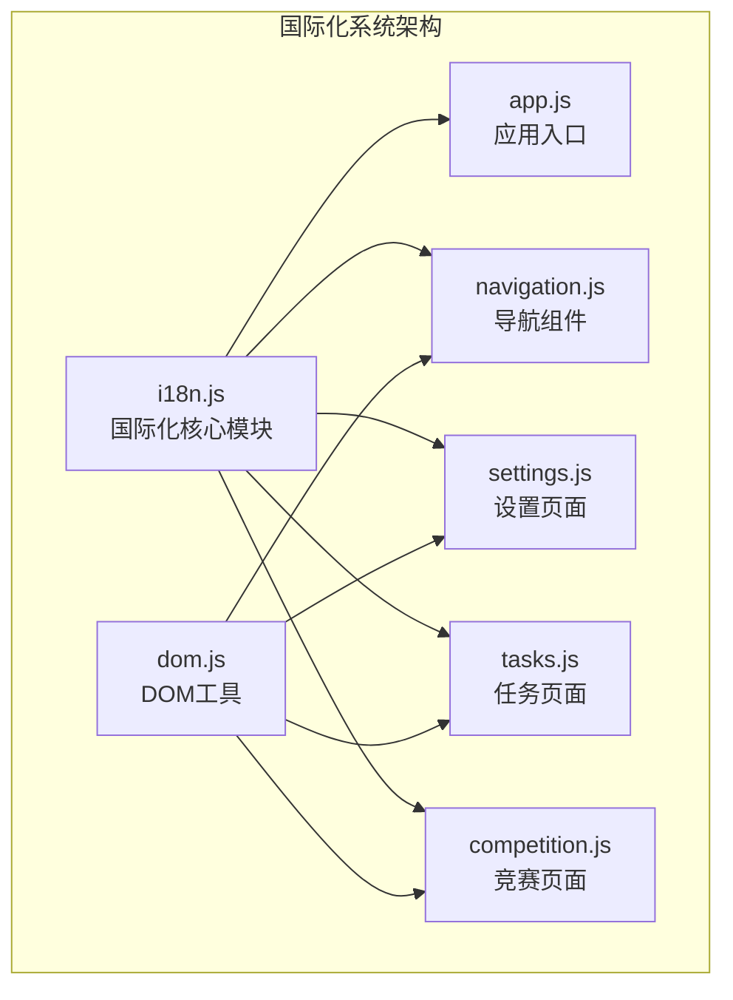
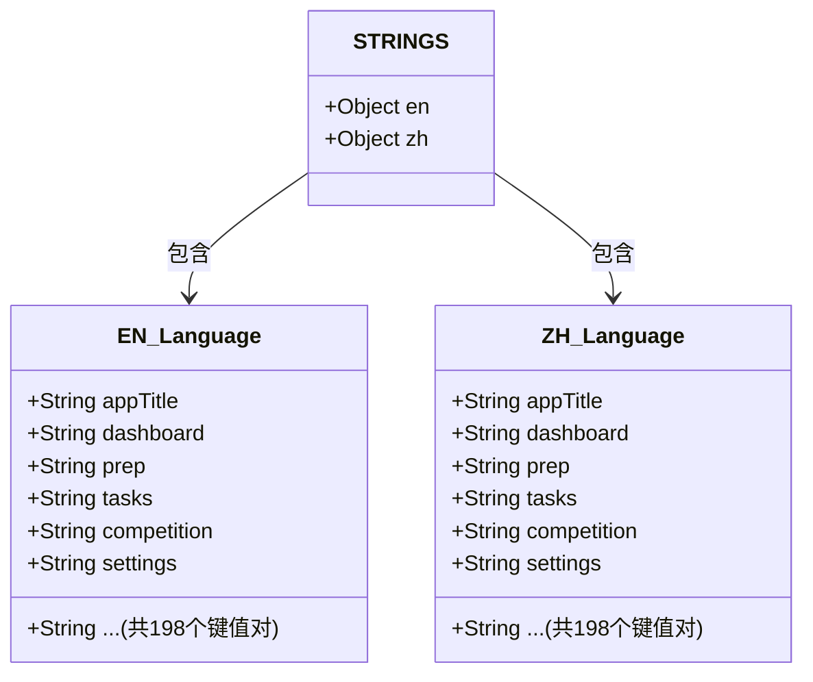
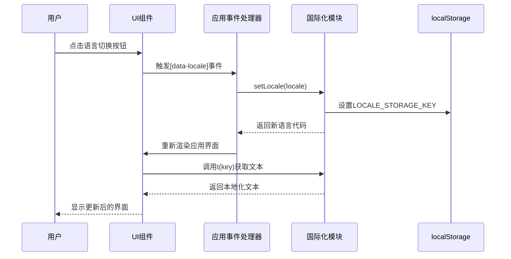
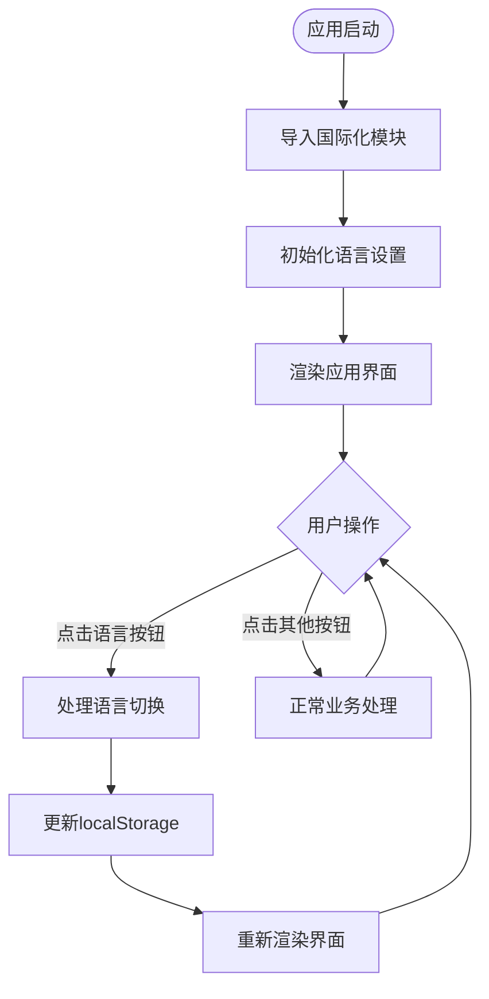
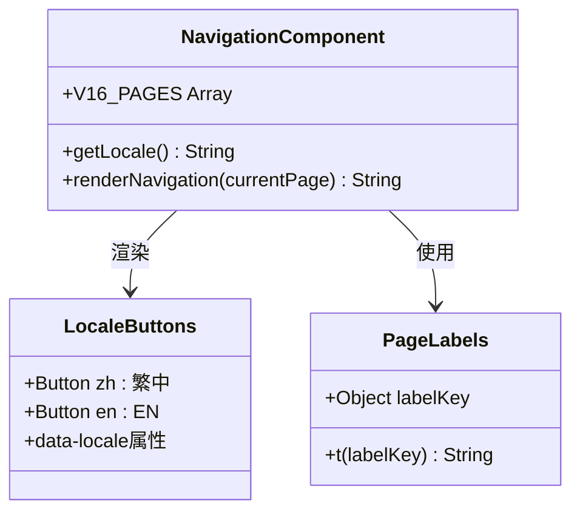
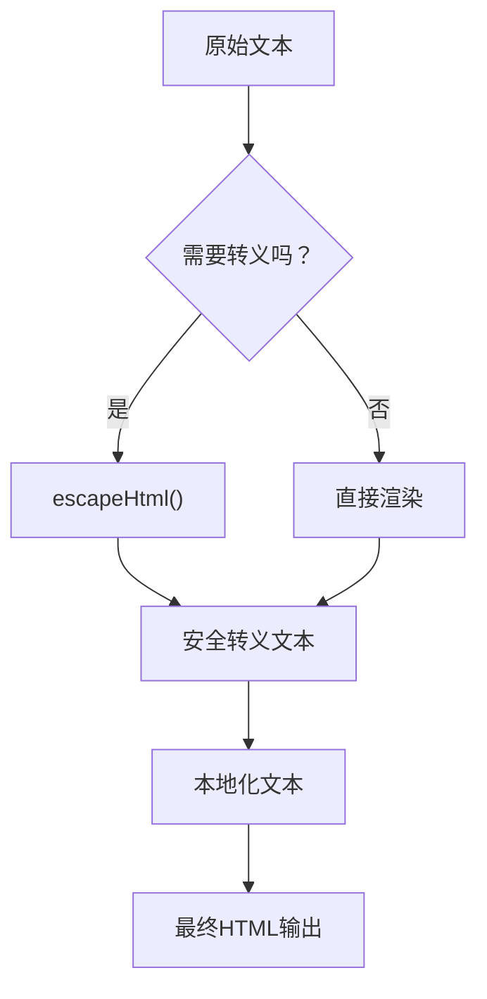
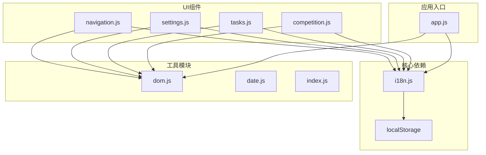

# 国际化系统

<cite>
**本文档引用的文件**
- [i18n.js](file://v16/src/utils/i18n.js)
- [app.js](file://v16/src/app.js)
- [navigation.js](file://v16/src/features/navigation.js)
- [settings.js](file://v16/src/features/settings.js)
- [tasks.js](file://v16/src/features/tasks.js)
- [competition.js](file://v16/src/features/competition.js)
- [dom.js](file://v16/src/utils/dom.js)
</cite>

## 目录
1. [简介](#简介)
2. [项目结构](#项目结构)
3. [核心组件](#核心组件)
4. [架构概览](#架构概览)
5. [详细组件分析](#详细组件分析)
6. [依赖关系分析](#依赖关系分析)
7. [性能考虑](#性能考虑)
8. [故障排除指南](#故障排除指南)
9. [结论](#结论)
10. [附录](#附录)

## 简介

ROV任务管理v16的国际化系统是一个轻量级的多语言支持解决方案，实现了中英文双语切换功能。该系统采用纯JavaScript实现，无需外部依赖，通过localStorage持久化用户语言偏好设置。

该国际化系统的核心目标是：
- 提供简洁高效的多语言支持
- 实现用户语言偏好的持久化存储
- 支持运行时动态切换语言
- 确保所有UI文本内容的本地化

## 项目结构

国际化系统主要分布在以下文件中：



**图表来源**
- [i18n.js:1-217](file://v16/src/utils/i18n.js#L1-L217)
- [app.js:1-402](file://v16/src/app.js#L1-L402)

**章节来源**
- [i18n.js:1-217](file://v16/src/utils/i18n.js#L1-L217)
- [app.js:1-402](file://v16/src/app.js#L1-L402)

## 核心组件

### LOCALE_STORAGE_KEY常量

`LOCALE_STORAGE_KEY`是国际化系统的核心配置常量，定义了localStorage中存储语言偏好的键名。

- **作用**：作为localStorage的键标识符，用于持久化用户的语言选择
- **默认值**：`'rov_v16_locale'`
- **存储格式**：字符串类型，值为`'zh'`或`'en'`

### STRINGS对象结构

STRINGS对象是国际化系统的核心数据结构，采用嵌套对象的形式组织本地化字符串：



**图表来源**
- [i18n.js:3-200](file://v18n.js#L3-L200)

每个语言对象包含约200个键值对，覆盖了应用的所有UI文本内容，包括：
- 应用标题和导航标签
- 页面标题和描述
- 按钮文本和操作提示
- 表单字段标签
- 状态信息和错误消息
- 功能模块的专用术语

### getLocale()函数

`getLocale()`函数用于获取当前激活的语言代码。

- **返回值**：字符串，要么是`'zh'`（中文），要么是`'en'`（英文）
- **实现逻辑**：从localStorage读取`LOCALE_STORAGE_KEY`对应的值，如果不存在则默认返回`'zh'`
- **使用场景**：在渲染过程中确定当前语言环境

### setLocale()函数

`setLocale()`函数负责切换和保存语言设置。

- **参数**：`locale` - 期望的语言代码
- **处理逻辑**：
  - 验证输入是否为`'en'`
  - 如果不是`'en'`，则强制设为`'zh'`
  - 更新全局`currentLocale`变量
  - 将新语言设置保存到localStorage
- **返回值**：实际设置的语言代码
- **副作用**：更新localStorage中的语言偏好

### t()函数

`t()`函数是国际化系统的核心翻译函数，负责根据键值查找对应的本地化文本。

- **参数**：`key` - 字符串类型的键值
- **查找优先级**：
  1. 首先查找`STRINGS[currentLocale][key]`（当前语言）
  2. 如果失败，回退到`STRINGS.en[key]`（英文）
  3. 如果仍然失败，直接返回`key`（保持原键值）
- **返回值**：字符串类型的本地化文本
- **设计原则**：确保不会出现未翻译的键值显示

**章节来源**
- [i18n.js:1-217](file://v16/src/utils/i18n.js#L1-L217)

## 架构概览

国际化系统采用模块化设计，通过清晰的职责分离实现语言管理：



**图表来源**
- [app.js:189-195](file://v16/src/app.js#L189-L195)
- [i18n.js:208-216](file://v16/src/utils/i18n.js#L208-L216)

## 详细组件分析

### 应用入口集成

应用入口文件`app.js`集成了国际化系统，实现了完整的语言切换流程：



**图表来源**
- [app.js:36](file://v16/src/app.js#L36)
- [app.js:189-195](file://v16/src/app.js#L189-L195)

### 导航组件国际化

导航组件`navigation.js`展示了国际化在UI中的具体应用：



**图表来源**
- [navigation.js:21-36](file://v16/src/features/navigation.js#L21-L36)

导航组件的关键特性：
- 动态语言按钮：根据当前语言状态高亮显示对应按钮
- 键值映射：使用`labelKey`属性指向STRINGS对象中的键值
- 即时切换：点击按钮立即触发语言切换并重新渲染

### 页面组件国际化模式

各个页面组件都遵循统一的国际化使用模式：

```mermaid
graph LR
subgraph "国际化使用模式"
T[t(key)] --> STRINGS[STRINGS对象]
STRINGS --> CURRENT[currentLocale]
STRINGS --> FALLBACK[英文回退]
ESCAPE[escapeHtml(text)] --> RENDER[HTML渲染]
CURRENT --> RENDER
FALLBACK --> RENDER
DOM_ESCAPE[DOM工具] --> RENDER
end
```

**图表来源**
- [tasks.js:50-82](file://v16/src/features/tasks.js#L50-L82)
- [settings.js:156-537](file://v16/src/features/settings.js#L156-L537)

### DOM安全处理

国际化系统与DOM安全处理紧密结合，确保本地化文本的安全渲染：



**图表来源**
- [dom.js:1-8](file://v16/src/utils/dom.js#L1-L8)

**章节来源**
- [app.js:189-195](file://v16/src/app.js#L189-L195)
- [navigation.js:21-36](file://v16/src/features/navigation.js#L21-L36)
- [tasks.js:50-82](file://v16/src/features/tasks.js#L50-L82)
- [settings.js:156-537](file://v16/src/features/settings.js#L156-L537)
- [dom.js:1-8](file://v16/src/utils/dom.js#L1-L8)

## 依赖关系分析

国际化系统与其他模块的依赖关系如下：



**图表来源**
- [i18n.js:1-217](file://v16/src/utils/i18n.js#L1-L217)
- [app.js:36](file://v16/src/app.js#L36)

**章节来源**
- [i18n.js:1-217](file://v16/src/utils/i18n.js#L1-L217)
- [app.js:1-402](file://v16/src/app.js#L1-L402)

## 性能考虑

国际化系统的性能特点：

### 内存使用
- STRINGS对象占用相对较小的内存空间（约200个键值对）
- 每次语言切换只更新一个全局变量和localStorage
- 翻译函数调用开销极小

### 访问速度
- 语言切换：O(1)时间复杂度
- 文本翻译：O(1)时间复杂度
- DOM渲染：受页面大小影响，但与国际化无关

### 存储策略
- localStorage持久化避免重复初始化
- 避免频繁的网络请求或外部依赖
- 支持离线使用

## 故障排除指南

### 常见问题及解决方案

#### 语言切换无效
**症状**：点击语言按钮后界面不变化
**可能原因**：
- localStorage访问被浏览器阻止
- 事件处理器未正确绑定
- t()函数调用错误

**解决步骤**：
1. 检查浏览器控制台是否有错误信息
2. 验证`data-locale`属性是否正确设置
3. 确认`setLocale()`函数被正确调用
4. 检查`localStorage`权限设置

#### 文本未翻译
**症状**：某些文本显示为原始键值而非本地化文本
**可能原因**：
- STRINGS对象中缺少对应键值
- t()函数参数错误
- DOM转义导致显示异常

**解决步骤**：
1. 在STRINGS对象中添加缺失的键值对
2. 验证t()函数调用的参数是否正确
3. 检查escapeHtml()函数的使用

#### 默认语言设置问题
**症状**：应用启动时显示非预期语言
**可能原因**：
- localStorage中存在无效的语言设置
- 初始语言设置逻辑错误

**解决步骤**：
1. 清除localStorage中的`LOCALE_STORAGE_KEY`条目
2. 重置浏览器缓存
3. 重新加载应用

**章节来源**
- [i18n.js:208-216](file://v16/src/utils/i18n.js#L208-L216)
- [app.js:189-195](file://v16/src/app.js#L189-L195)

## 结论

ROV任务管理v16的国际化系统是一个设计精良的轻量级解决方案，具有以下优势：

### 技术优势
- **简单可靠**：纯JavaScript实现，无外部依赖
- **性能优秀**：O(1)时间复杂度的查找和切换
- **易于维护**：清晰的模块化结构和单一职责
- **用户友好**：自动持久化用户语言偏好

### 功能完整性
- 支持中英文双语切换
- 完整的UI文本本地化覆盖
- 即时的语言切换反馈
- 优雅的回退机制

### 扩展性考虑
系统设计允许轻松添加新的语言支持，只需在STRINGS对象中添加对应语言的键值对即可。

## 附录

### 国际化使用最佳实践

#### 在UI组件中使用国际化
1. **导入模块**：在需要使用的文件顶部导入`{ t }`函数
2. **键值选择**：使用语义化的键值名称，避免硬编码文本
3. **DOM转义**：始终使用`escapeHtml()`函数处理用户输入
4. **即时更新**：语言切换后及时重新渲染相关组件

#### 语言包扩展指南

要为系统添加新的语言支持：

1. **添加语言对象**：在STRINGS对象中添加新的语言键值对
2. **键值映射**：确保所有现有键值都有对应的新语言翻译
3. **测试验证**：在新语言下测试所有UI组件
4. **回退机制**：确保英文作为可靠的回退选项

#### 性能优化建议

1. **批量翻译**：在渲染大量文本时考虑批量处理
2. **缓存策略**：对于频繁使用的文本可以考虑本地缓存
3. **懒加载**：大型应用可考虑按需加载语言包

#### 维护注意事项

1. **键值一致性**：保持不同语言版本间的键值一致性
2. **注释说明**：为复杂的翻译文本添加上下文注释
3. **定期审查**：定期检查翻译质量和完整性
4. **用户反馈**：建立用户反馈机制来改进翻译质量