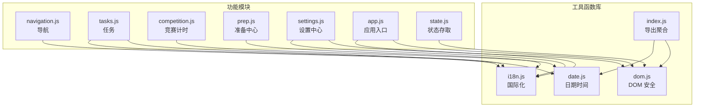
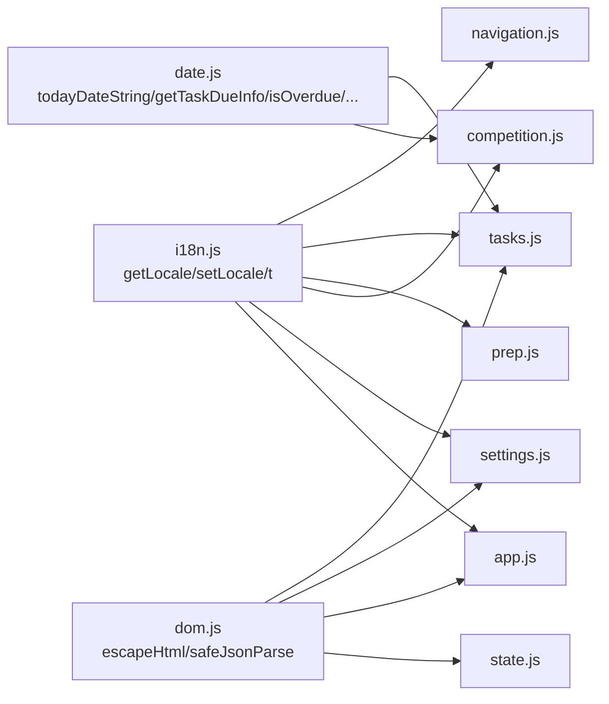
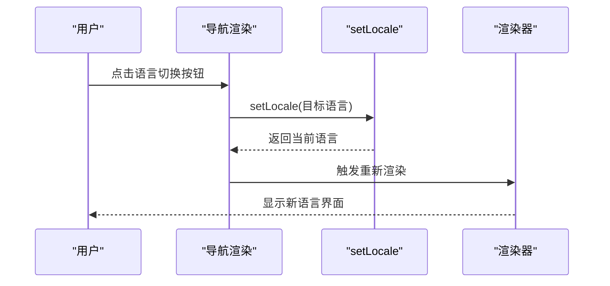
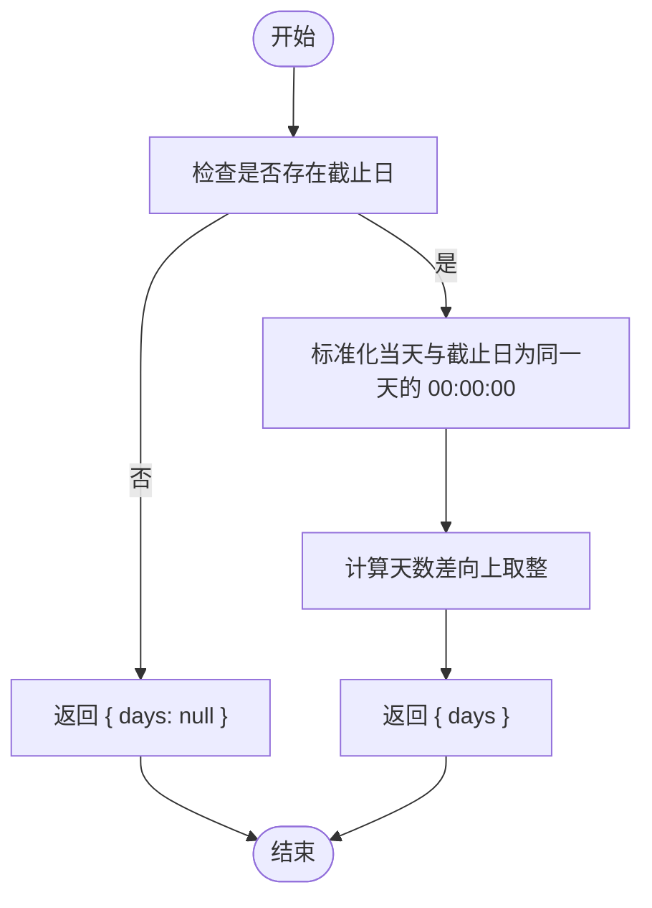
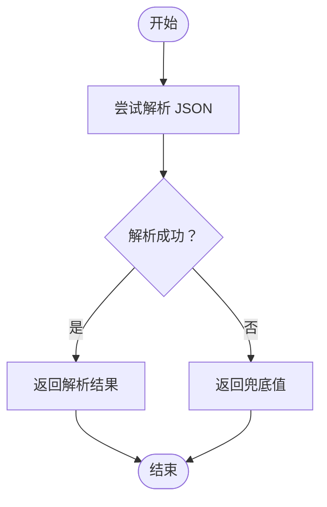
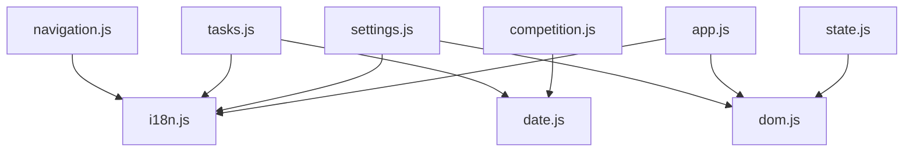

# 工具函数库

<cite>
**本文引用的文件**
- [i18n.js](file://v16/src/utils/i18n.js)
- [date.js](file://v16/src/utils/date.js)
- [dom.js](file://v16/src/utils/dom.js)
- [index.js](file://v16/src/utils/index.js)
- [README.md](file://v16/src/utils/README.md)
- [app.js](file://v16/src/app.js)
- [tasks.js](file://v16/src/features/tasks.js)
- [navigation.js](file://v16/src/features/navigation.js)
- [competition.js](file://v16/src/features/competition.js)
- [prep.js](file://v16/src/features/prep.js)
- [settings.js](file://v16/src/features/settings.js)
- [state.js](file://v16/src/data/state.js)
</cite>

## 目录
1. [简介](#简介)
2. [项目结构](#项目结构)
3. [核心组件](#核心组件)
4. [架构总览](#架构总览)
5. [详细组件分析](#详细组件分析)
6. [依赖关系分析](#依赖关系分析)
7. [性能考量](#性能考量)
8. [故障排查指南](#故障排查指南)
9. [结论](#结论)
10. [附录](#附录)

## 简介
本文件为 ROV 任务管理 v16 的工具函数库文档，覆盖国际化系统、日期时间处理、DOM 操作与通用工具函数。文档面向开发者与维护者，提供函数用途、参数说明、返回值类型、错误处理策略与最佳实践，并通过图示展示关键流程。

## 项目结构
工具函数库位于 v16/src/utils 目录，包含以下模块：
- 国际化：i18n.js（多语言字符串映射、当前语言读取/设置、翻译函数）
- 日期时间：date.js（日期字符串、周起始、到期信息、过期判断、逾期天数、计时器格式化）
- DOM 安全：dom.js（HTML 转义、属性转义、安全 JSON 解析）
- 导出聚合：index.js（统一导出 dom 与 date）

图表来源
- [index.js:1-3](file://v16/src/utils/index.js#L1-L3)
- [i18n.js:1-217](file://v16/src/utils/i18n.js#L1-L217)
- [date.js:1-55](file://v16/src/utils/date.js#L1-L55)
- [dom.js:1-21](file://v16/src/utils/dom.js#L1-L21)
- [navigation.js:1-37](file://v16/src/features/navigation.js#L1-L37)
- [tasks.js:1-112](file://v16/src/features/tasks.js#L1-L112)
- [competition.js:1-68](file://v16/src/features/competition.js#L1-L68)
- [prep.js:1-58](file://v16/src/features/prep.js#L1-L58)
- [settings.js:1-200](file://v16/src/features/settings.js#L1-L200)
- [app.js:1-402](file://v16/src/app.js#L1-L402)
- [state.js:1-45](file://v16/src/data/state.js#L1-L45)

章节来源
- [README.md:1-7](file://v16/src/utils/README.md#L1-L7)
- [index.js:1-3](file://v16/src/utils/index.js#L1-L3)

## 核心组件
- 国际化系统（i18n.js）
  - 多语言字符串常量表（中英文）
  - 当前语言持久化（localStorage 键）
  - 读取/设置语言函数
  - 翻译函数（键到文本映射，回退到英文或键名）
- 日期时间工具（date.js）
  - 今日日期字符串（YYYY-MM-DD）
  - 日期输入值格式化（YYYY-MM-DD）
  - 周起始日期（周一）
  - 任务到期信息（距今天数）
  - 过期判断（截止日是否已过）
  - 逾期天数计算
  - 计时器格式化（秒 → HH:MM:SS 或 MM:SS）
- DOM 安全工具（dom.js）
  - HTML 文本转义
  - 属性值转义
  - 安全 JSON 解析（异常兜底）
- 统一导出（index.js）
  - 聚合导出 dom 与 date 工具

章节来源
- [i18n.js:1-217](file://v16/src/utils/i18n.js#L1-L217)
- [date.js:1-55](file://v16/src/utils/date.js#L1-L55)
- [dom.js:1-21](file://v16/src/utils/dom.js#L1-L21)
- [index.js:1-3](file://v16/src/utils/index.js#L1-L3)

## 架构总览
工具函数在应用层被广泛复用，贯穿页面渲染、交互事件处理与数据导入导出等环节。下图展示了主要调用关系：

图表来源
- [i18n.js:1-217](file://v16/src/utils/i18n.js#L1-L217)
- [date.js:1-55](file://v16/src/utils/date.js#L1-L55)
- [dom.js:1-21](file://v16/src/utils/dom.js#L1-L21)
- [navigation.js:1-37](file://v16/src/features/navigation.js#L1-L37)
- [tasks.js:1-112](file://v16/src/features/tasks.js#L1-L112)
- [competition.js:1-68](file://v16/src/features/competition.js#L1-L68)
- [prep.js:1-58](file://v16/src/features/prep.js#L1-L58)
- [settings.js:1-200](file://v16/src/features/settings.js#L1-L200)
- [app.js:1-402](file://v16/src/app.js#L1-L402)
- [state.js:1-45](file://v16/src/data/state.js#L1-L45)

## 详细组件分析

### 国际化系统（i18n.js）
- 功能要点
  - 字符串常量表：包含界面标签、提示、按钮文案等，覆盖中英文
  - 语言持久化：通过 localStorage 存储用户选择的语言代码
  - 语言切换：限制可选语言，写入持久化存储
  - 翻译函数：按当前语言查找键值，不存在时回退到英文或键名
- 使用场景
  - 导航栏按钮标签、页面标题、表单占位符、提示信息等
  - 事件处理器中根据数据集切换语言后重新渲染
- 最佳实践
  - 所有用户可见文本优先通过翻译函数输出
  - 新增文案统一在常量表中添加键值
  - 保持键名稳定，避免破坏回退逻辑

图表来源
- [navigation.js:21-36](file://v16/src/features/navigation.js#L21-L36)
- [app.js:189-195](file://v16/src/app.js#L189-L195)
- [i18n.js:204-216](file://v16/src/utils/i18n.js#L204-L216)

章节来源
- [i18n.js:1-217](file://v16/src/utils/i18n.js#L1-L217)
- [navigation.js:1-37](file://v16/src/features/navigation.js#L1-L37)
- [app.js:189-195](file://v16/src/app.js#L189-L195)

### 日期时间工具（date.js）
- 功能要点
  - 今日日期字符串：YYYY-MM-DD
  - 日期输入值：YYYY-MM-DD（用于 <input type="date">）
  - 周起始：周一
  - 任务到期信息：返回距今天的天数（无截止日则 days 为 null）
  - 过期判断：截止日是否已过
  - 逾期天数：计算今日与截止日之差（非负）
  - 计时器格式化：秒 → HH:MM:SS 或 MM:SS（≥1 小时显示小时）
- 使用场景
  - 任务表单默认截止日、任务列表到期提示、竞赛计时显示
- 性能与边界
  - 所有日期计算均基于本地时间，注意时区差异
  - 逾期天数与到期信息对齐“当日”边界（00:00:00 vs 23:59:59）

图表来源
- [date.js:21-28](file://v16/src/utils/date.js#L21-L28)

章节来源
- [date.js:1-55](file://v16/src/utils/date.js#L1-L55)
- [tasks.js:50-82](file://v16/src/features/tasks.js#L50-L82)
- [competition.js:38-67](file://v16/src/features/competition.js#L38-L67)

### DOM 安全工具（dom.js）
- 功能要点
  - HTML 文本转义：替换 &, <, >, ", ' 为实体
  - 属性值转义：转义反斜杠与单引号
  - 安全 JSON 解析：捕获异常并返回兜底值
- 使用场景
  - 渲染用户输入文本、拼接 HTML、从文件读取 JSON
- 安全建议
  - 对来自用户或外部文件的文本一律先转义再插入 DOM
  - 使用安全解析替代直接 JSON.parse

图表来源
- [dom.js:14-20](file://v16/src/utils/dom.js#L14-L20)
- [state.js:16-33](file://v16/src/data/state.js#L16-L33)
- [settings.js:34-45](file://v16/src/features/settings.js#L34-L45)

章节来源
- [dom.js:1-21](file://v16/src/utils/dom.js#L1-L21)
- [tasks.js:1-3](file://v16/src/features/tasks.js#L1-L3)
- [settings.js:1-200](file://v16/src/features/settings.js#L1-L200)
- [state.js:1-45](file://v16/src/data/state.js#L1-L45)

### 统一导出（index.js）
- 功能要点
  - 聚合导出 dom 与 date 工具，便于上层模块统一引入
- 使用场景
  - app.js、各功能模块按需导入

章节来源
- [index.js:1-3](file://v16/src/utils/index.js#L1-L3)

## 依赖关系分析
- 模块内聚与耦合
  - i18n、date、dom 各自职责清晰，低耦合
  - index.js 提供统一入口，减少上层导入分散
- 关键依赖链
  - navigation.js → i18n.js（语言标签）
  - tasks.js → i18n.js（UI 文案）、date.js（截止日计算）
  - competition.js → date.js（计时格式化）
  - settings.js → i18n.js（UI 文案）、dom.js（安全解析）
  - app.js → i18n.js（语言切换）、dom.js（安全解析）
  - state.js → dom.js（安全解析）

图表来源
- [navigation.js:1-37](file://v16/src/features/navigation.js#L1-L37)
- [tasks.js:1-112](file://v16/src/features/tasks.js#L1-L112)
- [competition.js:1-68](file://v16/src/features/competition.js#L1-L68)
- [settings.js:1-200](file://v16/src/features/settings.js#L1-L200)
- [app.js:1-402](file://v16/src/app.js#L1-L402)
- [state.js:1-45](file://v16/src/data/state.js#L1-L45)
- [i18n.js:1-217](file://v16/src/utils/i18n.js#L1-L217)
- [date.js:1-55](file://v16/src/utils/date.js#L1-L55)
- [dom.js:1-21](file://v16/src/utils/dom.js#L1-L21)

## 性能考量
- 日期计算
  - 所有日期比较基于本地时间，避免额外时区转换开销
  - 周起始与到期计算为纯数学运算，复杂度 O(1)
- 国际化
  - 字符串查找为对象属性访问，O(1)，建议在渲染前缓存常用文案
- DOM 安全
  - 转义与解析均为轻量级操作，注意避免在高频循环中重复解析同一字符串

## 故障排查指南
- 翻译缺失
  - 现象：界面出现键名而非文案
  - 排查：确认键是否存在于当前语言表；若不存在，翻译函数会回退到英文或键名
  - 参考：[i18n.js:214-216](file://v16/src/utils/i18n.js#L214-L216)
- 日期格式异常
  - 现象：<input type="date"> 不识别或显示不正确
  - 排查：确保传入值为 YYYY-MM-DD 格式；使用日期输入值格式化函数
  - 参考：[date.js:5-11](file://v16/src/utils/date.js#L5-L11)
- 任务到期显示异常
  - 现象：到期天数为 null 或负数
  - 排查：检查任务截止日字段是否为空或格式错误；确认当天时间边界处理
  - 参考：[date.js:21-28](file://v16/src/utils/date.js#L21-L28)
- 过期判断不准确
  - 现象：截止日当天仍标记为过期
  - 排查：过期判断在当日 23:59:59 前不过期；如需严格区分，请调整边界逻辑
  - 参考：[date.js:30-35](file://v16/src/utils/date.js#L30-L35)
- 计时器格式异常
  - 现象：小于 1 小时未显示分钟前导零
  - 排查：格式化函数仅在大于等于 1 小时时显示小时段；小于 1 小时显示 MM:SS
  - 参考：[date.js:46-54](file://v16/src/utils/date.js#L46-L54)
- HTML 注入风险
  - 现象：XSS 或标签误解析
  - 排查：确认所有用户输入文本均经过 HTML 转义后再插入 DOM
  - 参考：[dom.js:1-8](file://v16/src/utils/dom.js#L1-L8)
- JSON 解析失败
  - 现象：导入设置包或备份失败
  - 排查：使用安全解析函数，捕获异常并提示用户；检查文件格式与完整性
  - 参考：[dom.js:14-20](file://v16/src/utils/dom.js#L14-L20)，[settings.js:34-45](file://v16/src/features/settings.js#L34-L45)

章节来源
- [i18n.js:214-216](file://v16/src/utils/i18n.js#L214-L216)
- [date.js:5-54](file://v16/src/utils/date.js#L5-L54)
- [dom.js:1-21](file://v16/src/utils/dom.js#L1-L21)
- [settings.js:34-45](file://v16/src/features/settings.js#L34-L45)

## 结论
工具函数库以简洁、高内聚的方式提供了国际化、日期时间与 DOM 安全的核心能力。通过统一导出与跨模块复用，提升了开发效率与安全性。建议在新增功能时遵循现有模式：优先使用翻译函数、日期工具与安全解析，确保一致的用户体验与数据安全。

## 附录

### 函数速查与最佳实践
- 国际化
  - getLocale：读取当前语言
  - setLocale：设置语言并持久化
  - t：按键获取文案，自动回退
  - 最佳实践：所有用户可见文本经 t 输出；新增文案统一在常量表添加
- 日期时间
  - todayDateString：生成 YYYY-MM-DD
  - toDateInputValue：日期输入值格式化
  - getWeekStart：返回当周周一
  - getTaskDueInfo：返回任务距今天的天数
  - isOverdue：判断截止日是否已过
  - getOverdueDays：计算逾期天数
  - formatMissionTime：计时器格式化
  - 最佳实践：注意本地时间与时区影响；在渲染前计算并缓存到期信息
- DOM 安全
  - escapeHtml：HTML 文本转义
  - escapeAttr：属性值转义
  - safeJsonParse：安全 JSON 解析
  - 最佳实践：所有用户输入与外部数据先转义/解析再使用

章节来源
- [i18n.js:204-216](file://v16/src/utils/i18n.js#L204-L216)
- [date.js:1-55](file://v16/src/utils/date.js#L1-L55)
- [dom.js:1-21](file://v16/src/utils/dom.js#L1-L21)