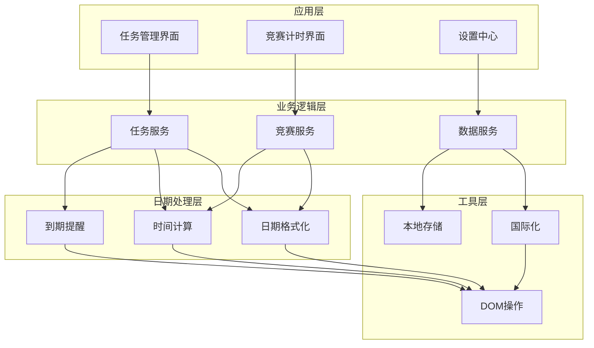
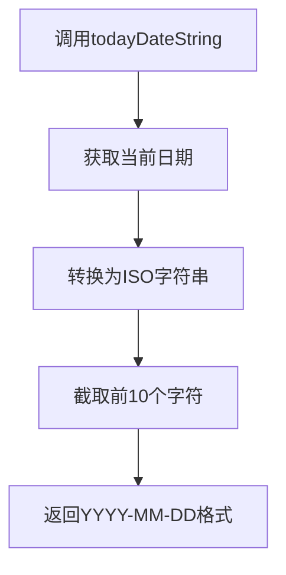
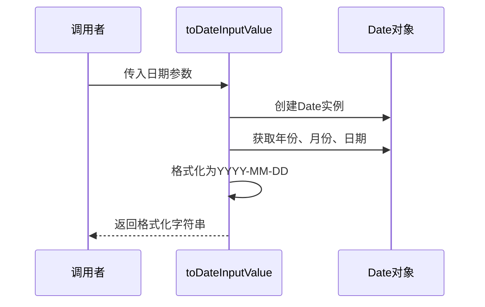
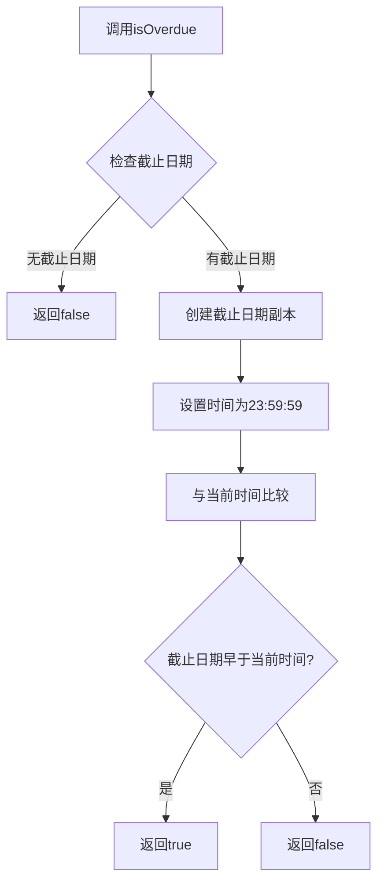
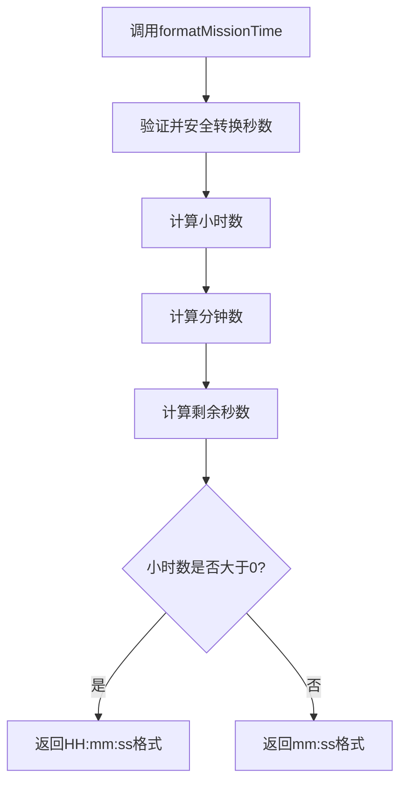
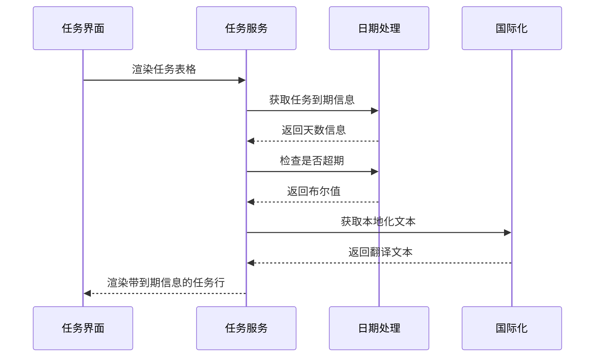
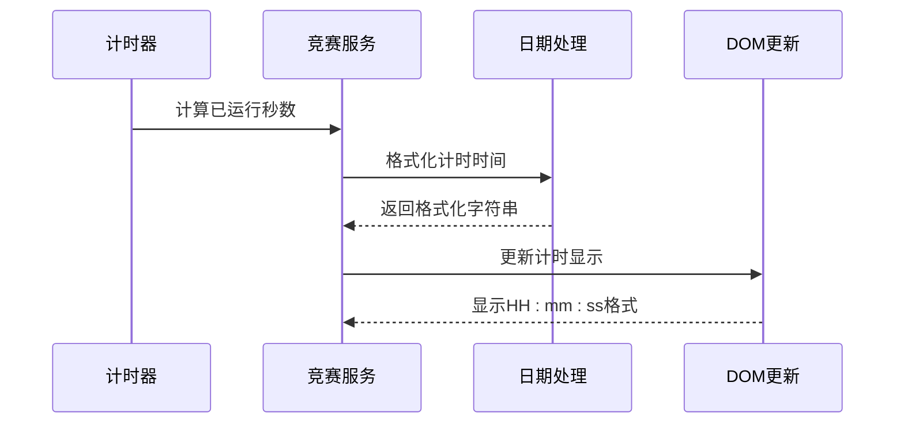
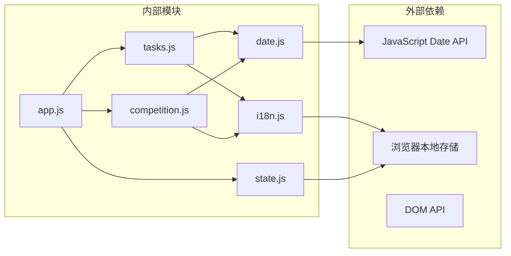
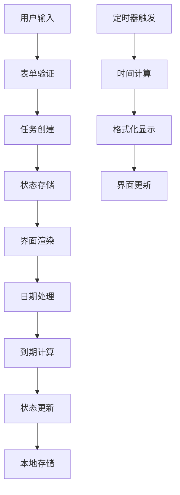

# 日期和时间处理

<cite>
**本文档引用的文件**
- [date.js](file://v16/src/utils/date.js)
- [tasks.js](file://v16/src/features/tasks.js)
- [competition.js](file://v16/src/features/competition.js)
- [i18n.js](file://v16/src/utils/i18n.js)
- [state.js](file://v16/src/data/state.js)
- [app.js](file://v16/src/app.js)
</cite>

## 目录
1. [简介](#简介)
2. [项目结构](#项目结构)
3. [核心组件](#核心组件)
4. [架构概览](#架构概览)
5. [详细组件分析](#详细组件分析)
6. [依赖关系分析](#依赖关系分析)
7. [性能考虑](#性能考虑)
8. [故障排除指南](#故障排除指南)
9. [结论](#结论)
10. [附录](#附录)

## 简介

ROV任务管理v16的日期和时间处理模块是一个专门设计用于处理任务管理中日期相关功能的工具集。该模块提供了完整的日期格式化、时间计算和到期提醒功能，支持任务截止日期管理、竞赛计时器以及本地化显示。

该模块的核心目标是：
- 提供统一的日期格式化和解析功能
- 实现任务到期状态的智能判断
- 支持本地化的时间显示
- 处理竞赛场景下的精确计时需求

## 项目结构

日期和时间处理模块在项目中的组织结构如下：

```mermaid
graph TB
subgraph "日期处理模块"
A[date.js<br/>核心日期处理函数"]
B[i18n.js<br/>国际化支持"]
end
subgraph "业务功能模块"
C[tasks.js<br/>任务管理"]
D[competition.js<br/>竞赛计时"]
E[state.js<br/>状态管理"]
F[app.js<br/>应用入口"]
end
A --> C
A --> D
B --> C
B --> D
E --> F
F --> C
F --> D
```

**图表来源**
- [date.js:1-55](file://v16/src/utils/date.js#L1-L55)
- [tasks.js:1-112](file://v16/src/features/tasks.js#L1-L112)
- [competition.js:1-68](file://v16/src/features/competition.js#L1-L68)

**章节来源**
- [date.js:1-55](file://v16/src/utils/date.js#L1-L55)
- [tasks.js:1-112](file://v16/src/features/tasks.js#L1-L112)
- [competition.js:1-68](file://v16/src/features/competition.js#L1-L68)

## 核心组件

### 日期格式化组件

日期格式化组件负责将JavaScript Date对象转换为用户友好的字符串格式，支持多种输出格式以满足不同场景的需求。

主要功能包括：
- ISO日期字符串生成（YYYY-MM-DD格式）
- HTML日期输入值格式化
- 周起始日期计算
- 任务到期天数计算

### 时间计算组件

时间计算组件专注于处理时间差计算和到期状态判断，为任务管理系统提供智能的到期提醒功能。

核心算法包括：
- 基于毫秒级精度的时间差计算
- 到期状态的智能判断逻辑
- 超期天数的精确计算
- 竞赛场景下的高精度计时

### 国际化支持组件

国际化支持组件确保日期和时间信息能够根据用户的语言偏好正确显示，支持中英文双语环境。

**章节来源**
- [date.js:1-55](file://v16/src/utils/date.js#L1-L55)
- [i18n.js:1-217](file://v16/src/utils/i18n.js#L1-L217)

## 架构概览

日期和时间处理模块采用分层架构设计，通过清晰的职责分离实现了高度的模块化和可维护性。



**图表来源**
- [tasks.js:1-112](file://v16/src/features/tasks.js#L1-L112)
- [competition.js:1-68](file://v16/src/features/competition.js#L1-L68)
- [date.js:1-55](file://v16/src/utils/date.js#L1-L55)

## 详细组件分析

### 日期格式化函数

#### todayDateString函数
该函数负责生成当前日期的ISO格式字符串，格式为YYYY-MM-DD，适用于HTML日期输入控件。



**图表来源**
- [date.js:1-3](file://v16/src/utils/date.js#L1-L3)

#### toDateInputValue函数
该函数将任意日期转换为HTML日期输入控件可用的格式，确保浏览器兼容性和数据一致性。



**图表来源**
- [date.js:5-11](file://v16/src/utils/date.js#L5-L11)

**章节来源**
- [date.js:1-11](file://v16/src/utils/date.js#L1-L11)

### 时间计算函数

#### getWeekStart函数
该函数计算给定日期所在周的开始日期，将时间设置为当天的0点，用于周统计和报表生成。

```mermaid
flowchart TD
A[调用getWeekStart] --> B[创建日期副本]
B --> C[设置时间为00:00:00]
C --> D[获取星期几(1-7)]
D --> E{星期几计算}
E --> |星期日| F[减去6天]
E --> |其他| G[减去(星期几-1)天]
F --> H[返回周开始日期]
G --> H
```

**图表来源**
- [date.js:13-19](file://v16/src/utils/date.js#L13-L19)

#### getTaskDueInfo函数
该函数计算任务距离截止日期的天数，为任务列表提供直观的到期提示。

```mermaid
flowchart TD
A[调用getTaskDueInfo] --> B{检查截止日期}
B --> |无截止日期| C[返回null天数]
B --> |有截止日期| D[创建今天日期副本]
D --> E[设置时间为00:00:00]
E --> F[创建截止日期对象]
F --> G[设置截止时间为00:00:00]
G --> H[计算时间差(毫秒)]
H --> I[转换为天数(向上取整)]
I --> J[返回天数信息]
```

**图表来源**
- [date.js:21-28](file://v16/src/utils/date.js#L21-L28)

**章节来源**
- [date.js:13-28](file://v16/src/utils/date.js#L13-L28)

### 到期提醒逻辑

#### isOverdue函数
该函数判断任务是否已过期，考虑了当天结束时刻的边界情况。



**图表来源**
- [date.js:30-35](file://v16/src/utils/date.js#L30-L35)

#### getOverdueDays函数
该函数计算任务超期的天数，使用向下取整确保超期天数的准确性。

```mermaid
flowchart TD
A[调用getOverdueDays] --> B{检查截止日期}
B --> |无截止日期| C[返回0]
B --> |有截止日期| D[创建今天日期副本]
D --> E[设置时间为00:00:00]
E --> F[创建截止日期对象]
F --> G[设置截止时间为00:00:00]
G --> H[计算时间差(毫秒)]
H --> I[转换为天数(向下取整)]
I --> J{天数是否为负?}
J --> |是| K[返回0]
J --> |否| L[返回天数]
```

**图表来源**
- [date.js:37-44](file://v16/src/utils/date.js#L37-L44)

**章节来源**
- [date.js:30-44](file://v16/src/utils/date.js#L30-L44)

### 竞赛计时功能

#### formatMissionTime函数
该函数专门用于格式化竞赛计时器的时间显示，支持小时、分钟、秒的精确显示。



**图表来源**
- [date.js:46-55](file://v16/src/utils/date.js#L46-L55)

**章节来源**
- [date.js:46-55](file://v16/src/utils/date.js#L46-L55)

### 在任务管理中的应用

#### 任务表渲染
任务管理模块通过导入日期处理函数，在任务表格中显示到期信息和超期状态。



**图表来源**
- [tasks.js:50-82](file://v16/src/features/tasks.js#L50-L82)
- [date.js:21-35](file://v16/src/utils/date.js#L21-L35)

**章节来源**
- [tasks.js:50-82](file://v16/src/features/tasks.js#L50-L82)

### 在竞赛计时中的应用

#### 计时器集成
竞赛计时功能直接使用日期处理模块提供的格式化函数，确保计时显示的准确性。



**图表来源**
- [competition.js:38-68](file://v16/src/features/competition.js#L38-L68)
- [date.js:46-55](file://v16/src/utils/date.js#L46-L55)

**章节来源**
- [competition.js:38-68](file://v16/src/features/competition.js#L38-L68)

## 依赖关系分析

### 组件间依赖关系



**图表来源**
- [date.js:1-55](file://v16/src/utils/date.js#L1-L55)
- [tasks.js:1-112](file://v16/src/features/tasks.js#L1-L112)
- [competition.js:1-68](file://v16/src/features/competition.js#L1-L68)

### 数据流分析



**图表来源**
- [app.js:346-352](file://v16/src/app.js#L346-L352)
- [state.js:35-44](file://v16/src/data/state.js#L35-L44)

**章节来源**
- [app.js:346-352](file://v16/src/app.js#L346-L352)
- [state.js:35-44](file://v16/src/data/state.js#L35-L44)

## 性能考虑

### 时间复杂度分析

所有日期处理函数都具有O(1)的时间复杂度，因为它们只执行固定数量的数学运算和字符串操作。

### 内存使用优化

- 所有函数都是纯函数，不产生副作用
- 使用Date对象的浅拷贝避免不必要的内存分配
- 字符串格式化使用原生方法，减少额外的内存开销

### 缓存策略

当前实现没有专门的缓存机制，但在实际使用中可以通过以下方式优化：

1. **重复计算避免**：在同一个渲染周期内复用计算结果
2. **批量更新**：在状态变更时批量处理多个日期计算
3. **懒加载**：仅在需要时才进行复杂的日期格式化

### 最佳实践建议

1. **输入验证**：始终验证日期输入的有效性
2. **边界处理**：正确处理时区和夏令时变化
3. **性能监控**：在大量数据场景下监控日期处理性能
4. **错误处理**：为无效日期提供优雅的降级处理

## 故障排除指南

### 常见问题及解决方案

#### 日期格式不一致
**问题描述**：不同组件显示的日期格式不统一
**解决方案**：统一使用`toDateInputValue`函数进行格式化

#### 到期状态判断错误
**问题描述**：任务在截止日当天被标记为超期
**解决方案**：检查`isOverdue`函数的时间边界设置

#### 本地化显示问题
**问题描述**：日期显示不符合用户语言偏好
**解决方案**：确认`i18n.js`中的语言设置和本地存储

#### 性能问题
**问题描述**：大量任务渲染时出现卡顿
**解决方案**：考虑实现虚拟滚动和延迟计算

**章节来源**
- [date.js:30-35](file://v16/src/utils/date.js#L30-L35)
- [i18n.js:202-212](file://v16/src/utils/i18n.js#L202-L212)

### 调试技巧

1. **控制台日志**：在关键日期处理点添加console.log
2. **单元测试**：为每个日期函数编写边界条件测试
3. **性能分析**：使用浏览器开发者工具分析日期处理性能
4. **错误捕获**：为日期解析添加try-catch块

## 结论

ROV任务管理v16的日期和时间处理模块展现了良好的设计原则和实现质量。通过清晰的功能划分、完善的错误处理和高效的算法实现，该模块为整个任务管理系统提供了可靠的时间处理基础。

模块的主要优势包括：
- **模块化设计**：功能职责明确，易于维护和扩展
- **性能优化**：所有操作都具有O(1)时间复杂度
- **国际化支持**：完整的多语言显示支持
- **错误处理**：健壮的边界条件处理

未来可以考虑的改进方向：
- 添加更灵活的日期格式配置选项
- 实现更高级的时区处理功能
- 增加日期范围验证和格式化
- 提供更多的本地化配置选项

## 附录

### API参考

#### 日期格式化函数
- `todayDateString(date)` - 生成ISO日期字符串
- `toDateInputValue(date)` - 格式化为HTML日期输入值

#### 时间计算函数
- `getWeekStart(date)` - 计算周起始日期
- `getTaskDueInfo(task, today)` - 获取任务到期信息
- `isOverdue(due, now)` - 检查任务是否超期
- `getOverdueDays(due, today)` - 计算超期天数

#### 竞赛计时函数
- `formatMissionTime(seconds)` - 格式化计时显示

### 使用示例

#### 任务到期提醒
```javascript
// 在任务管理中使用
const dueInfo = getTaskDueInfo(task);
const isLate = isOverdue(task.due);
```

#### 竞赛计时显示
```javascript
// 在竞赛界面中使用
const formattedTime = formatMissionTime(elapsedSeconds);
```

#### 日期输入处理
```javascript
// 在表单中使用
<input type="date" value={todayDateString()}>
```