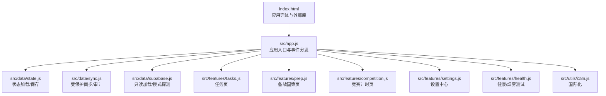
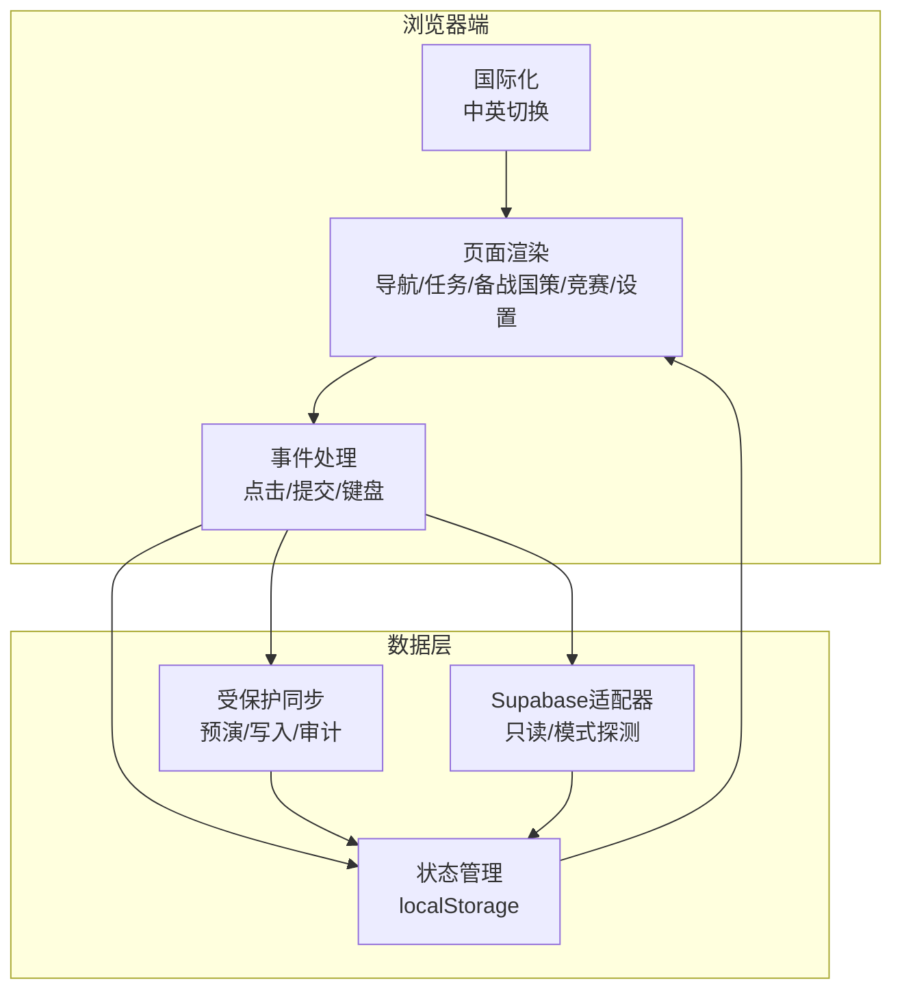
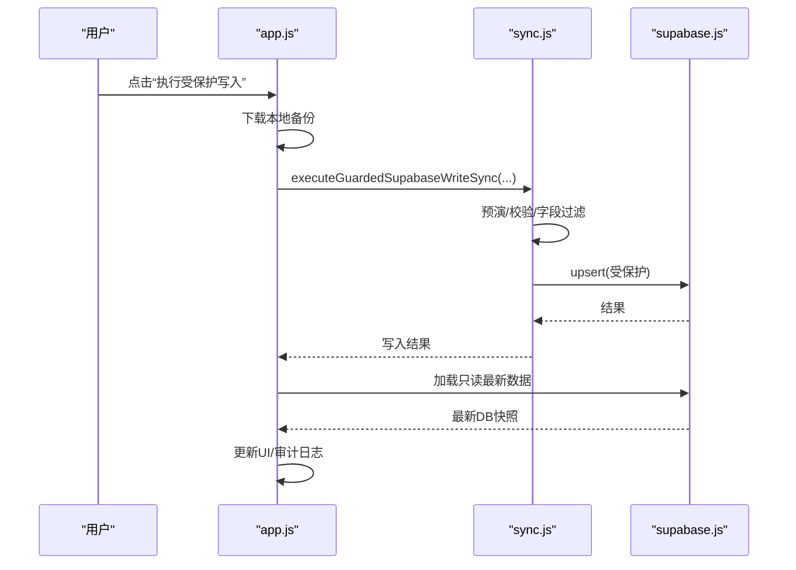
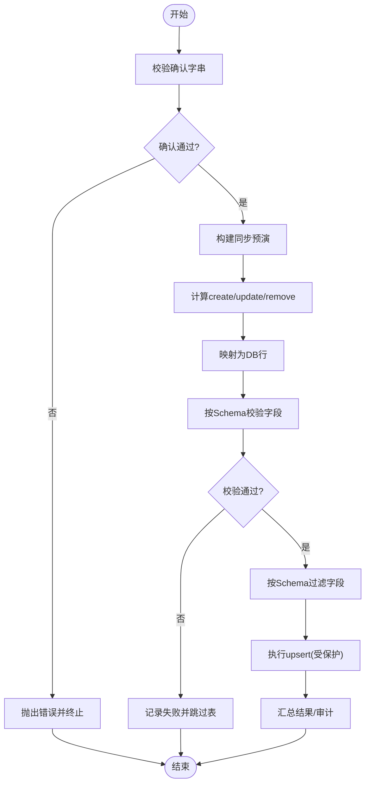
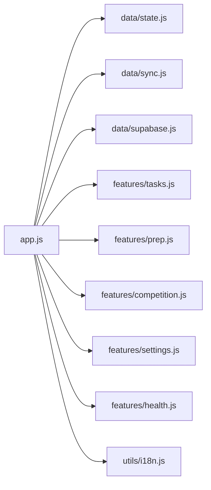

# 开发与测试

<cite>
**本文引用的文件**
- [README.md](file://v16/README.md)
- [index.html](file://v16/index.html)
- [smoke-server.mjs](file://v16/smoke-server.mjs)
- [smoke-v16.mjs](file://v16/smoke-v16.mjs)
- [app.js](file://v16/src/app.js)
- [state.js](file://v16/src/data/state.js)
- [sync.js](file://v16/src/data/sync.js)
- [defaults.js](file://v16/src/data/defaults.js)
- [health.js](file://v16/src/features/health.js)
- [i18n.js](file://v16/src/utils/i18n.js)
- [tasks.js](file://v16/src/features/tasks.js)
- [prep.js](file://v16/src/features/prep.js)
- [competition.js](file://v16/src/features/competition.js)
- [settings.js](file://v16/src/features/settings.js)
- [MIGRATION_MANIFEST.md](file://v16/MIGRATION_MANIFEST.md)
</cite>

## 目录
1. [简介](#简介)
2. [项目结构](#项目结构)
3. [核心组件](#核心组件)
4. [架构总览](#架构总览)
5. [详细组件分析](#详细组件分析)
6. [依赖关系分析](#依赖关系分析)
7. [性能考虑](#性能考虑)
8. [故障排除指南](#故障排除指南)
9. [结论](#结论)
10. [附录](#附录)

## 简介
本指南面向ROV任务管理v16项目的开发者与测试人员，覆盖开发环境配置、本地服务器搭建与调试、烟雾测试框架使用、测试用例编写与自动化流程、开发工具与代码质量、性能优化、故障排除、版本控制与发布流程等。v16采用本地优先（local-first）架构，以localStorage持久化为核心，同时支持Supabase只读加载与受保护的写入同步预演，具备完善的回滚与审计能力。

## 项目结构
v16目录组织遵循“页面/功能模块 + 数据层 + 工具库”的分层设计：
- 入口与样式：index.html加载全局CSS与模块入口；styles/app.css拆分全局样式。
- 数据层：defaults.js默认数据、state.js状态持久化、supabase.js读取与模式探测、sync.js受保护同步与审计。
- 功能模块：navigation.js导航分发、tasks.js任务管理、prep.js备战国策、competition.js竞赛计时与记录、settings.js设置中心、health.js健康与烟雾测试。
- 工具库：i18n.js国际化、date.js日期与计时辅助、dom.js与index.js通用工具。
- 测试与迁移：smoke-v16.mjs与smoke-server.mjs用于零依赖烟雾测试；MIGRATION_MANIFEST.md记录迁移清单与安全门。

图表来源
- [index.html:1-15](file://v16/index.html#L1-L15)
- [app.js:1-402](file://v16/src/app.js#L1-L402)

章节来源
- [README.md:10-26](file://v16/README.md#L10-L26)
- [index.html:1-15](file://v16/index.html#L1-L15)

## 核心组件
- 应用壳体与路由：index.html引入Supabase CDN与模块入口；app.js负责渲染导航与当前页面，并在settings页挂载设置中心与烟雾测试面板。
- 状态管理：state.js提供初始状态、从localStorage恢复、保存到localStorage的能力，确保本地优先。
- 同步与审计：sync.js定义写入白名单、冲突键、字段过滤、预演构建、受保护写入、结果汇总与审计日志。
- 功能模块：tasks.js提供任务增删改查与统计；prep.js提供checklist切换与统计；competition.js提供计时器与运行记录；settings.js提供主数据编辑、设置包导入导出、滚动定位；health.js提供烟雾测试执行与历史记录。
- 国际化：i18n.js提供中英双语字符串与语言切换，配合UI文本渲染。

章节来源
- [app.js:104-131](file://v16/src/app.js#L104-L131)
- [state.js:16-44](file://v16/src/data/state.js#L16-L44)
- [sync.js:9-341](file://v16/src/data/sync.js#L9-L341)
- [tasks.js:19-112](file://v16/src/features/tasks.js#L19-L112)
- [prep.js:5-58](file://v16/src/features/prep.js#L5-L58)
- [competition.js:6-68](file://v16/src/features/competition.js#L6-L68)
- [settings.js:121-200](file://v16/src/features/settings.js#L121-L200)
- [health.js:14-127](file://v16/src/features/health.js#L14-L127)
- [i18n.js:202-217](file://v16/src/utils/i18n.js#L202-L217)

## 架构总览
v16采用“模块化单页应用 + 本地优先 + 受保护同步”的架构。浏览器端通过模块脚本加载，事件驱动渲染；数据通过localStorage持久化；Supabase仅用于只读加载与模式探测，写入通过受保护流程进行预演与审计。

图表来源
- [app.js:189-393](file://v16/src/app.js#L189-L393)
- [state.js:16-44](file://v16/src/data/state.js#L16-L44)
- [sync.js:221-284](file://v16/src/data/sync.js#L221-L284)

## 详细组件分析

### 应用入口与事件分发（app.js）
- 职责：加载初始状态与主数据、渲染导航与当前页面、响应用户交互（导航、动作、表单、键盘）、触发Supabase只读加载、模式探测、同步预演与受保护写入。
- 关键流程：页面切换、任务增删改、备战国策checklist切换、计时器启停重置、保存运行记录、设置中心操作（导出/导入设置包、选择备份、滚动定位）。
- 安全与可观测性：在写入前下载本地备份，写后加载最新DB快照进行对比；写入结果与被丢弃字段记录到审计日志。

图表来源
- [app.js:262-299](file://v16/src/app.js#L262-L299)
- [sync.js:221-284](file://v16/src/data/sync.js#L221-L284)

章节来源
- [app.js:133-187](file://v16/src/app.js#L133-L187)
- [app.js:189-393](file://v16/src/app.js#L189-L393)

### 状态管理（state.js）
- 职责：提供初始状态、从localStorage恢复、合并默认值与已保存数据、保存到localStorage并清空脏标记。
- 复杂度：O(n)合并，默认数据与已保存数据逐字段覆盖，主数据单独深合并。

章节来源
- [state.js:6-44](file://v16/src/data/state.js#L6-L44)

### 同步与审计（sync.js）
- 职责：构建本地与远程差异预演、映射为数据库行、按表/字段白名单过滤、执行upsert、汇总结果、生成审计条目、维护最近20条审计日志。
- 关键常量：写入确认字串、表白名单、字段白名单、审计日志键。
- 安全策略：禁用删除、基于冲突键upsert、Schema探测结果动态裁剪字段。

图表来源
- [sync.js:221-284](file://v16/src/data/sync.js#L221-L284)

章节来源
- [sync.js:9-341](file://v16/src/data/sync.js#L9-L341)

### 健康与烟雾测试（health.js）
- 职责：定义默认烟雾检查项、执行DOM检查、记录历史、渲染烟雾测试面板、提供数据健康检查。
- 输出：每次运行生成带时间戳的结果，最多保留最近10次历史。

章节来源
- [health.js:3-54](file://v16/src/features/health.js#L3-L54)
- [health.js:96-127](file://v16/src/features/health.js#L96-L127)

### 功能模块

#### 任务管理（tasks.js）
- 职责：从表单创建任务、添加到状态、更新状态、删除任务、统计开/关/完成/逾期/阻塞数量、渲染表格与页面。
- 性能：按需渲染，状态变更后统一保存与重绘。

章节来源
- [tasks.js:5-112](file://v16/src/features/tasks.js#L5-L112)

#### 备战国策（prep.js）
- 职责：切换checklist/prediveChecklist项、统计完成数、渲染页面卡片与列表。

章节来源
- [prep.js:5-58](file://v16/src/features/prep.js#L5-L58)

#### 竞赛计时（competition.js）
- 职责：计时器启停重置、保存运行记录（分数/备注/耗时）、渲染运行历史。

章节来源
- [competition.js:6-68](file://v16/src/features/competition.js#L6-L68)

#### 设置中心（settings.js）
- 职责：主数据（角色/组/任务类型/装备分类）编辑、去重排序、按赛季存储、设置包导出/导入、滚动定位、统计卡片渲染。

章节来源
- [settings.js:121-200](file://v16/src/features/settings.js#L121-L200)

### 国际化（i18n.js）
- 职责：提供中英双语字符串、语言切换、本地存储键、翻译函数。
- 使用：各模块通过t(key)获取对应语言文案，保证UI一致性。

章节来源
- [i18n.js:202-217](file://v16/src/utils/i18n.js#L202-L217)

## 依赖关系分析
- 模块依赖：app.js集中导入数据与功能模块，形成清晰的上层调度层；各功能模块仅依赖共享工具与数据层。
- 外部依赖：index.html仅引入Supabase CDN与模块入口，无打包器依赖，便于零依赖运行。
- 运行时依赖：浏览器原生API（fetch、localStorage、FileReader、Blob、URL.createObjectURL等）。

图表来源
- [app.js:1-36](file://v16/src/app.js#L1-L36)

章节来源
- [app.js:1-36](file://v16/src/app.js#L1-L36)
- [index.html:11-12](file://v16/index.html#L11-L12)

## 性能考虑
- 渲染粒度：页面级重渲染，事件驱动局部更新，避免全量重绘。
- 存储策略：localStorage批量保存，脏标记减少不必要持久化。
- 计算复杂度：预演与差异计算按表线性处理，字段比较按对象键排序后序列化，整体O(n*m)（n为行数，m为字段数）。
- I/O优化：写入前先下载本地备份，避免重复网络请求；审计日志限制最近20条，控制存储占用。
- 建议：对大型列表采用虚拟滚动或分页；对频繁字段比较可缓存比较键；对多表写入可考虑批处理（当前实现逐表执行）。

## 故障排除指南
- 烟雾测试失败
  - 现象：烟雾测试面板显示部分检查未通过。
  - 排查：查看面板详情与历史记录；确认页面元素ID/选择器是否存在；检查模块导入是否正确。
  - 参考：烟雾测试定义与历史记录逻辑。
  
  章节来源
  - [health.js:14-54](file://v16/src/features/health.js#L14-L54)
  - [smoke-v16.mjs:88-111](file://v16/smoke-v16.mjs#L88-L111)

- 本地服务器烟雾检查失败
  - 现象：命令行输出失败检查与HTTP状态码。
  - 排查：确认服务监听地址与端口；检查静态资源路径；验证模块图解析与导入链。
  
  章节来源
  - [smoke-server.mjs:58-72](file://v16/smoke-server.mjs#L58-L72)

- 受保护写入失败
  - 现象：弹窗提示错误；审计日志记录失败。
  - 排查：确认输入确认字串；检查表白名单与字段白名单；核对Schema探测结果；查看被丢弃字段；必要时回滚备份。
  
  章节来源
  - [sync.js:228-233](file://v16/src/data/sync.js#L228-L233)
  - [sync.js:300-317](file://v16/src/data/sync.js#L300-L317)

- 回滚无效
  - 现象：选择备份后未生效。
  - 排查：确认备份JSON格式为v16本地备份；检查restore逻辑与季节字段；清理预演与写后预演状态。
  
  章节来源
  - [sync.js:190-205](file://v16/src/data/sync.js#L190-L205)

- 国际化显示异常
  - 现象：界面出现占位key而非文案。
  - 排查：确认当前语言键存在；检查i18n字符串键是否拼写正确；刷新后重试。
  
  章节来源
  - [i18n.js:214-217](file://v16/src/utils/i18n.js#L214-L217)

## 结论
v16以模块化与本地优先为核心，结合受保护的Supabase同步与完善的审计机制，提供了高安全性与可维护性的任务管理平台。通过烟雾测试与迁移清单，确保每次抽取与集成的安全门。建议在开发过程中持续运行烟雾测试，严格遵守安全门要求，并在生产前进行Schema探测与写入预演。

## 附录

### 开发环境配置与本地服务器
- 环境要求：现代浏览器与Node.js（用于烟雾脚本）。
- 启动方式：直接用浏览器打开index.html即可运行；如需服务器烟雾检查，启动本地HTTP服务后运行服务器烟雾脚本。
- 端口与基址：可通过环境变量设置服务器基址；默认本地回环地址与端口。

章节来源
- [README.md:55-67](file://v16/README.md#L55-L67)
- [smoke-server.mjs:1](file://v16/smoke-server.mjs#L1)

### 烟雾测试框架使用
- 零依赖脚本：检查HTML结构、模块导入、关键动作按钮、i18n键、同步安全守则等。
- 服务器烟雾脚本：抓取首页与模块，解析import声明，验证模块图大小与关键模块是否全部拉取。

章节来源
- [smoke-v16.mjs:1-111](file://v16/smoke-v16.mjs#L1-L111)
- [smoke-server.mjs:1-72](file://v16/smoke-server.mjs#L1-L72)

### 测试用例编写与自动化流程
- 单元测试建议：围绕diffRows、diffFields、toDbRows、validateRowsForSchema、filterRowForSchema等纯函数编写断言。
- 集成测试建议：模拟用户操作（导航、表单提交、开关checklist、计时器、写入同步），断言状态变化与持久化。
- 自动化流程：在CI中顺序执行零依赖烟雾测试与服务器烟雾检查；对关键分支增加Schema探测与写入预演步骤。

章节来源
- [health.js:14-54](file://v16/src/features/health.js#L14-L54)
- [sync.js:43-88](file://v16/src/data/sync.js#L43-L88)

### 开发工具与代码质量
- 语法检查：利用Node.js内置检查与ES模块导入规范，确保模块图正确。
- 格式与风格：保持一致的缩进与命名；对公共API添加注释说明。
- 依赖最小化：尽量使用浏览器原生API，避免打包器与第三方库。

章节来源
- [README.md:50-53](file://v16/README.md#L50-L53)

### 版本控制、代码审查与发布
- 版本控制：遵循迁移清单与安全门，每次抽取后更新清单与烟雾检查。
- 代码审查：重点检查模块边界、DOM/状态所有权、事件处理与持久化时机。
- 发布流程：在本地运行烟雾测试与服务器烟雾检查；确认Supabase只读加载与Schema探测正常；在受控环境下执行一次写入预演与回滚验证。

章节来源
- [MIGRATION_MANIFEST.md:58-76](file://v16/MIGRATION_MANIFEST.md#L58-L76)
- [README.md:46-54](file://v16/README.md#L46-L54)