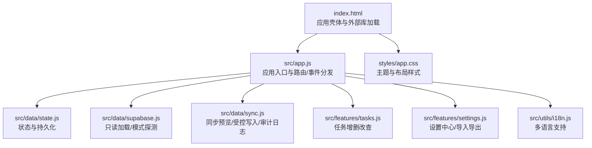
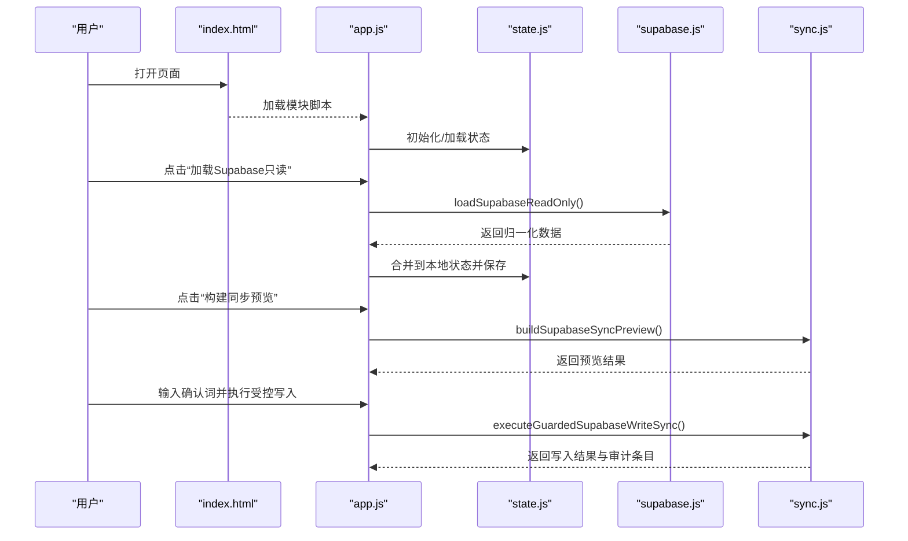
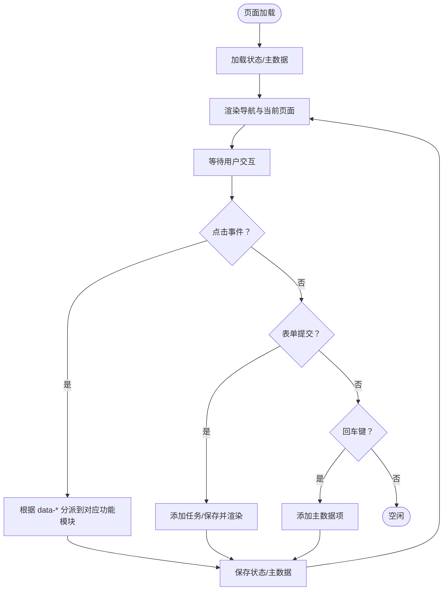
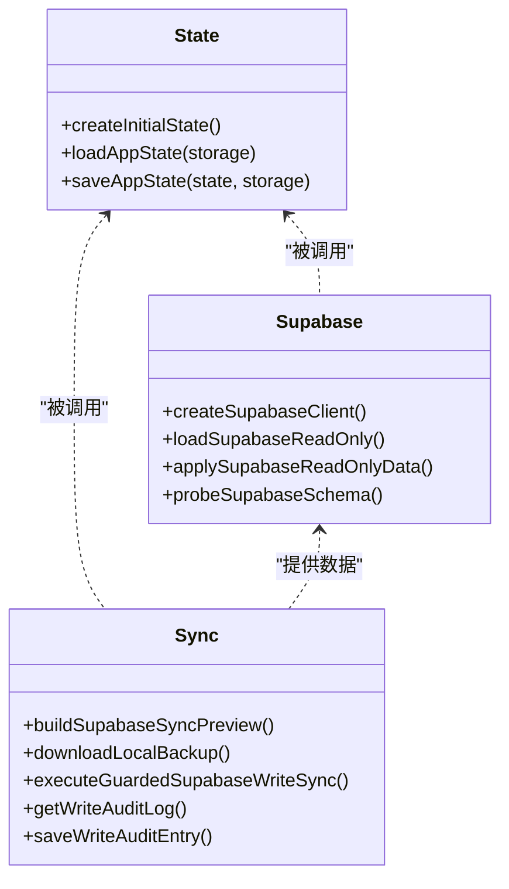
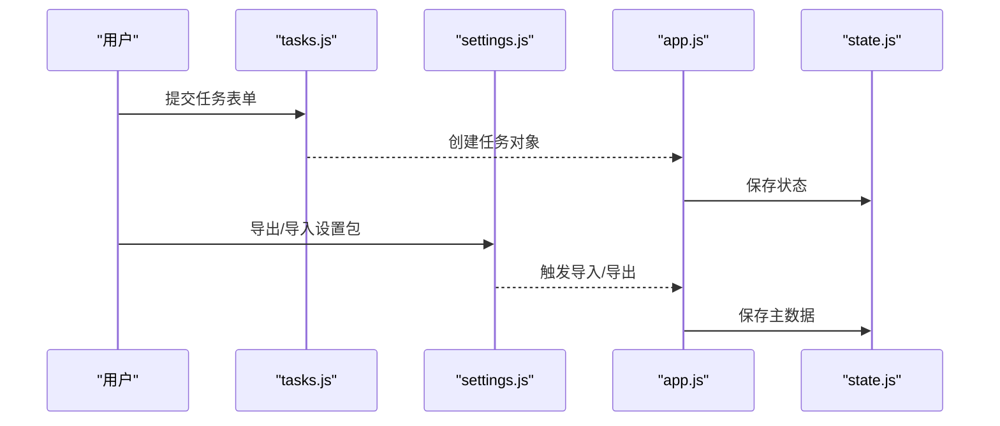
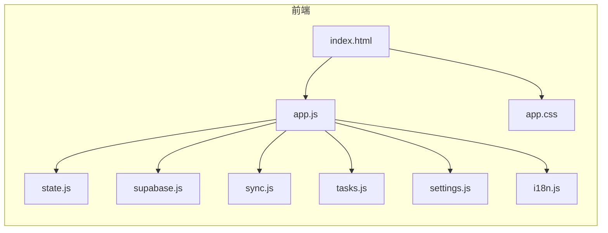

# 快速开始

<cite>
**本文引用的文件**
- [README.md](file://v16/README.md)
- [index.html](file://v16/index.html)
- [smoke-v16.mjs](file://v16/smoke-v16.mjs)
- [smoke-server.mjs](file://v16/smoke-server.mjs)
- [app.js](file://v16/src/app.js)
- [state.js](file://v16/src/data/state.js)
- [supabase.js](file://v16/src/data/supabase.js)
- [sync.js](file://v16/src/data/sync.js)
- [tasks.js](file://v16/src/features/tasks.js)
- [settings.js](file://v16/src/features/settings.js)
- [i18n.js](file://v16/src/utils/i18n.js)
- [app.css](file://v16/styles/app.css)
- [MIGRATION_MANIFEST.md](file://v16/MIGRATION_MANIFEST.md)
</cite>

## 目录
1. [简介](#简介)
2. [项目结构](#项目结构)
3. [核心组件](#核心组件)
4. [架构总览](#架构总览)
5. [详细组件分析](#详细组件分析)
6. [依赖关系分析](#依赖关系分析)
7. [性能与可用性建议](#性能与可用性建议)
8. [常见问题排查](#常见问题排查)
9. [结论](#结论)
10. [附录：命令与预期结果](#附录命令与预期结果)

## 简介
本指南面向首次接触 ROV 任务管理 v16 的用户，帮助你在最短时间内完成本地开发环境搭建、启动本地服务器、运行烟雾测试，并理解项目的零依赖特性与部署方式。v16 是一个“本地优先”的单页应用（SPA），以 localStorage 作为持久化存储，同时保留对 Supabase 的只读加载与受控写入能力，确保生产安全与迁移兼容。

## 项目结构
v16 将 v15 的庞大单文件拆分为模块化的目录结构：
- 根页面与样式：index.html、styles/app.css
- 数据层：src/data/state.js、src/data/supabase.js、src/data/sync.js、src/data/defaults.js、src/data/migration.js、src/data/sync.js
- 功能模块：src/features/tasks.js、src/features/prep.js、src/features/competition.js、src/features/settings.js、src/features/health.js、src/features/navigation.js
- 工具与国际化：src/utils/index.js、src/utils/dom.js、src/utils/date.js、src/utils/i18n.js
- 测试与验证：smoke-v16.mjs、smoke-server.mjs
- 迁移清单：MIGRATION_MANIFEST.md

图表来源
- [index.html:1-15](file://v16/index.html#L1-L15)
- [app.js:1-402](file://v16/src/app.js#L1-L402)
- [state.js:1-45](file://v16/src/data/state.js#L1-L45)
- [supabase.js:1-157](file://v16/src/data/supabase.js#L1-L157)
- [sync.js:1-341](file://v16/src/data/sync.js#L1-L341)
- [tasks.js:1-112](file://v16/src/features/tasks.js#L1-L112)
- [settings.js:1-592](file://v16/src/features/settings.js#L1-L592)
- [i18n.js:1-217](file://v16/src/utils/i18n.js#L1-L217)
- [app.css:1-200](file://v16/styles/app.css#L1-L200)

章节来源
- [README.md:1-68](file://v16/README.md#L1-L68)
- [MIGRATION_MANIFEST.md:1-76](file://v16/MIGRATION_MANIFEST.md#L1-L76)

## 核心组件
- 应用壳体与入口
  - index.html 负责加载 Supabase 客户端 CDN 与模块脚本 src/app.js。
  - app.js 初始化状态、渲染导航与页面、处理用户交互与数据持久化。
- 数据层
  - state.js 提供默认状态、从 localStorage 加载与保存。
  - supabase.js 提供只读加载、模式探测、数据归一化。
  - sync.js 提供同步预览、受控写入、备份下载、审计日志。
- 功能模块
  - tasks.js 提供任务表单、列表、状态更新、删除与统计。
  - settings.js 提供设置中心、主数据管理、设置包导入导出、回滚与迁移。
- 国际化与样式
  - i18n.js 支持中英双语切换；app.css 提供主题变量与响应式布局。

章节来源
- [index.html:1-15](file://v16/index.html#L1-L15)
- [app.js:1-402](file://v16/src/app.js#L1-L402)
- [state.js:1-45](file://v16/src/data/state.js#L1-L45)
- [supabase.js:1-157](file://v16/src/data/supabase.js#L1-L157)
- [sync.js:1-341](file://v16/src/data/sync.js#L1-L341)
- [tasks.js:1-112](file://v16/src/features/tasks.js#L1-L112)
- [settings.js:1-592](file://v16/src/features/settings.js#L1-L592)
- [i18n.js:1-217](file://v16/src/utils/i18n.js#L1-L217)
- [app.css:1-200](file://v16/styles/app.css#L1-L200)

## 架构总览
v16 采用“本地优先 + 受控同步”的架构：
- 前端为纯浏览器模块（ESM）与本地存储，无需后端依赖。
- Supabase 仅用于只读加载与模式探测，写入通过受控流程执行，且有备份与审计。
- 设置中心提供系统健康检查、同步预览、受控写入与回滚能力。

图表来源
- [index.html:1-15](file://v16/index.html#L1-L15)
- [app.js:200-299](file://v16/src/app.js#L200-L299)
- [supabase.js:79-121](file://v16/src/data/supabase.js#L79-L121)
- [sync.js:150-284](file://v16/src/data/sync.js#L150-L284)

## 详细组件分析

### 组件A：应用入口与事件分发（app.js）
- 负责初始化状态、渲染导航与当前页面、处理点击/提交/按键事件。
- 与数据层、功能模块、国际化协作，实现任务、准备、竞赛、设置等页面的统一调度。
- 提供烟雾测试触发与面板渲染。

图表来源
- [app.js:104-187](file://v16/src/app.js#L104-L187)
- [app.js:189-393](file://v16/src/app.js#L189-L393)

章节来源
- [app.js:1-402](file://v16/src/app.js#L1-L402)

### 组件B：数据层（state.js、supabase.js、sync.js）
- state.js：提供默认状态、从 localStorage 恢复、保存到 localStorage。
- supabase.js：创建客户端、批量只读查询、数据归一化、模式探测。
- sync.js：计算本地与远程差异、生成预览、受控写入（白名单/冲突处理）、备份下载、审计日志。

图表来源
- [state.js:1-45](file://v16/src/data/state.js#L1-L45)
- [supabase.js:1-157](file://v16/src/data/supabase.js#L1-L157)
- [sync.js:1-341](file://v16/src/data/sync.js#L1-L341)

章节来源
- [state.js:1-45](file://v16/src/data/state.js#L1-L45)
- [supabase.js:1-157](file://v16/src/data/supabase.js#L1-L157)
- [sync.js:1-341](file://v16/src/data/sync.js#L1-L341)

### 组件C：功能模块（tasks.js、settings.js）
- tasks.js：任务表单、表格、状态选择、删除、统计与逾期判断。
- settings.js：设置中心卡片、主数据编辑、设置包导入导出、v15 备份导入、回滚、烟雾测试面板。

图表来源
- [tasks.js:5-17](file://v16/src/features/tasks.js#L5-L17)
- [tasks.js:84-112](file://v16/src/features/tasks.js#L84-L112)
- [settings.js:79-119](file://v16/src/features/settings.js#L79-L119)
- [app.js:346-393](file://v16/src/app.js#L346-L393)

章节来源
- [tasks.js:1-112](file://v16/src/features/tasks.js#L1-L112)
- [settings.js:1-592](file://v16/src/features/settings.js#L1-L592)

### 组件D：国际化与样式（i18n.js、app.css）
- i18n.js：提供中英双语字符串与本地存储的语言偏好。
- app.css：定义主题变量、导航、卡片、表格、竞赛界面等样式，并支持明暗主题与打印模式。

章节来源
- [i18n.js:1-217](file://v16/src/utils/i18n.js#L1-L217)
- [app.css:1-200](file://v16/styles/app.css#L1-L200)

## 依赖关系分析
- 零依赖特性
  - 前端完全基于浏览器原生模块与 localStorage，不依赖任何打包器或后端服务。
  - Supabase 仅通过 CDN 引入，且只在需要时调用其只读接口。
- 关键外部资源
  - Supabase 客户端 CDN：用于只读加载与模式探测。
  - 本地模块图：由 app.js 作为入口，按需加载各功能模块。
- 内部耦合
  - app.js 作为中枢，协调 state、supabase、sync 与各功能模块。
  - settings.js 与 i18n.js 协作提供设置中心与多语言。

图表来源
- [index.html:1-15](file://v16/index.html#L1-L15)
- [app.js:1-36](file://v16/src/app.js#L1-L36)
- [state.js:1-14](file://v16/src/data/state.js#L1-L14)
- [supabase.js:1-29](file://v16/src/data/supabase.js#L1-L29)
- [sync.js:1-17](file://v16/src/data/sync.js#L1-L17)
- [tasks.js:1-3](file://v16/src/features/tasks.js#L1-L3)
- [settings.js:1-2](file://v16/src/features/settings.js#L1-L2)
- [i18n.js:1-1](file://v16/src/utils/i18n.js#L1-L1)
- [app.css:1-8](file://v16/styles/app.css#L1-L8)

章节来源
- [README.md:3-44](file://v16/README.md#L3-L44)

## 性能与可用性建议
- 本地存储与模块化加载
  - 使用 localStorage 减少网络请求，模块按需加载降低首屏负担。
- 只读加载与模式探测
  - 通过 Promise.allSettled 并行加载多个表，减少等待时间。
- 受控写入与审计
  - 写入前下载本地备份，写后进行预写对比，避免误操作影响。
- 主题与可访问性
  - 明暗主题自动适配，打印模式优化输出。

[本节为通用建议，不直接分析具体文件]

## 常见问题排查
- 无法加载 Supabase 只读数据
  - 检查 Supabase 客户端是否正确加载（CDN）。
  - 确认网络可达与凭据有效。
- 受控写入失败
  - 确认已输入正确的确认词。
  - 检查字段白名单与模式探测结果。
- 烟雾测试失败
  - 使用零依赖烟雾脚本检查模块导入与关键功能片段是否存在。
  - 使用服务器烟雾脚本检查本地 URL 与模块图是否可访问。

章节来源
- [app.js:226-241](file://v16/src/app.js#L226-L241)
- [app.js:262-299](file://v16/src/app.js#L262-L299)
- [smoke-v16.mjs:1-111](file://v16/smoke-v16.mjs#L1-L111)
- [smoke-server.mjs:1-72](file://v16/smoke-server.mjs#L1-L72)

## 结论
v16 通过模块化与“本地优先”设计，在不引入额外依赖的前提下提供了完整的任务管理、准备检查、竞赛计时与设置中心功能，并保留了对 Supabase 的只读与受控写入能力。借助烟雾测试与审计日志，你可以安全地在本地验证与部署该应用。

[本节为总结，不直接分析具体文件]

## 附录：命令与预期结果

### 环境要求
- Node.js：用于运行烟雾脚本与本地服务器（可选）。
- 浏览器：支持 ES 模块与 localStorage 的现代浏览器。
- Supabase：仅用于只读加载与模式探测（CDN 引入）。

章节来源
- [README.md:55-67](file://v16/README.md#L55-L67)

### 安装与启动步骤
- 在项目根目录执行零依赖烟雾测试，验证模块与关键功能存在性。
  - 命令：node smoke-v16.mjs
  - 预期：输出所有检查项与通过/失败统计，无失败项即通过。
- 启动本地服务器（可选），验证模块图与页面加载。
  - 命令：node smoke-server.mjs
  - 预期：输出模块图检查结果，至少包含 10 个模块，且 settings 与 sync、i18n 模块均被拉取。
- 在浏览器打开 index.html，验证页面渲染与导航。
  - 预期：页面显示导航、仪表盘、任务、准备、竞赛、设置等页面，支持中英切换。

章节来源
- [README.md:55-67](file://v16/README.md#L55-L67)
- [smoke-v16.mjs:1-111](file://v16/smoke-v16.mjs#L1-L111)
- [smoke-server.mjs:1-72](file://v16/smoke-server.mjs#L1-L72)
- [index.html:1-15](file://v16/index.html#L1-L15)

### 基本使用方法
- 任务管理
  - 在任务页面填写表单新增任务，选择状态、删除任务，查看统计与逾期信息。
- 准备中心
  - 使用每日检查与预潜水流程，支持本地持久化。
- 竞赛计时
  - 使用计时器记录任务耗时，保存运行记录。
- 设置中心
  - 导入/导出设置包，主数据编辑，加载 Supabase 只读数据，构建同步预览，执行受控写入，查看审计日志，从 v16 备份回滚。

章节来源
- [tasks.js:84-112](file://v16/src/features/tasks.js#L84-L112)
- [settings.js:156-592](file://v16/src/features/settings.js#L156-L592)
- [app.js:104-187](file://v16/src/app.js#L104-L187)

### 零依赖特性说明
- 前端模块与本地存储：无需后端服务，直接在浏览器运行。
- Supabase 仅用于只读加载与模式探测，写入通过受控流程执行。
- 烟雾测试脚本：无需外部工具，仅使用 Node.js 与内置模块。

章节来源
- [README.md:3-44](file://v16/README.md#L3-L44)
- [index.html:11-12](file://v16/index.html#L11-L12)
- [smoke-v16.mjs:1-111](file://v16/smoke-v16.mjs#L1-L111)

### 不同环境部署建议
- 本地开发：直接在浏览器打开 index.html，或使用任意静态服务器。
- 生产部署：将构建产物（HTML/CSS/JS）托管于静态站点服务（如 GitHub Pages、Vercel、Cloudflare Pages），Supabase 仍通过 CDN 引入。
- 安全策略：受控写入始终要求确认词、下载本地备份、白名单字段过滤、禁止删除、写后验证与审计日志。

章节来源
- [README.md:38-44](file://v16/README.md#L38-L44)
- [sync.js:221-284](file://v16/src/data/sync.js#L221-L284)