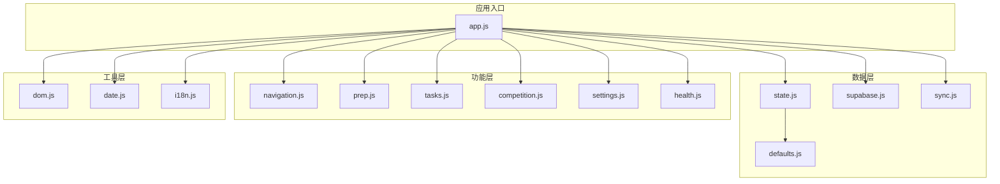
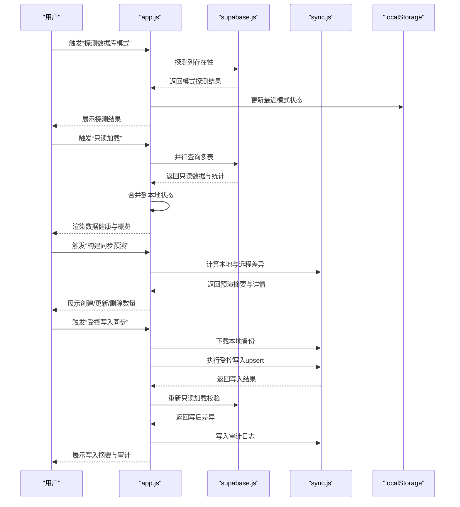
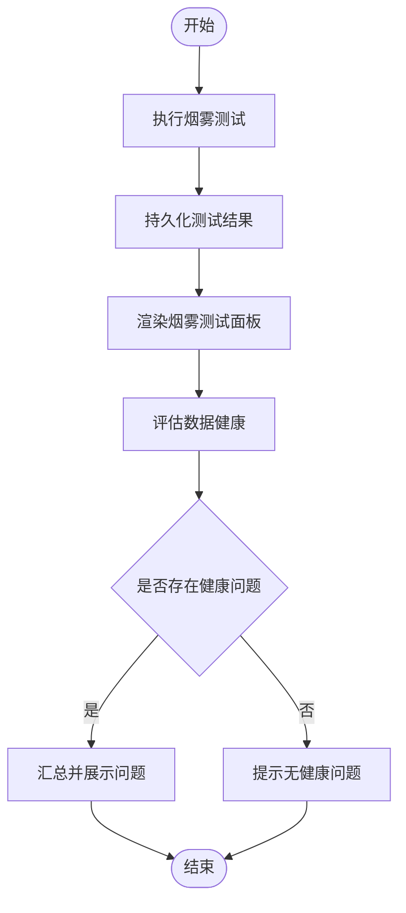
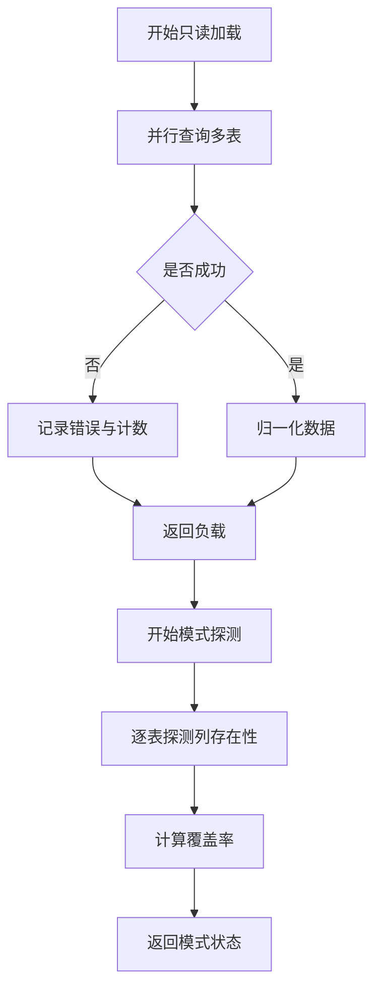
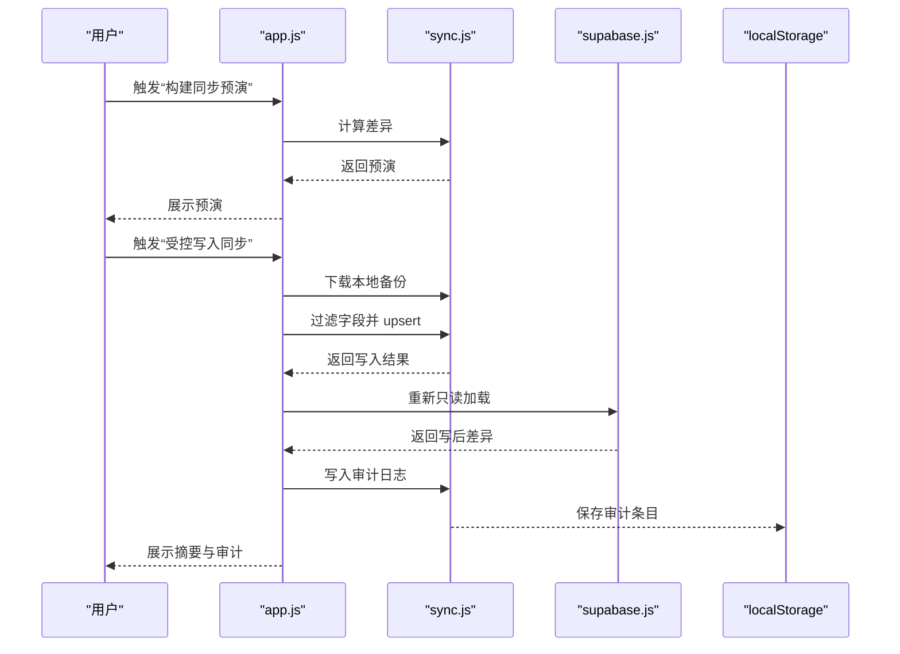
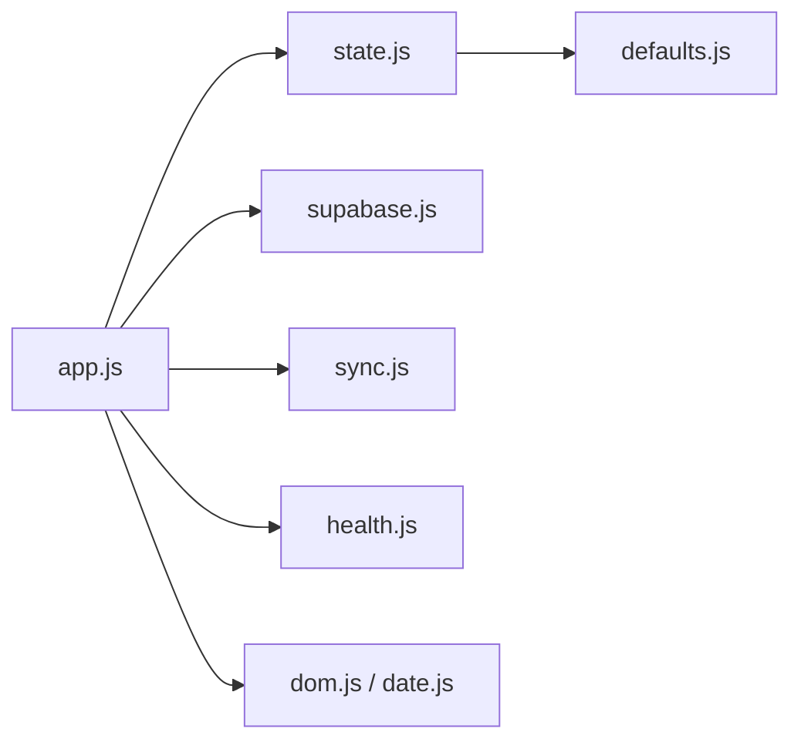

# 故障排除

<cite>
**本文引用的文件**
- [README.md](file://README.md)
- [MIGRATION_MANIFEST.md](file://MIGRATION_MANIFEST.md)
- [app.js](file://src/app.js)
- [state.js](file://src/data/state.js)
- [supabase.js](file://src/data/supabase.js)
- [sync.js](file://src/data/sync.js)
- [health.js](file://src/features/health.js)
- [dom.js](file://src/utils/dom.js)
- [date.js](file://src/utils/date.js)
- [smoke-v16.mjs](file://smoke-v16.mjs)
- [smoke-server.mjs](file://smoke-server.mjs)
</cite>

## 目录
1. [简介](#简介)
2. [项目结构](#项目结构)
3. [核心组件](#核心组件)
4. [架构总览](#架构总览)
5. [详细组件分析](#详细组件分析)
6. [依赖关系分析](#依赖关系分析)
7. [性能与资源问题诊断](#性能与资源问题诊断)
8. [Supabase 集成与数据同步故障排除](#supabase-集成与数据同步故障排除)
9. [本地存储与回滚故障排除](#本地存储与回滚故障排除)
10. [日志与调试技巧](#日志与调试技巧)
11. [常见问题与解决方案](#常见问题与解决方案)
12. [结论](#结论)

## 简介
本指南面向 ROV 任务管理 v16 的使用者与维护者，提供系统化的故障排除流程与实操建议。内容覆盖健康检查、数据异常检测、系统状态监控、性能与内存问题、网络连接问题、Supabase 集成与数据同步错误、以及本地存储与回滚等场景。通过结合应用源码中的模块职责与行为，帮助用户自助定位并解决问题。

## 项目结构
v16 采用“本地优先”的单页应用架构，按功能拆分为 data（数据）、features（页面与工作流）、utils（通用工具）三层，并通过入口脚本统一渲染与事件分发。Supabase 仅用于只读加载与受控写入预演，所有写操作均在本地完成并可回滚。

图表来源
- [app.js:1-402](file://src/app.js#L1-L402)
- [state.js:1-45](file://src/data/state.js#L1-L45)
- [supabase.js:1-157](file://src/data/supabase.js#L1-L157)
- [sync.js:1-341](file://src/data/sync.js#L1-L341)
- [health.js:1-127](file://src/features/health.js#L1-L127)

章节来源
- [README.md:1-68](file://README.md#L1-L68)
- [MIGRATION_MANIFEST.md:1-76](file://MIGRATION_MANIFEST.md#L1-L76)

## 核心组件
- 应用入口与渲染调度：负责页面切换、事件绑定、状态持久化、以及调用各功能模块渲染与交互。
- 数据层：提供默认数据、应用状态持久化、Supabase 只读加载与模式探测、受控写入预演与审计日志。
- 功能模块：任务、准备清单、竞赛计时器、设置中心、导航与健康检查面板。
- 工具库：DOM 安全转义、安全 JSON 解析、日期与计时格式化等。

章节来源
- [app.js:1-402](file://src/app.js#L1-L402)
- [state.js:1-45](file://src/data/state.js#L1-L45)
- [supabase.js:1-157](file://src/data/supabase.js#L1-L157)
- [sync.js:1-341](file://src/data/sync.js#L1-L341)
- [health.js:1-127](file://src/features/health.js#L1-L127)
- [dom.js:1-21](file://src/utils/dom.js#L1-L21)
- [date.js:1-55](file://src/utils/date.js#L1-L55)

## 架构总览
下图展示 v16 的关键交互路径：用户在设置页触发 Supabase 模式探测、只读加载、同步预演与受控写入；写入前自动下载本地备份，写后进行数据库差异验证，并记录审计日志；同时健康检查与烟雾测试持续监控界面元素与运行状态。

图表来源
- [app.js:201-299](file://src/app.js#L201-L299)
- [supabase.js:79-121](file://src/data/supabase.js#L79-L121)
- [supabase.js:131-156](file://src/data/supabase.js#L131-L156)
- [sync.js:150-178](file://src/data/sync.js#L150-L178)
- [sync.js:221-284](file://src/data/sync.js#L221-L284)
- [sync.js:300-340](file://src/data/sync.js#L300-L340)

## 详细组件分析

### 健康检查与烟雾测试
- 烟雾测试：对关键页面容器、动作按钮、模块导入等进行自动化检查，支持历史记录与重跑。
- 数据健康：基于主数据与实体一致性生成“紧急/警告”级问题列表，辅助快速定位配置缺失或不一致。

图表来源
- [health.js:37-54](file://src/features/health.js#L37-L54)
- [health.js:56-84](file://src/features/health.js#L56-L84)
- [health.js:96-122](file://src/features/health.js#L96-L122)

章节来源
- [health.js:1-127](file://src/features/health.js#L1-L127)
- [app.js:66-102](file://src/app.js#L66-L102)

### Supabase 只读加载与模式探测
- 只读加载：并行查询多个表，返回每表计数与错误信息，用于评估数据库可用性与数据规模。
- 模式探测：逐列探测现有字段，计算覆盖率，为受控写入提供白名单依据。

图表来源
- [supabase.js:79-121](file://src/data/supabase.js#L79-L121)
- [supabase.js:131-156](file://src/data/supabase.js#L131-L156)

章节来源
- [supabase.js:1-157](file://src/data/supabase.js#L1-157)

### 受控写入同步与审计日志
- 预演：比较本地与远程数据，输出创建/更新/删除数量与详情。
- 写入：要求确认文本，仅允许 upsert 创建/更新，禁用删除；按表/字段白名单过滤；失败时记录审计日志。
- 校验：写后重新只读加载并再次预演，对比前后差异，确保一致性。

图表来源
- [app.js:243-299](file://src/app.js#L243-L299)
- [sync.js:150-178](file://src/data/sync.js#L150-L178)
- [sync.js:221-284](file://src/data/sync.js#L221-L284)
- [sync.js:300-340](file://src/data/sync.js#L300-L340)

章节来源
- [sync.js:1-341](file://src/data/sync.js#L1-L341)
- [app.js:201-299](file://src/app.js#L201-L299)

## 依赖关系分析
- 入口脚本集中管理事件与状态持久化，耦合度低，便于扩展与替换。
- 数据层与功能层通过清晰的接口交互：数据层提供只读/写入能力与审计；功能层专注 UI 与业务逻辑。
- 工具层提供安全与格式化能力，避免重复实现。

图表来源
- [app.js:1-37](file://src/app.js#L1-L37)
- [state.js:1-45](file://src/data/state.js#L1-L45)
- [supabase.js:1-29](file://src/data/supabase.js#L1-L29)
- [sync.js:1-17](file://src/data/sync.js#L1-L17)
- [health.js:1-2](file://src/features/health.js#L1-L2)
- [dom.js:1-21](file://src/utils/dom.js#L1-L21)
- [date.js:1-55](file://src/utils/date.js#L1-L55)

章节来源
- [app.js:1-402](file://src/app.js#L1-L402)
- [state.js:1-45](file://src/data/state.js#L1-L45)
- [supabase.js:1-157](file://src/data/supabase.js#L1-L157)
- [sync.js:1-341](file://src/data/sync.js#L1-L341)
- [health.js:1-127](file://src/features/health.js#L1-L127)
- [dom.js:1-21](file://src/utils/dom.js#L1-L21)
- [date.js:1-55](file://src/utils/date.js#L1-L55)

## 性能与资源问题诊断
- 页面渲染卡顿
  - 现象：点击导航或切换页面响应慢。
  - 排查：检查定时器是否频繁触发渲染；确认渲染函数未在每次变更中做昂贵计算。
  - 建议：减少不必要的渲染调用，合并状态更新，避免在渲染路径中进行 IO。
- 内存占用上升
  - 现象：长时间使用后内存增长。
  - 排查：确认对象引用是否被正确释放；避免在全局持有大型数组或对象。
  - 建议：定期清理临时对象，使用弱引用或延迟加载策略。
- 网络请求阻塞
  - 现象：只读加载或模式探测耗时长。
  - 排查：检查并发查询数量与超时；确认浏览器网络状况与 CDN 可达性。
  - 建议：优化查询条件与索引，必要时分批加载或缓存结果。

## Supabase 集成与数据同步故障排除

### 常见问题与步骤
- 只读加载失败
  - 现象：加载面板显示错误或部分表为空。
  - 步骤：确认 Supabase 凭据与网络连通；查看返回的错误信息；检查目标表是否存在。
  - 处理：修正凭据或网络配置；等待数据库恢复后重试。
- 模式探测覆盖率低
  - 现象：某些字段缺失导致写入被拒绝。
  - 步骤：运行模式探测；核对返回的缺失字段；根据实际数据库结构调整白名单。
  - 处理：在写入前先执行模式探测；使用探测结果过滤字段。
- 同步预演与实际写入不一致
  - 现象：预演显示可写，但写入报错。
  - 步骤：确认预演时点的只读数据；检查写入前后的差异；查看审计日志。
  - 处理：在写入前再次构建预演；确保白名单与探测结果一致。
- 写入被拒绝
  - 现象：提示需要确认文本或删除被禁用。
  - 步骤：确认输入的确认文本；检查是否选择了允许的表；确认未尝试删除。
  - 处理：按提示输入确认文本；仅选择白名单内的表；避免删除操作。

章节来源
- [app.js:226-241](file://src/app.js#L226-L241)
- [app.js:201-212](file://src/app.js#L201-L212)
- [app.js:243-261](file://src/app.js#L243-L261)
- [app.js:262-299](file://src/app.js#L262-L299)
- [supabase.js:79-121](file://src/data/supabase.js#L79-L121)
- [supabase.js:131-156](file://src/data/supabase.js#L131-L156)
- [sync.js:221-284](file://src/data/sync.js#L221-L284)

## 本地存储与回滚故障排除
- 无法读取或保存状态
  - 现象：刷新后状态丢失或页面空白。
  - 步骤：检查浏览器本地存储权限；查看存储键值是否存在；尝试清除旧数据后重试。
  - 处理：在隐私模式或无痕模式下验证；清理过期或损坏的键值。
- 回滚失败
  - 现象：导入 v16 本地备份后数据未恢复。
  - 步骤：确认备份文件类型与数据结构；检查导入流程是否抛出异常。
  - 处理：使用正确的备份文件；确保导入后触发持久化与渲染。
- 审计日志异常
  - 现象：写入审计日志为空或解析失败。
  - 步骤：检查存储键；确认写入审计条目是否成功保存；查看最近条目。
  - 处理：清理损坏的日志；重新执行一次受控写入以生成新条目。

章节来源
- [state.js:16-44](file://src/data/state.js#L16-L44)
- [sync.js:190-205](file://src/data/sync.js#L190-L205)
- [sync.js:300-317](file://src/data/sync.js#L300-L317)
- [dom.js:14-20](file://src/utils/dom.js#L14-L20)

## 日志与调试技巧
- 浏览器控制台
  - 使用烟雾测试函数记录结果；在写入前后打印关键状态；利用断点观察事件流。
- 本地存储检查
  - 查看烟雾测试日志键与写入审计日志键；核对最近条目的时间戳与摘要。
- 脚本辅助
  - 使用零依赖烟雾脚本检查模块导入与关键片段；使用服务器烟雾脚本验证模块图与可访问性。
- 安全解析
  - 使用安全 JSON 解析工具避免解析错误导致的崩溃；在导入备份或设置包时捕获异常并提示用户。

章节来源
- [health.js:31-54](file://src/features/health.js#L31-L54)
- [health.js:27-35](file://src/features/health.js#L27-L35)
- [sync.js:300-317](file://src/data/sync.js#L300-L317)
- [smoke-v16.mjs:1-111](file://smoke-v16.mjs#L1-L111)
- [smoke-server.mjs:1-72](file://smoke-server.mjs#L1-L72)
- [dom.js:14-20](file://src/utils/dom.js#L14-L20)

## 常见问题与解决方案

- 页面空白或导航失效
  - 检查应用根节点是否存在；确认模块导入是否完整；运行烟雾测试验证关键元素。
  - 参考：[README.md:10-25](file://README.md#L10-L25)，[smoke-v16.mjs:28-51](file://smoke-v16.mjs#L28-L51)
- 任务/成员/清单为空
  - 先执行只读加载；若加载成功但数据为空，检查数据库中对应表的数据；若加载失败，检查网络与凭据。
  - 参考：[supabase.js:79-121](file://src/data/supabase.js#L79-L121)
- 写入时报“请确认 SYNC V16”
  - 在确认框中输入指定文本；确保选择了允许的表；不要尝试删除。
  - 参考：[sync.js:228-233](file://src/data/sync.js#L228-L233)，[sync.js:238-244](file://src/data/sync.js#L238-L244)
- 字段被拒绝写入
  - 使用模式探测获取当前数据库存在的字段；仅保留白名单内的字段；必要时重新探测。
  - 参考：[sync.js:120-125](file://src/data/sync.js#L120-L125)，[supabase.js:131-156](file://src/data/supabase.js#L131-L156)
- 写后差异不一致
  - 写入后重新只读加载并再次预演；核对前后差异；查看审计日志中的 droppedFields。
  - 参考：[app.js:278-291](file://src/app.js#L278-L291)，[sync.js:319-340](file://src/data/sync.js#L319-L340)
- 导入备份失败
  - 确认备份文件类型与数据结构；导入后触发持久化与渲染；如失败，检查异常提示。
  - 参考：[sync.js:190-205](file://src/data/sync.js#L190-L205)，[app.js:374-383](file://src/app.js#L374-L383)
- 数据健康告警
  - 检查主数据角色/任务类型/装备分类是否配置；核对实体引用是否匹配。
  - 参考：[health.js:56-84](file://src/features/health.js#L56-L84)

## 结论
通过健康检查、烟雾测试、只读加载与模式探测、受控写入预演与审计日志，v16 提供了从界面到数据的全链路可观测性与可恢复性。遇到问题时，建议按“状态检查—只读验证—模式探测—预演—写入—校验—审计”的顺序排查，配合本地存储与脚本工具快速定位根因并自助解决。