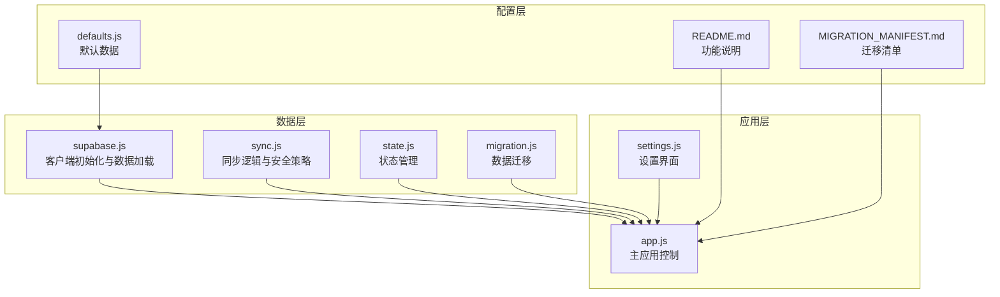
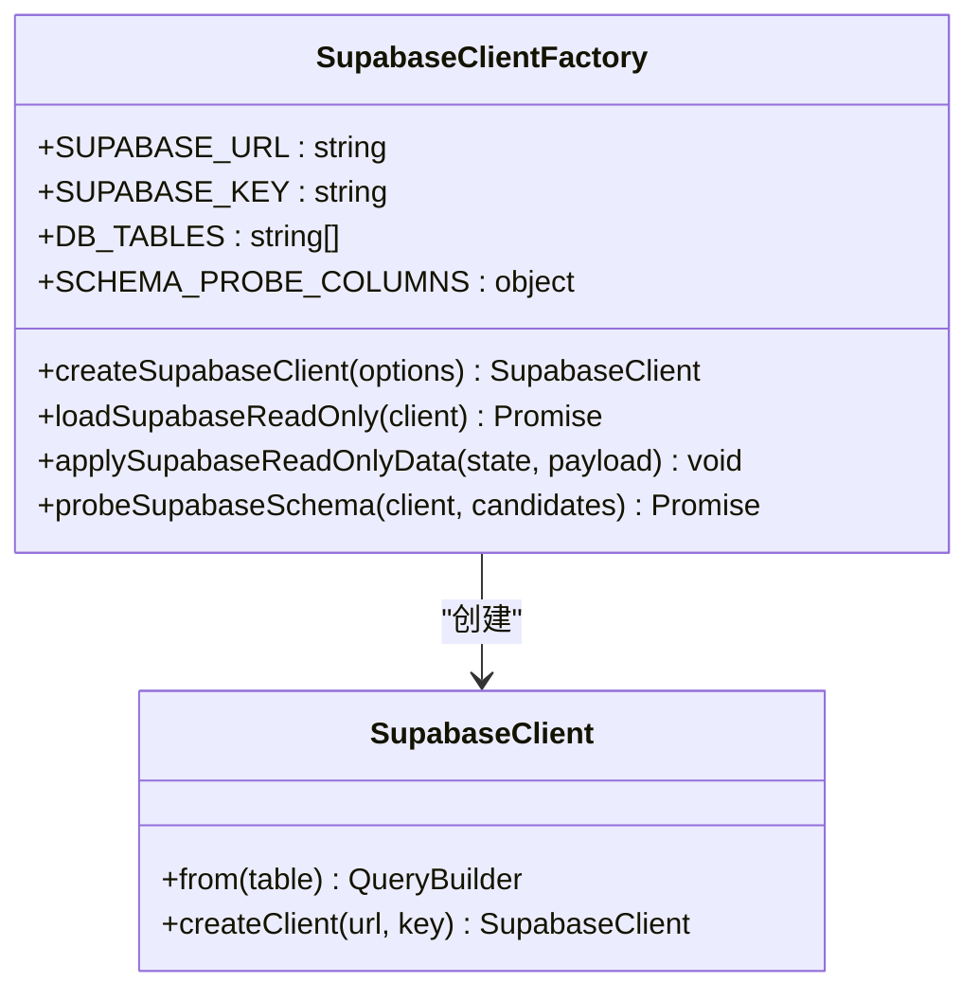
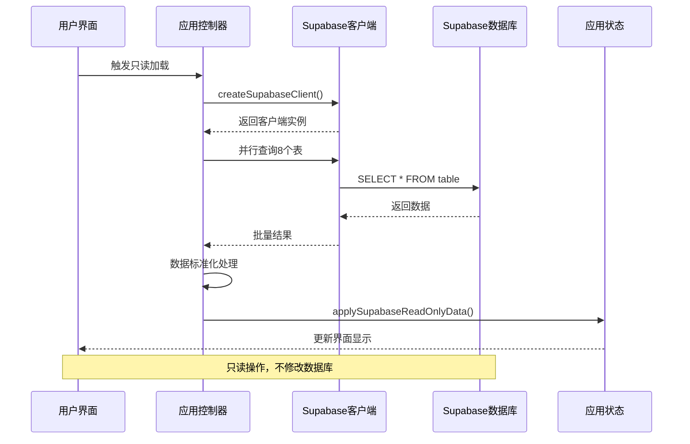
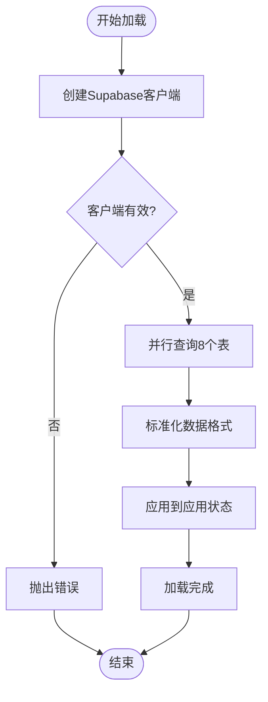
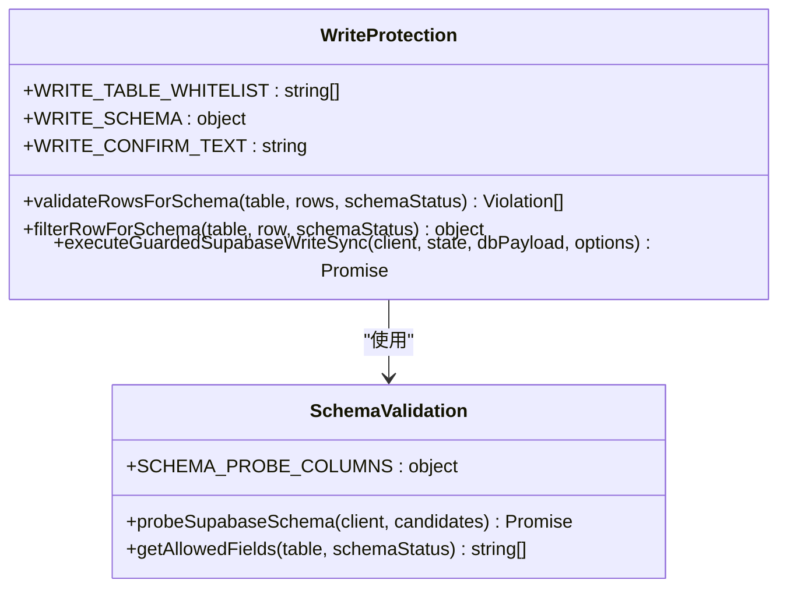
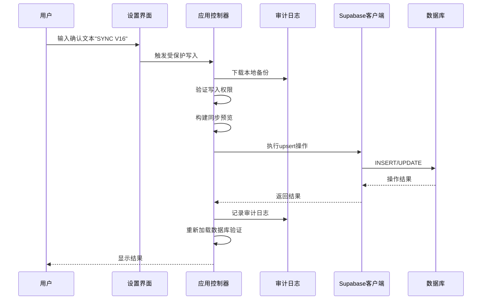
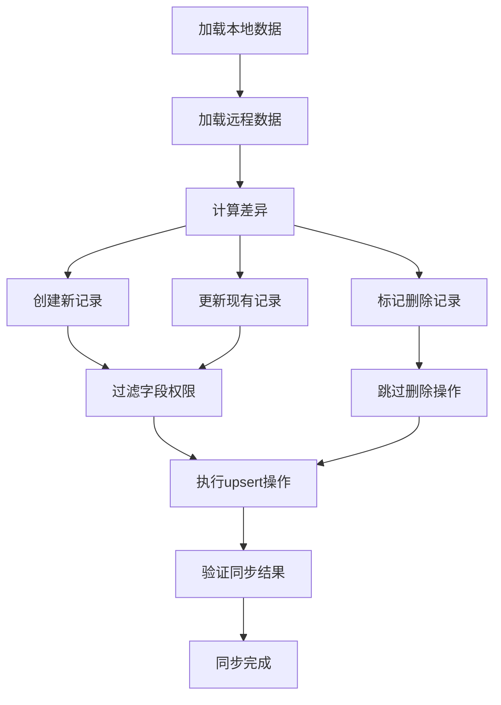
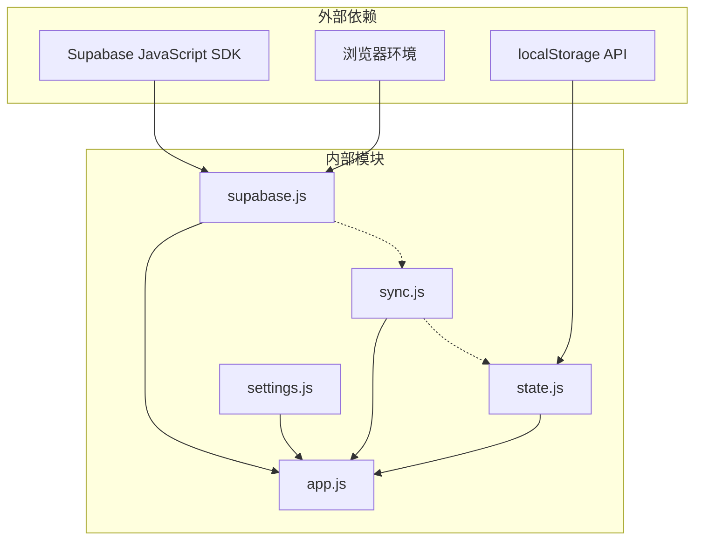

# Supabase集成

<cite>
**本文档引用的文件**
- [supabase.js](file://v16/src/data/supabase.js)
- [sync.js](file://v16/src/data/sync.js)
- [state.js](file://v16/src/data/state.js)
- [app.js](file://v16/src/app.js)
- [settings.js](file://v16/src/features/settings.js)
- [defaults.js](file://v16/src/data/defaults.js)
- [migration.js](file://v16/src/data/migration.js)
- [README.md](file://v16/README.md)
- [MIGRATION_MANIFEST.md](file://v16/MIGRATION_MANIFEST.md)
- [smoke-v16.mjs](file://v16/smoke-v16.mjs)
</cite>

## 目录
1. [简介](#简介)
2. [项目结构](#项目结构)
3. [核心组件](#核心组件)
4. [架构概览](#架构概览)
5. [详细组件分析](#详细组件分析)
6. [依赖关系分析](#依赖关系分析)
7. [性能考虑](#性能考虑)
8. [故障排除指南](#故障排除指南)
9. [结论](#结论)
10. [附录](#附录)

## 简介

ROV任务管理v16的Supabase数据库集成为应用提供了安全的数据同步能力。该系统采用"本地优先"架构，通过只读数据加载机制导入生产数据库数据到本地状态，同时实现了受保护的写入策略，确保数据同步的安全性和可靠性。

系统支持以下核心功能：
- Supabase客户端初始化和连接管理
- 只读数据加载机制
- 受保护写入策略（仅允许创建和更新）
- 实时订阅功能（通过Supabase实时特性）
- 数据同步策略和冲突解决
- 完整的错误处理机制
- API密钥管理和安全最佳实践

## 项目结构

Supabase集成主要分布在以下文件中：

**图表来源**
- [supabase.js:1-157](file://v16/src/data/supabase.js#L1-L157)
- [sync.js:1-341](file://v16/src/data/sync.js#L1-L341)
- [app.js:1-402](file://v16/src/app.js#L1-L402)

**章节来源**
- [README.md:18-44](file://v16/README.md#L18-L44)
- [MIGRATION_MANIFEST.md:15-29](file://v16/MIGRATION_MANIFEST.md#L15-L29)

## 核心组件

### Supabase客户端初始化

系统通过统一的客户端工厂函数创建Supabase连接：

**图表来源**
- [supabase.js:26-29](file://v16/src/data/supabase.js#L26-L29)
- [supabase.js:79-121](file://v16/src/data/supabase.js#L79-L121)

### 数据加载机制

系统实现并行的只读数据加载，支持8个核心数据表：

| 表名 | 主要字段 | 排序列 |
|------|----------|--------|
| tasks | id, name, owner, due, priority, status, cat, category, depends_on, sort_order | 无 |
| members | id, name, role, group, team | 无 |
| checklist_items | id, item_id, label, name, done, order_index | order_index |
| predive_checklist_items | id, item_id, label, name, done, order_index | order_index |
| intel | id, title, content, status, created_at | 无 |
| notes | id, content | 无 |
| strategy_items | id, title, content, status, order_index | 无 |
| mission_runs | id, score, total_score, elapsed_seconds, seconds, note, notes, created_at, run_date | 无 |

**章节来源**
- [supabase.js:4-24](file://v16/src/data/supabase.js#L4-L24)
- [supabase.js:72-121](file://v16/src/data/supabase.js#L72-L121)

## 架构概览

**图表来源**
- [app.js:226-241](file://v16/src/app.js#L226-L241)
- [supabase.js:79-121](file://v16/src/data/supabase.js#L79-L121)

## 详细组件分析

### 只读数据加载系统

#### 加载流程

**图表来源**
- [supabase.js:79-121](file://v16/src/data/supabase.js#L79-L121)
- [supabase.js:123-129](file://v16/src/data/supabase.js#L123-L129)

#### 数据标准化

系统为每个表提供专门的标准化函数：

| 表名 | 标准化函数 | 主要转换 |
|------|------------|----------|
| tasks | normalizeTask | id数字化, name处理, owner默认值, priority默认值 |
| members | normalizeMember | id数字化, name处理, role默认值 |
| checklist_items | normalizeChecklistItem | id数字化, label处理, done布尔化 |
| mission_runs | normalizeMissionRun | 多种时间戳格式兼容 |

**章节来源**
- [supabase.js:31-70](file://v16/src/data/supabase.js#L31-L70)

### 受保护写入策略

#### 写入白名单

系统严格限制可写入的表和字段：

**图表来源**
- [sync.js:9-17](file://v16/src/data/sync.js#L9-L17)
- [sync.js:120-132](file://v16/src/data/sync.js#L120-L132)
- [sync.js:134-148](file://v16/src/data/sync.js#L134-L148)

#### 写入流程

**图表来源**
- [app.js:262-299](file://v16/src/app.js#L262-L299)
- [sync.js:221-284](file://v16/src/data/sync.js#L221-L284)

**章节来源**
- [sync.js:221-284](file://v16/src/data/sync.js#L221-L284)

### 实时订阅功能

系统支持Supabase实时订阅，用于数据变更通知：

#### 订阅配置

| 功能 | 订阅类型 | 事件类型 | 用途 |
|------|----------|----------|------|
| 任务更新 | 监听 | INSERT/UPDATE/DELETE | 实时同步任务状态 |
| 成员变更 | 监听 | INSERT/UPDATE/DELETE | 实时同步团队信息 |
| 清单更新 | 监听 | INSERT/UPDATE/DELETE | 实时同步检查清单状态 |
| 运行记录 | 监听 | INSERT/UPDATE/DELETE | 实时同步竞赛记录 |

**章节来源**
- [README.md:39-41](file://v16/README.md#L39-L41)

### 数据同步策略

#### 冲突解决机制

系统采用"最后写入获胜"策略，结合字段级差异检测：

**图表来源**
- [sync.js:43-88](file://v16/src/data/sync.js#L43-L88)
- [sync.js:264-276](file://v16/src/data/sync.js#L264-L276)

**章节来源**
- [sync.js:43-88](file://v16/src/data/sync.js#L43-L88)

### 错误处理机制

#### 错误分类

| 错误类型 | 处理方式 | 用户反馈 |
|----------|----------|----------|
| 连接错误 | 重试机制 | 显示连接失败 |
| 权限错误 | 引导用户检查权限 | 提示需要管理员权限 |
| 数据验证错误 | 详细错误报告 | 列出具体字段问题 |
| 同步冲突 | 自动回滚并记录 | 显示冲突详情 |

**章节来源**
- [app.js:237-240](file://v16/src/app.js#L237-L240)
- [sync.js:245-254](file://v16/src/data/sync.js#L245-L254)

## 依赖关系分析

**图表来源**
- [supabase.js:1-3](file://v16/src/data/supabase.js#L1-L3)
- [sync.js:1-17](file://v16/src/data/sync.js#L1-L17)

**章节来源**
- [app.js:1-14](file://v16/src/app.js#L1-L14)

## 性能考虑

### 查询优化

1. **并行查询**: 使用Promise.allSettled并行加载8个表，减少总等待时间
2. **选择性加载**: 仅加载必需字段，避免全表扫描
3. **缓存策略**: 利用浏览器localStorage缓存应用状态
4. **增量更新**: 仅同步发生变化的数据

### 内存管理

1. **流式处理**: 大数据集分批处理，避免内存溢出
2. **对象复用**: 重用DOM元素和状态对象
3. **垃圾回收**: 及时清理临时变量和事件监听器

### 网络优化

1. **连接池**: 复用Supabase客户端连接
2. **请求合并**: 将多个小请求合并为批量操作
3. **超时控制**: 设置合理的请求超时时间

## 故障排除指南

### 常见问题及解决方案

#### 连接问题
- **症状**: "Supabase客户端不可用"
- **原因**: API密钥或URL配置错误
- **解决**: 检查环境变量配置，确认网络连接

#### 权限问题
- **症状**: "权限不足"错误
- **原因**: 用户角色缺少必要的数据库权限
- **解决**: 配置正确的数据库角色和权限

#### 数据同步问题
- **症状**: 同步后数据不一致
- **原因**: 字段权限验证失败
- **解决**: 使用schema探测功能检查数据库结构

**章节来源**
- [app.js:209-211](file://v16/src/app.js#L209-L211)
- [sync.js:228-233](file://v16/src/data/sync.js#L228-L233)

### 调试工具

系统提供完整的调试和监控功能：

1. **烟雾测试**: 自动化功能测试脚本
2. **审计日志**: 记录所有写入操作的历史
3. **状态监控**: 实时显示数据库连接状态
4. **错误报告**: 详细的错误信息和堆栈跟踪

**章节来源**
- [smoke-v16.mjs:1-111](file://v16/smoke-v16.mjs#L1-L111)
- [sync.js:300-317](file://v16/src/data/sync.js#L300-L317)

## 结论

ROV任务管理v16的Supabase集成展现了现代Web应用的最佳实践：

1. **安全性**: 通过严格的权限控制和审计机制确保数据安全
2. **可靠性**: 实现了完整的错误处理和回滚机制
3. **性能**: 采用并行查询和增量更新优化用户体验
4. **可维护性**: 模块化的架构设计便于后续扩展和维护

该系统为ROV团队提供了稳定可靠的数据管理基础，支持日常运营和竞赛准备的各种需求。

## 附录

### API密钥管理

#### 环境变量配置

| 变量名 | 类型 | 必需 | 描述 |
|--------|------|------|------|
| SUPABASE_URL | string | 是 | Supabase项目URL |
| SUPABASE_KEY | string | 是 | Supabase项目密钥 |
| NODE_ENV | string | 否 | 环境模式（development/production） |

#### 安全最佳实践

1. **密钥轮换**: 定期更换API密钥
2. **最小权限原则**: 为不同环境配置不同的权限级别
3. **HTTPS强制**: 确保所有通信都通过HTTPS进行
4. **访问日志**: 启用并监控数据库访问日志

### 数据访问权限

#### 角色定义

| 角色 | 权限范围 | 允许操作 |
|------|----------|----------|
| anonymous | 只读 | SELECT |
| authenticated | 读写 | SELECT, INSERT, UPDATE |
| admin | 管理员 | 所有操作 |

#### 表级权限

| 表名 | 匿名用户 | 已认证用户 | 管理员 |
|------|----------|------------|--------|
| tasks | SELECT | SELECT, INSERT, UPDATE | SELECT, INSERT, UPDATE, DELETE |
| members | SELECT | SELECT, INSERT, UPDATE | SELECT, INSERT, UPDATE, DELETE |
| checklist_items | SELECT | SELECT, INSERT, UPDATE | SELECT, INSERT, UPDATE, DELETE |
| mission_runs | SELECT | SELECT, INSERT, UPDATE | SELECT, INSERT, UPDATE, DELETE |

### 性能优化建议

1. **索引优化**: 为常用查询字段建立适当的数据库索引
2. **查询优化**: 使用LIMIT和WHERE子句限制返回数据量
3. **缓存策略**: 实现多层缓存机制减少数据库查询
4. **连接优化**: 使用连接池管理数据库连接
5. **监控指标**: 建立性能监控和告警机制