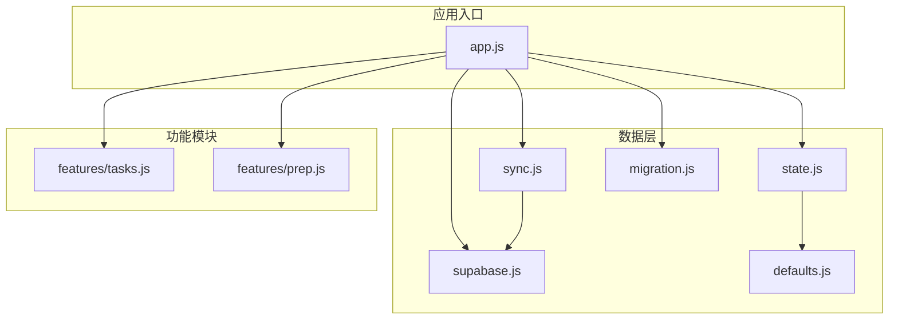
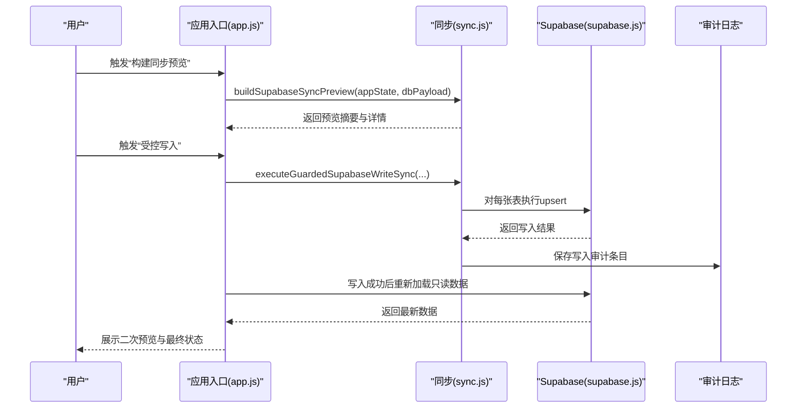
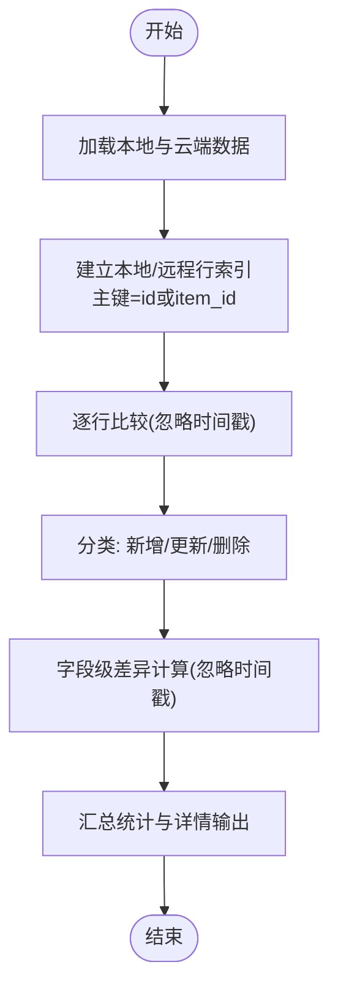
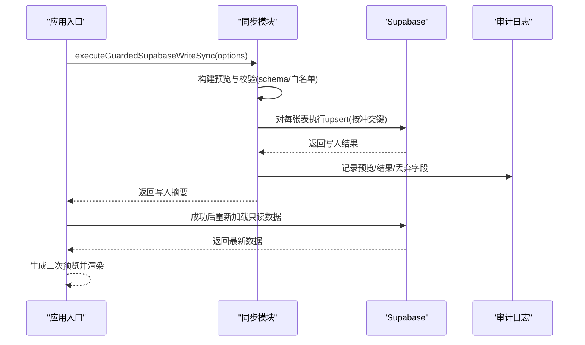
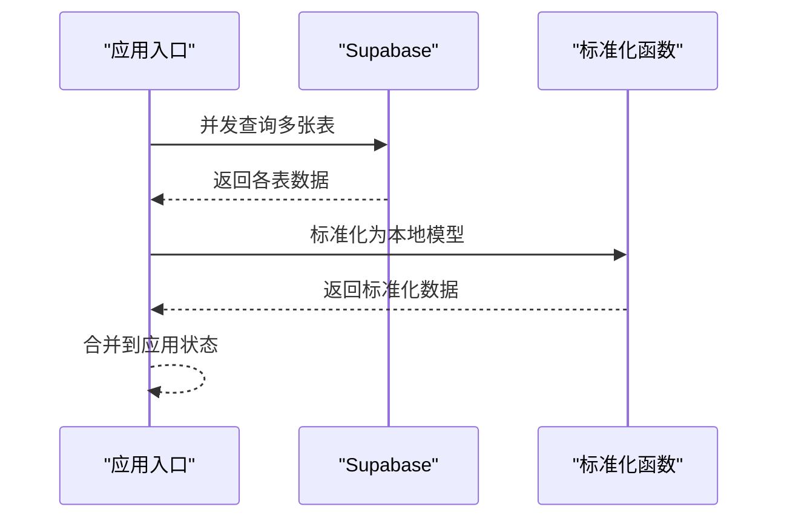
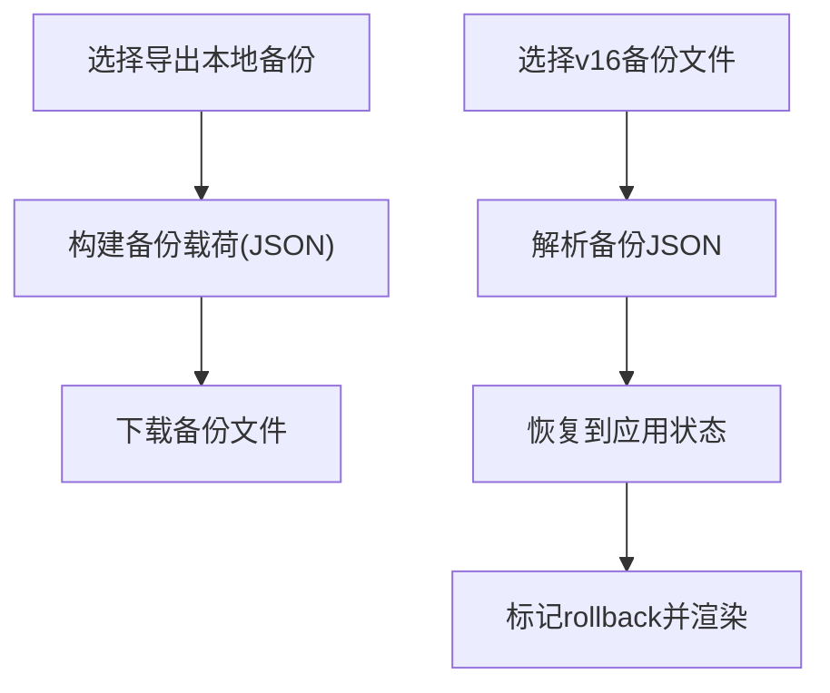
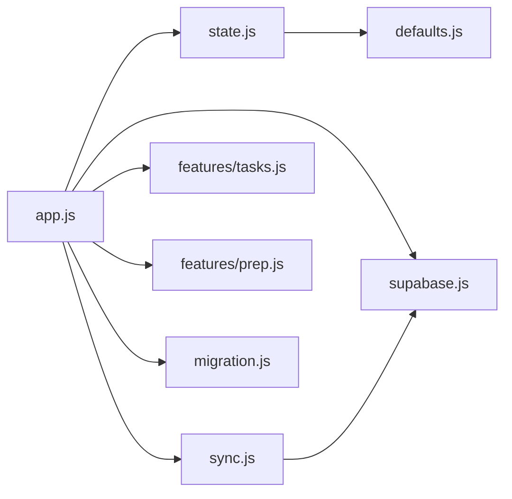

# 数据同步

<cite>
**本文引用的文件**
- [sync.js](file://v16/src/data/sync.js)
- [supabase.js](file://v16/src/data/supabase.js)
- [state.js](file://v16/src/data/state.js)
- [defaults.js](file://v16/src/data/defaults.js)
- [migration.js](file://v16/src/data/migration.js)
- [app.js](file://v16/src/app.js)
- [tasks.js](file://v16/src/features/tasks.js)
- [prep.js](file://v16/src/features/prep.js)
- [README.md](file://v16/README.md)
</cite>

## 目录
1. [简介](#简介)
2. [项目结构](#项目结构)
3. [核心组件](#核心组件)
4. [架构总览](#架构总览)
5. [详细组件分析](#详细组件分析)
6. [依赖关系分析](#依赖关系分析)
7. [性能考量](#性能考量)
8. [故障排查指南](#故障排查指南)
9. [结论](#结论)
10. [附录](#附录)

## 简介
本文件面向ROV任务管理v16的数据同步系统，系统采用“本地优先”（local-first）架构：应用以浏览器localStorage中的本地状态为核心，通过Supabase进行只读加载与受控写入。v16提供：
- 同步预览（Dry-run）：在不写入数据库的前提下，计算本地与云端差异，统计新增、更新、删除数量及字段级差异详情。
- 受控写入（Guarded Write）：仅允许白名单表与字段写入，禁止删除，要求输入确认文本，写入前自动下载本地备份，写入后重新加载云端数据进行二次校验。
- 冲突检测与解决策略：基于行级主键（id或item_id）的upsert合并；忽略时间戳字段；对字段差异进行逐项比对。
- 数据版本控制与审计：通过schema探测动态裁剪字段，写入审计日志记录每次尝试的预览、结果与丢弃字段。
- 增量同步与一致性：通过预览与二次预览对比，确保写入后的一致性；支持回滚到本地备份。
- 性能优化与网络异常处理：批量并发读取云端表，按需顺序执行写入，失败时保留本地状态并记录审计。

## 项目结构
v16将数据层拆分为独立模块，便于维护与测试：
- 数据层：默认数据、状态持久化、Supabase读写、同步与审计
- 功能层：任务、准备清单、竞赛计时等页面模块
- 应用入口：事件绑定、渲染与交互逻辑

图表来源
- [app.js:1-402](file://v16/src/app.js#L1-L402)
- [sync.js:1-341](file://v16/src/data/sync.js#L1-L341)
- [supabase.js:1-157](file://v16/src/data/supabase.js#L1-L157)
- [state.js:1-45](file://v16/src/data/state.js#L1-L45)
- [migration.js:1-100](file://v16/src/data/migration.js#L1-L100)
- [defaults.js:1-46](file://v16/src/data/defaults.js#L1-L46)
- [tasks.js:1-112](file://v16/src/features/tasks.js#L1-L112)
- [prep.js:1-58](file://v16/src/features/prep.js#L1-L58)

章节来源
- [README.md:1-68](file://v16/README.md#L1-L68)
- [app.js:1-402](file://v16/src/app.js#L1-L402)

## 核心组件
- 同步映射与白名单
  - 表映射：定义本地键与云端表名的对应关系，用于预览与写入。
  - 写入白名单：限定可写入的表集合。
  - 字段白名单：结合schema探测结果，动态裁剪不可写字段。
- 差异计算
  - 行级比较：忽略时间戳字段，对剩余字段进行序列化比较，识别新增、更新、删除。
  - 字段级差异：输出每个差异字段的本地与远程值，便于预览。
- 预处理与转换
  - 行标准化：将本地行转换为数据库期望的列集，缺失字段填充默认值。
  - 字段过滤：根据白名单与schema探测结果过滤字段。
- 受控写入
  - upsert策略：按id或item_id冲突键执行upsert，避免删除。
  - 审计日志：记录每次写入尝试的预览、结果、丢弃字段与二次预览。
- 备份与回滚
  - 本地备份：导出当前v16状态为JSON，包含时间戳与赛季信息。
  - 回滚：从v16备份JSON恢复本地状态，不涉及云端写入。

章节来源
- [sync.js:1-341](file://v16/src/data/sync.js#L1-L341)

## 架构总览
v16的同步架构遵循“只读加载 + 受控写入”的模式：
- 只读加载：并发读取云端表，标准化为本地模型，合并到应用状态。
- 同步预览：基于本地状态与只读加载结果，计算差异并汇总。
- 受控写入：对白名单表与字段执行upsert，写入前下载本地备份，写入后重新加载并生成二次预览。
- 审计与回滚：记录写入审计，必要时从本地备份回滚。

图表来源
- [app.js:243-299](file://v16/src/app.js#L243-L299)
- [sync.js:221-284](file://v16/src/data/sync.js#L221-L284)
- [supabase.js:79-121](file://v16/src/data/supabase.js#L79-L121)

## 详细组件分析

### 同步预览与差异计算
- 预览构建
  - 输入：应用状态与只读加载结果。
  - 输出：每张表的本地/远程数量、新增/更新/删除计数，以及字段级差异详情。
- 差异算法
  - 行级：以行主键（id或item_id）为键，分别建立本地与远程索引；遍历索引识别新增、更新、删除三类操作。
  - 字段级：忽略时间戳字段，对剩余字段进行序列化比较，输出差异字段列表。
- 预览用途
  - Dry-run：在不写入数据库的情况下，让用户确认变更范围。
  - 详情视图：展示受影响的行标签与具体字段差异，辅助决策。

图表来源
- [sync.js:43-88](file://v16/src/data/sync.js#L43-L88)

章节来源
- [sync.js:150-178](file://v16/src/data/sync.js#L150-L178)
- [sync.js:30-88](file://v16/src/data/sync.js#L30-L88)

### 受控写入与冲突解决
- 写入约束
  - 必须输入确认文本，否则拒绝执行。
  - 禁止删除：强制跳过删除操作。
  - 白名单：仅对白名单表执行写入。
  - 字段白名单：结合schema探测裁剪不可写字段。
- 冲突解决策略
  - upsert：按id或item_id冲突键执行upsert，覆盖远程同主键记录。
  - 字段裁剪：对不在白名单或schema探测缺失的字段进行过滤，记录丢弃字段。
- 写入后验证
  - 重新加载云端数据，生成二次预览，对比写入前后差异，确保一致性。

图表来源
- [app.js:262-299](file://v16/src/app.js#L262-L299)
- [sync.js:221-284](file://v16/src/data/sync.js#L221-L284)
- [supabase.js:79-121](file://v16/src/data/supabase.js#L79-L121)

章节来源
- [sync.js:221-284](file://v16/src/data/sync.js#L221-L284)
- [sync.js:120-148](file://v16/src/data/sync.js#L120-L148)

### 数据库只读加载与schema探测
- 并发加载
  - 使用Promise.allSettled并发查询多张表，避免串行等待。
  - 按需排序：对checklist_items与predive_checklist_items按order_index排序。
- 数据标准化
  - 将不同来源的字段映射到统一的本地模型，如任务、成员、检查项、任务运行等。
- Schema探测
  - 对候选列逐一进行只读查询，统计存在与缺失列，评估覆盖率。
  - 结果用于动态裁剪写入字段，提升兼容性。

图表来源
- [supabase.js:79-121](file://v16/src/data/supabase.js#L79-L121)
- [supabase.js:131-156](file://v16/src/data/supabase.js#L131-L156)

章节来源
- [supabase.js:79-121](file://v16/src/data/supabase.js#L79-L121)
- [supabase.js:131-156](file://v16/src/data/supabase.js#L131-L156)

### 备份与回滚
- 本地备份
  - 导出当前v16状态为JSON，包含类型、版本、导出时间、赛季与数据主体。
  - 下载为文件，便于离线存档与跨设备迁移。
- 回滚
  - 从v16备份JSON恢复本地状态，同时标记rollback标志，触发UI更新。
  - 不涉及云端写入，确保安全。

图表来源
- [sync.js:180-219](file://v16/src/data/sync.js#L180-L219)
- [sync.js:190-205](file://v16/src/data/sync.js#L190-L205)

章节来源
- [sync.js:180-219](file://v16/src/data/sync.js#L180-L219)
- [sync.js:190-205](file://v16/src/data/sync.js#L190-L205)

### 写入审计与错误处理
- 审计日志
  - 存储在localStorage中，记录每次写入尝试的预览、结果、丢弃字段与二次预览。
  - 限制最多保留最近20条，避免无限增长。
- 错误处理
  - 写入失败时，记录错误并提示用户；保持本地状态不变。
  - schema探测失败时，捕获错误并提示用户。
  - 预览构建失败时，返回错误摘要并提示用户。

章节来源
- [sync.js:300-317](file://v16/src/data/sync.js#L300-L317)
- [sync.js:319-340](file://v16/src/data/sync.js#L319-L340)
- [app.js:209-211](file://v16/src/app.js#L209-L211)
- [app.js:292-297](file://v16/src/app.js#L292-L297)

## 依赖关系分析
- 组件耦合
  - app.js作为入口，协调state、supabase、sync与各功能模块。
  - sync.js依赖supabase.js提供的客户端与schema探测能力。
  - state.js与defaults.js共同决定初始状态与持久化格式。
- 外部依赖
  - Supabase客户端：用于只读查询与upsert写入。
  - 浏览器API：localStorage用于状态持久化，Blob/File用于备份导出。

图表来源
- [app.js:1-402](file://v16/src/app.js#L1-L402)
- [sync.js:1-341](file://v16/src/data/sync.js#L1-L341)
- [supabase.js:1-157](file://v16/src/data/supabase.js#L1-L157)
- [state.js:1-45](file://v16/src/data/state.js#L1-L45)
- [migration.js:1-100](file://v16/src/data/migration.js#L1-L100)
- [defaults.js:1-46](file://v16/src/data/defaults.js#L1-L46)
- [tasks.js:1-112](file://v16/src/features/tasks.js#L1-L112)
- [prep.js:1-58](file://v16/src/features/prep.js#L1-L58)

章节来源
- [app.js:1-402](file://v16/src/app.js#L1-L402)
- [sync.js:1-341](file://v16/src/data/sync.js#L1-L341)
- [supabase.js:1-157](file://v16/src/data/supabase.js#L1-L157)

## 性能考量
- 并发读取
  - 只读加载使用Promise.allSettled并发查询多表，减少总等待时间。
- 批量写入
  - 对每张表聚合需要创建与更新的行，一次性执行upsert，降低请求次数。
- 字段裁剪
  - 基于schema探测裁剪无效字段，减少写入体积与失败概率。
- 时间戳忽略
  - 差异计算忽略created_at/updated_at，避免因时钟偏差导致的无意义更新。
- 二次预览
  - 写入后重新加载并生成二次预览，确保一致性，但会增加一次网络往返。

章节来源
- [supabase.js:79-121](file://v16/src/data/supabase.js#L79-L121)
- [sync.js:243-276](file://v16/src/data/sync.js#L243-L276)
- [sync.js:255-259](file://v16/src/data/sync.js#L255-L259)

## 故障排查指南
- 写入被拒绝
  - 确认已输入正确的确认文本。
  - 检查是否选择了允许写入的表。
  - 确认未启用删除选项。
- 写入失败
  - 查看审计日志，定位失败表与错误信息。
  - 检查schema探测结果，确认字段是否存在于云端表。
  - 使用二次预览对比写入前后差异，确认一致性。
- 只读加载失败
  - 检查Supabase客户端初始化参数与网络连接。
  - 使用schema探测确认候选列是否存在。
- 回滚失败
  - 确认导入的备份文件类型为v16本地备份。
  - 检查JSON格式是否完整，包含必需字段。

章节来源
- [sync.js:228-234](file://v16/src/data/sync.js#L228-L234)
- [sync.js:244-254](file://v16/src/data/sync.js#L244-L254)
- [sync.js:300-317](file://v16/src/data/sync.js#L300-L317)
- [app.js:209-211](file://v16/src/app.js#L209-L211)
- [app.js:292-297](file://v16/src/app.js#L292-L297)

## 结论
v16的数据同步系统以“只读加载 + 受控写入”为核心，通过预览与审计保障变更透明与可追溯，通过schema探测与字段裁剪提升兼容性，通过二次预览确保一致性。该设计在保证安全性的同时，提供了清晰的变更路径与完善的回滚能力，适合在弱网与多端场景下稳定运行。

## 附录
- 实际使用示例
  - 只读加载：点击“加载Supabase只读数据”，系统并发查询多表并合并到本地状态。
  - 同步预览：点击“构建同步预览”，系统计算差异并显示新增/更新/删除数量与字段详情。
  - 受控写入：勾选目标表，输入确认文本，系统下载本地备份后执行upsert，完成后重新加载并生成二次预览。
  - 回滚：选择v16备份文件，系统恢复本地状态并提示完成。

章节来源
- [app.js:226-241](file://v16/src/app.js#L226-L241)
- [app.js:243-261](file://v16/src/app.js#L243-L261)
- [app.js:262-299](file://v16/src/app.js#L262-L299)
- [app.js:374-383](file://v16/src/app.js#L374-L383)