# 数据层设计

<cite>
**本文档引用的文件**
- [state.js](file://v16/src/data/state.js)
- [supabase.js](file://v16/src/data/supabase.js)
- [sync.js](file://v16/src/data/sync.js)
- [migration.js](file://v16/src/data/migration.js)
- [defaults.js](file://v16/src/data/defaults.js)
- [app.js](file://v16/src/app.js)
- [settings.js](file://v16/src/features/settings.js)
- [tasks.js](file://v16/src/features/tasks.js)
- [MIGRATION_MANIFEST.md](file://v16/MIGRATION_MANIFEST.md)
</cite>

## 目录
1. [简介](#简介)
2. [项目结构](#项目结构)
3. [核心组件](#核心组件)
4. [架构概览](#架构概览)
5. [详细组件分析](#详细组件分析)
6. [依赖关系分析](#依赖关系分析)
7. [性能考虑](#性能考虑)
8. [故障排除指南](#故障排除指南)
9. [结论](#结论)
10. [附录](#附录)

## 简介

ROV任务管理v16的数据层设计采用本地优先（Local-First）架构，结合Supabase数据库实现数据持久化和同步。该系统通过状态管理、数据持久化机制和数据同步策略，为用户提供可靠的任务管理功能。

系统的核心特点包括：
- 本地状态管理与持久化
- Supabase数据库集成
- 安全的双向数据同步
- 数据迁移和版本管理
- 完整的审计日志记录

## 项目结构

数据层位于`v16/src/data/`目录下，包含以下核心文件：

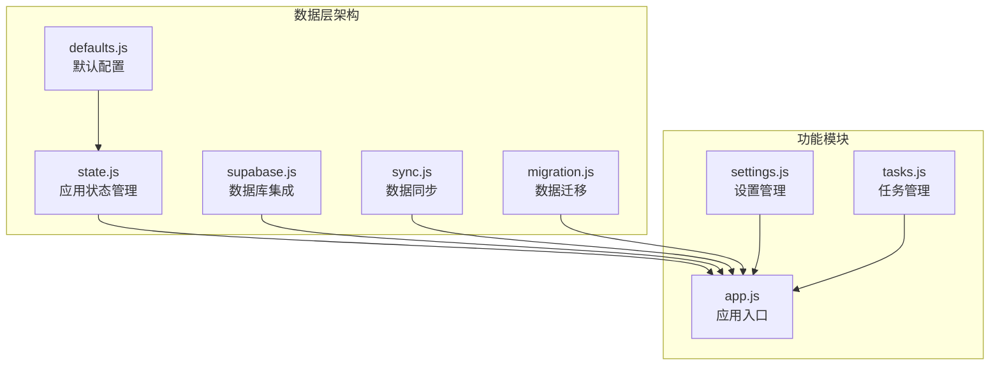

**图表来源**
- [state.js:1-45](file://v16/src/data/state.js#L1-L45)
- [supabase.js:1-157](file://v16/src/data/supabase.js#L1-L157)
- [sync.js:1-341](file://v16/src/data/sync.js#L1-L341)

**章节来源**
- [state.js:1-45](file://v16/src/data/state.js#L1-L45)
- [supabase.js:1-157](file://v16/src/data/supabase.js#L1-L157)
- [sync.js:1-341](file://v16/src/data/sync.js#L1-L341)
- [migration.js:1-100](file://v16/src/data/migration.js#L1-L100)
- [defaults.js:1-46](file://v16/src/data/defaults.js#L1-L46)

## 核心组件

### 应用状态管理

应用状态管理是数据层的核心，负责维护整个应用的状态信息。状态结构包括：

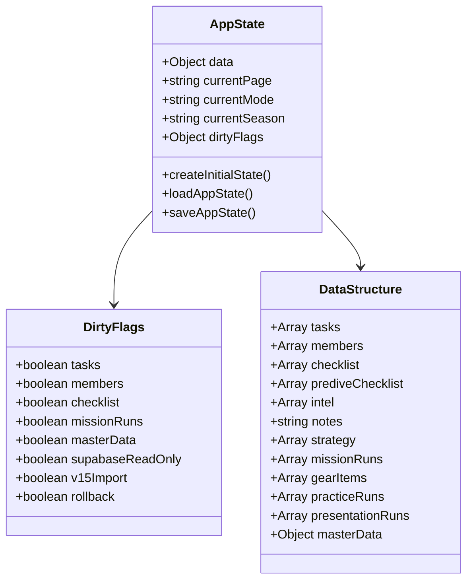

**图表来源**
- [state.js:6-33](file://v16/src/data/state.js#L6-L33)
- [defaults.js:1-46](file://v16/src/data/defaults.js#L1-L46)

### 数据持久化机制

系统采用localStorage作为主要的持久化存储，支持以下功能：

- **自动保存**：应用状态在用户交互后自动保存到localStorage
- **恢复机制**：启动时从localStorage恢复之前的状态
- **脏标记系统**：跟踪哪些数据需要重新同步到数据库

**章节来源**
- [state.js:16-44](file://v16/src/data/state.js#L16-L44)
- [app.js:60-64](file://v16/src/app.js#L60-L64)

## 架构概览

数据层采用分层架构设计，确保各组件职责清晰：

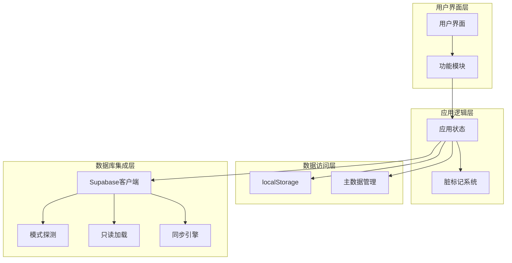

**图表来源**
- [app.js:1-402](file://v16/src/app.js#L1-L402)
- [supabase.js:26-121](file://v16/src/data/supabase.js#L26-L121)
- [sync.js:221-284](file://v16/src/data/sync.js#L221-L284)

## 详细组件分析

### 状态结构定义

应用状态采用扁平化设计，便于管理和同步：

| 状态属性 | 类型 | 描述 | 默认值 |
|---------|------|------|--------|
| `data` | Object | 主要数据容器 | 默认状态对象 |
| `currentPage` | String | 当前页面标识 | 'dashboard' |
| `currentMode` | String | 当前操作模式 | 'review' |
| `currentSeason` | String | 当前赛季标识 | '2025-2026' |
| `dirtyFlags` | Object | 脏标记集合 | 空对象 |

数据结构包含以下主要实体：

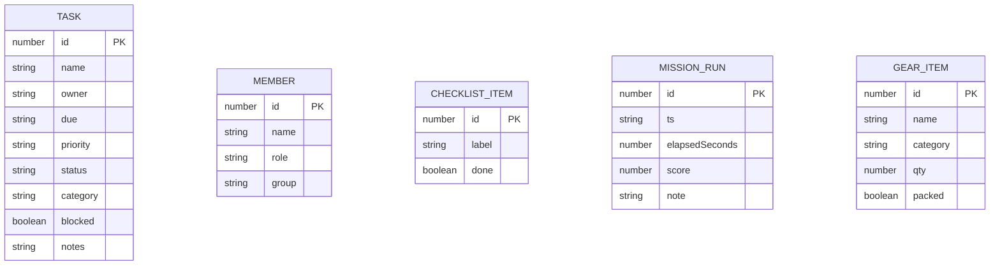

**图表来源**
- [defaults.js:2-37](file://v16/src/data/defaults.js#L2-L37)

**章节来源**
- [defaults.js:1-46](file://v16/src/data/defaults.js#L1-L46)
- [state.js:6-14](file://v16/src/data/state.js#L6-L14)

### 加载和保存流程

系统实现了完整的数据生命周期管理：

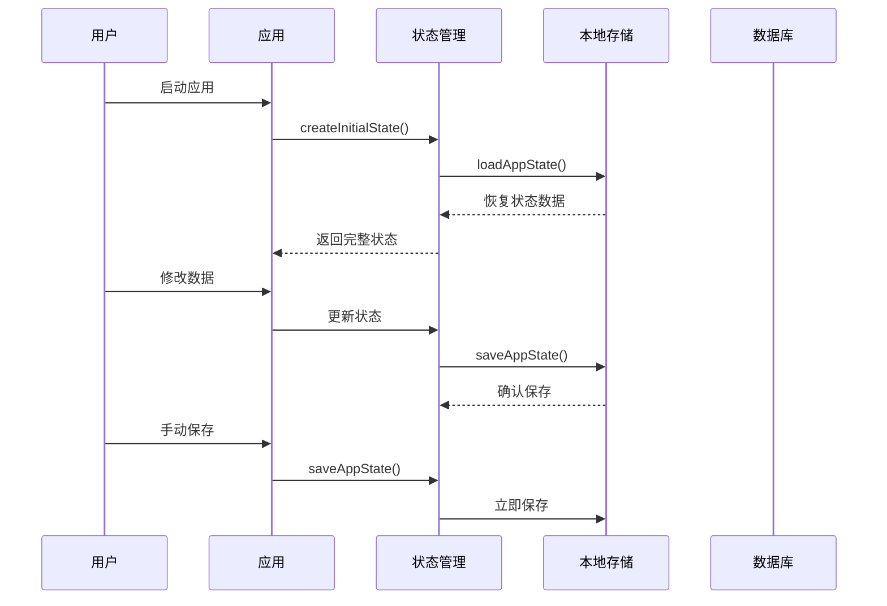

**图表来源**
- [state.js:16-44](file://v16/src/data/state.js#L16-L44)
- [app.js:60-64](file://v16/src/app.js#L60-L64)

**章节来源**
- [state.js:16-44](file://v16/src/data/state.js#L16-L44)
- [app.js:38-46](file://v16/src/app.js#L38-L46)

### Supabase数据库集成

系统通过Supabase实现云端数据存储，支持多种操作模式：

#### 只读数据加载

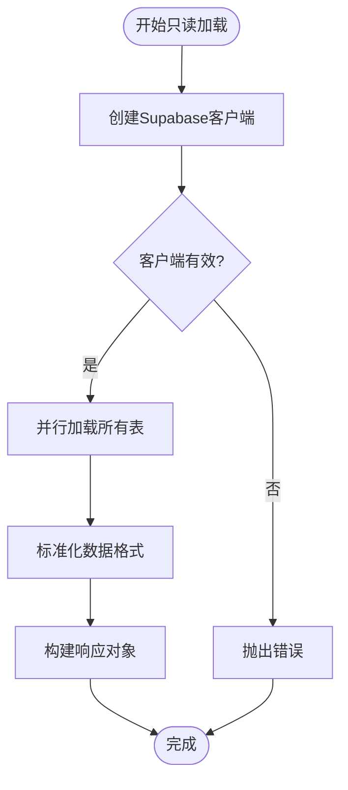

**图表来源**
- [supabase.js:79-121](file://v16/src/data/supabase.js#L79-L121)

#### 数据同步策略

系统采用"受保护写入"同步模式，确保数据安全：

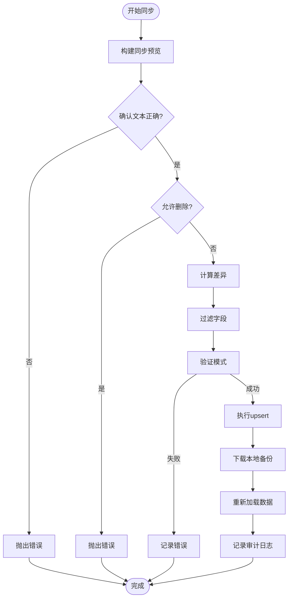

**图表来源**
- [sync.js:221-284](file://v16/src/data/sync.js#L221-L284)

**章节来源**
- [supabase.js:79-121](file://v16/src/data/supabase.js#L79-L121)
- [sync.js:221-284](file://v16/src/data/sync.js#L221-L284)

### 数据访问模式

系统实现了多种数据访问模式：

#### 本地访问模式
- 直接操作localStorage中的应用状态
- 支持实时更新和即时保存
- 适用于离线场景

#### 远程访问模式
- 通过Supabase客户端访问云端数据库
- 支持只读查询和受保护写入
- 提供数据同步和冲突解决

#### 混合访问模式
- 结合本地状态和远程数据
- 使用脏标记系统跟踪变更
- 实现智能同步策略

**章节来源**
- [app.js:226-242](file://v16/src/app.js#L226-L242)
- [app.js:262-299](file://v16/src/app.js#L262-L299)

### 缓存策略

系统采用多层缓存策略：

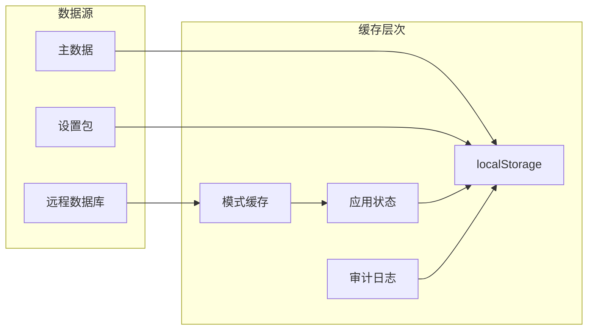

**图表来源**
- [supabase.js:131-156](file://v16/src/data/supabase.js#L131-L156)
- [sync.js:300-317](file://v16/src/data/sync.js#L300-L317)

**章节来源**
- [supabase.js:131-156](file://v16/src/data/supabase.js#L131-L156)
- [sync.js:300-317](file://v16/src/data/sync.js#L300-L317)

## 依赖关系分析

数据层组件之间的依赖关系如下：

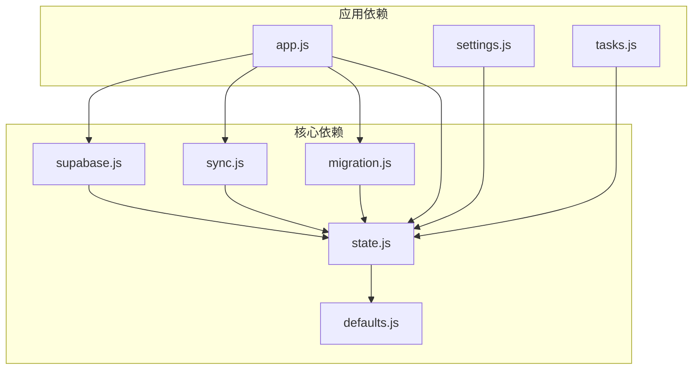

**图表来源**
- [app.js:1-14](file://v16/src/app.js#L1-L14)
- [state.js:1-3](file://v16/src/data/state.js#L1-L3)

**章节来源**
- [app.js:1-14](file://v16/src/app.js#L1-L14)

## 性能考虑

### 并行数据加载

系统使用Promise.allSettled实现并行数据加载，提高性能：

- **并发查询**：同时查询8个数据库表
- **错误隔离**：单表查询失败不影响其他表
- **性能监控**：记录加载时间和成功率

### 内存优化

- **结构化克隆**：使用structuredClone避免深拷贝开销
- **增量更新**：只更新变化的数据部分
- **垃圾回收**：及时清理临时对象和事件监听器

### 网络优化

- **连接池**：复用Supabase客户端实例
- **请求合并**：将多个小操作合并为批量操作
- **重试机制**：网络失败时自动重试

## 故障排除指南

### 常见问题及解决方案

#### 数据同步失败

**症状**：受保护写入同步报错
**原因**：
- 确认文本输入不正确
- 数据库模式不匹配
- 字段权限不足

**解决方案**：
1. 确保输入正确的确认文本"SYNC V16"
2. 运行模式探测检查数据库列存在性
3. 检查字段白名单配置

#### 数据加载超时

**症状**：只读数据加载长时间无响应
**原因**：
- 网络连接不稳定
- 数据库查询超时
- 浏览器限制

**解决方案**：
1. 检查网络连接状态
2. 减少同时查询的表数量
3. 增加超时时间设置

#### 数据丢失风险

**症状**：执行同步后数据异常
**原因**：
- 删除操作被禁用
- 字段过滤导致数据丢失
- 审计日志未记录

**解决方案**：
1. 使用本地备份功能
2. 检查字段过滤规则
3. 查看审计日志记录

**章节来源**
- [sync.js:228-233](file://v16/src/data/sync.js#L228-L233)
- [sync.js:300-317](file://v16/src/data/sync.js#L300-L317)

## 结论

ROV任务管理v16的数据层设计体现了现代Web应用的最佳实践：

### 设计优势

1. **安全性**：采用受保护写入模式，防止意外数据修改
2. **可靠性**：完整的备份和回滚机制
3. **可维护性**：清晰的模块化架构和文档
4. **性能**：优化的并发处理和缓存策略

### 技术创新

- **本地优先架构**：确保离线可用性和快速响应
- **智能同步**：基于模式探测的动态字段映射
- **审计追踪**：完整的操作历史记录
- **版本管理**：支持v15到v16的数据迁移

### 未来改进方向

1. **实时同步**：添加WebSocket支持实现实时数据更新
2. **数据压缩**：对大数据集进行压缩存储
3. **增量备份**：实现增量备份减少存储空间
4. **权限控制**：增强用户权限和访问控制

## 附录

### 数据模型定义

#### 表结构映射

| v16键名 | Supabase表名 | 主键字段 |
|---------|-------------|----------|
| `tasks` | `tasks` | `id` |
| `members` | `members` | `id` |
| `checklist` | `checklist_items` | `item_id` |
| `prediveChecklist` | `predive_checklist_items` | `item_id` |
| `missionRuns` | `mission_runs` | `id` |

#### 字段映射规则

系统通过标准化函数将不同来源的数据转换为统一格式：

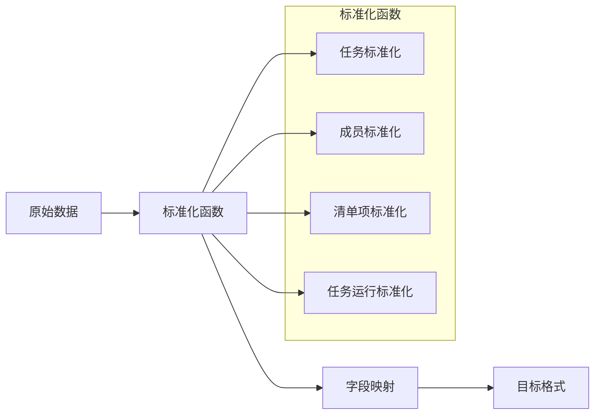

**图表来源**
- [supabase.js:31-70](file://v16/src/data/supabase.js#L31-L70)

### 验证规则和业务规则

#### 数据验证规则

1. **类型验证**：确保字段类型符合预期
2. **范围验证**：检查数值范围和枚举值
3. **完整性验证**：确保必需字段存在
4. **一致性验证**：检查关联数据的一致性

#### 业务规则

1. **状态流转**：任务状态只能按特定顺序变化
2. **依赖关系**：阻塞任务必须先于被阻塞任务完成
3. **权限控制**：只有授权用户才能修改数据
4. **数据完整性**：确保引用完整性约束

### 数据生命周期管理

#### 数据保留策略

- **临时数据**：会话期间保存，关闭浏览器清除
- **用户数据**：永久保存，支持导出和导入
- **审计日志**：保留最近20次操作记录
- **备份数据**：支持无限期保存

#### 归档规则

- **历史数据**：超过1年的数据自动归档
- **备份文件**：按月生成备份文件
- **日志清理**：定期清理过期的日志记录

### 数据安全和隐私

#### 访问控制

- **认证机制**：基于Supabase的用户认证
- **权限模型**：基于角色的访问控制
- **数据加密**：敏感数据在传输中加密

#### 隐私保护

- **最小化原则**：只收集必要的数据
- **数据匿名化**：个人身份信息匿名化处理
- **用户同意**：明确告知数据使用目的

### 版本管理和迁移

#### 迁移路径

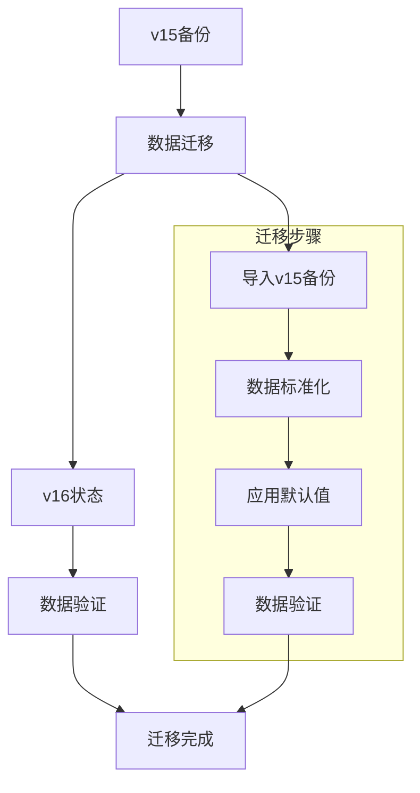

**图表来源**
- [migration.js:75-99](file://v16/src/data/migration.js#L75-L99)

**章节来源**
- [migration.js:75-99](file://v16/src/data/migration.js#L75-L99)
- [MIGRATION_MANIFEST.md:1-76](file://v16/MIGRATION_MANIFEST.md#L1-L76)