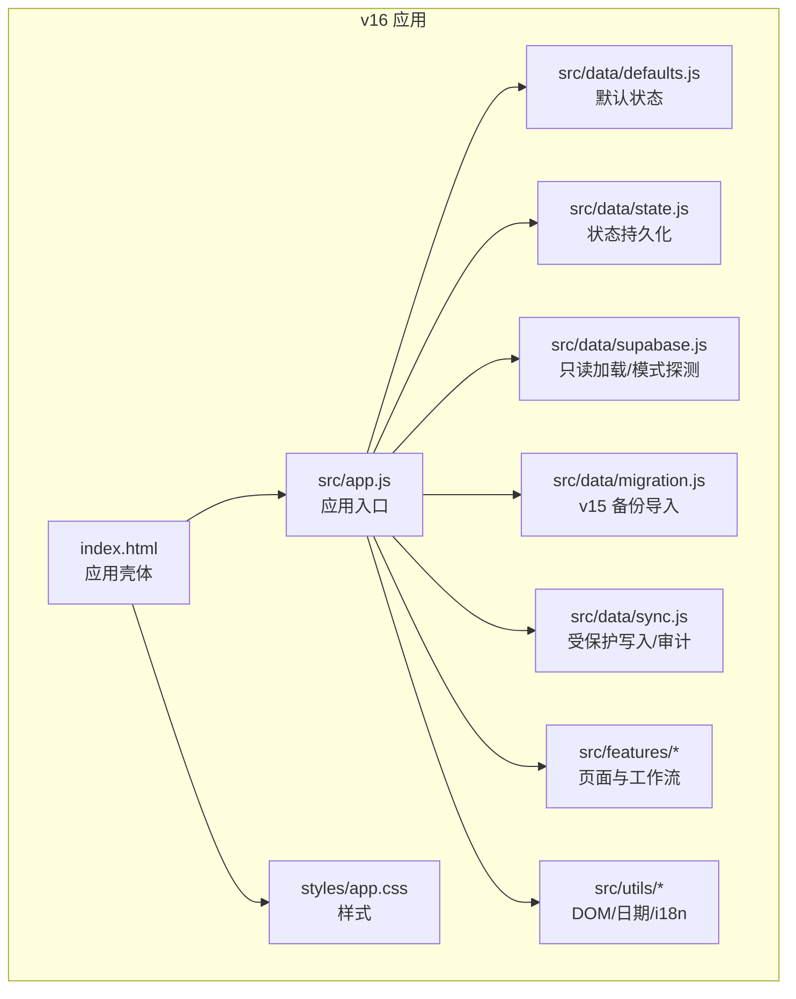
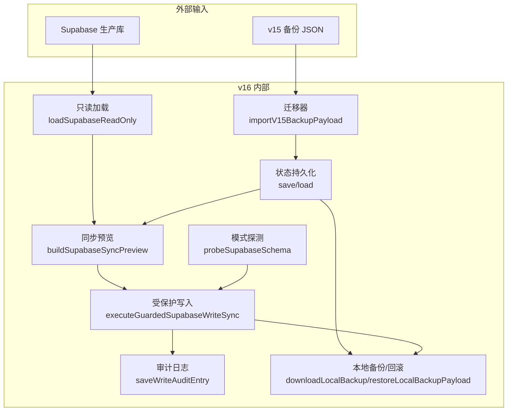
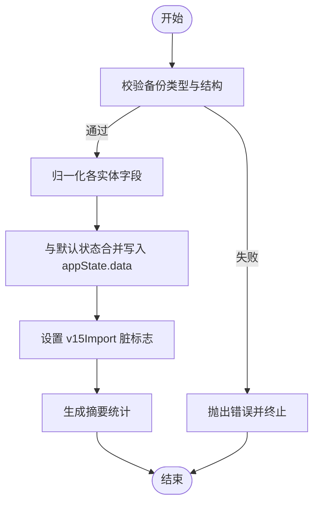
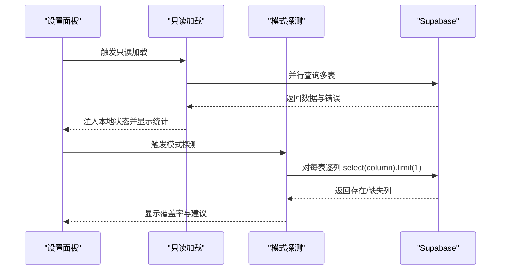
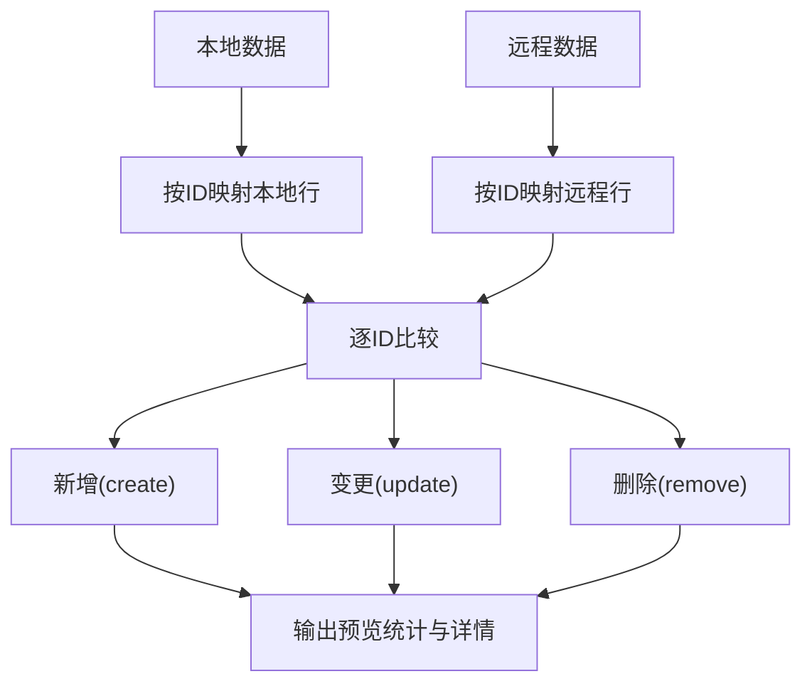
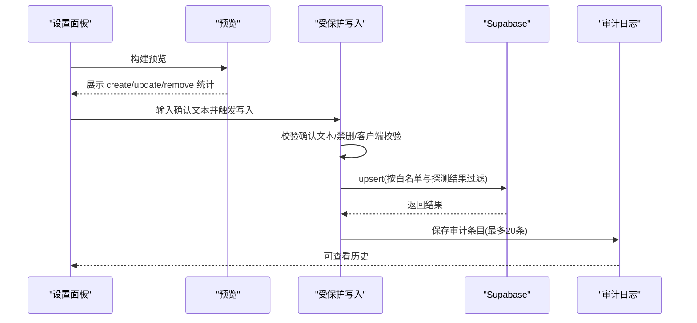
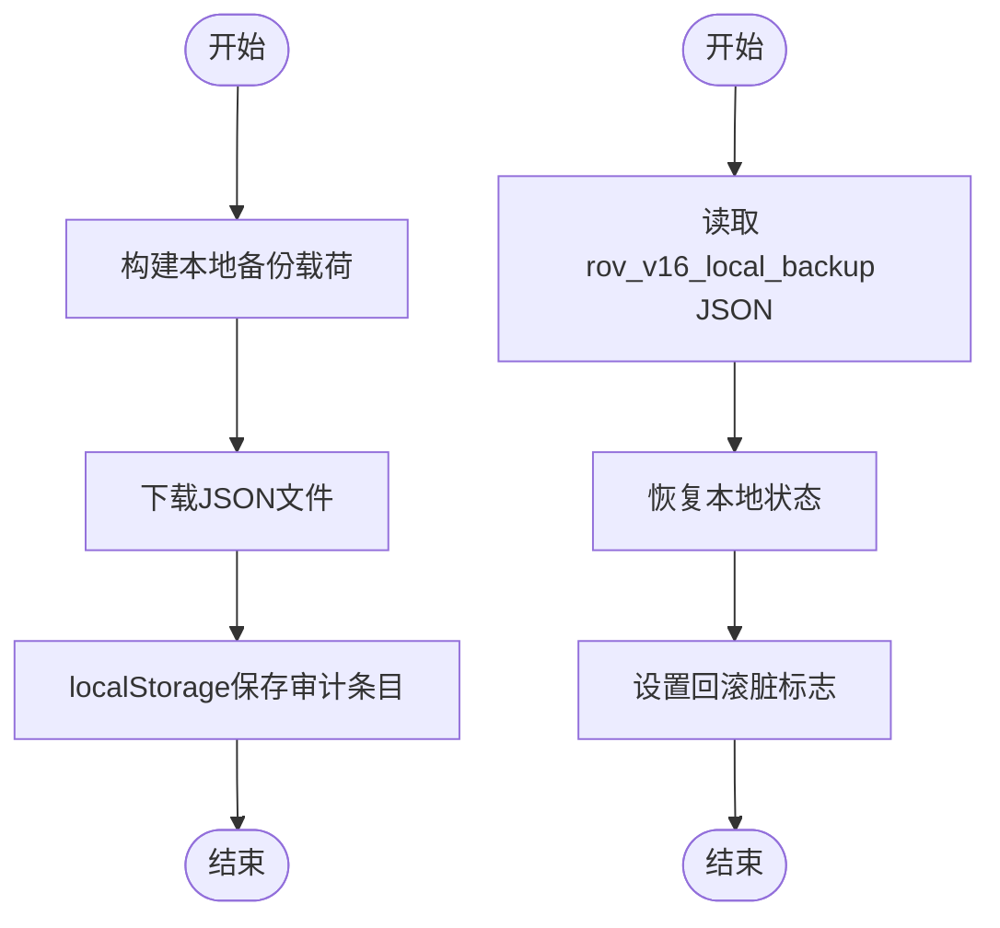
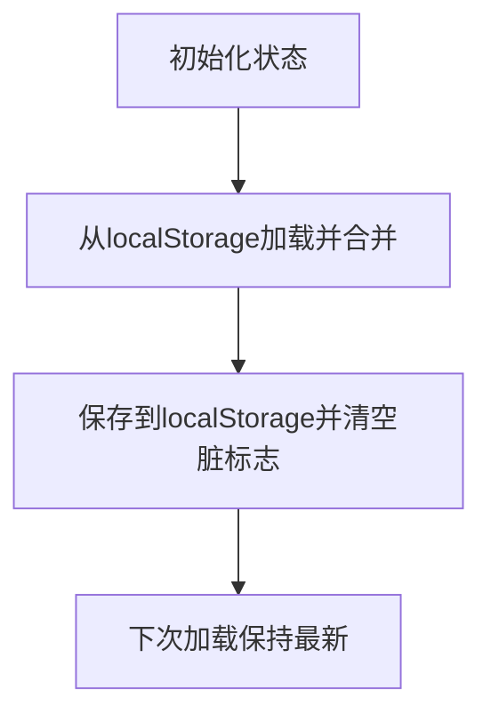
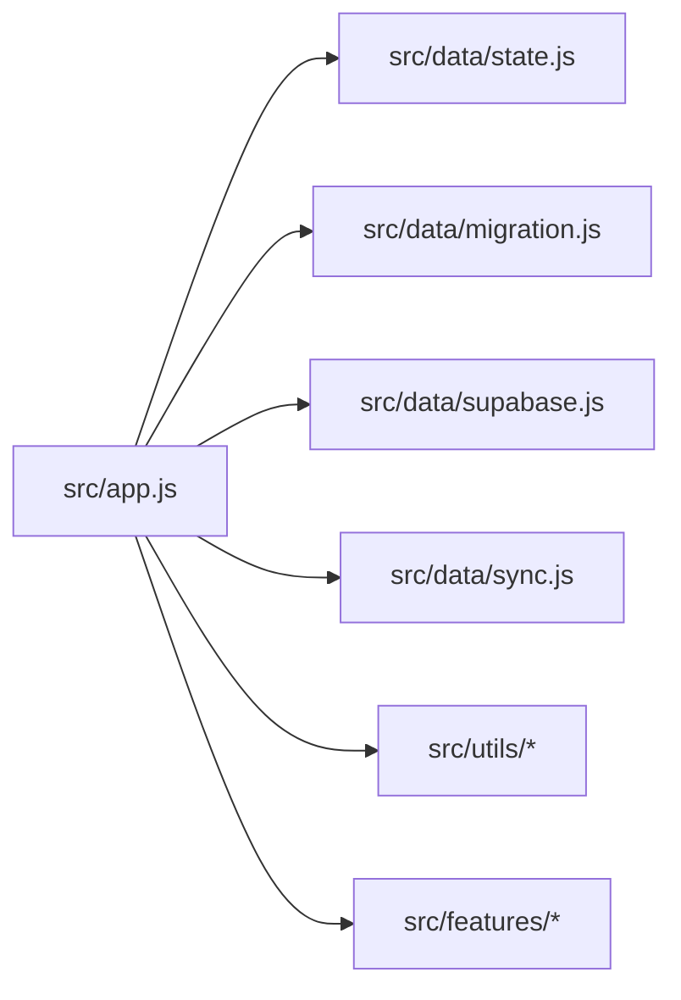
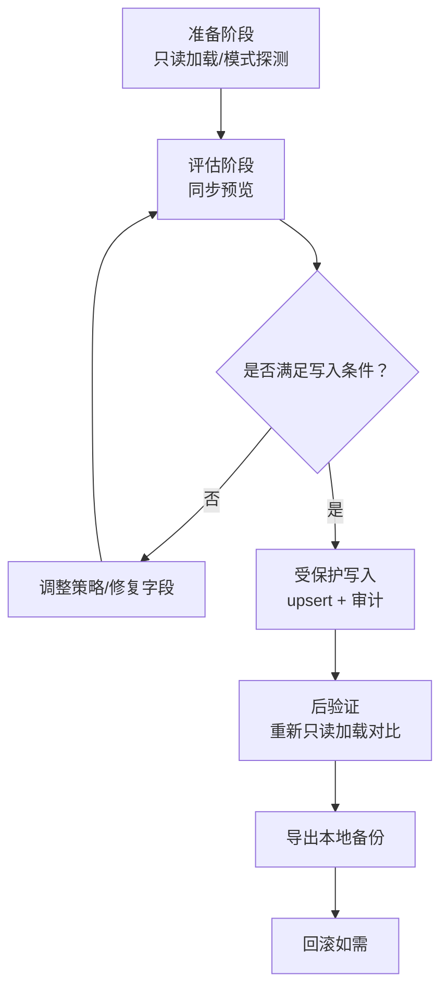

# 数据迁移

<cite>
**本文引用的文件**
- [迁移清单](file://v16/MIGRATION_MANIFEST.md)
- [项目说明](file://v16/README.md)
- [应用入口与模块组织](file://v16/src/app.js)
- [默认状态与种子数据](file://v16/src/data/defaults.js)
- [应用状态持久化](file://v16/src/data/state.js)
- [Supabase 只读加载与模式探测](file://v16/src/data/supabase.js)
- [迁移与同步核心逻辑](file://v16/src/data/migration.js)
- [受保护写入与审计日志](file://v16/src/data/sync.js)
- [本地备份与回滚](file://v16/src/data/sync.js)
- [通用工具（DOM/日期）](file://v16/src/utils/dom.js)
- [国际化字符串](file://v16/src/utils/i18n.js)
- [零依赖冒烟测试脚本](file://v16/smoke-v16.mjs)
- [服务器模块图冒烟脚本](file://v16/smoke-server.mjs)
</cite>

## 目录
1. [简介](#简介)
2. [项目结构](#项目结构)
3. [核心组件](#核心组件)
4. [架构总览](#架构总览)
5. [详细组件分析](#详细组件分析)
6. [依赖关系分析](#依赖关系分析)
7. [性能考量](#性能考量)
8. [故障排查指南](#故障排查指南)
9. [结论](#结论)
10. [附录](#附录)

## 简介
本文件面向 ROV 任务管理 v16 的数据迁移系统，系统性阐述版本升级时的数据迁移策略、迁移脚本执行与回滚机制；详解迁移清单管理、版本兼容性检查与数据转换规则；覆盖迁移状态追踪、进度报告与错误处理；解释数据备份策略、迁移验证与完整性检查；并总结迁移最佳实践、性能考虑与风险控制。文末提供迁移流程图与实际迁移示例，帮助管理员理解并安全执行数据升级。

## 项目结构
v16 将 v15 单文件产物拆分为模块化结构，形成“本地优先”的单页应用，保留 v15 作为生产回退。迁移相关的关键目录与文件如下：
- v16/
  - src/data/：默认状态、状态持久化、Supabase 只读加载、迁移与受保护写入
  - src/features/：页面与工作流模块（任务、准备、竞赛、设置、健康）
  - src/utils/：通用工具（DOM、日期、国际化）
  - styles/：样式拆分
  - README.md、MIGRATION_MANIFEST.md：迁移目标、步骤与冒烟清单
  - smoke-v16.mjs、smoke-server.mjs：零依赖与服务器端冒烟测试

图表来源
- [应用入口与模块组织](file://v16/src/app.js)
- [默认状态与种子数据](file://v16/src/data/defaults.js)
- [应用状态持久化](file://v16/src/data/state.js)
- [Supabase 只读加载与模式探测](file://v16/src/data/supabase.js)
- [迁移与同步核心逻辑](file://v16/src/data/migration.js)
- [受保护写入与审计日志](file://v16/src/data/sync.js)

章节来源
- [项目说明](file://v16/README.md)
- [迁移清单](file://v16/MIGRATION_MANIFEST.md)

## 核心组件
- v15 备份导入器：将 v15 导出的系统备份 JSON 转换为 v16 标准格式，写入本地状态并标记导入脏标志。
- Supabase 只读加载：并行拉取多表数据，标准化后注入本地状态，不进行任何写入。
- 模式探测：通过 select(column).limit(1) 探测数据库现有列，生成覆盖率信息，用于后续写入前字段过滤。
- 同步预览：对比本地状态与只读 DB 加载结果，统计 create/update/remove 数量，支持详情视图。
- 受保护写入：仅允许 create/update，禁用删除；基于白名单与模式探测结果过滤字段；执行 upsert 并记录审计日志。
- 本地备份与回滚：导出当前 v16 本地状态为 rov_v16_local_backup JSON，支持从该备份恢复本地状态。
- 状态持久化：以 localStorage 保存应用状态，含时间戳与脏标志，确保迁移后可追踪。

章节来源
- [迁移与同步核心逻辑](file://v16/src/data/migration.js)
- [Supabase 只读加载与模式探测](file://v16/src/data/supabase.js)
- [受保护写入与审计日志](file://v16/src/data/sync.js)
- [应用状态持久化](file://v16/src/data/state.js)

## 架构总览
下图展示 v16 迁移与同步的整体交互：从 v15 备份导入到 Supabase 只读加载，再到模式探测、同步预览、受保护写入与审计日志，最后提供本地备份与回滚能力。

图表来源
- [迁移与同步核心逻辑](file://v16/src/data/migration.js)
- [Supabase 只读加载与模式探测](file://v16/src/data/supabase.js)
- [受保护写入与审计日志](file://v16/src/data/sync.js)
- [应用状态持久化](file://v16/src/data/state.js)

## 详细组件分析

### 组件一：v15 备份导入与数据转换
- 兼容性检查：校验备份类型与结构，拒绝非 v15 备份。
- 字段归一化：将 v15 不同键名映射到 v16 标准字段（如任务、成员、检查项、装备、运行记录等），缺失值使用默认或占位符。
- 数据合并：将 v15 归一化数据与默认状态合并，写入 appState.data，并设置 v15Import 脏标志。
- 摘要统计：统计各类实体数量与赛季、导出时间等元数据。

图表来源
- [迁移与同步核心逻辑](file://v16/src/data/migration.js)

章节来源
- [迁移与同步核心逻辑](file://v16/src/data/migration.js)
- [默认状态与种子数据](file://v16/src/data/defaults.js)

### 组件二：Supabase 只读加载与模式探测
- 只读加载：并行查询多张表，按需排序，返回每表计数与错误信息，并将数据标准化后注入本地状态。
- 模式探测：对候选列逐列探测，返回存在/缺失列与覆盖率，供写入前字段过滤使用。

图表来源
- [Supabase 只读加载与模式探测](file://v16/src/data/supabase.js)

章节来源
- [Supabase 只读加载与模式探测](file://v16/src/data/supabase.js)

### 组件三：同步预览与差异计算
- 差异计算：基于 ID 建立映射，比较本地与远程行，区分 create/update/remove。
- 预览构建：汇总每表差异数量与详情，支持干跑模式，不产生副作用。

图表来源
- [受保护写入与审计日志](file://v16/src/data/sync.js)

章节来源
- [受保护写入与审计日志](file://v16/src/data/sync.js)

### 组件四：受保护写入与审计日志
- 安全门禁：要求用户输入确认文本才允许写入；显式禁止删除；仅允许白名单表。
- 字段过滤：结合静态白名单与模式探测结果，过滤掉不存在的字段。
- 执行与记录：对每表 upsert，记录写入数量、跳过的删除、被丢弃字段与错误信息；生成审计条目并保存最近 20 条。

图表来源
- [受保护写入与审计日志](file://v16/src/data/sync.js)

章节来源
- [受保护写入与审计日志](file://v16/src/data/sync.js)

### 组件五：本地备份与回滚
- 备份导出：将当前 appState 序列化为 rov_v16_local_backup JSON，包含版本、导出时间、赛季与数据主体。
- 回滚恢复：从 rov_v16_local_backup JSON 恢复本地状态，设置回滚脏标志，不涉及数据库写入。

图表来源
- [本地备份与回滚](file://v16/src/data/sync.js)

章节来源
- [本地备份与回滚](file://v16/src/data/sync.js)

### 组件六：状态持久化与脏标志
- 初始化：从默认状态克隆初始值，设置当前页面、模式、赛季与空脏标志。
- 加载：从 localStorage 解析并合并，保留 masterData 的增量更新。
- 保存：序列化并写入 localStorage，同时清空脏标志，记录保存时间戳。

图表来源
- [应用状态持久化](file://v16/src/data/state.js)

章节来源
- [应用状态持久化](file://v16/src/data/state.js)
- [默认状态与种子数据](file://v16/src/data/defaults.js)

## 依赖关系分析
- 模块耦合：应用入口集中导入数据层（状态、Supabase、迁移、同步），功能模块通过设置面板调用这些能力。
- 外部依赖：Supabase 客户端库；浏览器 localStorage；DOM 工具与日期工具。
- 关键接口契约：
  - 迁移器：要求输入为 v15 类型备份，输出为摘要统计。
  - 只读加载：要求返回标准化数据与每表统计。
  - 模式探测：要求返回每表存在/缺失列与覆盖率。
  - 受保护写入：要求白名单表、确认文本、禁删策略与审计日志。

图表来源
- [应用入口与模块组织](file://v16/src/app.js)
- [应用状态持久化](file://v16/src/data/state.js)
- [迁移与同步核心逻辑](file://v16/src/data/migration.js)
- [Supabase 只读加载与模式探测](file://v16/src/data/supabase.js)
- [受保护写入与审计日志](file://v16/src/data/sync.js)

章节来源
- [应用入口与模块组织](file://v16/src/app.js)

## 性能考量
- 并行查询：只读加载对多表采用 Promise.allSettled 并行查询，减少总等待时间。
- 字段过滤：在写入前根据模式探测结果过滤字段，避免无效列导致的写入失败与重试。
- 本地持久化：localStorage 读写为 O(1) 级别，适合频繁保存与恢复。
- 审计日志截断：仅保留最近 20 条写入记录，控制存储占用。

## 故障排查指南
- v15 备份导入失败
  - 现象：抛出“不是 v15 备份”类错误。
  - 排查：确认备份文件类型与结构；检查摘要统计是否为空。
  - 参考路径：[迁移与同步核心逻辑](file://v16/src/data/migration.js)
- 只读加载异常
  - 现象：某表计数为 0 或出现错误信息。
  - 排查：检查 Supabase 凭据与网络连通；查看每表错误消息。
  - 参考路径：[Supabase 只读加载与模式探测](file://v16/src/data/supabase.js)
- 模式探测不完整
  - 现象：覆盖率低或缺失列较多。
  - 排查：确认数据库列是否存在；必要时调整候选列集合。
  - 参考路径：[Supabase 只读加载与模式探测](file://v16/src/data/supabase.js)
- 受保护写入被拒绝
  - 现象：提示需要输入确认文本、或字段不在白名单。
  - 排查：核对确认文本；根据模式探测结果修正字段；检查白名单表。
  - 参考路径：[受保护写入与审计日志](file://v16/src/data/sync.js)
- 写入审计日志为空
  - 现象：未看到审计条目。
  - 排查：确认已执行写入；检查 localStorage 键；查看最近条目是否被截断。
  - 参考路径：[受保护写入与审计日志](file://v16/src/data/sync.js)
- 回滚无效
  - 现象：恢复后状态未改变。
  - 排查：确认导入的是 rov_v16_local_backup JSON；检查回滚脏标志。
  - 参考路径：[本地备份与回滚](file://v16/src/data/sync.js)

章节来源
- [迁移与同步核心逻辑](file://v16/src/data/migration.js)
- [Supabase 只读加载与模式探测](file://v16/src/data/supabase.js)
- [受保护写入与审计日志](file://v16/src/data/sync.js)
- [本地备份与回滚](file://v16/src/data/sync.js)

## 结论
v16 的数据迁移体系以“本地优先、只读先行、受保护写入、可回滚”为核心原则，通过 v15 备份导入、Supabase 只读加载与模式探测、同步预览与受保护写入、以及本地备份与审计日志，实现了高安全性与可追溯性的升级路径。配合迁移清单与冒烟测试，管理员可以稳健地完成版本升级与数据迁移。

## 附录

### 迁移清单管理与版本兼容性检查
- 迁移清单：明确 v15 到 v16 的模块拆分与提取状态，提供阶段性验收点与冒烟清单。
- 版本兼容性：迁移器对备份类型进行严格校验；模式探测为写入提供 schema 安全网；白名单限制写入范围。

章节来源
- [迁移清单](file://v16/MIGRATION_MANIFEST.md)
- [迁移与同步核心逻辑](file://v16/src/data/migration.js)
- [Supabase 只读加载与模式探测](file://v16/src/data/supabase.js)
- [受保护写入与审计日志](file://v16/src/data/sync.js)

### 数据转换规则与字段映射
- 任务：统一 id/name/owner/due/priority/status/category/blocked/notes。
- 成员：统一 id/name/role/group。
- 检查项：统一 id/item_id/label/name/done/order_index。
- 装备：统一 id/name/category/qty/packed。
- 运行记录：统一 id/ts/elapsedSeconds/score/note。
- 备注与策略：字符串化或数组化处理。

章节来源
- [迁移与同步核心逻辑](file://v16/src/data/migration.js)
- [Supabase 只读加载与模式探测](file://v16/src/data/supabase.js)

### 迁移状态追踪、进度报告与错误处理
- 状态追踪：脏标志（v15Import/supabaseReadOnly/rollback）用于标识变更来源。
- 进度报告：预览统计（create/update/remove）、覆盖率、写入摘要与审计日志。
- 错误处理：只读加载使用 allSettled 收集每表错误；写入前进行字段合法性校验；失败时记录错误信息。

章节来源
- [应用状态持久化](file://v16/src/data/state.js)
- [受保护写入与审计日志](file://v16/src/data/sync.js)
- [Supabase 只读加载与模式探测](file://v16/src/data/supabase.js)

### 数据备份策略、迁移验证与完整性检查
- 备份策略：本地备份 JSON 包含版本、导出时间、赛季与数据主体；回滚仅作用于本地状态。
- 迁移验证：冒烟测试脚本验证模块加载、动作存在性与安全门禁；服务器端脚本验证模块图。
- 完整性检查：写入前后对比（预览与后验证）、字段过滤与审计日志留存。

章节来源
- [本地备份与回滚](file://v16/src/data/sync.js)
- [零依赖冒烟测试脚本](file://v16/smoke-v16.mjs)
- [服务器模块图冒烟脚本](file://v16/smoke-server.mjs)

### 迁移最佳实践与风险控制
- 最佳实践
  - 升级前先执行只读加载与模式探测，确认数据库列现状。
  - 使用同步预览评估差异，确认 create/update/remove 数量与字段。
  - 执行受保护写入前，确保确认文本正确、白名单与探测结果一致。
  - 每次写入后进行后验证，并检查审计日志。
  - 在写入前导出本地备份，以便回滚。
- 风险控制
  - 禁止删除：写入路径中显式禁用删除。
  - 白名单与字段过滤：仅写入允许字段，避免未知列引发异常。
  - 本地回滚：不依赖数据库，快速恢复到上一个稳定状态。

章节来源
- [受保护写入与审计日志](file://v16/src/data/sync.js)
- [本地备份与回滚](file://v16/src/data/sync.js)

### 迁移流程图与实际迁移示例
- 迁移流程图（概念示意）

- 实际迁移示例（步骤化）
  1) 在设置面板执行“Supabase 只读加载”，确认各表计数与错误信息。
  2) 执行“Supabase Schema Probe”，记录覆盖率与缺失列。
  3) 执行“Supabase Sync Preview”，核对 create/update/remove 统计与详情。
  4) 在执行“Guarded Write Sync”前，导出“rov_v16_local_backup” JSON。
  5) 输入确认文本，执行受保护写入，观察写入摘要与审计日志。
  6) 进行后验证：再次只读加载并对比差异。
  7) 如遇问题，使用本地备份回滚至上一个稳定状态。

章节来源
- [Supabase 只读加载与模式探测](file://v16/src/data/supabase.js)
- [受保护写入与审计日志](file://v16/src/data/sync.js)
- [本地备份与回滚](file://v16/src/data/sync.js)