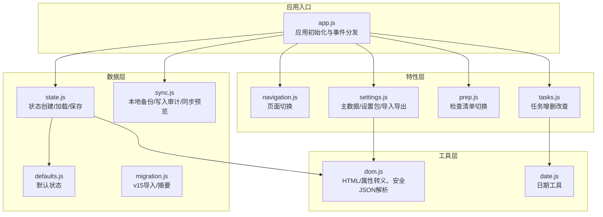
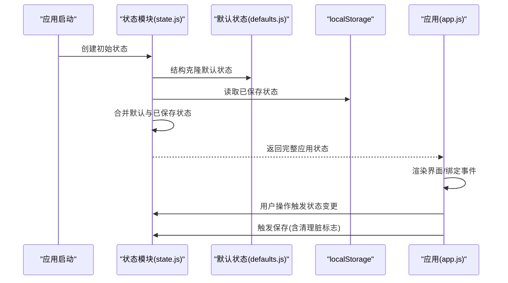
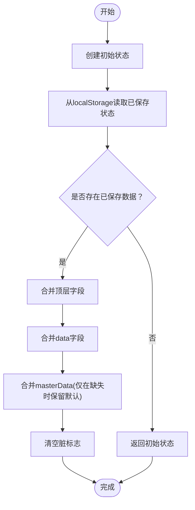
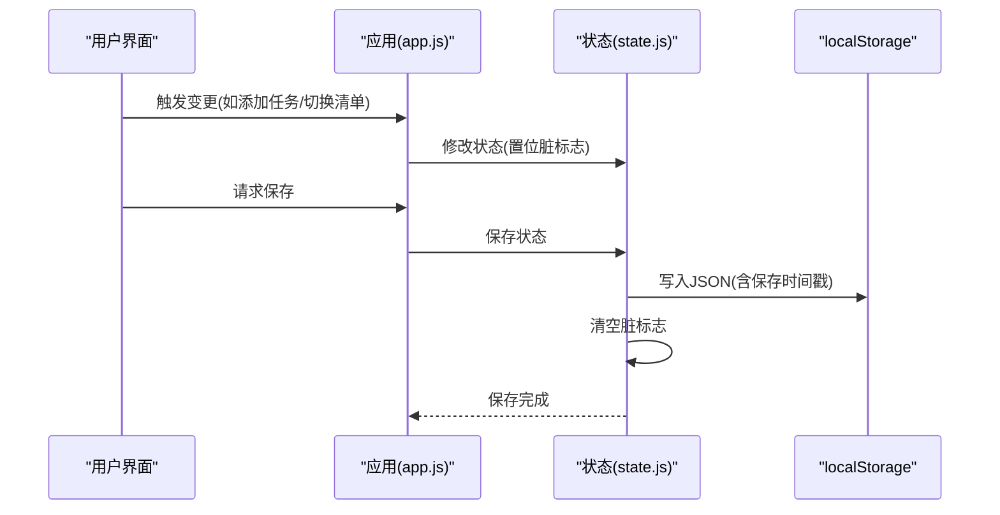
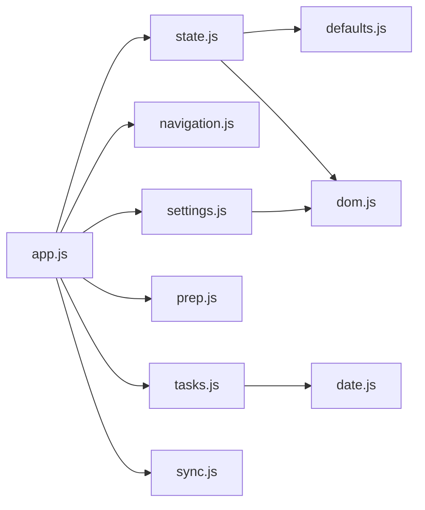

# 状态管理

<cite>
**本文引用的文件**
- [state.js](file://v16/src/data/state.js)
- [defaults.js](file://v16/src/data/defaults.js)
- [migration.js](file://v16/src/data/migration.js)
- [app.js](file://v16/src/app.js)
- [sync.js](file://v16/src/data/sync.js)
- [settings.js](file://v16/src/features/settings.js)
- [tasks.js](file://v16/src/features/tasks.js)
- [prep.js](file://v16/src/features/prep.js)
- [navigation.js](file://v16/src/features/navigation.js)
- [dom.js](file://v16/src/utils/dom.js)
- [date.js](file://v16/src/utils/date.js)
</cite>

## 目录
1. [简介](#简介)
2. [项目结构](#项目结构)
3. [核心组件](#核心组件)
4. [架构总览](#架构总览)
5. [详细组件分析](#详细组件分析)
6. [依赖关系分析](#依赖关系分析)
7. [性能考量](#性能考量)
8. [故障排查指南](#故障排查指南)
9. [结论](#结论)
10. [附录](#附录)

## 简介
本文件面向ROV任务管理v16，系统性阐述其“状态管理系统”。内容涵盖：
- 应用状态结构与初始状态创建
- 状态持久化与加载机制
- 状态键值对、页面状态管理与脏标志系统
- 状态加载流程、保存机制与数据合并策略
- 状态存储键名、序列化与反序列化过程
- 状态验证规则与默认值处理
- 状态操作最佳实践与性能优化建议
- 实际代码示例路径（以源码路径代替具体代码）

## 项目结构
v16采用“数据层 + 特性层 + 工具层”的分层组织：
- 数据层：状态定义与持久化、迁移与同步
- 特性层：页面渲染与交互逻辑（任务、准备、设置等）
- 工具层：DOM转义、日期计算、安全JSON解析等

图表来源
- [app.js:38-187](file://v16/src/app.js#L38-L187)
- [state.js:6-44](file://v16/src/data/state.js#L6-L44)
- [defaults.js:1-46](file://v16/src/data/defaults.js#L1-L46)
- [migration.js:60-99](file://v16/src/data/migration.js#L60-L99)
- [sync.js:150-219](file://v16/src/data/sync.js#L150-L219)
- [navigation.js:3-19](file://v16/src/features/navigation.js#L3-L19)
- [tasks.js:19-37](file://v16/src/features/tasks.js#L19-L37)
- [prep.js:5-11](file://v16/src/features/prep.js#L5-L11)
- [settings.js:34-52](file://v16/src/features/settings.js#L34-L52)
- [dom.js:14-20](file://v16/src/utils/dom.js#L14-L20)
- [date.js:21-44](file://v16/src/utils/date.js#L21-L44)

章节来源
- [app.js:1-402](file://v16/src/app.js#L1-L402)
- [state.js:1-45](file://v16/src/data/state.js#L1-L45)
- [defaults.js:1-46](file://v16/src/data/defaults.js#L1-L46)

## 核心组件
- 应用状态对象：包含数据区、页面与模式信息、当前赛季、脏标志集合
- 默认状态：定义所有业务实体的初始形态
- 持久化键：应用状态键、主数据键前缀
- 脏标志：按实体类型标记变更，驱动保存时机
- 安全解析：统一的JSON解析容错

章节来源
- [state.js:4-14](file://v16/src/data/state.js#L4-L14)
- [defaults.js:1-46](file://v16/src/data/defaults.js#L1-L46)
- [settings.js:4-52](file://v16/src/features/settings.js#L4-L52)
- [dom.js:14-20](file://v16/src/utils/dom.js#L14-L20)

## 架构总览
状态管理贯穿应用启动、用户交互、特性渲染与持久化保存的全流程。

图表来源
- [state.js:6-33](file://v16/src/data/state.js#L6-L33)
- [defaults.js:1-46](file://v16/src/data/defaults.js#L1-L46)
- [app.js:38-64](file://v16/src/app.js#L38-L64)

## 详细组件分析

### 应用状态结构与初始状态创建
- 状态键值对
  - data：业务数据区，包含任务、成员、检查清单、任务类型、装备等
  - currentPage/currentMode：页面与模式标识
  - currentSeason：当前赛季
  - dirtyFlags：脏标志集合，按实体类型标记变更
- 初始状态创建
  - 使用结构化克隆复制默认状态
  - 初始化页面与模式、赛季
  - 初始化空脏标志集合

章节来源
- [state.js:6-14](file://v16/src/data/state.js#L6-L14)
- [defaults.js:1-46](file://v16/src/data/defaults.js#L1-L46)

### 状态加载流程与数据合并策略
- 加载流程
  - 先创建初始状态
  - 从localStorage读取已保存状态
  - 若无已保存数据，直接返回初始状态
  - 若存在已保存数据，则进行逐层合并
    - 顶层字段：覆盖合并（data、currentPage、currentMode、currentSeason）
    - data.masterData：仅在缺失时保留默认值，避免覆盖用户自定义主数据
    - data.data：深度合并，优先使用已保存值，否则回退到默认值
  - 合并后清空脏标志，确保新加载状态不误判为“已保存”
- 数据合并策略
  - 顶层字段：已保存优先
  - data.masterData：默认主数据与已保存主数据并集，避免丢失用户自定义项
  - data.data：数组与对象逐项合并，保持默认值兜底

图表来源
- [state.js:16-33](file://v16/src/data/state.js#L16-L33)
- [defaults.js:39-44](file://v16/src/data/defaults.js#L39-L44)

章节来源
- [state.js:16-33](file://v16/src/data/state.js#L16-L33)

### 状态保存机制与脏标志系统
- 保存机制
  - 将当前状态序列化为JSON并写入localStorage
  - 写入时间戳，便于审计与调试
  - 保存完成后清空脏标志，表示本次保存已生效
- 脏标志系统
  - 每个业务实体维护一个布尔或布尔型标记
  - 变更发生时置位，保存成功后清零
  - 主要用于区分哪些部分需要持久化（如主数据独立保存）
- 典型使用点
  - 任务增删改：tasks实体置位
  - 检查清单切换：对应清单实体置位
  - 主数据变更：masterData置位
  - 页面切换：保存当前页面状态

图表来源
- [app.js:60-64](file://v16/src/app.js#L60-L64)
- [state.js:35-44](file://v16/src/data/state.js#L35-L44)
- [tasks.js:19-37](file://v16/src/features/tasks.js#L19-L37)
- [prep.js:5-11](file://v16/src/features/prep.js#L5-L11)
- [settings.js:47-52](file://v16/src/features/settings.js#L47-L52)

章节来源
- [app.js:60-64](file://v16/src/app.js#L60-L64)
- [tasks.js:19-37](file://v16/src/features/tasks.js#L19-L37)
- [prep.js:5-11](file://v16/src/features/prep.js#L5-L11)
- [settings.js:47-52](file://v16/src/features/settings.js#L47-L52)

### 状态存储键名、序列化与反序列化
- 应用状态键名
  - APP_STATE_STORAGE_KEY：应用状态主键
- 主数据键名
  - MASTER_DATA_STORAGE_PREFIX + 当前赛季：主数据按赛季隔离存储
- 序列化与反序列化
  - 保存：JSON.stringify(state)
  - 加载：safeJsonParse(storage.getItem(key), null) 容错解析
  - 主数据：同上，但按赛季键读取/写入
- 安全解析
  - safeJsonParse提供异常捕获与回退值，避免解析失败导致崩溃

章节来源
- [state.js:4](file://v16/src/data/state.js#L4)
- [settings.js:30-32](file://v16/src/features/settings.js#L30-L32)
- [settings.js:34-52](file://v16/src/features/settings.js#L34-L52)
- [dom.js:14-20](file://v16/src/utils/dom.js#L14-L20)

### 状态验证规则与默认值处理
- 默认值处理
  - 默认状态提供完整骨架，确保首次运行与字段缺失时有合理回退
  - masterData默认值作为兜底，避免用户自定义被覆盖
- 验证规则
  - v15导入：规范化字段映射与类型转换，保证兼容性
  - 写入同步：基于白名单字段与探测到的数据库字段进行校验，过滤不可写字段
- 迁移摘要
  - 导入v15备份时生成统计摘要，便于用户确认数据规模

章节来源
- [defaults.js:1-46](file://v16/src/data/defaults.js#L1-L46)
- [migration.js:9-58](file://v16/src/data/migration.js#L9-L58)
- [sync.js:120-148](file://v16/src/data/sync.js#L120-L148)
- [migration.js:60-73](file://v16/src/data/migration.js#L60-L73)

### 状态操作最佳实践
- 变更即置位：任何状态修改后立即设置对应脏标志，确保保存时不会遗漏
- 批量保存：聚合多次变更后一次性保存，减少localStorage写入次数
- 分离持久化：主数据独立保存，避免与应用状态混杂
- 事件驱动保存：在关键交互（页面切换、任务提交、清单切换）后触发保存
- 键名规范：应用状态与主数据使用明确的键名前缀与命名空间

章节来源
- [tasks.js:19-37](file://v16/src/features/tasks.js#L19-L37)
- [prep.js:5-11](file://v16/src/features/prep.js#L5-L11)
- [settings.js:47-52](file://v16/src/features/settings.js#L47-L52)
- [app.js:60-64](file://v16/src/app.js#L60-L64)

### 性能优化建议
- 减少深层合并开销：尽量只在必要时进行深度合并；可考虑按需合并或分块更新
- 控制脏标志数量：仅对真正需要持久化的实体设置脏标志，避免冗余保存
- 延迟保存：在高频变更场景下使用节流/防抖，降低localStorage写入频率
- 选择性序列化：仅序列化必要字段，剔除临时或可重算的数据
- 主数据缓存：主数据按赛季隔离，避免频繁读写大对象

章节来源
- [state.js:23-31](file://v16/src/data/state.js#L23-L31)
- [settings.js:34-52](file://v16/src/features/settings.js#L34-L52)

## 依赖关系分析
状态管理模块之间的依赖关系如下：

图表来源
- [app.js:1-14](file://v16/src/app.js#L1-L14)
- [state.js:1-2](file://v16/src/data/state.js#L1-L2)
- [navigation.js:1-2](file://v16/src/features/navigation.js#L1-L2)
- [tasks.js:1-4](file://v16/src/features/tasks.js#L1-L4)
- [prep.js:1-3](file://v16/src/features/prep.js#L1-L3)
- [settings.js:1-2](file://v16/src/features/settings.js#L1-L2)
- [sync.js:1-17](file://v16/src/data/sync.js#L1-L17)
- [dom.js:1-3](file://v16/src/utils/dom.js#L1-L3)
- [date.js:1-55](file://v16/src/utils/date.js#L1-L55)

章节来源
- [app.js:1-14](file://v16/src/app.js#L1-L14)

## 性能考量
- localStorage写入成本：频繁写入会阻塞UI线程，建议批量保存与去抖动
- JSON序列化/反序列化：大对象序列化耗时较长，应避免不必要的深拷贝
- 合并策略：深度合并可能带来额外开销，建议在必要时才进行
- 脏标志粒度：精细化控制脏标志范围，减少无效保存

## 故障排查指南
- 解析失败
  - 现象：加载状态时报错或数据丢失
  - 排查：检查localStorage中的键值是否为合法JSON；确认safeJsonParse是否正确回退
  - 参考：[dom.js:14-20](file://v16/src/utils/dom.js#L14-L20)
- 数据合并异常
  - 现象：页面显示异常或字段缺失
  - 排查：确认已保存状态与默认状态字段是否一致；检查masterData合并逻辑
  - 参考：[state.js:16-33](file://v16/src/data/state.js#L16-L33)
- 保存未生效
  - 现象：刷新后状态未持久化
  - 排查：确认保存调用是否执行；检查脏标志是否被清空
  - 参考：[app.js:60-64](file://v16/src/app.js#L60-L64), [state.js:35-44](file://v16/src/data/state.js#L35-L44)
- v15导入失败
  - 现象：导入后数据不完整或报错
  - 排查：确认备份文件类型与结构；检查规范化函数映射
  - 参考：[migration.js:75-99](file://v16/src/data/migration.js#L75-L99)

章节来源
- [dom.js:14-20](file://v16/src/utils/dom.js#L14-L20)
- [state.js:16-33](file://v16/src/data/state.js#L16-L33)
- [app.js:60-64](file://v16/src/app.js#L60-L64)
- [migration.js:75-99](file://v16/src/data/migration.js#L75-L99)

## 结论
v16的状态管理系统通过“默认状态 + 安全加载 + 深度合并 + 脏标志 + 分离持久化”的设计，在保证兼容性与稳定性的同时，提供了清晰的扩展点。遵循本文的最佳实践与性能建议，可在复杂业务场景下维持良好的用户体验与开发效率。

## 附录
- 实际代码示例路径（以源码路径代替具体代码）
  - 初始状态创建：[state.js:6-14](file://v16/src/data/state.js#L6-L14)
  - 状态加载与合并：[state.js:16-33](file://v16/src/data/state.js#L16-L33)
  - 状态保存与脏标志清空：[state.js:35-44](file://v16/src/data/state.js#L35-L44)
  - 主数据加载与保存：[settings.js:34-52](file://v16/src/features/settings.js#L34-L52)
  - 任务增删改与脏标志：[tasks.js:19-37](file://v16/src/features/tasks.js#L19-L37)
  - 检查清单切换与脏标志：[prep.js:5-11](file://v16/src/features/prep.js#L5-L11)
  - v15备份导入与摘要：[migration.js:75-99](file://v16/src/data/migration.js#L75-L99)
  - 写入同步与审计日志：[sync.js:150-219](file://v16/src/data/sync.js#L150-L219), [sync.js:300-317](file://v16/src/data/sync.js#L300-L317)