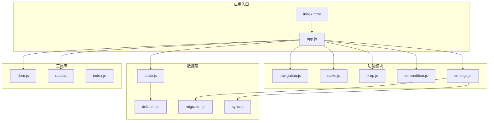
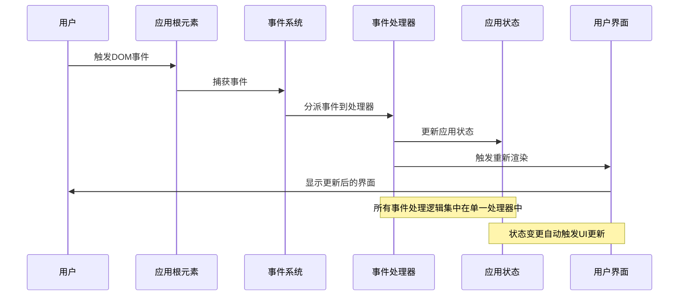
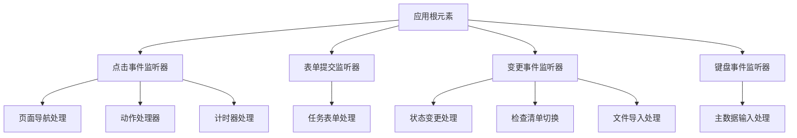
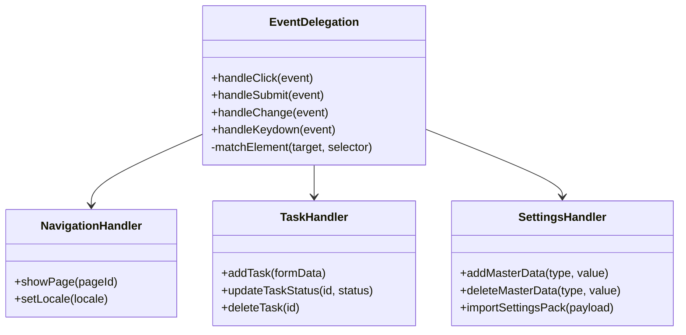
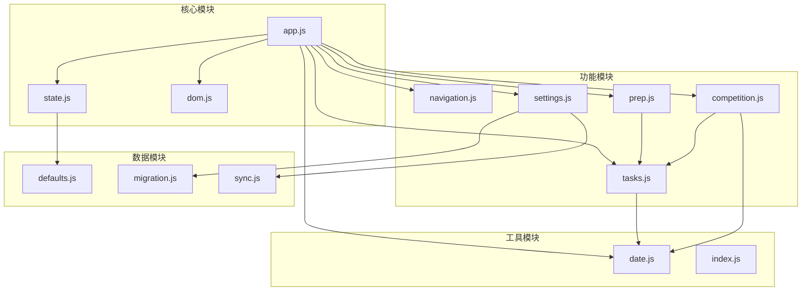
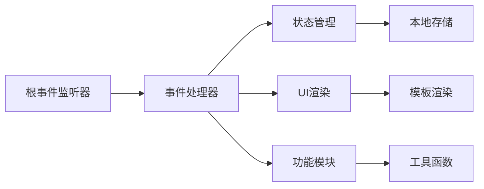

# 事件驱动架构

<cite>
**本文档引用的文件**
- [app.js](file://v16/src/app.js)
- [dom.js](file://v16/src/utils/dom.js)
- [index.html](file://v16/index.html)
- [state.js](file://v16/src/data/state.js)
- [tasks.js](file://v16/src/features/tasks.js)
- [navigation.js](file://v16/src/features/navigation.js)
- [prep.js](file://v16/src/features/prep.js)
- [competition.js](file://v16/src/features/competition.js)
- [settings.js](file://v16/src/features/settings.js)
- [date.js](file://v16/src/utils/date.js)
- [defaults.js](file://v16/src/data/defaults.js)
- [migration.js](file://v16/src/data/migration.js)
- [sync.js](file://v16/src/data/sync.js)
</cite>

## 目录
1. [简介](#简介)
2. [项目结构](#项目结构)
3. [核心组件](#核心组件)
4. [架构概览](#架构概览)
5. [详细组件分析](#详细组件分析)
6. [依赖关系分析](#依赖关系分析)
7. [性能考虑](#性能考虑)
8. [故障排除指南](#故障排除指南)
9. [结论](#结论)

## 简介

ROV任务管理v16项目采用事件驱动架构设计，通过DOM事件监听器实现用户交互与应用状态管理的解耦。该架构基于单一事件源模式，在应用根元素上集中处理所有用户交互事件，实现了松耦合、可扩展且易于测试的前端系统。

事件驱动架构的核心优势在于：
- **松耦合**：事件处理器与UI组件分离，降低组件间依赖
- **可扩展性**：新增功能只需添加新的事件处理器，无需修改现有代码
- **易于测试**：事件处理逻辑独立，便于单元测试和集成测试
- **响应式**：实时状态更新和UI同步

## 项目结构

ROV任务管理v16项目采用模块化架构，主要目录结构如下：

**图表来源**
- [index.html:1-15](file://v16/index.html#L1-L15)
- [app.js:1-50](file://v16/src/app.js#L1-L50)

**章节来源**
- [index.html:1-15](file://v16/index.html#L1-L15)
- [app.js:1-50](file://v16/src/app.js#L1-L50)

## 核心组件

### 应用主控制器

应用主控制器位于`app.js`文件中，负责：
- 初始化应用状态和数据
- 设置事件监听器
- 管理页面渲染流程
- 协调各功能模块

### 事件处理器系统

事件处理器系统采用单一事件源模式，所有用户交互事件都通过根元素的事件监听器进行统一处理。主要事件类型包括：

#### 点击事件处理器
处理导航切换、按钮操作、设置管理等交互行为

#### 表单提交处理器  
处理任务添加、设置导入等数据提交操作

#### 变更事件处理器
处理状态选择、复选框切换等状态变更操作

#### 键盘事件处理器
处理快捷键操作，如回车键添加主数据

**章节来源**
- [app.js:189-401](file://v16/src/app.js#L189-L401)

## 架构概览

ROV任务管理v16项目的事件驱动架构采用以下设计模式：

**图表来源**
- [app.js:189-401](file://v16/src/app.js#L189-L401)

### 事件委托模式

项目广泛使用事件委托模式，通过`event.target.closest()`方法实现：
- 动态元素匹配
- 性能优化
- 内存泄漏防护

### 状态管理模式

应用状态管理采用集中式设计：
- 单一状态树
- 不可变更新
- 自动持久化
- 脏标志跟踪

**章节来源**
- [app.js:38-64](file://v16/src/app.js#L38-L64)
- [state.js:16-44](file://v16/src/data/state.js#L16-L44)

## 详细组件分析

### 事件处理器架构

#### 单一事件源设计

应用采用单一事件源模式，在应用根元素上注册三个主要事件监听器：

**图表来源**
- [app.js:189-401](file://v16/src/app.js#L189-L401)

#### 事件委托实现

事件委托通过`closest()`方法实现精确的目标元素匹配：

**图表来源**
- [app.js:189-401](file://v16/src/app.js#L189-L401)

**章节来源**
- [app.js:189-401](file://v16/src/app.js#L189-L401)

### 用户交互事件处理

#### 导航事件处理

页面导航通过`data-page`属性实现：
- 动态页面切换
- 状态持久化
- UI更新

#### 表单提交处理

任务表单通过`data-task-form`标识：
- 数据验证
- 状态更新
- 实时反馈

#### 状态变更处理

状态选择和复选框切换：
- 即时状态更新
- 自动保存
- UI同步

#### 键盘输入处理

回车键快捷操作：
- 主数据快速添加
- 表单提交
- 用户体验优化

**章节来源**
- [app.js:189-401](file://v16/src/app.js#L189-L401)
- [tasks.js:5-17](file://v16/src/features/tasks.js#L5-L17)

### 自定义事件系统

虽然项目未显式创建自定义事件，但通过以下机制实现跨模块通信：

#### 状态更新通知

应用状态变更通过以下方式通知：
- 脏标志系统
- 自动持久化
- 统一渲染触发

#### 模块间通信

各功能模块通过共享状态对象进行通信：
- 集中式状态管理
- 解耦的模块设计
- 灵活的状态更新

**章节来源**
- [state.js:16-44](file://v16/src/data/state.js#L16-L44)
- [settings.js:1-50](file://v16/src/features/settings.js#L1-L50)

### 错误处理策略

事件处理器采用渐进式错误处理：
- 输入验证
- 异步操作错误捕获
- 用户友好的错误提示
- 状态回滚机制

**章节来源**
- [app.js:209-211](file://v16/src/app.js#L209-L211)
- [app.js:292-297](file://v16/src/app.js#L292-L297)

## 依赖关系分析

### 模块依赖图

**图表来源**
- [app.js:1-36](file://v16/src/app.js#L1-L36)
- [state.js:1-14](file://v16/src/data/state.js#L1-L14)

### 事件处理依赖链

事件处理器之间的依赖关系：

**图表来源**
- [app.js:189-401](file://v16/src/app.js#L189-L401)

**章节来源**
- [app.js:1-36](file://v16/src/app.js#L1-L36)
- [state.js:1-14](file://v16/src/data/state.js#L1-L14)

## 性能考虑

### 事件处理性能优化

#### 事件委托优化
- 减少事件监听器数量
- 动态元素支持
- 内存效率提升

#### 渲染优化
- 批量状态更新
- 脏标志系统
- 条件渲染

#### 内存管理
- 事件监听器清理
- 对象引用管理
- 定时器清理

### 性能监控指标

- 事件处理延迟
- 渲染帧率
- 内存使用情况
- 存储访问频率

**章节来源**
- [app.js:147-177](file://v16/src/app.js#L147-L177)
- [app.js:38-64](file://v16/src/app.js#L38-L64)

## 故障排除指南

### 常见问题诊断

#### 事件不响应
- 检查事件委托选择器
- 验证元素属性设置
- 确认事件监听器注册

#### 状态不同步
- 检查脏标志设置
- 验证状态持久化
- 确认渲染触发

#### 性能问题
- 分析事件处理时间
- 检查内存泄漏
- 优化渲染频率

### 调试技巧

#### 事件追踪
- 使用浏览器开发者工具
- 监控事件流
- 分析事件目标

#### 状态检查
- 检查应用状态
- 验证数据完整性
- 追踪状态变更历史

**章节来源**
- [app.js:209-211](file://v16/src/app.js#L209-L211)
- [app.js:292-297](file://v16/src/app.js#L292-L297)

## 结论

ROV任务管理v16项目的事件驱动架构展现了现代前端开发的最佳实践。通过单一事件源、事件委托和集中式状态管理，实现了高度解耦、可扩展且易于维护的系统架构。

### 主要优势

1. **架构清晰**：单一职责的事件处理器
2. **性能优秀**：事件委托减少内存占用
3. **易于扩展**：模块化设计支持功能扩展
4. **测试友好**：独立的业务逻辑便于测试
5. **用户体验**：即时响应和流畅交互

### 技术亮点

- **事件委托模式**：高效的DOM事件处理
- **状态管理模式**：集中式状态管理
- **模块化设计**：功能模块独立开发
- **错误处理机制**：健壮的异常处理
- **性能优化**：内存管理和渲染优化

该架构为类似的任务管理系统提供了优秀的参考模型，展示了如何在保持代码简洁的同时实现复杂的功能需求。