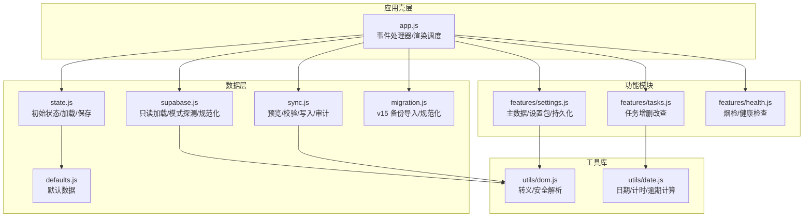
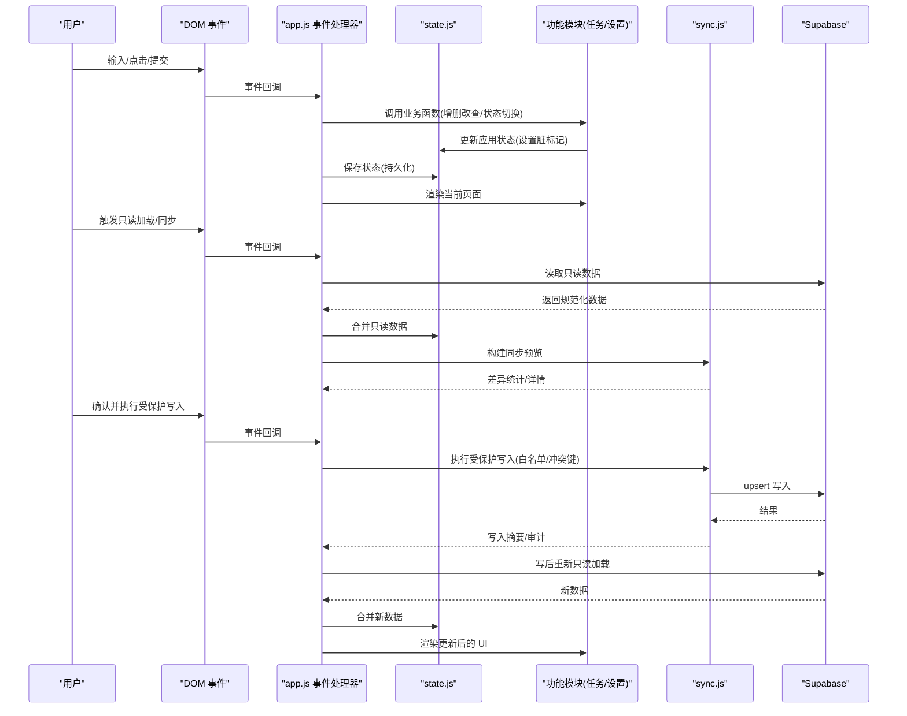
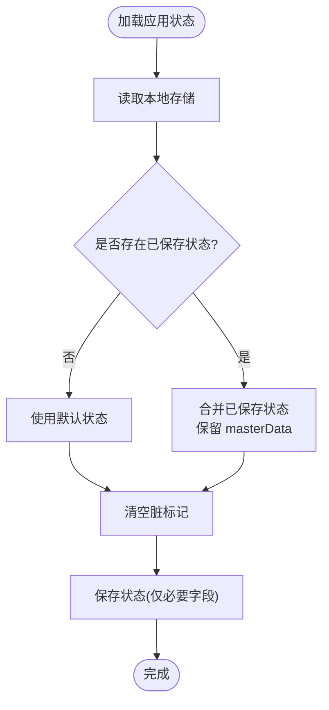
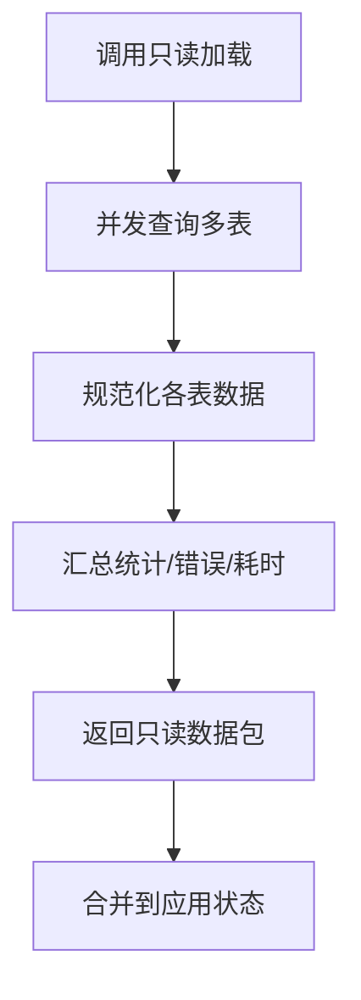
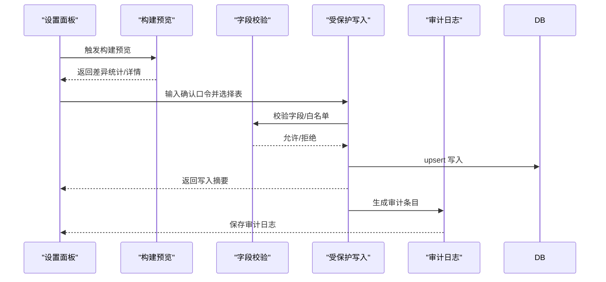
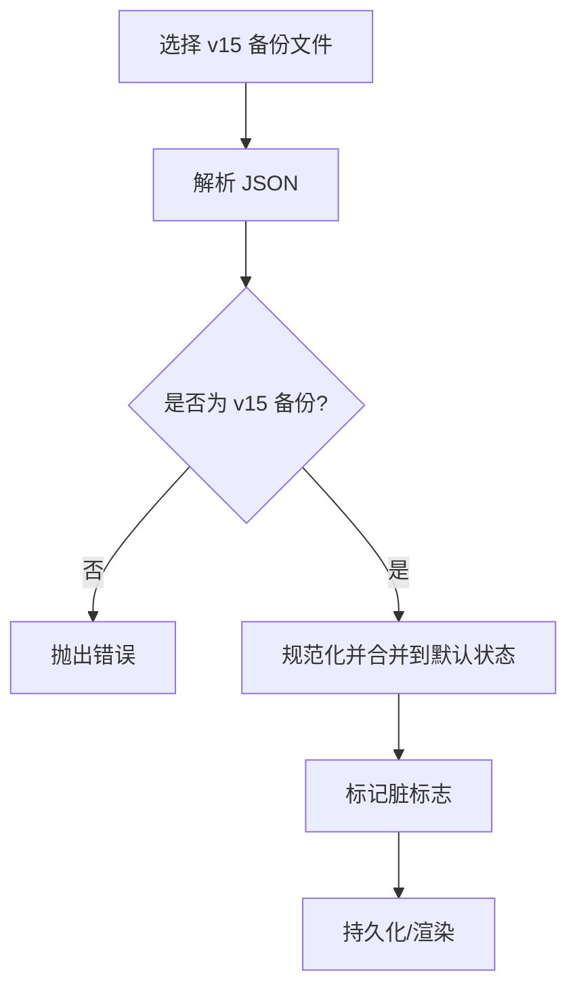
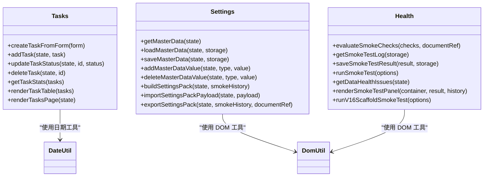
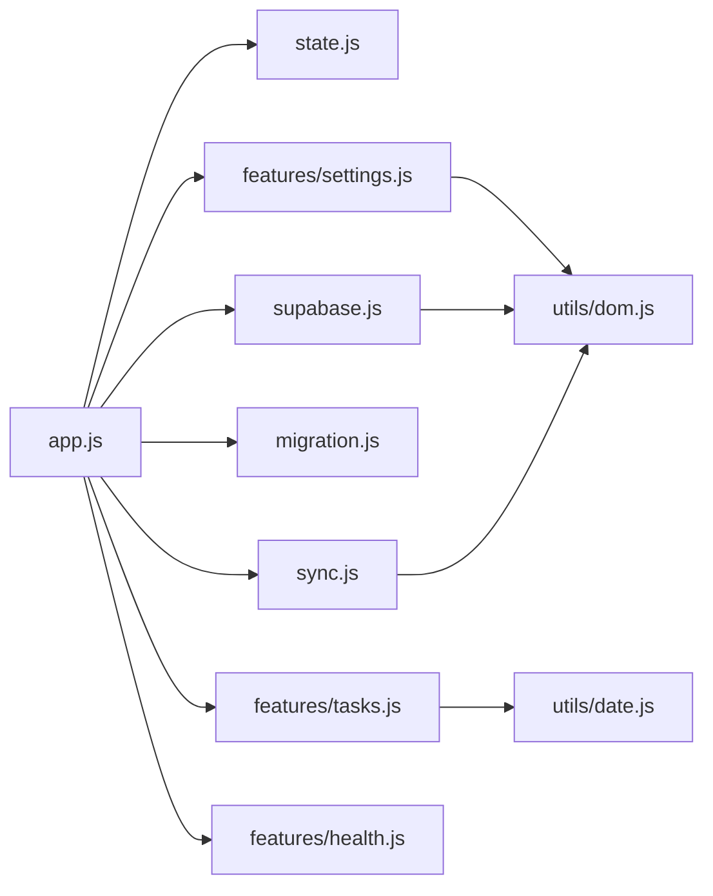

# 数据流设计

<cite>
**本文引用的文件**
- [state.js](file://v16/src/data/state.js)
- [supabase.js](file://v16/src/data/supabase.js)
- [sync.js](file://v16/src/data/sync.js)
- [migration.js](file://v16/src/data/migration.js)
- [defaults.js](file://v16/src/data/defaults.js)
- [app.js](file://v16/src/app.js)
- [tasks.js](file://v16/src/features/tasks.js)
- [settings.js](file://v16/src/features/settings.js)
- [health.js](file://v16/src/features/health.js)
- [dom.js](file://v16/src/utils/dom.js)
- [date.js](file://v16/src/utils/date.js)
- [README.md](file://v16/README.md)
- [MIGRATION_MANIFEST.md](file://v16/MIGRATION_MANIFEST.md)
</cite>

## 目录
1. [简介](#简介)
2. [项目结构](#项目结构)
3. [核心组件](#核心组件)
4. [架构总览](#架构总览)
5. [详细组件分析](#详细组件分析)
6. [依赖关系分析](#依赖关系分析)
7. [性能考量](#性能考量)
8. [故障排查指南](#故障排查指南)
9. [结论](#结论)
10. [附录](#附录)

## 简介
本文件系统化梳理 ROV 任务管理 v16 的数据流设计，覆盖从用户输入到事件处理器、应用状态、数据持久化、UI 更新的完整路径，并深入说明本地与云端数据的同步机制（只读加载、受保护写入、冲突解决）、数据验证与转换、缓存与增量更新、批量操作、监控与调试、安全与访问控制、以及数据迁移与版本兼容处理。目标是帮助开发者与非技术读者共同理解该系统的数据运作方式。

## 项目结构
v16 采用“本地优先”的单页应用架构，围绕应用状态驱动 UI 渲染，通过数据层模块负责默认值、状态持久化、Supabase 只读加载与受保护写入同步、以及迁移与备份恢复等能力。主要目录与职责如下：
- src/data：默认数据、应用状态、Supabase 读写适配、同步与审计、迁移工具
- src/features：页面与工作流模块（任务、准备、竞赛、设置、健康）
- src/utils：通用工具（DOM 转义、日期、国际化等）
- 根目录 README 与迁移清单文档：说明目标形态、安全门禁与当前能力

图表来源
- [app.js:1-402](file://v16/src/app.js#L1-L402)
- [state.js:1-45](file://v16/src/data/state.js#L1-L45)
- [supabase.js:1-157](file://v16/src/data/supabase.js#L1-L157)
- [sync.js:1-341](file://v16/src/data/sync.js#L1-L341)
- [migration.js:1-100](file://v16/src/data/migration.js#L1-L100)
- [defaults.js:1-46](file://v16/src/data/defaults.js#L1-L46)
- [tasks.js:1-112](file://v16/src/features/tasks.js#L1-L112)
- [settings.js:1-200](file://v16/src/features/settings.js#L1-L200)
- [health.js:1-127](file://v16/src/features/health.js#L1-L127)
- [dom.js:1-21](file://v16/src/utils/dom.js#L1-L21)
- [date.js:1-55](file://v16/src/utils/date.js#L1-L55)

章节来源
- [README.md:1-68](file://v16/README.md#L1-L68)
- [MIGRATION_MANIFEST.md:1-76](file://v16/MIGRATION_MANIFEST.md#L1-L76)

## 核心组件
- 应用状态与持久化
  - 初始状态与合并：使用默认值作为基线，合并本地存储中的已保存状态，确保 masterData 不被覆盖。
  - 持久化：保存时仅写入必要的字段（页面、模式、赛季、时间戳），并清空脏标记。
- Supabase 只读加载
  - 并发读取多表，统一规范化输出，支持按列排序与错误统计。
  - 提供模式探测，评估候选列在数据库中的存在情况。
- 同步与写入
  - 预览：基于本地与只读数据库的差异计算创建/更新/删除数量。
  - 受保护写入：白名单表与字段、确认口令、禁止删除、按冲突键 upsert、写后重载对比。
  - 审计日志：记录每次受保护写入的预览、结果、丢弃字段与写后对比摘要。
- 迁移与回滚
  - v15 备份导入：将旧版数据映射到 v16 规范结构。
  - v16 本地回滚：从本地备份 JSON 恢复状态，不涉及云端写入。
- 功能模块
  - 任务：本地增删改查、状态切换、统计与渲染。
  - 设置：主数据编辑、设置包导入导出、按赛季存储。
  - 健康：烟检与数据健康检查。

章节来源
- [state.js:6-44](file://v16/src/data/state.js#L6-L44)
- [supabase.js:79-129](file://v16/src/data/supabase.js#L79-L129)
- [supabase.js:131-156](file://v16/src/data/supabase.js#L131-L156)
- [sync.js:150-178](file://v16/src/data/sync.js#L150-L178)
- [sync.js:221-284](file://v16/src/data/sync.js#L221-L284)
- [sync.js:300-340](file://v16/src/data/sync.js#L300-L340)
- [migration.js:75-99](file://v16/src/data/migration.js#L75-L99)
- [tasks.js:19-37](file://v16/src/features/tasks.js#L19-L37)
- [settings.js:34-52](file://v16/src/features/settings.js#L34-L52)
- [health.js:56-84](file://v16/src/features/health.js#L56-L84)

## 架构总览
下图展示从用户输入到 UI 更新的端到端数据流，以及本地与云端数据的交互路径。

图表来源
- [app.js:189-393](file://v16/src/app.js#L189-L393)
- [state.js:35-44](file://v16/src/data/state.js#L35-L44)
- [supabase.js:79-121](file://v16/src/data/supabase.js#L79-L121)
- [sync.js:150-178](file://v16/src/data/sync.js#L150-L178)
- [sync.js:221-284](file://v16/src/data/sync.js#L221-L284)

## 详细组件分析

### 组件一：应用状态与持久化（state.js）
- 初始化与合并
  - 使用默认状态作为基线，合并本地存储中的已保存状态；对 masterData 进行保留合并，避免被覆盖。
- 持久化
  - 保存时仅写入必要字段（页面、模式、赛季、时间戳），并将脏标记清空，便于后续增量处理。
- 性能与复杂度
  - 合并逻辑为 O(n) 级别，按字段浅合并，避免深度克隆开销。
- 错误处理
  - 解析本地存储失败时回退到初始状态，保证启动稳定性。

图表来源
- [state.js:16-44](file://v16/src/data/state.js#L16-L44)

章节来源
- [state.js:6-44](file://v16/src/data/state.js#L6-L44)
- [defaults.js:1-46](file://v16/src/data/defaults.js#L1-L46)

### 组件二：Supabase 只读加载与模式探测（supabase.js）
- 只读加载
  - 并发查询多表，按候选列顺序排序，统一规范化输出，记录每表加载耗时与错误。
  - 支持任务、成员、检查清单、情报、笔记、策略、任务运行等数据的标准化。
- 模式探测
  - 对候选列进行只读探测，返回每个表的现有/缺失列与覆盖率，用于写入前的字段过滤。
- 规范化与转换
  - 将不同来源字段映射到统一键，处理空值与类型转换，确保本地状态一致性。

图表来源
- [supabase.js:79-121](file://v16/src/data/supabase.js#L79-L121)
- [supabase.js:123-129](file://v16/src/data/supabase.js#L123-L129)

章节来源
- [supabase.js:79-129](file://v16/src/data/supabase.js#L79-L129)
- [supabase.js:131-156](file://v16/src/data/supabase.js#L131-L156)

### 组件三：同步预览与受保护写入（sync.js）
- 同步预览
  - 基于本地与只读数据库的差异计算创建/更新/删除数量，支持逐表详情展示。
- 受保护写入
  - 白名单表与字段、确认口令、禁止删除、按冲突键 upsert、写后重新只读加载并生成写后预览。
  - 字段过滤：根据模式探测结果或静态白名单过滤不允许写入的字段。
- 审计日志
  - 记录每次受保护写入的预览、结果、丢弃字段与写后对比摘要，最多保留最近 20 条。

图表来源
- [sync.js:150-178](file://v16/src/data/sync.js#L150-L178)
- [sync.js:221-284](file://v16/src/data/sync.js#L221-L284)
- [sync.js:300-340](file://v16/src/data/sync.js#L300-L340)

章节来源
- [sync.js:150-178](file://v16/src/data/sync.js#L150-L178)
- [sync.js:221-284](file://v16/src/data/sync.js#L221-L284)
- [sync.js:300-340](file://v16/src/data/sync.js#L300-L340)

### 组件四：迁移与回滚（migration.js）
- v15 备份导入
  - 校验备份类型，规范化任务、成员、检查清单、任务运行、装备、笔记与策略等字段，合并到默认状态。
- 回滚
  - 从 v16 本地备份 JSON 恢复状态，不涉及云端写入，适合在受保护写入前自动下载备份以保障可逆性。

图表来源
- [migration.js:75-99](file://v16/src/data/migration.js#L75-L99)

章节来源
- [migration.js:1-100](file://v16/src/data/migration.js#L1-100)

### 组件五：功能模块（任务/设置/健康）
- 任务模块
  - 表单到任务对象的转换、增删改查、状态切换、统计与渲染。
- 设置模块
  - 主数据去重与排序、按赛季存储、设置包导入导出。
- 健康模块
  - 烟检与数据健康检查，识别主数据不一致与数据缺失问题。

图表来源
- [tasks.js:1-112](file://v16/src/features/tasks.js#L1-L112)
- [settings.js:1-200](file://v16/src/features/settings.js#L1-L200)
- [health.js:1-127](file://v16/src/features/health.js#L1-L127)
- [date.js:1-55](file://v16/src/utils/date.js#L1-L55)
- [dom.js:1-21](file://v16/src/utils/dom.js#L1-L21)

章节来源
- [tasks.js:1-112](file://v16/src/features/tasks.js#L1-L112)
- [settings.js:1-200](file://v16/src/features/settings.js#L1-L200)
- [health.js:1-127](file://v16/src/features/health.js#L1-L127)

## 依赖关系分析
- 低耦合高内聚
  - 数据层模块独立封装只读加载、同步与迁移，功能模块通过状态与工具函数交互，避免直接耦合外部服务。
- 关键依赖链
  - app.js 作为事件中枢，协调 state.js、supabase.js、sync.js、migration.js 与各功能模块。
  - 工具模块（dom.js、date.js）被多个模块复用，保持跨模块一致性。
- 循环依赖
  - 当前结构未发现循环依赖，模块间为单向依赖（app -> data/features/utils）。

图表来源
- [app.js:1-402](file://v16/src/app.js#L1-L402)
- [state.js:1-45](file://v16/src/data/state.js#L1-L45)
- [supabase.js:1-157](file://v16/src/data/supabase.js#L1-L157)
- [sync.js:1-341](file://v16/src/data/sync.js#L1-L341)
- [migration.js:1-100](file://v16/src/data/migration.js#L1-L100)
- [tasks.js:1-112](file://v16/src/features/tasks.js#L1-L112)
- [settings.js:1-200](file://v16/src/features/settings.js#L1-L200)
- [health.js:1-127](file://v16/src/features/health.js#L1-L127)
- [dom.js:1-21](file://v16/src/utils/dom.js#L1-L21)
- [date.js:1-55](file://v16/src/utils/date.js#L1-L55)

章节来源
- [app.js:1-402](file://v16/src/app.js#L1-L402)

## 性能考量
- 并发只读加载
  - 使用 Promise.allSettled 并发查询多表，减少总等待时间，同时保留失败项的统计信息。
- 差异计算
  - 基于 ID 映射与可比较 JSON 比较，避免全量深比较，提升大列表差异计算效率。
- 字段过滤
  - 在写入前按白名单与模式探测结果过滤字段，减少无效写入与网络往返。
- 渲染节流
  - 保存状态后统一渲染，避免频繁重排；定时器场景按秒级刷新，降低渲染压力。

章节来源
- [supabase.js:82-92](file://v16/src/data/supabase.js#L82-L92)
- [sync.js:43-64](file://v16/src/data/sync.js#L43-L64)
- [sync.js:120-132](file://v16/src/data/sync.js#L120-L132)
- [app.js:147-171](file://v16/src/app.js#L147-L171)

## 故障排查指南
- 数据健康检查
  - 使用健康模块检查主数据与实体一致性，定位角色/类别/装备分类不在主数据中的问题。
- 烟检面板
  - 运行烟检检查关键 DOM 元素是否存在，查看历史记录与失败项，快速定位界面问题。
- 受保护写入审计
  - 查看审计日志，关注错误表、丢弃字段与写后对比，判断写入是否成功及影响范围。
- 只读加载与模式探测
  - 若写入失败，先运行模式探测，确认候选列是否存在于数据库；若缺失则调整白名单或修复数据库结构。
- 回滚与备份
  - 在受保护写入前会自动下载本地备份，若出现异常可使用 v16 本地回滚 JSON 恢复状态。

章节来源
- [health.js:56-84](file://v16/src/features/health.js#L56-L84)
- [health.js:14-54](file://v16/src/features/health.js#L14-L54)
- [sync.js:300-340](file://v16/src/data/sync.js#L300-L340)
- [supabase.js:131-156](file://v16/src/data/supabase.js#L131-L156)
- [app.js:267-291](file://v16/src/app.js#L267-L291)

## 结论
v16 的数据流设计以“本地优先”为核心，通过明确的只读加载、受保护写入与审计日志，实现了安全可控的云端同步。状态持久化与脏标记配合统一渲染，保证了 UI 与数据的一致性。迁移与回滚机制进一步提升了版本演进的安全性。建议在生产环境中持续使用烟检与健康检查，结合审计日志进行监控与回归验证。

## 附录

### 数据验证、转换与清理流程
- 表单到实体
  - 任务表单转换为任务对象，清理空值与布尔值，确保字段完整性。
- 规范化
  - Supabase 只读加载时对字段进行映射与类型转换，统一键名与格式。
- 主数据清理
  - 主数据去重、排序与清洗，避免重复与大小写差异导致的不一致。
- 安全解析
  - 使用安全 JSON 解析工具，避免解析错误导致的崩溃。

章节来源
- [tasks.js:5-17](file://v16/src/features/tasks.js#L5-L17)
- [supabase.js:31-70](file://v16/src/data/supabase.js#L31-L70)
- [settings.js:14-21](file://v16/src/features/settings.js#L14-L21)
- [dom.js:14-20](file://v16/src/utils/dom.js#L14-L20)

### 缓存策略、增量更新与批量操作
- 缓存策略
  - 本地存储作为主要缓存，保存应用状态与主数据；只读加载结果用于 UI 展示但不持久化。
- 增量更新
  - 脏标记用于标识受影响域，保存时仅写入必要字段，减少存储与传输开销。
- 批量操作
  - 受保护写入按表批量 upsert，支持多表并发写入；写后统一重载以获得最新状态。

章节来源
- [state.js:35-44](file://v16/src/data/state.js#L35-L44)
- [sync.js:221-284](file://v16/src/data/sync.js#L221-L284)

### 数据流监控与调试
- 状态快照
  - 保存状态时记录时间戳，便于追踪变更时间线。
- 变更追踪
  - 脏标记用于标识变更域，审计日志记录写入前后差异摘要。
- 可视化面板
  - 设置中心提供只读加载、模式探测、同步预览、写入结果与审计日志的可视化展示。

章节来源
- [state.js:35-44](file://v16/src/data/state.js#L35-L44)
- [sync.js:319-340](file://v16/src/data/sync.js#L319-L340)
- [settings.js:156-200](file://v16/src/features/settings.js#L156-L200)

### 数据安全与访问控制
- 只读加载
  - 仅使用只读查询，避免意外写入。
- 受保护写入
  - 强制确认口令、白名单表/字段、禁止删除、冲突键 upsert，降低误操作风险。
- 审计日志
  - 记录每次写入的预览与结果，便于事后审计与回溯。
- 敏感信息处理
  - 本地存储中不存放敏感凭据；工具函数提供安全解析与转义，防止注入与 XSS。

章节来源
- [supabase.js:79-121](file://v16/src/data/supabase.js#L79-L121)
- [sync.js:9-17](file://v16/src/data/sync.js#L9-L17)
- [sync.js:221-284](file://v16/src/data/sync.js#L221-L284)
- [dom.js:1-21](file://v16/src/utils/dom.js#L1-L21)

### 数据迁移与版本升级兼容
- v15 备份导入
  - 校验备份类型，规范化字段并合并到默认状态，保留 masterData 与部分默认值。
- v16 本地回滚
  - 从 v16 本地备份 JSON 恢复状态，不涉及云端写入，确保可逆性。
- 迁移清单
  - 文档记录迁移步骤与安全门禁，确保 v15 生产环境不受影响。

章节来源
- [migration.js:75-99](file://v16/src/data/migration.js#L75-L99)
- [sync.js:180-205](file://v16/src/data/sync.js#L180-L205)
- [MIGRATION_MANIFEST.md:1-76](file://v16/MIGRATION_MANIFEST.md#L1-L76)