# 架构设计

<cite>
**本文引用的文件**
- [app.js](file://v16/src/app.js)
- [index.html](file://v16/index.html)
- [state.js](file://v16/src/data/state.js)
- [defaults.js](file://v16/src/data/defaults.js)
- [supabase.js](file://v16/src/data/supabase.js)
- [sync.js](file://v16/src/data/sync.js)
- [migration.js](file://v16/src/data/migration.js)
- [tasks.js](file://v16/src/features/tasks.js)
- [prep.js](file://v16/src/features/prep.js)
- [competition.js](file://v16/src/features/competition.js)
- [settings.js](file://v16/src/features/settings.js)
- [health.js](file://v16/src/features/health.js)
- [navigation.js](file://v16/src/features/navigation.js)
- [utils/index.js](file://v16/src/utils/index.js)
- [README.md](file://v16/README.md)
</cite>

## 目录
1. [引言](#引言)
2. [项目结构](#项目结构)
3. [核心组件](#核心组件)
4. [架构总览](#架构总览)
5. [详细组件分析](#详细组件分析)
6. [依赖关系分析](#依赖关系分析)
7. [性能考量](#性能考量)
8. [故障排查指南](#故障排查指南)
9. [结论](#结论)
10. [附录](#附录)

## 引言
本文件为 ROV 任务管理 v16 的架构设计文档，面向开发与运维读者，系统性阐述高层设计、架构模式、模块化组织、事件驱动与状态管理、组件交互与数据流、技术决策与权衡、基础设施与可扩展性、部署拓扑、安全与监控、灾难恢复等横切关注点，并给出系统上下文图与组件分解图。v16 采用本地优先（local-first）策略，以浏览器端单页应用为核心，结合 Supabase 只读加载与受控写入同步，提供迁移、备份、回滚与烟雾测试等安全机制。

## 项目结构
v16 将 v15 生产回退与 v16 迁移工作区解耦，形成清晰的模块化分层：
- 应用壳与入口：index.html 加载样式与模块脚本，挂载根节点。
- 数据层：默认状态、本地持久化、Supabase 只读加载、同步预览与受控写入、迁移与回滚。
- 功能模块：导航、仪表盘、准备检查清单、任务、竞赛计时与跑次、设置中心、健康与烟雾测试。
- 工具层：国际化、日期与 DOM 辅助、通用转义与安全工具。

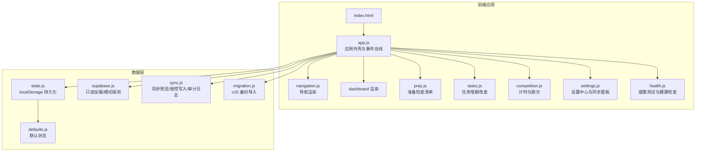

图表来源
- [index.html:1-15](file://v16/index.html#L1-L15)
- [app.js:1-402](file://v16/src/app.js#L1-L402)
- [navigation.js:1-37](file://v16/src/features/navigation.js#L1-L37)
- [state.js:1-45](file://v16/src/data/state.js#L1-L45)
- [defaults.js:1-46](file://v16/src/data/defaults.js#L1-L46)
- [supabase.js:1-157](file://v16/src/data/supabase.js#L1-L157)
- [sync.js:1-341](file://v16/src/data/sync.js#L1-L341)
- [migration.js:1-100](file://v16/src/data/migration.js#L1-L100)

章节来源
- [README.md:10-26](file://v16/README.md#L10-L26)
- [index.html:1-15](file://v16/index.html#L1-L15)
- [app.js:1-402](file://v16/src/app.js#L1-L402)

## 核心组件
- 应用外壳与事件总线：负责页面切换、定时器、用户交互事件分发、状态持久化与渲染调度。
- 状态管理：基于单一应用状态对象，支持脏标记、当前页面、季节、模式等字段；通过 localStorage 持久化。
- 数据层：默认状态、Supabase 只读加载、模式探测、同步预览、受控写入、审计日志、v15 备份导入与 v16 回滚。
- 功能模块：导航、仪表盘、准备检查清单、任务、竞赛计时与跑次、设置中心（含数据库只读、模式探测、同步预览、受控写入、审计日志、回滚、v15 导入、设置包导入导出）、烟雾测试与健康检查。
- 工具层：国际化、日期处理、DOM 与安全转义。

章节来源
- [app.js:38-187](file://v16/src/app.js#L38-L187)
- [state.js:6-44](file://v16/src/data/state.js#L6-L44)
- [supabase.js:79-129](file://v16/src/data/supabase.js#L79-L129)
- [sync.js:150-284](file://v16/src/data/sync.js#L150-L284)
- [settings.js:156-537](file://v16/src/features/settings.js#L156-L537)
- [health.js:14-54](file://v16/src/features/health.js#L14-L54)

## 架构总览
v16 采用“本地优先 + 云端只读 + 受控写入”的混合架构：
- 本地优先：所有业务数据与 UI 状态保存在浏览器 localStorage，确保离线可用与快速启动。
- 云端只读：从 Supabase 并行拉取多表数据，构建只读视图，用于对比与预览。
- 受控写入：仅允许白名单表与字段进行 upsert 写入，禁止删除；写前下载本地备份，写后验证差异。
- 安全与审计：写入需显式确认文本，记录审计日志；支持回滚到本地备份。
- 质量保障：内置烟雾测试与健康检查，持续监控界面元素与关键流程。

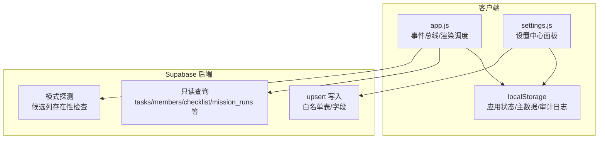

图表来源
- [app.js:201-299](file://v16/src/app.js#L201-L299)
- [supabase.js:79-156](file://v16/src/data/supabase.js#L79-L156)
- [sync.js:221-284](file://v16/src/data/sync.js#L221-L284)
- [settings.js:358-401](file://v16/src/features/settings.js#L358-L401)

## 详细组件分析

### 应用外壳与事件驱动架构
- 页面切换：通过导航按钮触发当前页面变更，随后统一渲染应用外壳。
- 用户交互：集中监听点击、提交、变更与键盘事件，按目标属性分派到对应功能模块。
- 定时器：竞赛计时器以每秒刷新的方式更新渲染，避免频繁重绘。
- 渲染调度：统一入口负责持久化状态与主数据，再触发页面渲染。

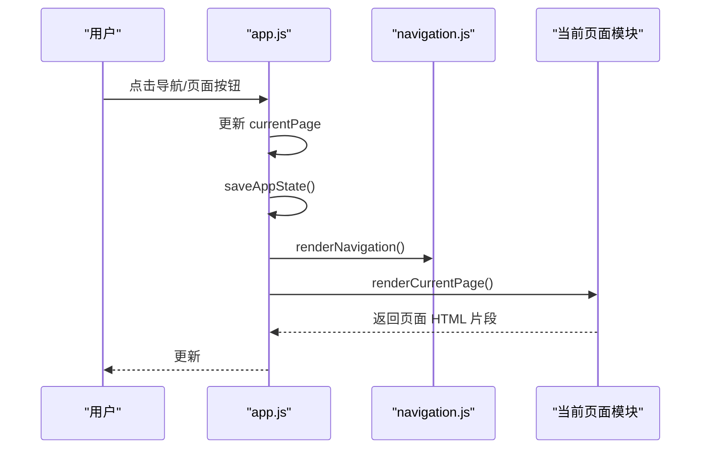

图表来源
- [app.js:141-145](file://v16/src/app.js#L141-L145)
- [navigation.js:21-36](file://v16/src/features/navigation.js#L21-L36)
- [app.js:104-112](file://v16/src/app.js#L104-L112)

章节来源
- [app.js:189-344](file://v16/src/app.js#L189-L344)

### 状态管理模式
- 单一状态树：包含 data（业务数据）、currentPage、currentMode、currentSeason、dirtyFlags。
- 默认状态：从 defaults.js 提供种子数据，首次加载时合并至初始状态。
- 持久化：saveAppState 仅保存必要字段并清空脏标记；主数据独立存储于按季键名的 localStorage。
- 脏标记：各模块在修改数据后设置对应脏标记，便于追踪变更来源。

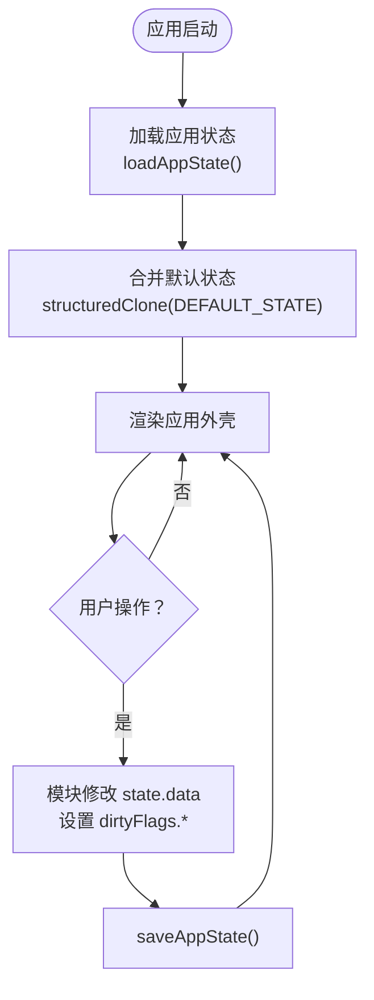

图表来源
- [state.js:16-44](file://v16/src/data/state.js#L16-L44)
- [defaults.js:1-46](file://v16/src/data/defaults.js#L1-L46)
- [app.js:60-64](file://v16/src/app.js#L60-L64)

章节来源
- [state.js:6-44](file://v16/src/data/state.js#L6-L44)
- [app.js:38-64](file://v16/src/app.js#L38-L64)

### 数据层与 Supabase 集成
- 只读加载：并行查询多表，标准化行格式，汇总统计与错误信息。
- 模式探测：逐表探测候选列的存在性，计算覆盖率，用于动态过滤写入字段。
- 同步预览：对比本地与远程数据，统计新增/更新/删除数量，支持详情列表。
- 受控写入：校验确认文本与白名单，过滤非白名单字段，执行 upsert，记录审计日志，支持写后验证。
- 回滚：支持从 v16 本地备份恢复，不涉及数据库写入。

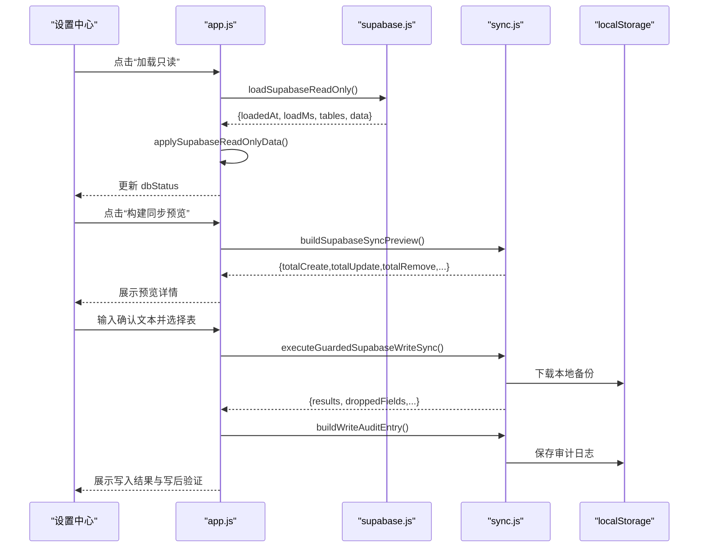

图表来源
- [app.js:226-299](file://v16/src/app.js#L226-L299)
- [supabase.js:79-121](file://v16/src/data/supabase.js#L79-L121)
- [sync.js:150-284](file://v16/src/data/sync.js#L150-L284)

章节来源
- [supabase.js:79-156](file://v16/src/data/supabase.js#L79-L156)
- [sync.js:150-341](file://v16/src/data/sync.js#L150-L341)

### 功能模块交互

#### 任务模块
- 表单创建：从 FormData 解析任务字段，生成唯一 ID。
- 列表渲染：展示任务名称、负责人、到期日、优先级、状态与删除按钮。
- 统计与过期判断：统计总数、开放数、完成数、逾期数与阻塞数。

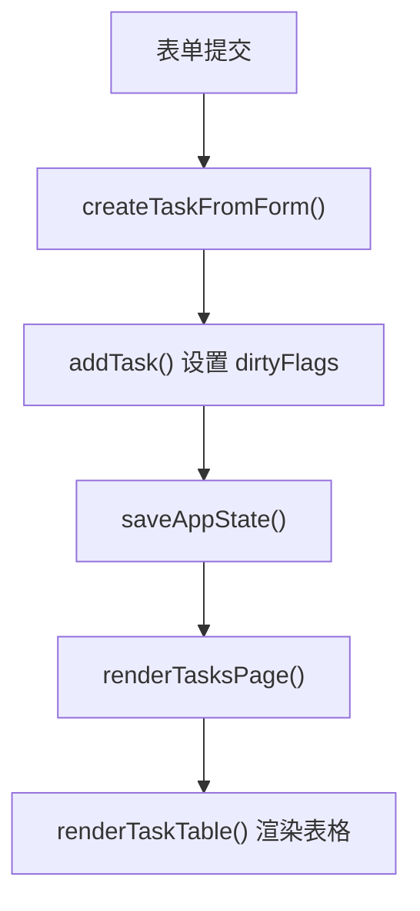

图表来源
- [tasks.js:5-17](file://v16/src/features/tasks.js#L5-L17)
- [tasks.js:19-37](file://v16/src/features/tasks.js#L19-L37)
- [tasks.js:84-112](file://v16/src/features/tasks.js#L84-L112)

章节来源
- [tasks.js:1-112](file://v16/src/features/tasks.js#L1-L112)

#### 竞赛计时与跑次
- 计时器：开始/暂停/重置，每秒刷新渲染。
- 跑次保存：收集分数与备注，写入 missionRuns 列表。

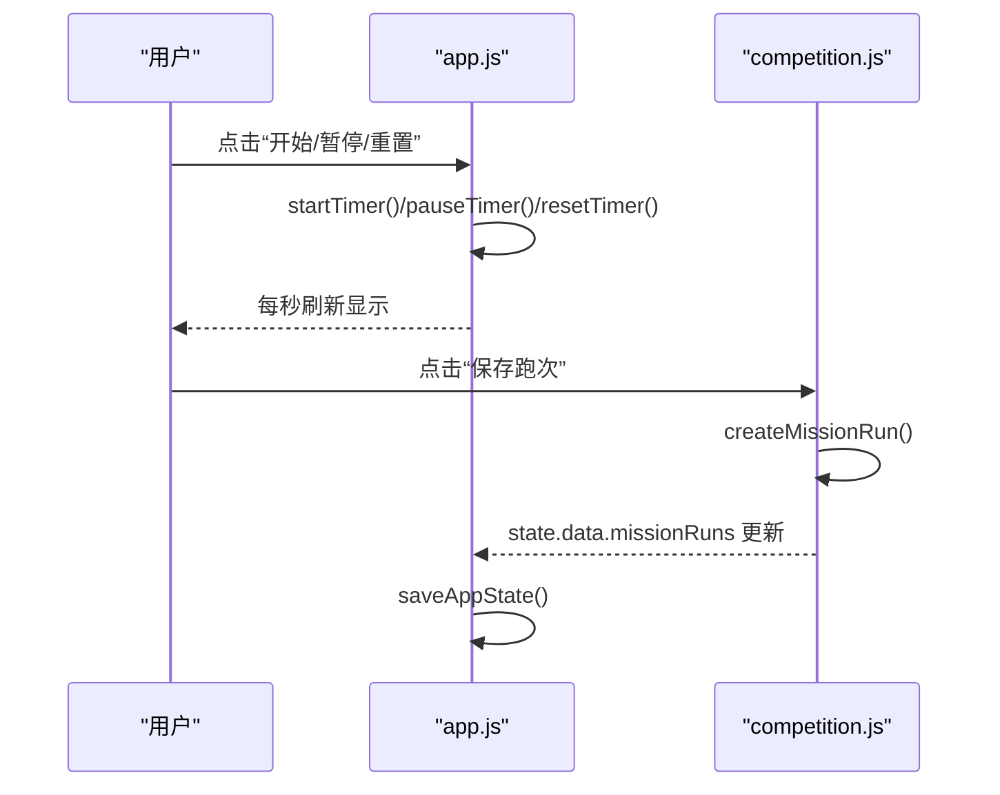

图表来源
- [app.js:147-177](file://v16/src/app.js#L147-L177)
- [competition.js:6-19](file://v16/src/features/competition.js#L6-L19)

章节来源
- [competition.js:1-68](file://v16/src/features/competition.js#L1-L68)
- [app.js:332-343](file://v16/src/app.js#L332-L343)

#### 准备检查清单
- 切换完成状态：根据列表名与条目 ID 切换 done 字段。
- 概览卡片：统计开放任务、检查清单完成度、预潜水检查完成度与装备项数量。

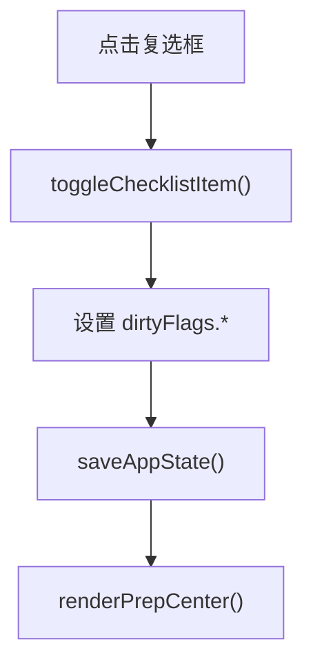

图表来源
- [prep.js:5-11](file://v16/src/features/prep.js#L5-L11)
- [prep.js:25-57](file://v16/src/features/prep.js#L25-L57)

章节来源
- [prep.js:1-58](file://v16/src/features/prep.js#L1-L58)

#### 设置中心与同步面板
- 数据概览：统计任务、成员、跑次、检查清单、装备等数量。
- 只读加载：并行查询多表，展示加载时间与每表行数。
- 模式探测：展示每表存在的列与缺失列，计算覆盖率。
- 同步预览：展示新增/更新/跳过的删除数量与详情。
- 受控写入：输入确认文本，勾选表，执行 upsert，记录审计日志，支持写后验证。
- 回滚：从 v16 本地备份恢复。
- v15 导入：解析 v15 备份 JSON，映射字段并合并到当前状态。
- 设置包：导出/导入主数据与烟雾测试历史。

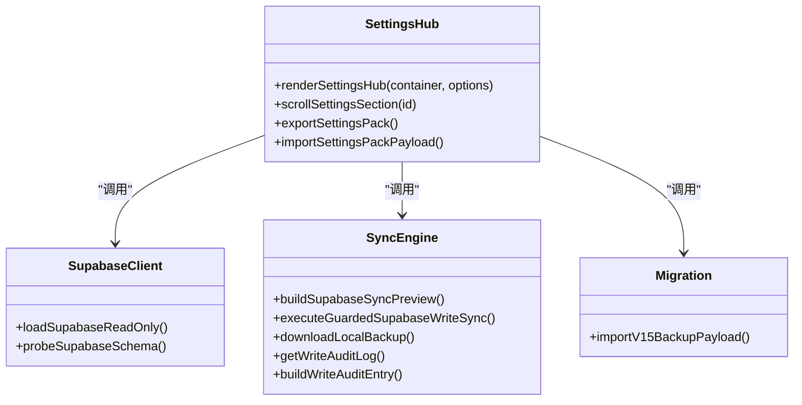

图表来源
- [settings.js:156-537](file://v16/src/features/settings.js#L156-L537)
- [supabase.js:79-156](file://v16/src/data/supabase.js#L79-L156)
- [sync.js:150-341](file://v16/src/data/sync.js#L150-L341)
- [migration.js:75-99](file://v16/src/data/migration.js#L75-L99)

章节来源
- [settings.js:1-592](file://v16/src/features/settings.js#L1-L592)

#### 烟雾测试与健康检查
- 烟雾测试：扫描关键 DOM 元素，记录通过/失败，持久化最近 10 次结果。
- 健康检查：基于主数据与业务数据，检测角色/类型/分类是否配置完整，提示潜在问题。

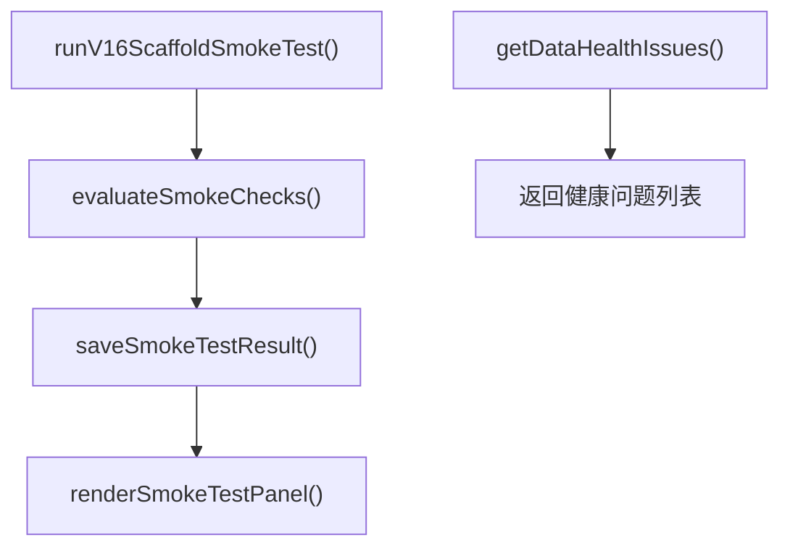

图表来源
- [health.js:37-54](file://v16/src/features/health.js#L37-L54)
- [health.js:56-84](file://v16/src/features/health.js#L56-L84)
- [health.js:96-122](file://v16/src/features/health.js#L96-L122)

章节来源
- [health.js:1-127](file://v16/src/features/health.js#L1-L127)

## 依赖关系分析
- 模块内聚：每个功能模块聚焦单一职责，通过 app.js 的事件总线进行编排。
- 松耦合：数据层通过函数接口暴露能力，设置中心作为门面协调 Supabase 与同步引擎。
- 外部依赖：Supabase 客户端库通过 CDN 注入，无构建时打包。
- 循环依赖：未见直接循环；若未来扩展，应避免模块间相互 import。

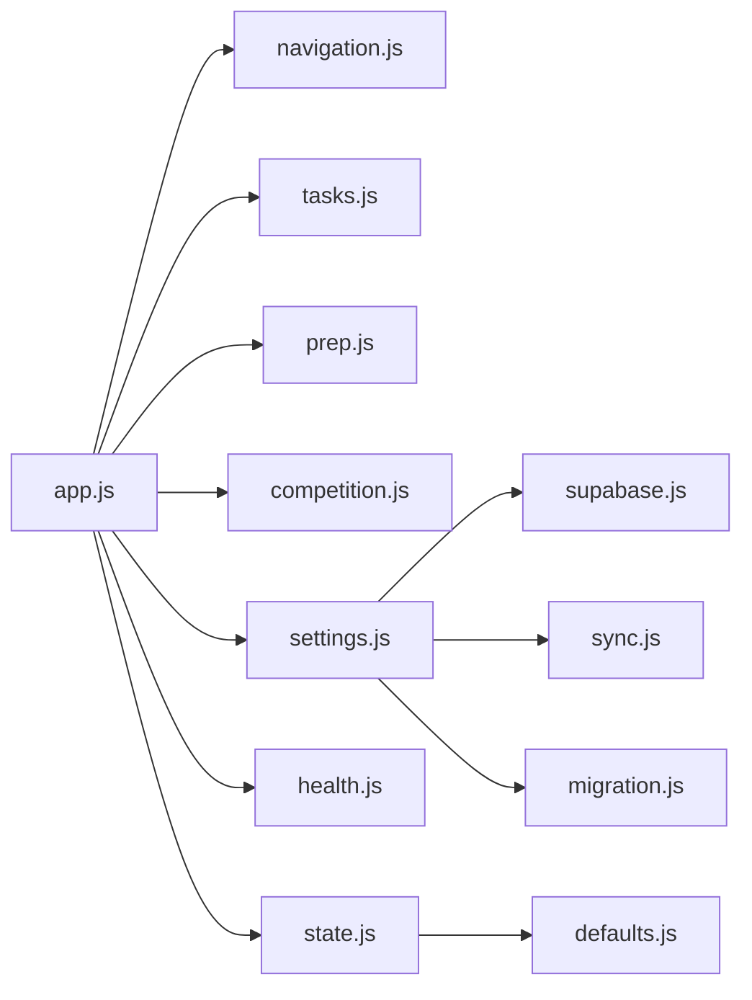

图表来源
- [app.js:1-36](file://v16/src/app.js#L1-L36)
- [settings.js:1-6](file://v16/src/features/settings.js#L1-L6)
- [supabase.js:1-3](file://v16/src/data/supabase.js#L1-L3)
- [sync.js:1-12](file://v16/src/data/sync.js#L1-L12)
- [migration.js:1-3](file://v16/src/data/migration.js#L1-L3)
- [state.js:1-4](file://v16/src/data/state.js#L1-L4)
- [defaults.js:1-2](file://v16/src/data/defaults.js#L1-L2)

章节来源
- [app.js:1-36](file://v16/src/app.js#L1-L36)
- [settings.js:1-6](file://v16/src/features/settings.js#L1-L6)

## 性能考量
- 渲染频率：计时器每秒刷新一次，避免过度重绘；页面切换与状态变更后统一渲染。
- 并行加载：Supabase 只读加载使用 Promise.allSettled 并行查询多表，减少总等待时间。
- 本地优先：所有业务逻辑与渲染在浏览器完成，减少网络往返。
- 写入安全：受控写入前先下载本地备份，避免不可逆风险；同时限制删除与字段白名单，降低写入开销与复杂度。

## 故障排查指南
- 只读加载失败：检查 Supabase 客户端初始化参数与网络连通性；查看 dbStatus 中的错误信息。
- 模式探测异常：确认候选列是否存在；覆盖率低于阈值时，写入字段会被自动过滤。
- 同步预览为空：需先执行只读加载，再构建预览。
- 受控写入失败：确认已输入正确确认文本、勾选了白名单表、未尝试删除；查看审计日志中的错误明细。
- 回滚无效：确认上传的是 v16 本地备份 JSON，且格式正确。
- 烟雾测试失败：检查关键 DOM 是否存在，定位缺失项并修复页面结构或资源路径。

章节来源
- [app.js:226-299](file://v16/src/app.js#L226-L299)
- [sync.js:286-341](file://v16/src/data/sync.js#L286-L341)
- [health.js:14-54](file://v16/src/features/health.js#L14-L54)

## 结论
v16 通过本地优先与云端只读/受控写入的组合，实现了高可用、可审计、可回滚的任务管理方案。模块化与事件驱动的设计使系统易于扩展与维护；设置中心将数据健康、同步与安全机制整合为一体，显著降低了迁移与运维风险。建议后续在保持现有安全边界的同时，逐步引入更细粒度的模块拆分与测试覆盖，以进一步提升可维护性与可靠性。

## 附录

### 系统上下文图
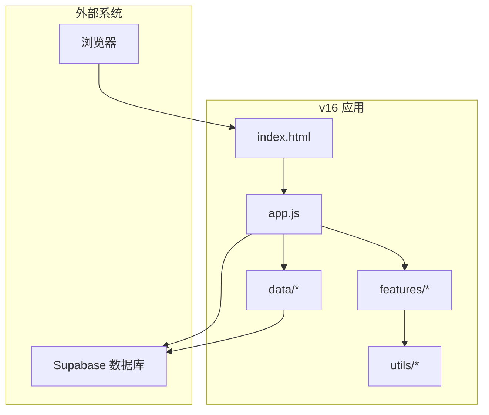

图表来源
- [index.html:1-15](file://v16/index.html#L1-L15)
- [app.js:1-13](file://v16/src/app.js#L1-L13)
- [supabase.js:1-29](file://v16/src/data/supabase.js#L1-L29)

### 组件分解图
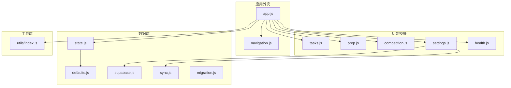

图表来源
- [app.js:1-36](file://v16/src/app.js#L1-L36)
- [navigation.js:1-37](file://v16/src/features/navigation.js#L1-L37)
- [tasks.js:1-4](file://v16/src/features/tasks.js#L1-L4)
- [prep.js:1-3](file://v16/src/features/prep.js#L1-L3)
- [competition.js:1-4](file://v16/src/features/competition.js#L1-L4)
- [settings.js:1-6](file://v16/src/features/settings.js#L1-L6)
- [health.js:1-3](file://v16/src/features/health.js#L1-L3)
- [state.js:1-4](file://v16/src/data/state.js#L1-L4)
- [defaults.js:1-2](file://v16/src/data/defaults.js#L1-L2)
- [supabase.js:1-2](file://v16/src/data/supabase.js#L1-L2)
- [sync.js:1-11](file://v16/src/data/sync.js#L1-L11)
- [migration.js:1-3](file://v16/src/data/migration.js#L1-L3)
- [utils/index.js:1-3](file://v16/src/utils/index.js#L1-L3)

### 技术栈与版本兼容性
- 浏览器端：ES 模块脚本，无需构建；Supabase 客户端库通过 CDN 引入。
- 存储：localStorage 用于应用状态、主数据、审计日志与烟雾测试历史。
- 国际化：支持简繁中切换，字符串经 Unicode 转义与安全输出。
- 第三方依赖：Supabase JS 客户端（CDN 版本），无 npm/yarn 依赖。

章节来源
- [index.html:11-12](file://v16/index.html#L11-L12)
- [README.md:27-44](file://v16/README.md#L27-L44)