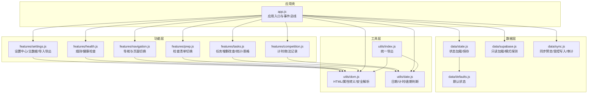
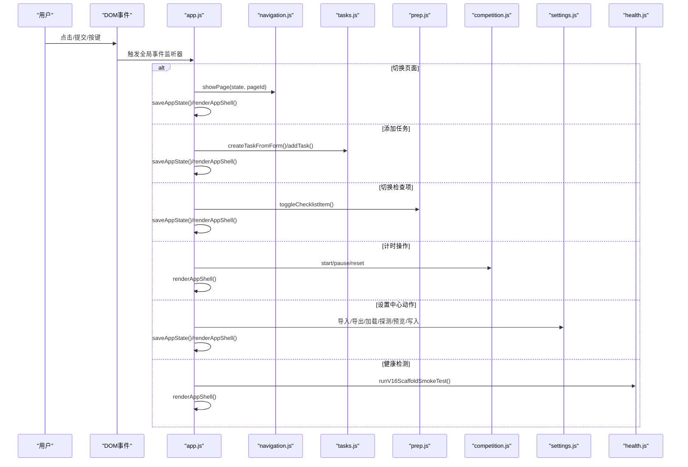
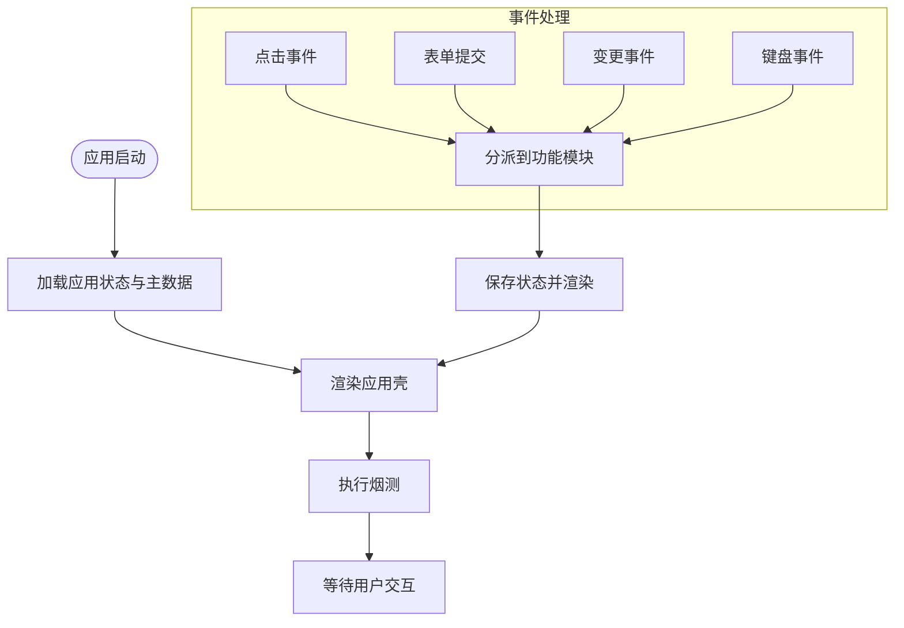
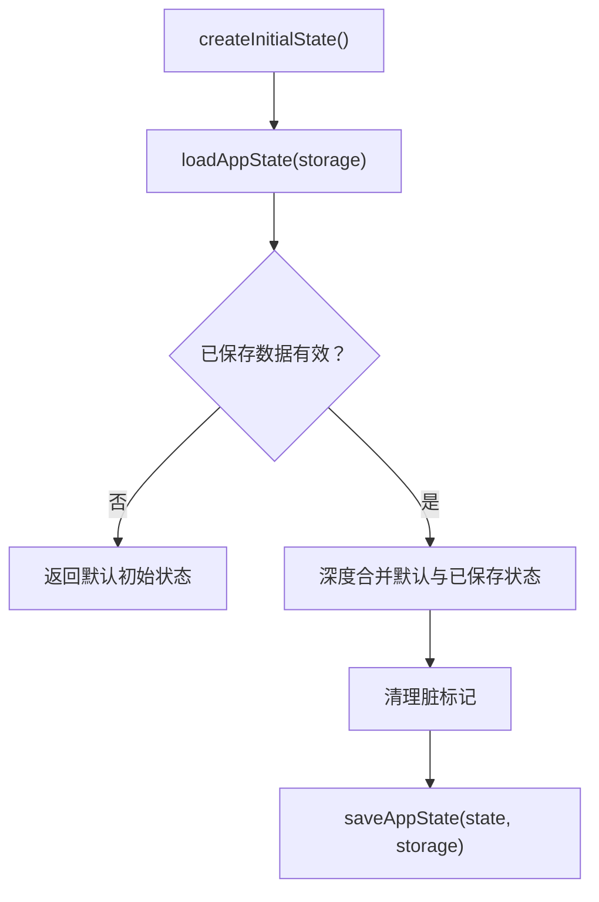
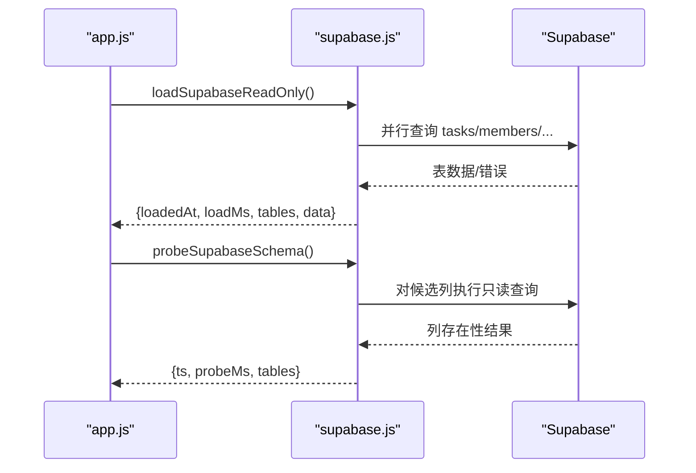
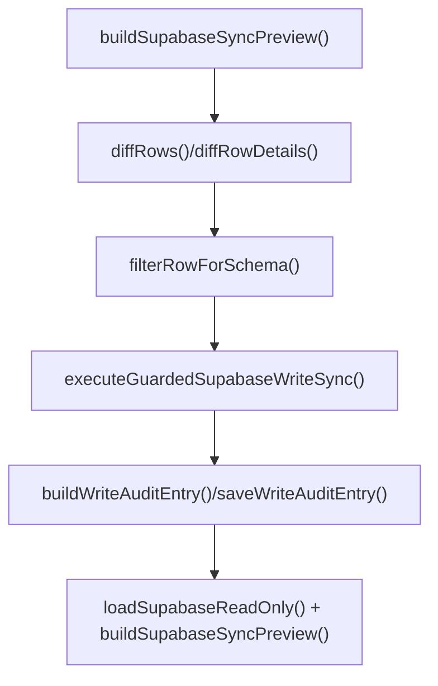
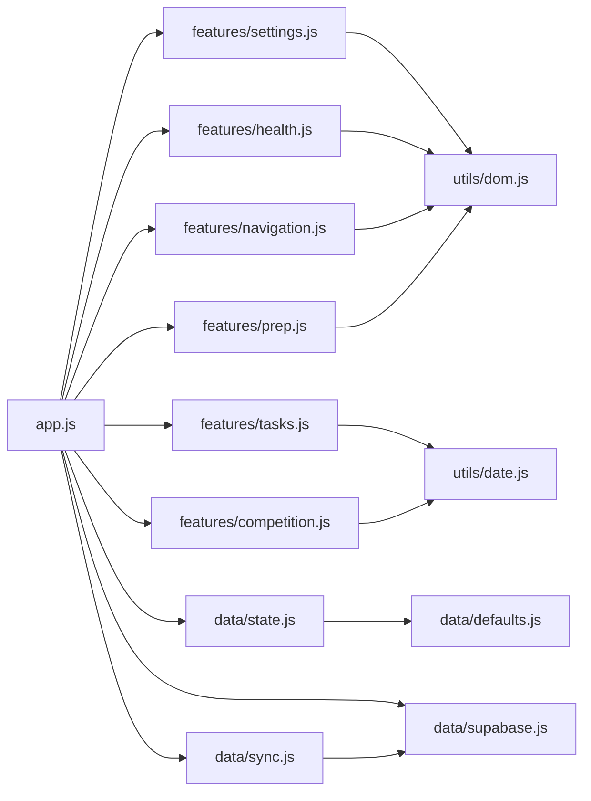

# 模块化架构设计

<cite>
**本文档引用的文件**
- [app.js](file://v16/src/app.js)
- [state.js](file://v16/src/data/state.js)
- [defaults.js](file://v16/src/data/defaults.js)
- [supabase.js](file://v16/src/data/supabase.js)
- [sync.js](file://v16/src/data/sync.js)
- [navigation.js](file://v16/src/features/navigation.js)
- [tasks.js](file://v16/src/features/tasks.js)
- [prep.js](file://v16/src/features/prep.js)
- [competition.js](file://v16/src/features/competition.js)
- [settings.js](file://v16/src/features/settings.js)
- [health.js](file://v16/src/features/health.js)
- [dom.js](file://v16/src/utils/dom.js)
- [date.js](file://v16/src/utils/date.js)
- [index.js](file://v16/src/utils/index.js)
- [README.md](file://v16/README.md)
</cite>

## 目录
1. [简介](#简介)
2. [项目结构](#项目结构)
3. [核心组件](#核心组件)
4. [架构总览](#架构总览)
5. [详细组件分析](#详细组件分析)
6. [依赖分析](#依赖分析)
7. [性能考虑](#性能考虑)
8. [故障排除指南](#故障排除指南)
9. [结论](#结论)
10. [附录](#附录)

## 简介
本文件系统性阐述 ROV 任务管理 v16 的模块化架构设计，围绕功能模块分离、数据层封装与工具函数抽象展开，解释模块间依赖关系、接口设计与通信机制，详述事件驱动架构下的 DOM 事件监听与处理流程，记录模块加载顺序、初始化与生命周期管理，并总结模块化带来的代码复用、可测试性与可维护性提升，最后给出模块扩展的最佳实践与新增模块开发指南。

## 项目结构
v16 采用“按职责分层”的模块化组织方式：
- 根入口：应用壳与事件总线在根入口集中处理，页面渲染与状态持久化由入口协调各功能模块。
- 数据层（data）：默认状态、本地存储、Supabase 只读加载、同步预览与受控写入、迁移与回滚等。
- 功能层（features）：导航、任务、准备检查清单、竞赛计时、设置中心、健康检测等页面级模块。
- 工具层（utils）：DOM 安全转义、日期时间、国际化等通用工具，统一导出供上层使用。

图表来源
- [app.js:1-402](file://v16/src/app.js#L1-L402)
- [state.js:1-45](file://v16/src/data/state.js#L1-L45)
- [defaults.js:1-46](file://v16/src/data/defaults.js#L1-L46)
- [supabase.js:1-157](file://v16/src/data/supabase.js#L1-L157)
- [sync.js:1-341](file://v16/src/data/sync.js#L1-L341)
- [navigation.js:1-37](file://v16/src/features/navigation.js#L1-L37)
- [tasks.js:1-112](file://v16/src/features/tasks.js#L1-L112)
- [prep.js:1-58](file://v16/src/features/prep.js#L1-L58)
- [competition.js:1-68](file://v16/src/features/competition.js#L1-L68)
- [settings.js:1-592](file://v16/src/features/settings.js#L1-L592)
- [health.js:1-127](file://v16/src/features/health.js#L1-L127)
- [dom.js:1-21](file://v16/src/utils/dom.js#L1-L21)
- [date.js:1-55](file://v16/src/utils/date.js#L1-L55)
- [index.js:1-3](file://v16/src/utils/index.js#L1-L3)

章节来源
- [README.md:10-26](file://v16/README.md#L10-L26)

## 核心组件
- 应用入口与事件总线：负责应用初始化、状态持久化、页面渲染调度、全局 DOM 事件监听与处理、定时器管理与竞速计时。
- 数据层：提供默认状态、本地存储读写、Supabase 只读加载与模式探测、同步预览与受控写入、备份与回滚、写入审计日志。
- 功能模块：导航、任务、准备检查清单、竞赛计时、设置中心、健康检测，每个模块聚焦单一页面或工作流，暴露纯函数接口供入口调用。
- 工具层：DOM 转义与安全解析、日期时间计算、国际化键值映射，统一从 utils/index.js 导出，避免跨模块重复实现。

章节来源
- [app.js:38-187](file://v16/src/app.js#L38-L187)
- [state.js:6-44](file://v16/src/data/state.js#L6-L44)
- [supabase.js:79-130](file://v16/src/data/supabase.js#L79-L130)
- [sync.js:150-284](file://v16/src/data/sync.js#L150-L284)
- [navigation.js:13-36](file://v16/src/features/navigation.js#L13-L36)
- [tasks.js:5-112](file://v16/src/features/tasks.js#L5-L112)
- [prep.js:5-58](file://v16/src/features/prep.js#L5-L58)
- [competition.js:6-68](file://v16/src/features/competition.js#L6-L68)
- [settings.js:7-592](file://v16/src/features/settings.js#L7-L592)
- [health.js:14-127](file://v16/src/features/health.js#L14-L127)
- [dom.js:1-21](file://v16/src/utils/dom.js#L1-L21)
- [date.js:1-55](file://v16/src/utils/date.js#L1-L55)
- [index.js:1-3](file://v16/src/utils/index.js#L1-L3)

## 架构总览
v16 采用“单页应用 + 本地优先 + 事件驱动”的架构：
- 单页应用：通过入口控制页面渲染与路由切换，避免整页刷新。
- 本地优先：状态持久化于 localStorage，支持备份与回滚，降低对外部服务依赖。
- 事件驱动：入口集中注册 click/submit/change/keydown 等 DOM 事件监听器，根据事件目标分派到对应功能模块处理。
- 分层解耦：数据层负责状态与外部系统交互；功能层负责 UI 渲染与业务逻辑；工具层提供通用能力。

图表来源
- [app.js:189-393](file://v16/src/app.js#L189-L393)
- [navigation.js:3-6](file://v16/src/features/navigation.js#L3-L6)
- [tasks.js:5-37](file://v16/src/features/tasks.js#L5-L37)
- [prep.js:5-11](file://v16/src/features/prep.js#L5-L11)
- [competition.js:6-19](file://v16/src/features/competition.js#L6-L19)
- [settings.js:79-119](file://v16/src/features/settings.js#L79-L119)
- [health.js:124-126](file://v16/src/features/health.js#L124-L126)

## 详细组件分析

### 应用入口与事件总线（app.js）
- 初始化流程：加载应用状态与主数据 → 渲染应用壳 → 启动烟测。
- 生命周期管理：定时器运行/暂停/重置，配合渲染周期更新计时显示。
- 事件处理：集中处理页面切换、任务表单提交、任务状态变更、检查项切换、计时控制、设置中心动作、文件导入等。
- 状态持久化：每次变更后保存至 localStorage 并触发重新渲染。

图表来源
- [app.js:38-187](file://v16/src/app.js#L38-L187)
- [app.js:189-393](file://v16/src/app.js#L189-L393)

章节来源
- [app.js:38-187](file://v16/src/app.js#L38-L187)
- [app.js:189-393](file://v16/src/app.js#L189-L393)

### 数据层（data）

#### 状态管理（state.js）
- 提供初始状态创建、从 localStorage 加载、合并默认值与已保存状态、保存至 localStorage。
- 使用结构化克隆与选择性覆盖，确保主数据独立合并，避免字段丢失。

图表来源
- [state.js:6-44](file://v16/src/data/state.js#L6-L44)

章节来源
- [state.js:6-44](file://v16/src/data/state.js#L6-L44)

#### 默认状态（defaults.js）
- 定义种子数据：任务、成员、检查清单、预潜检查清单、策略、跑法、装备等。
- 主数据类型：角色、组、任务类型、装备分类。

章节来源
- [defaults.js:1-46](file://v16/src/data/defaults.js#L1-L46)

#### Supabase 只读加载与模式探测（supabase.js）
- 并行查询多张表，汇总每表加载结果与错误信息。
- 模式探测：对候选列进行只读查询，统计覆盖率，输出缺失字段列表。

图表来源
- [supabase.js:79-130](file://v16/src/data/supabase.js#L79-L130)
- [supabase.js:131-156](file://v16/src/data/supabase.js#L131-L156)

章节来源
- [supabase.js:79-130](file://v16/src/data/supabase.js#L79-L130)
- [supabase.js:131-156](file://v16/src/data/supabase.js#L131-L156)

#### 同步预览与受控写入（sync.js）
- 预览：基于本地与远程数据差异生成创建/更新/删除计数与详情。
- 写入：白名单表与字段过滤、冲突键 upsert、禁止删除、下载本地备份、写入审计日志、后置验证。
- 审计：记录预览、写入结果、丢弃字段、后置差异。

图表来源
- [sync.js:150-284](file://v16/src/data/sync.js#L150-L284)
- [sync.js:319-340](file://v16/src/data/sync.js#L319-L340)

章节来源
- [sync.js:150-284](file://v16/src/data/sync.js#L150-L284)
- [sync.js:319-340](file://v16/src/data/sync.js#L319-L340)

### 功能层（features）

#### 导航（navigation.js）
- 页面常量与渲染：定义页面集合、当前页高亮、语言切换按钮。
- 页面切换：通过入口 showPage 更新状态并持久化。

章节来源
- [navigation.js:13-36](file://v16/src/features/navigation.js#L13-L36)

#### 任务（tasks.js）
- 表单到任务对象转换、任务增删改查、统计与逾期判断、表格渲染。
- 与日期工具协作：到期天数、是否逾期、今日日期字符串。

章节来源
- [tasks.js:5-112](file://v16/src/features/tasks.js#L5-L112)
- [date.js:1-55](file://v16/src/utils/date.js#L1-L55)

#### 准备检查清单（prep.js）
- 检查项切换、统计完成数量、渲染清单卡片。

章节来源
- [prep.js:5-58](file://v16/src/features/prep.js#L5-L58)

#### 竞赛计时（competition.js）
- 创建跑法记录、历史展示、计时器集成、格式化时间。

章节来源
- [competition.js:6-68](file://v16/src/features/competition.js#L6-L68)
- [date.js:46-55](file://v16/src/utils/date.js#L46-L55)

#### 设置中心（settings.js）
- 主数据管理：增删、去重排序、按季存储、导入导出设置包。
- 设置中心渲染：数据概览、数据库只读加载、模式探测、同步预览、受控写入、审计日志、回滚、迁移、设置包导入导出。
- 与工具层协作：HTML 转义、安全解析。

章节来源
- [settings.js:7-592](file://v16/src/features/settings.js#L7-L592)
- [dom.js:1-21](file://v16/src/utils/dom.js#L1-L21)

#### 健康检测（health.js）
- 烟测：默认检查点集合、评估结果、历史记录、运行烟测。
- 数据健康：基于主数据校验成员角色、任务类别、装备分类一致性。

章节来源
- [health.js:14-127](file://v16/src/features/health.js#L14-L127)

### 工具层（utils）

#### 统一导出（index.js）
- 将日期与 DOM 工具统一导出，供功能模块按需引入。

章节来源
- [index.js:1-3](file://v16/src/utils/index.js#L1-L3)

#### DOM 安全（dom.js）
- HTML/属性转义、安全 JSON 解析，防止 XSS 与解析异常。

章节来源
- [dom.js:1-21](file://v16/src/utils/dom.js#L1-L21)

#### 日期时间（date.js）
- 日期输入值、周起始、任务到期信息、逾期判断、计时格式化。

章节来源
- [date.js:1-55](file://v16/src/utils/date.js#L1-L55)

## 依赖分析
- 入口对功能模块的依赖：app.js 通过命名导出直接依赖各功能模块的渲染与业务函数。
- 功能模块对工具层的依赖：tasks.js、competition.js、settings.js、health.js、prep.js 间接依赖 utils/index.js 导出的工具。
- 数据层对工具层的依赖：settings.js 使用 DOM 工具，health.js 使用 DOM 工具。
- 数据层内部依赖：state.js 依赖 defaults.js 与工具层；sync.js 依赖 supabase.js 的客户端与模式探测结果；supabase.js 依赖 utils/date.js 的格式化工具。

图表来源
- [app.js:1-37](file://v16/src/app.js#L1-L37)
- [tasks.js:1-4](file://v16/src/features/tasks.js#L1-L4)
- [competition.js:1-4](file://v16/src/features/competition.js#L1-L4)
- [settings.js:1-3](file://v16/src/features/settings.js#L1-L3)
- [health.js:1-2](file://v16/src/features/health.js#L1-L2)
- [prep.js:1-3](file://v16/src/features/prep.js#L1-L3)
- [state.js:1-3](file://v16/src/data/state.js#L1-L3)
- [supabase.js:1-29](file://v16/src/data/supabase.js#L1-L29)
- [sync.js:1-17](file://v16/src/data/sync.js#L1-L17)

章节来源
- [app.js:1-37](file://v16/src/app.js#L1-L37)

## 性能考虑
- 并行加载：Supabase 只读加载使用并行查询，减少整体等待时间。
- 按需渲染：入口仅在状态变化后触发渲染，避免不必要的 DOM 更新。
- 本地优先：localStorage 存取与 JSON 序列化，减少网络往返。
- 受控写入：写入前先下载本地备份，失败可快速回滚，降低风险与重试成本。
- 事件委托：入口集中监听，减少子元素绑定数量，提高事件处理效率。

## 故障排除指南
- 烟测失败：检查烟测面板中的失败项与最新运行时间，定位缺失元素或脚本错误。
- 数据健康告警：关注主数据不一致提示，修正角色/任务类型/装备分类后重新评估。
- Supabase 加载错误：查看只读加载面板中的错误信息，确认凭据与网络连通性。
- 同步预览异常：确认已先加载只读数据，再构建预览；若出现错误，检查错误消息并修正。
- 受控写入失败：核对确认文本、表白名单、字段白名单与模式探测结果；查看审计日志中的错误明细。
- 回滚失败：确认备份文件类型与结构正确，检查回滚摘要中的恢复时间与版本。

章节来源
- [health.js:27-54](file://v16/src/features/health.js#L27-L54)
- [health.js:86-94](file://v16/src/features/health.js#L86-L94)
- [supabase.js:79-130](file://v16/src/data/supabase.js#L79-L130)
- [sync.js:221-284](file://v16/src/data/sync.js#L221-L284)
- [sync.js:300-317](file://v16/src/data/sync.js#L300-L317)
- [settings.js:190-205](file://v16/src/features/settings.js#L190-L205)

## 结论
v16 的模块化架构以“入口集中、功能解耦、数据内聚”为核心原则，通过事件驱动与本地优先策略实现了清晰的职责边界与良好的可维护性。工具层的统一抽象提升了代码复用与安全性，数据层的受控同步与审计保障了生产安全。该架构为后续扩展新功能模块提供了稳定基座。

## 附录

### 模块加载顺序与初始化流程
- 加载顺序：入口 → 状态与主数据 → 渲染壳 → 启动烟测。
- 初始化要点：确保默认状态与工具可用，再进入功能模块渲染阶段。

章节来源
- [app.js:38-187](file://v16/src/app.js#L38-L187)
- [state.js:16-32](file://v16/src/data/state.js#L16-L32)

### 事件驱动架构与通信机制
- DOM 事件监听：入口注册 click/submit/change/keydown 监听器，使用事件委托与选择器匹配，分派到具体功能模块。
- 模块间通信：通过共享状态对象与纯函数调用实现松耦合通信，避免直接 DOM 依赖扩散。

章节来源
- [app.js:189-393](file://v16/src/app.js#L189-L393)

### 模块扩展最佳实践
- 新增功能模块建议遵循以下规范：
  - 保持纯函数接口，避免直接操作 DOM。
  - 通过入口注入状态对象与回调，必要时暴露渲染函数。
  - 在 utils 中沉淀通用能力，避免重复实现。
  - 编写最小可行的烟测检查点，确保与现有入口兼容。
  - 与数据层交互时，遵循只读加载与受控写入的安全约定。

章节来源
- [README.md:46-54](file://v16/README.md#L46-L54)