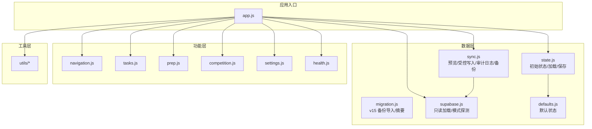
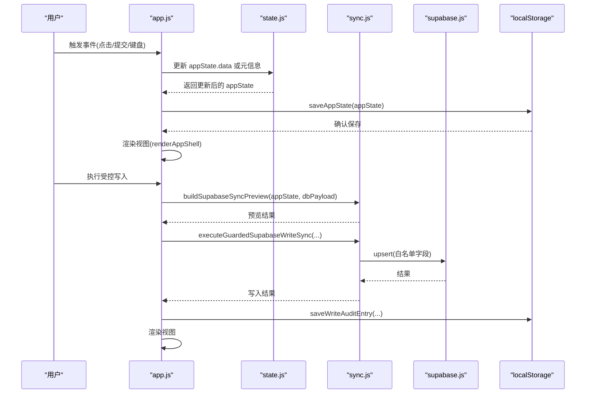
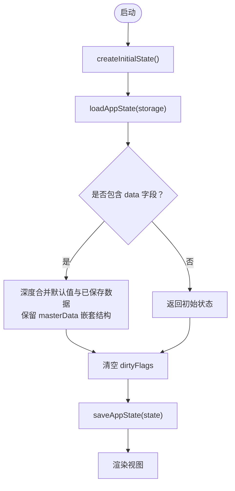
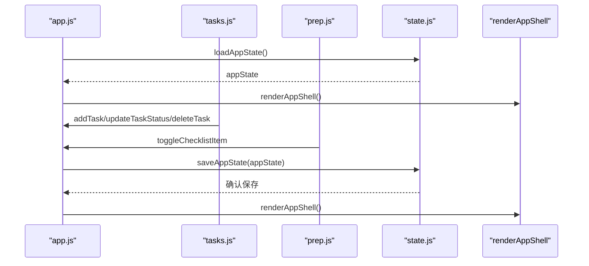
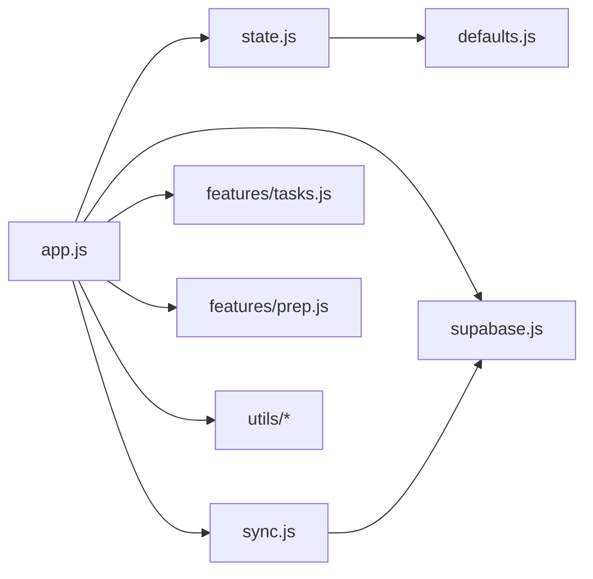
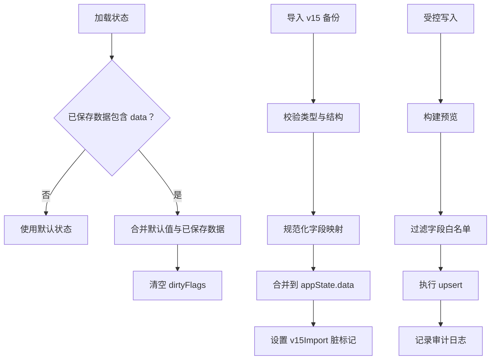

# 状态管理模式

<cite>
**本文引用的文件**
- [state.js](file://v16/src/data/state.js)
- [migration.js](file://v16/src/data/migration.js)
- [sync.js](file://v16/src/data/sync.js)
- [supabase.js](file://v16/src/data/supabase.js)
- [defaults.js](file://v16/src/data/defaults.js)
- [app.js](file://v16/src/app.js)
- [tasks.js](file://v16/src/features/tasks.js)
- [prep.js](file://v16/src/features/prep.js)
- [README.md](file://v16/README.md)
- [MIGRATION_MANIFEST.md](file://v16/MIGRATION_MANIFEST.md)
</cite>

## 目录
1. [简介](#简介)
2. [项目结构](#项目结构)
3. [核心组件](#核心组件)
4. [架构总览](#架构总览)
5. [详细组件分析](#详细组件分析)
6. [依赖关系分析](#依赖关系分析)
7. [性能考量](#性能考量)
8. [故障排查指南](#故障排查指南)
9. [结论](#结论)
10. [附录](#附录)

## 简介
本文件系统性阐述 ROV 任务管理 v16 的状态管理模式，围绕“单一状态树”的设计理念与实现，覆盖应用状态结构、状态更新机制、持久化策略、状态加载/更新/保存/传播流程，以及本地存储与内存状态的同步、序列化/反序列化与版本兼容处理。同时记录状态变更的触发时机与响应机制（用户交互、定时器、异步操作），并提供调试技巧与性能优化建议，最后包含状态重置、回滚与备份恢复的实现细节。

## 项目结构
v16 将 v15 的单体代码拆分为模块化的数据层、功能层与工具层：
- 数据层：默认状态、状态读写、迁移与同步（含 Supabase 只读适配）
- 功能层：导航、任务、准备中心、竞赛、设置等页面与工作流
- 工具层：日期、DOM、国际化等通用工具

图表来源
- [app.js:1-402](file://v16/src/app.js#L1-L402)
- [state.js:1-45](file://v16/src/data/state.js#L1-L45)
- [migration.js:1-100](file://v16/src/data/migration.js#L1-L100)
- [sync.js:1-341](file://v16/src/data/sync.js#L1-L341)
- [supabase.js:1-157](file://v16/src/data/supabase.js#L1-L157)
- [defaults.js:1-46](file://v16/src/data/defaults.js#L1-L46)

章节来源
- [README.md:1-68](file://v16/README.md#L1-L68)
- [MIGRATION_MANIFEST.md:1-76](file://v16/MIGRATION_MANIFEST.md#L1-L76)

## 核心组件
- 单一状态树：以 appState 为核心对象，包含 data（业务数据）、currentPage/currentMode/currentSeason（UI/运行态）与 dirtyFlags（脏标记）。
- 初始状态与默认值：通过 createInitialState 与 DEFAULT_STATE 提供种子数据与默认结构。
- 持久化：localStorage 序列化保存，包含时间戳与关键字段；加载时进行结构合并与兼容处理。
- 迁移：支持从 v15 备份 JSON 导入，规范化字段映射与默认值填充。
- 同步：Supabase 只读加载到本地状态；受控写入（upsert）仅允许 create/update，禁用删除；支持模式探测与字段白名单过滤；提供写入审计日志与本地备份下载。
- 脏标记：每个数据域与全局标志位用于驱动最小化渲染与持久化。

章节来源
- [state.js:6-44](file://v16/src/data/state.js#L6-L44)
- [defaults.js:1-46](file://v16/src/data/defaults.js#L1-L46)
- [migration.js:75-99](file://v16/src/data/migration.js#L75-L99)
- [sync.js:150-205](file://v16/src/data/sync.js#L150-L205)
- [sync.js:221-284](file://v16/src/data/sync.js#L221-L284)
- [sync.js:300-340](file://v16/src/data/sync.js#L300-L340)

## 架构总览
v16 的状态管理遵循“本地优先”原则：所有 UI 与业务逻辑均作用于内存中的 appState，持久化通过 localStorage 实现；Supabase 仅作为只读数据源参与状态合并或受控写入前的对比与验证。

图表来源
- [app.js:189-393](file://v16/src/app.js#L189-L393)
- [state.js:35-44](file://v16/src/data/state.js#L35-L44)
- [sync.js:150-284](file://v16/src/data/sync.js#L150-L284)
- [supabase.js:79-121](file://v16/src/data/supabase.js#L79-L121)

## 详细组件分析

### 单一状态树与初始状态
- 结构组成
  - data：业务数据集合（任务、成员、清单、任务运行、装备等）
  - currentPage/currentMode/currentSeason：页面、模式与赛季标识
  - dirtyFlags：脏标记，按域与全局使用，用于最小化渲染与持久化
- 初始化
  - createInitialState 基于 DEFAULT_STATE 创建深拷贝种子状态
  - loadAppState 从 localStorage 读取并合并，确保 masterData 等嵌套结构安全合并
- 保存
  - saveAppState 将关键字段与时间戳写入 localStorage，并清空 dirtyFlags

图表来源
- [state.js:6-33](file://v16/src/data/state.js#L6-L33)
- [defaults.js:1-46](file://v16/src/data/defaults.js#L1-L46)

章节来源
- [state.js:6-44](file://v16/src/data/state.js#L6-L44)
- [defaults.js:1-46](file://v16/src/data/defaults.js#L1-L46)

### 状态加载、更新、保存与传播
- 加载：应用启动时调用 loadAppState，若无保存则使用默认状态
- 更新：各功能模块直接修改 appState.data 对象，设置对应 dirtyFlags
- 保存：统一在 persistAndRender 中调用 saveAppState 与 saveMasterData，随后渲染
- 传播：renderAppShell 统一渲染当前页面与侧边栏，settings 页面额外注入健康检查、数据库状态、同步预览、写入结果等上下文

图表来源
- [app.js:38-64](file://v16/src/app.js#L38-L64)
- [tasks.js:19-37](file://v16/src/features/tasks.js#L19-L37)
- [prep.js:5-11](file://v16/src/features/prep.js#L5-L11)
- [state.js:35-44](file://v16/src/data/state.js#L35-L44)

章节来源
- [app.js:38-131](file://v16/src/app.js#L38-L131)
- [tasks.js:19-37](file://v16/src/features/tasks.js#L19-L37)
- [prep.js:5-11](file://v16/src/features/prep.js#L5-L11)
- [state.js:35-44](file://v16/src/data/state.js#L35-L44)

### 本地存储与内存状态的同步机制
- 序列化/反序列化
  - 保存：JSON.stringify 包含 data、页面/模式/赛季、保存时间戳
  - 加载：safeJsonParse 解析失败时回退到默认状态
- 版本兼容
  - 迁移：importV15BackupPayload 将 v15 备份 JSON 规范化为 v16 字段，汇总统计
  - 回滚：restoreLocalBackupPayload 支持从 v16 本地备份 JSON 恢复状态
- 脏标记
  - 各模块在变更后设置对应 dirtyFlags，保存时清空，避免不必要的持久化

章节来源
- [state.js:16-33](file://v16/src/data/state.js#L16-L33)
- [migration.js:75-99](file://v16/src/data/migration.js#L75-L99)
- [sync.js:190-205](file://v16/src/data/sync.js#L190-L205)

### 状态变更的触发时机与响应机制
- 用户交互
  - 导航切换：data-page 属性触发 setPage，保存并渲染
  - 表单提交：新增任务，保存并渲染
  - 状态变更：任务状态选择框、清单项勾选，保存并渲染
  - 设置操作：主数据增删、导入导出、v15/v16 备份导入
- 定时器
  - 竞赛计时器：start/pause/reset 控制运行秒数，每秒渲染一次
- 异步操作
  - Supabase 只读加载：并发查询多表，成功后合并到 appState，清空预览与写入结果
  - 模式探测：逐表探测列存在性，生成覆盖率报告
  - 受控写入：下载本地备份，执行 upsert，记录审计日志，必要时重新加载 DB 并对比

章节来源
- [app.js:141-177](file://v16/src/app.js#L141-L177)
- [app.js:189-393](file://v16/src/app.js#L189-L393)

### 状态重置、回滚与备份恢复
- v15 备份导入
  - importV15BackupPayload 校验类型，规范化字段，合并到 appState.data，并设置 v15Import 脏标记
- v16 本地备份恢复
  - restoreLocalBackupPayload 校验类型与数据，恢复季节与数据，并设置 rollback 脏标记
- 本地备份导出
  - downloadLocalBackup 生成 rov_v16_local_backup JSON，包含版本、导出时间、季节与数据

章节来源
- [migration.js:75-99](file://v16/src/data/migration.js#L75-L99)
- [sync.js:190-205](file://v16/src/data/sync.js#L190-L205)
- [sync.js:207-219](file://v16/src/data/sync.js#L207-L219)

### 受控写入与审计日志
- 预览构建
  - buildSupabaseSyncPreview 计算本地与远程差异，输出 create/update/remove 数量与详情
- 写入执行
  - executeGuardedSupabaseWriteSync 要求确认文本，限制表白名单，过滤字段白名单，执行 upsert，禁止删除
- 审计日志
  - buildWriteAuditEntry 汇总预览、结果、丢弃字段与后写入预览
  - saveWriteAuditEntry 保存最近 20 条记录

章节来源
- [sync.js:150-178](file://v16/src/data/sync.js#L150-L178)
- [sync.js:221-284](file://v16/src/data/sync.js#L221-L284)
- [sync.js:286-298](file://v16/src/data/sync.js#L286-L298)
- [sync.js:300-340](file://v16/src/data/sync.js#L300-L340)

### Supabase 只读适配与模式探测
- 只读加载
  - loadSupabaseReadOnly 并发查询多表，规范化数据，合并到 appState.data
- 模式探测
  - probeSupabaseSchema 对候选列逐一探测，返回每表存在的列、缺失的列与覆盖率

章节来源
- [supabase.js:79-121](file://v16/src/data/supabase.js#L79-L121)
- [supabase.js:131-156](file://v16/src/data/supabase.js#L131-L156)

## 依赖关系分析

图表来源
- [app.js:1-15](file://v16/src/app.js#L1-L15)
- [state.js:1-2](file://v16/src/data/state.js#L1-L2)
- [sync.js:1-17](file://v16/src/data/sync.js#L1-L17)
- [supabase.js:1-29](file://v16/src/data/supabase.js#L1-L29)
- [defaults.js:1](file://v16/src/data/defaults.js#L1)

章节来源
- [app.js:1-15](file://v16/src/app.js#L1-L15)

## 性能考量
- 最小化渲染与持久化
  - 使用 dirtyFlags 标记变更域，仅在需要时保存与渲染，降低 localStorage 写入频率
- 并发加载
  - Supabase 只读加载采用 Promise.allSettled 并行查询，缩短等待时间
- 字段白名单与模式探测
  - 在受控写入前过滤不匹配字段，减少无效写入与错误
- 审计日志容量控制
  - 仅保留最近 20 条写入审计条目，避免日志膨胀

章节来源
- [app.js:60-64](file://v16/src/app.js#L60-L64)
- [supabase.js:82-103](file://v16/src/data/supabase.js#L82-L103)
- [sync.js:120-125](file://v16/src/data/sync.js#L120-L125)
- [sync.js:308-317](file://v16/src/data/sync.js#L308-L317)

## 故障排查指南
- 状态加载失败
  - 检查 localStorage 中的键值是否为合法 JSON；若解析失败，将回退到默认状态
- v15 备份导入异常
  - 确认备份文件类型为 v15 备份；检查字段映射与默认值填充是否正确
- 受控写入失败
  - 确认输入确认文本；检查表白名单与字段白名单；查看审计日志中的错误详情
- 模式探测异常
  - 确认 Supabase 凭据可用；检查候选列是否存在；关注探测耗时与覆盖率
- 定时器异常
  - 检查 timer 状态与 interval 是否正确清理；确保每秒渲染触发正常

章节来源
- [state.js:16-18](file://v16/src/data/state.js#L16-L18)
- [migration.js:75-78](file://v16/src/data/migration.js#L75-L78)
- [sync.js:221-234](file://v16/src/data/sync.js#L221-L234)
- [supabase.js:131-156](file://v16/src/data/supabase.js#L131-L156)
- [app.js:147-171](file://v16/src/app.js#L147-L171)

## 结论
v16 的状态管理模式以“单一状态树 + 本地优先 + 受控同步”为核心，通过明确的加载/更新/保存/传播流程、完善的迁移与回滚机制、严格的字段白名单与模式探测，确保了状态的一致性与可维护性。配合脏标记与最小化渲染策略，有效提升了性能与用户体验。

## 附录
- 关键流程图（算法实现）
  - 状态加载与合并
  - v15 备份导入与摘要
  - 受控写入与审计日志
  - 模式探测与字段过滤

图表来源
- [state.js:16-33](file://v16/src/data/state.js#L16-L33)
- [migration.js:75-99](file://v16/src/data/migration.js#L75-L99)
- [sync.js:150-284](file://v16/src/data/sync.js#L150-L284)
- [sync.js:300-340](file://v16/src/data/sync.js#L300-L340)