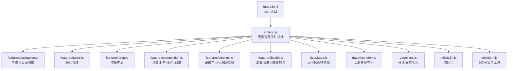
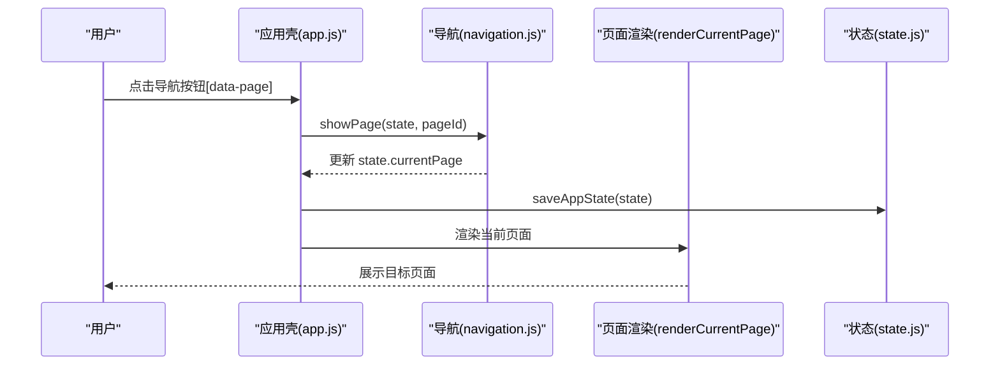
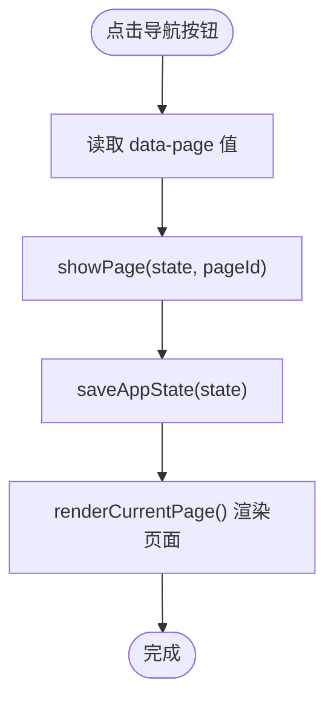
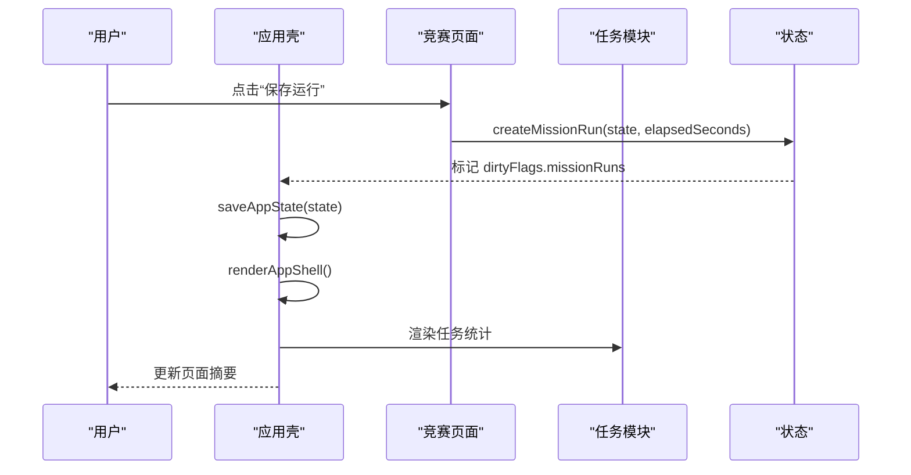
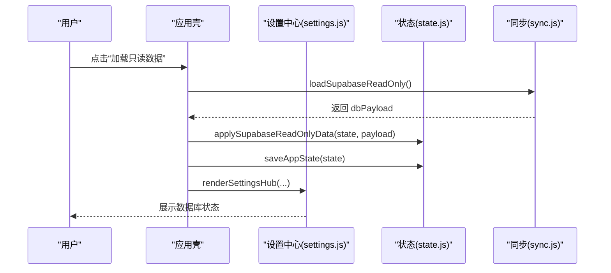
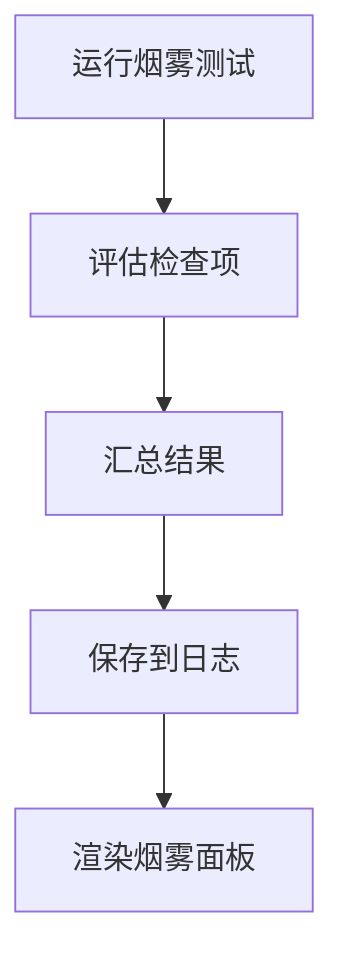
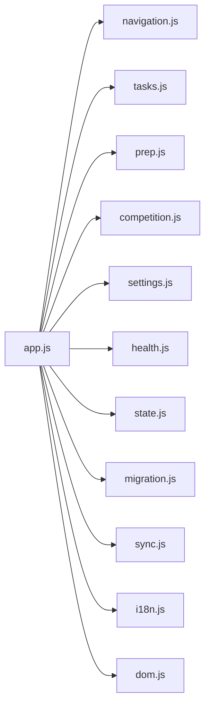

# 组件交互模式

<cite>
**本文引用的文件**
- [index.html](file://index.html)
- [app.js](file://src/app.js)
- [navigation.js](file://src/features/navigation.js)
- [tasks.js](file://src/features/tasks.js)
- [prep.js](file://src/features/prep.js)
- [competition.js](file://src/features/competition.js)
- [settings.js](file://src/features/settings.js)
- [health.js](file://src/features/health.js)
- [state.js](file://src/data/state.js)
- [defaults.js](file://src/data/defaults.js)
- [migration.js](file://src/data/migration.js)
- [sync.js](file://src/data/sync.js)
- [i18n.js](file://src/utils/i18n.js)
- [dom.js](file://src/utils/dom.js)
</cite>

## 目录
1. [引言](#引言)
2. [项目结构](#项目结构)
3. [核心组件](#核心组件)
4. [架构总览](#架构总览)
5. [组件详细分析](#组件详细分析)
6. [依赖关系分析](#依赖关系分析)
7. [性能考量](#性能考量)
8. [故障排查指南](#故障排查指南)
9. [结论](#结论)
10. [附录](#附录)

## 引言
本文件系统化梳理 ROV 任务管理 v16 的组件交互模式，覆盖页面组件、功能组件与 UI 组件的职责边界与协作方式；解释导航组件与页面组件的切换逻辑（含路由状态管理与渲染流程）；阐述任务管理与竞赛指挥等模块间的数据共享与状态同步；记录组件生命周期管理（初始化、更新、销毁）；给出组件解耦最佳实践（依赖注入与接口抽象）；提供测试策略与调试技巧；并总结组件复用与扩展的设计原则。

## 项目结构
v16 采用“单页应用 + 功能域划分”的组织方式：入口 HTML 加载应用脚本，应用脚本集中编排状态、导航、页面渲染与事件处理；数据层负责状态持久化、迁移与与 Supabase 的只读/受控写入；各功能域以纯函数形式暴露渲染器与业务方法，便于组合与测试。

图表来源
- [index.html:1-15](file://index.html#L1-L15)
- [app.js:1-402](file://src/app.js#L1-L402)

章节来源
- [index.html:1-15](file://index.html#L1-L15)
- [app.js:1-402](file://src/app.js#L1-L402)

## 核心组件
- 应用壳与事件总线：负责状态加载、页面渲染、事件分发与持久化。
- 导航组件：维护当前页面标识，驱动页面切换。
- 页面组件：按需渲染 Dashboard、Prep、Tasks、Competition、Settings。
- 功能组件：任务 CRUD、准备清单切换、竞赛计时与运行记录、设置中心、烟雾测试。
- 数据层：状态持久化、默认数据、迁移、Supabase 只读/受控写入。
- 工具层：国际化、DOM 安全与通用工具。

章节来源
- [app.js:38-187](file://src/app.js#L38-L187)
- [navigation.js:3-37](file://src/features/navigation.js#L3-L37)
- [tasks.js:19-112](file://src/features/tasks.js#L19-L112)
- [prep.js:5-58](file://src/features/prep.js#L5-L58)
- [competition.js:6-68](file://src/features/competition.js#L6-L68)
- [settings.js:156-537](file://src/features/settings.js#L156-L537)
- [health.js:14-127](file://src/features/health.js#L14-L127)
- [state.js:6-45](file://src/data/state.js#L6-L45)
- [migration.js:75-100](file://src/data/migration.js#L75-L100)
- [sync.js:150-341](file://src/data/sync.js#L150-L341)
- [i18n.js:204-217](file://src/utils/i18n.js#L204-L217)
- [dom.js:1-21](file://src/utils/dom.js#L1-L21)

## 架构总览
应用采用“状态驱动渲染”的单向数据流：应用壳加载初始状态，渲染导航与当前页面；用户交互通过事件委托触发业务函数修改状态，随后统一保存并重新渲染。导航组件仅负责切换 currentPage，不直接操作 DOM 内容，实现低耦合。

图表来源
- [app.js:141-145](file://src/app.js#L141-L145)
- [navigation.js:3-6](file://src/features/navigation.js#L3-L6)
- [state.js:35-44](file://src/data/state.js#L35-L44)

## 组件详细分析

### 导航与页面切换
- 切换逻辑：点击导航按钮触发事件，调用 showPage 修改 currentPage，保存状态后统一渲染。
- 页面选择：renderCurrentPage 根据 currentPage 返回对应页面片段或仪表盘。
- 国际化：导航栏包含语言切换按钮，切换后重绘导航与页面。

图表来源
- [app.js:189-200](file://src/app.js#L189-L200)
- [app.js:104-112](file://src/app.js#L104-L112)
- [navigation.js:3-6](file://src/features/navigation.js#L3-L6)

章节来源
- [app.js:141-145](file://src/app.js#L141-L145)
- [app.js:104-112](file://src/app.js#L104-L112)
- [navigation.js:13-37](file://src/features/navigation.js#L13-L37)

### 任务管理与竞赛指挥的数据共享
- 共享点：任务列表用于多个页面统计与展示；竞赛计时器与任务状态共同影响页面摘要。
- 同步方式：状态对象在内存中共享，任一功能模块修改后统一保存并渲染。
- 计时器：全局 timer 对象跨页面使用，开始/暂停/重置通过事件触发，每秒刷新一次外壳。

图表来源
- [app.js:339-343](file://src/app.js#L339-L343)
- [competition.js:6-19](file://src/features/competition.js#L6-L19)
- [tasks.js:39-48](file://src/features/tasks.js#L39-L48)

章节来源
- [app.js:147-177](file://src/app.js#L147-L177)
- [competition.js:38-68](file://src/features/competition.js#L38-L68)
- [tasks.js:84-112](file://src/features/tasks.js#L84-L112)

### 设置中心与系统控制
- 设置中心作为独立页面，由应用壳在 currentPage 为 settings 时挂载。
- 提供 Master Data 管理、Supabase 只读加载、Schema 探测、同步预览、受控写入、回滚、迁移等功能。
- 所有变更均通过状态持久化与统一渲染体现。

图表来源
- [app.js:226-242](file://src/app.js#L226-L242)
- [settings.js:156-537](file://src/features/settings.js#L156-L537)
- [sync.js:150-178](file://src/data/sync.js#L150-L178)

章节来源
- [app.js:114-131](file://src/app.js#L114-L131)
- [settings.js:156-537](file://src/features/settings.js#L156-L537)

### 烟雾测试与健康检查
- 运行烟雾测试：评估关键 DOM 节点是否存在，记录结果到本地存储。
- 健康检查：基于 Master Data 与实体数据生成健康问题列表，用于仪表盘与设置中心提示。

图表来源
- [health.js:37-54](file://src/features/health.js#L37-L54)
- [health.js:96-122](file://src/features/health.js#L96-L122)
- [health.js:56-84](file://src/features/health.js#L56-L84)

章节来源
- [health.js:14-127](file://src/features/health.js#L14-L127)

### 准备中心与清单切换
- 支持两类清单：常规检查清单与 Pre-Dive 检查清单。
- 切换行为：toggleChecklistItem 修改对应条目 done 状态并标记脏位，统一保存与渲染。

章节来源
- [prep.js:5-11](file://src/features/prep.js#L5-L11)
- [prep.js:25-58](file://src/features/prep.js#L25-L58)

### 数据层与状态持久化
- 初始状态：从默认数据克隆，合并已保存状态，确保字段完整性。
- 持久化：保存时仅序列化必要字段，清理脏位标志。
- 默认数据：包含种子任务、成员、清单、装备与主数据模板。

章节来源
- [state.js:6-45](file://src/data/state.js#L6-L45)
- [defaults.js:1-46](file://src/data/defaults.js#L1-L46)

### 迁移与回滚
- v15 备份导入：标准化 v15 字段映射，替换当前状态数据。
- v16 备份回滚：从本地备份恢复完整状态。
- 迁移摘要：统计导入前后实体数量变化。

章节来源
- [migration.js:75-100](file://src/data/migration.js#L75-L100)
- [sync.js:190-205](file://src/data/sync.js#L190-L205)

### 受控写入与审计
- 只读预览：比较本地状态与上次只读加载数据，生成创建/更新/删除差异概览。
- 受控写入：白名单表与字段过滤，冲突键 upsert，禁用删除。
- 审计日志：记录每次写入前后的预览、结果与丢弃字段。

章节来源
- [sync.js:150-284](file://src/data/sync.js#L150-L284)
- [sync.js:300-341](file://src/data/sync.js#L300-L341)

## 依赖关系分析
- 应用壳依赖所有功能模块与数据模块，形成“中心辐射式”耦合，便于统一调度。
- 功能模块之间无直接依赖，通过共享状态对象进行协作，降低耦合度。
- 工具模块被广泛使用，承担安全转义与本地化职责。

图表来源
- [app.js:1-37](file://src/app.js#L1-L37)
- [navigation.js:1-37](file://src/features/navigation.js#L1-L37)
- [tasks.js:1-4](file://src/features/tasks.js#L1-L4)
- [prep.js:1-3](file://src/features/prep.js#L1-L3)
- [competition.js:1-4](file://src/features/competition.js#L1-L4)
- [settings.js:1-3](file://src/features/settings.js#L1-L3)
- [health.js:1-3](file://src/features/health.js#L1-L3)
- [state.js:1-3](file://src/data/state.js#L1-L3)
- [migration.js:1-3](file://src/data/migration.js#L1-L3)
- [sync.js:1-11](file://src/data/sync.js#L1-L11)
- [i18n.js:1-3](file://src/utils/i18n.js#L1-L3)
- [dom.js:1-3](file://src/utils/dom.js#L1-L3)

## 性能考量
- 渲染粒度：页面级重渲染，适合小体量数据；若任务量增长，可考虑细粒度组件拆分与虚拟滚动。
- 事件委托：统一在应用壳根节点监听，减少事件绑定开销。
- 定时器：仅在竞赛页面使用，按秒刷新外壳，避免频繁重渲染。
- 持久化：保存时清理脏位，避免重复序列化。

## 故障排查指南
- 事件未生效：确认事件目标是否带有 data-* 属性；检查事件委托分支是否命中。
- 页面不更新：确认状态修改后是否调用保存与渲染；检查脏位是否被清空。
- 受控写入失败：核对确认文本、所选表、Schema 白名单与字段合法性；查看审计日志。
- 回滚无效：确认备份文件类型与格式；检查恢复后脏位与时间戳。

章节来源
- [app.js:189-393](file://src/app.js#L189-L393)
- [sync.js:221-284](file://src/data/sync.js#L221-L284)
- [sync.js:300-341](file://src/data/sync.js#L300-L341)

## 结论
v16 通过“状态驱动渲染 + 功能模块解耦”的设计，在保持简单易维护的同时，提供了完整的任务管理、准备中心、竞赛计时与设置中心能力。导航与页面切换清晰、数据共享自然、受控写入安全可控。建议后续在任务量增大时引入更细粒度的组件化与缓存策略，以进一步提升性能与可维护性。

## 附录

### 组件生命周期管理
- 初始化：加载初始状态与主数据，渲染应用壳与页面。
- 更新：事件触发业务函数修改状态，保存并统一渲染。
- 销毁：当前实现为单页应用，无需显式销毁；卸载时注意清理定时器与事件监听。

章节来源
- [app.js:38-64](file://src/app.js#L38-L64)
- [app.js:147-177](file://src/app.js#L147-L177)

### 组件解耦最佳实践
- 依赖注入：将 Supabase 客户端、本地存储等外部依赖作为参数传入，便于测试替身。
- 接口抽象：以纯函数形式暴露渲染器与业务方法，避免直接依赖 DOM。
- 状态收敛：统一通过状态对象传递数据，避免跨模块直接访问。

章节来源
- [app.js:262-299](file://src/app.js#L262-L299)
- [sync.js:221-284](file://src/data/sync.js#L221-L284)

### 组件测试策略与调试技巧
- 单元测试：针对纯函数（如 diff、渲染器）编写断言，验证输入输出。
- 集成测试：模拟事件触发与状态变更，验证渲染一致性。
- 调试技巧：利用浏览器断点观察状态对象变化；在设置中心查看审计日志与 Schema 探测结果；通过烟雾测试快速定位页面缺失。

章节来源
- [health.js:37-54](file://src/features/health.js#L37-L54)
- [settings.js:156-537](file://src/features/settings.js#L156-L537)

### 组件复用与扩展设计原则
- 复用：将通用 UI 片段（如卡片、表格、徽章）抽取为可复用渲染函数。
- 扩展：新增页面时遵循现有渲染与事件处理模式，保持一致的命名与数据结构。

章节来源
- [tasks.js:50-82](file://src/features/tasks.js#L50-L82)
- [settings.js:521-537](file://src/features/settings.js#L521-L537)