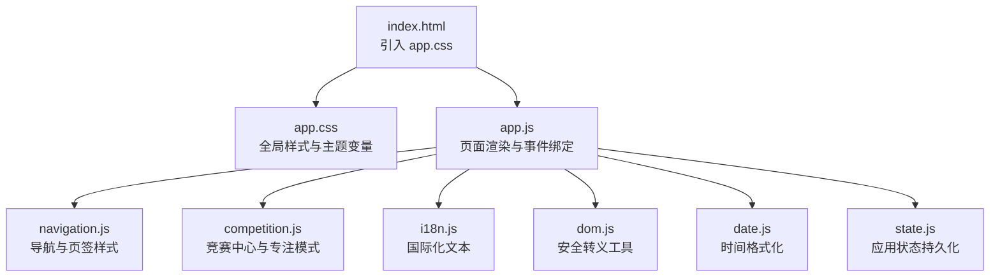
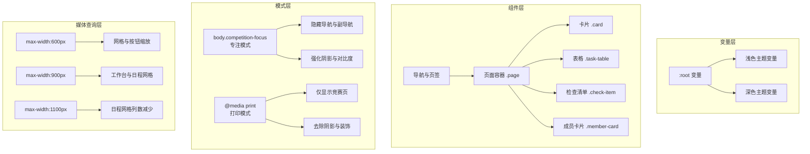
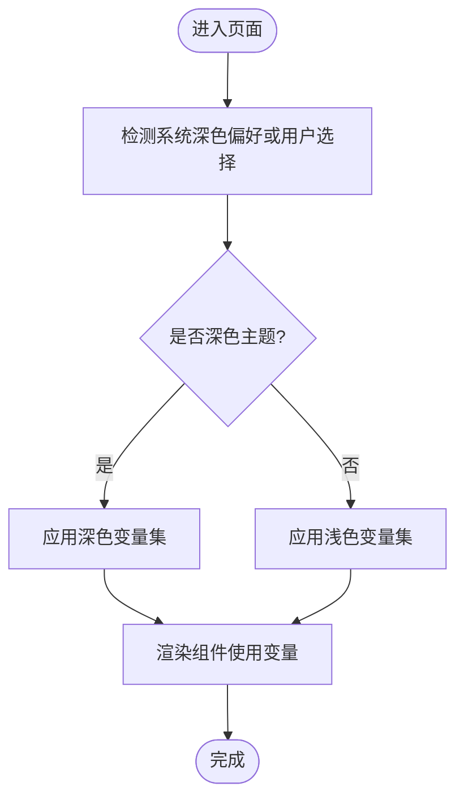
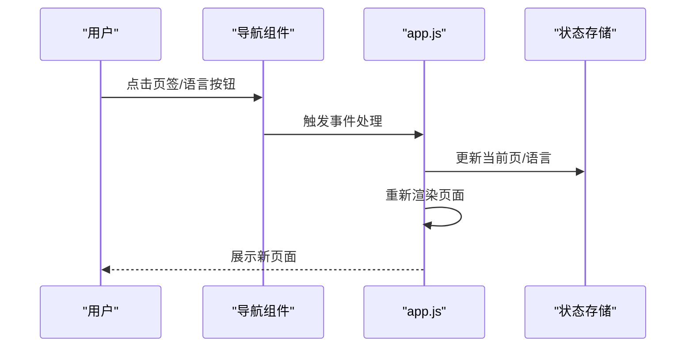
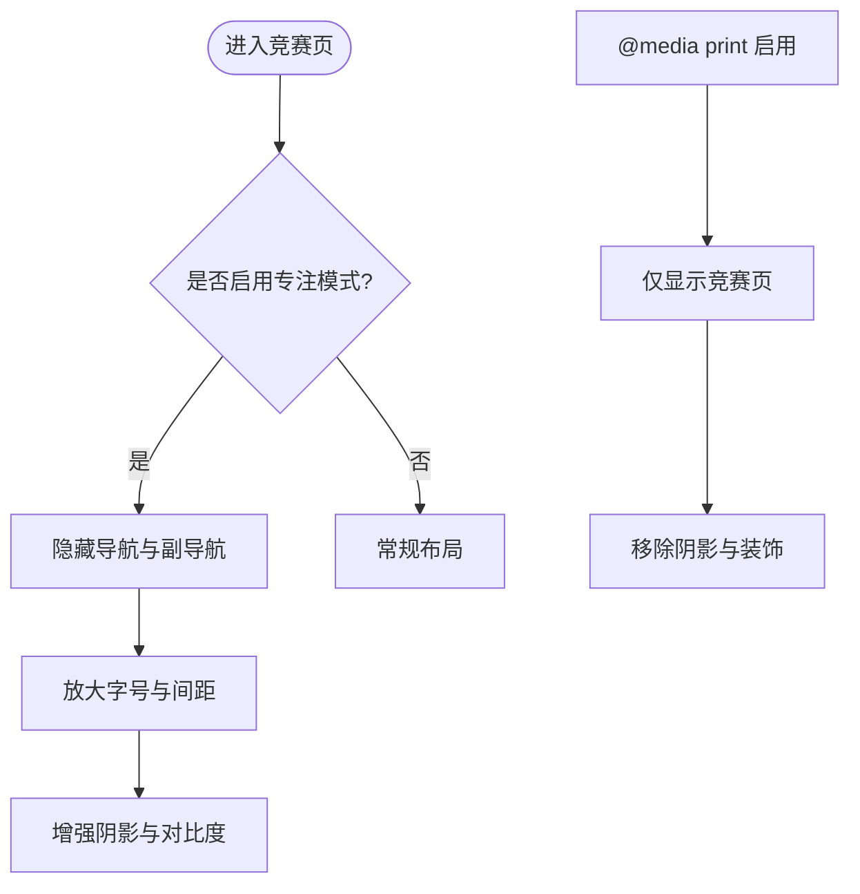
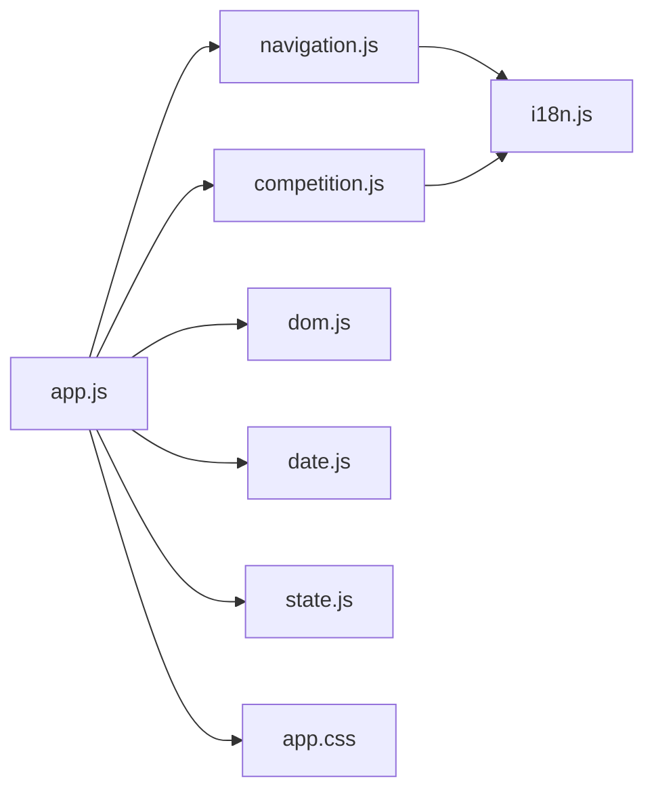

# 样式系统设计

<cite>
**本文引用的文件列表**
- [index.html](file://v16/index.html)
- [app.css](file://v16/styles/app.css)
- [app.js](file://v16/src/app.js)
- [navigation.js](file://v16/src/features/navigation.js)
- [competition.js](file://v16/src/features/competition.js)
- [i18n.js](file://v16/src/utils/i18n.js)
- [dom.js](file://v16/src/utils/dom.js)
- [date.js](file://v16/src/utils/date.js)
- [state.js](file://v16/src/data/state.js)
</cite>

## 目录
1. [简介](#简介)
2. [项目结构](#项目结构)
3. [核心组件](#核心组件)
4. [架构总览](#架构总览)
5. [详细组件分析](#详细组件分析)
6. [依赖关系分析](#依赖关系分析)
7. [性能考量](#性能考量)
8. [故障排查指南](#故障排查指南)
9. [结论](#结论)
10. [附录](#附录)

## 简介
本文件面向设计师与开发者，系统化阐述 ROV 任务管理 v16 的样式系统设计。内容覆盖主题系统（含深色/浅色与竞赛专注模式）、响应式设计策略、CSS 架构与组织方式、颜色与字体体系、布局设计原则、竞赛模式下的特殊样式需求，以及样式定制、浏览器兼容性、性能优化与维护策略等最佳实践。目标是帮助团队在保持一致性的同时，高效扩展与迭代界面风格。

## 项目结构
v16 的样式系统以单一入口 CSS 文件为核心，通过 HTML 引入并由 JavaScript 控制页面渲染与交互。整体采用“原子化 + 组件化”的类名组织方式，配合 CSS 变量实现主题切换与模式化样式。

图表来源
- [index.html:1-15](file://v16/index.html#L1-L15)
- [app.css:1-429](file://v16/styles/app.css#L1-L429)
- [app.js:1-402](file://v16/src/app.js#L1-L402)
- [navigation.js:1-37](file://v16/src/features/navigation.js#L1-L37)
- [competition.js:1-68](file://v16/src/features/competition.js#L1-L68)
- [i18n.js:1-217](file://v16/src/utils/i18n.js#L1-L217)
- [dom.js:1-21](file://v16/src/utils/dom.js#L1-L21)
- [date.js:1-55](file://v16/src/utils/date.js#L1-L55)
- [state.js:1-45](file://v16/src/data/state.js#L1-L45)

章节来源
- [index.html:1-15](file://v16/index.html#L1-L15)
- [app.css:1-429](file://v16/styles/app.css#L1-L429)
- [app.js:1-402](file://v16/src/app.js#L1-L402)

## 核心组件
- 主题系统：基于 CSS 自定义属性（CSS 变量）定义颜色、阴影、背景等基础变量，并通过媒体查询与数据属性选择器实现浅色/深色主题切换与竞赛专注模式。
- 导航与页签：使用统一按钮样式与激活态高亮，支持语言切换与页签切换。
- 页面布局：卡片网格、统计卡片、任务表格、检查清单、成员卡片等，均采用一致的边框、阴影与间距规范。
- 竞赛模式：提供“专注模式”与“打印模式”，针对大屏展示与现场操作进行视觉强化与信息层级调整。
- 响应式设计：在移动端与小屏设备上自动调整网格、按钮尺寸与布局密度，确保可用性与可读性。

章节来源
- [app.css:1-429](file://v16/styles/app.css#L1-L429)
- [navigation.js:21-37](file://v16/src/features/navigation.js#L21-L37)
- [competition.js:38-68](file://v16/src/features/competition.js#L38-L68)

## 架构总览
样式系统采用“变量驱动 + 类名组织 + 模式化覆盖”的架构：
- 变量层：在根元素与主题容器上集中声明变量，保证全局一致性与可替换性。
- 组件层：以语义化类名组织页面元素，如 .card、.page、.btn 等，避免内联样式的蔓延。
- 模式层：通过 body 上的类或数据属性（如 competition-focus）对组件进行局部覆盖，实现竞赛模式与打印模式的差异化表现。
- 媒体查询层：在关键断点处调整布局与排版，确保跨设备体验一致。

图表来源
- [app.css:1-429](file://v16/styles/app.css#L1-L429)

## 详细组件分析

### 主题系统与颜色体系
- 变量定义：在根元素与主题选择器中集中定义主色、辅助色、背景、文字、边框、阴影、输入背景与悬停态等变量，便于统一替换与扩展。
- 深色/浅色主题：通过媒体查询与数据属性选择器分别定义两套变量值；默认浅色，深色主题在暗色偏好或显式选择时生效。
- 颜色语义：红、橙、黄、绿、蓝、灰等用于状态提示（紧急、高优先级、完成、成功、悬停等），并配套徽章与标签使用。

图表来源
- [app.css:11-34](file://v16/styles/app.css#L11-L34)

章节来源
- [app.css:1-429](file://v16/styles/app.css#L1-L429)

### 字体系统与排版
- 字体族：默认使用系统字体栈，兼顾中英文显示与可读性。
- 排版层级：标题、段落、标签、按钮等采用统一字号与字重规范，强调信息层级与对比度。
- 数值与等宽字体：计时器与分数使用等宽数字，提升现场可读性与一致性。

章节来源
- [app.css:10-11](file://v16/styles/app.css#L10-L11)
- [app.css:80-88](file://v16/styles/app.css#L80-L88)

### 导航与页签样式
- 导航栏：固定顶部、带阴影，按钮采用统一的圆角与过渡动画，激活态高亮。
- 页签：支持语言切换与页面跳转，点击后更新当前页并持久化状态。

图表来源
- [navigation.js:21-37](file://v16/src/features/navigation.js#L21-L37)
- [app.js:141-145](file://v16/src/app.js#L141-L145)
- [state.js:35-44](file://v16/src/data/state.js#L35-L44)

章节来源
- [navigation.js:1-37](file://v16/src/features/navigation.js#L1-L37)
- [app.js:141-145](file://v16/src/app.js#L141-L145)
- [state.js:1-45](file://v16/src/data/state.js#L1-L45)

### 页面布局与卡片系统
- 页面容器：.page 控制最大宽度与居中，激活页显示。
- 卡片系统：.card 提供统一的圆角、阴影与内边距；统计卡片与竞赛卡片在边框颜色与布局上区分场景。
- 表格与交互：任务表格采用悬停高亮与状态着色，输入控件与按钮遵循一致的圆角与过渡。

章节来源
- [app.css:55-69](file://v16/styles/app.css#L55-L69)
- [app.css:191-214](file://v16/styles/app.css#L191-L214)
- [app.css:215-227](file://v16/styles/app.css#L215-L227)

### 竞赛模式样式与特殊需求
- 专注模式：通过 body.competition-focus 切换到全屏大字、高对比度与极简布局，隐藏导航与副导航，强化计时器与分数区域。
- 打印模式：在 @media print 下仅显示竞赛页，移除非必要元素，降低阴影与装饰，保证纸质输出清晰。
- 计时器与分数：使用等宽数字与醒目标识，超时状态添加闪烁动画，提升现场警示效果。
- 实时状态：通过类名切换控制警告条与状态卡片的可见性与颜色。

图表来源
- [app.css:111-176](file://v16/styles/app.css#L111-L176)
- [app.css:368-378](file://v16/styles/app.css#L368-L378)

章节来源
- [app.css:111-176](file://v16/styles/app.css#L111-L176)
- [app.css:368-378](file://v16/styles/app.css#L368-L378)
- [competition.js:38-68](file://v16/src/features/competition.js#L38-L68)

### 响应式设计策略
- 断点与网格：在不同断点下调整网格列数、按钮弹性与布局密度，确保移动端与小屏设备的可用性。
- 移动端优化：导航换行、页签自适应、命令栏与计分板在小屏下改为单列布局，避免横向滚动。
- 表格与列表：在窄屏下通过网格与折叠方式呈现，保持信息完整性。

章节来源
- [app.css:368-428](file://v16/styles/app.css#L368-L428)

### 数据与国际化对样式的影响
- 国际化文本：通过 i18n.js 提供多语言文本，渲染时直接注入到 HTML 中，样式层不感知语言差异。
- 安全渲染：dom.js 提供 HTML 转义，避免 XSS 对样式与布局造成破坏。
- 时间格式：date.js 提供竞赛计时格式化，确保计时器显示符合预期。

章节来源
- [i18n.js:1-217](file://v16/src/utils/i18n.js#L1-L217)
- [dom.js:1-21](file://v16/src/utils/dom.js#L1-L21)
- [date.js:46-54](file://v16/src/utils/date.js#L46-L54)

## 依赖关系分析
样式系统与业务模块的耦合关系主要体现在：
- app.js 渲染页面并绑定事件，间接影响样式类名的切换（如竞赛专注模式）。
- navigation.js 与 competition.js 分别负责导航与竞赛页的渲染，依赖 i18n 文本与 dom 工具。
- 状态持久化（state.js）影响页面初始状态，从而影响样式渲染结果。

图表来源
- [app.js:1-402](file://v16/src/app.js#L1-L402)
- [navigation.js:1-37](file://v16/src/features/navigation.js#L1-L37)
- [competition.js:1-68](file://v16/src/features/competition.js#L1-L68)
- [i18n.js:1-217](file://v16/src/utils/i18n.js#L1-L217)
- [dom.js:1-21](file://v16/src/utils/dom.js#L1-L21)
- [date.js:1-55](file://v16/src/utils/date.js#L1-L55)
- [state.js:1-45](file://v16/src/data/state.js#L1-L45)
- [app.css:1-429](file://v16/styles/app.css#L1-L429)

章节来源
- [app.js:1-402](file://v16/src/app.js#L1-L402)
- [navigation.js:1-37](file://v16/src/features/navigation.js#L1-L37)
- [competition.js:1-68](file://v16/src/features/competition.js#L1-L68)
- [i18n.js:1-217](file://v16/src/utils/i18n.js#L1-L217)
- [dom.js:1-21](file://v16/src/utils/dom.js#L1-L21)
- [date.js:1-55](file://v16/src/utils/date.js#L1-L55)
- [state.js:1-45](file://v16/src/data/state.js#L1-L45)
- [app.css:1-429](file://v16/styles/app.css#L1-L429)

## 性能考量
- CSS 变量与选择器：通过变量集中管理颜色与阴影，减少重复定义，降低维护成本与体积。
- 媒体查询：在关键断点处调整布局，避免过度嵌套与复杂选择器，提升渲染效率。
- 动画与闪烁：计时器与警告条的动画仅在特定状态下触发，避免不必要的重绘。
- 按需加载：CSS 作为静态资源按需加载，无动态样式注入，减少运行时开销。
- 建议：尽量复用现有类名，避免在 JS 中动态拼接内联样式；在新增组件时遵循既有命名规范，保持选择器简洁。

[本节为通用建议，无需引用具体文件]

## 故障排查指南
- 主题不生效
  - 检查系统深色偏好或手动设置的数据属性是否正确；确认 :root 与 [data-theme] 的变量定义完整。
  - 参考路径：[app.css:11-34](file://v16/styles/app.css#L11-L34)
- 竞赛专注模式异常
  - 确认 body 是否包含 competition-focus 类；检查打印模式与专注模式的条件选择器是否冲突。
  - 参考路径：[app.css:111-176](file://v16/styles/app.css#L111-L176)
- 移动端布局错乱
  - 检查断点与网格规则是否覆盖目标屏幕宽度；确认按钮与输入控件的最小尺寸与弹性设置。
  - 参考路径：[app.css:368-428](file://v16/styles/app.css#L368-L428)
- 文本被截断或溢出
  - 使用合适的换行与省略策略；对长文本容器设置最大宽度与换行规则。
  - 参考路径：[app.css:213-214](file://v16/styles/app.css#L213-L214)
- 国际化导致布局变化
  - 确保文本长度变化不会影响布局；必要时为长文本预留空间或使用缩写。
  - 参考路径：[i18n.js:1-217](file://v16/src/utils/i18n.js#L1-L217)

章节来源
- [app.css:11-34](file://v16/styles/app.css#L11-L34)
- [app.css:111-176](file://v16/styles/app.css#L111-L176)
- [app.css:368-428](file://v16/styles/app.css#L368-L428)
- [app.css:213-214](file://v16/styles/app.css#L213-L214)
- [i18n.js:1-217](file://v16/src/utils/i18n.js#L1-L217)

## 结论
v16 的样式系统以 CSS 变量为核心，结合类名组织与模式化覆盖，实现了主题灵活、布局清晰、响应性强的设计目标。竞赛模式与打印模式通过条件选择器实现差异化展示，满足现场与纸质输出的需求。建议在后续迭代中持续遵循现有命名与组织规范，保持变量与组件的一致性，进一步优化动画与交互细节，提升整体用户体验。

[本节为总结性内容，无需引用具体文件]

## 附录
- 样式定制指南
  - 新增颜色：在 :root 或主题选择器中定义变量，避免直接在组件中硬编码颜色。
  - 新增组件：遵循现有类名命名规范（如 .card、.btn、.page），并在 app.css 中集中定义样式。
  - 新增模式：通过 body 类或数据属性进行条件覆盖，避免破坏现有样式。
- 最佳实践
  - 使用 CSS 变量统一管理颜色与阴影，便于主题切换。
  - 在移动端优先考虑可读性与触达面积，适当增大按钮与字体。
  - 避免在 JS 中动态拼接内联样式，优先使用类名切换。
  - 对动画与闪烁效果进行条件控制，减少不必要的重绘。
- 浏览器兼容性
  - 支持现代浏览器的 CSS 变量与媒体查询；对旧版本浏览器可通过 polyfill 或降级方案处理。
  - 媒体查询断点已覆盖主流移动设备，建议在新设备上补充测试。
- 维护策略
  - 统一命名与注释规范，定期清理未使用的类名与变量。
  - 在合并前进行样式回归测试，确保主题与模式切换正常。

[本节为通用建议，无需引用具体文件]