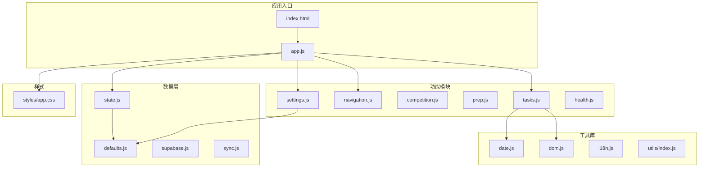
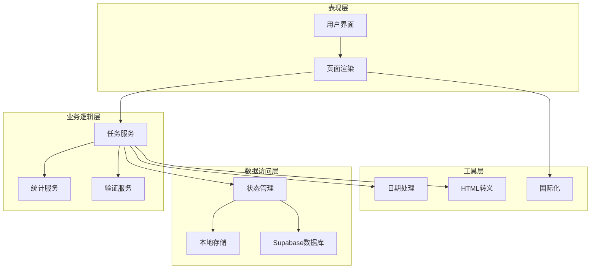
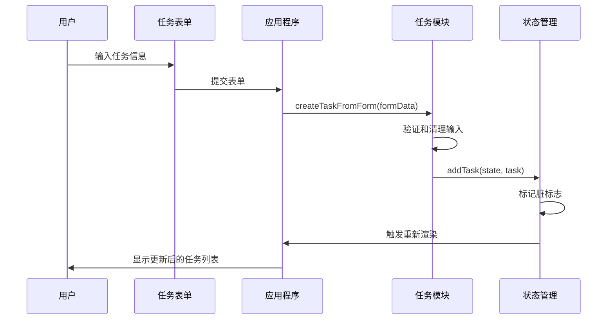
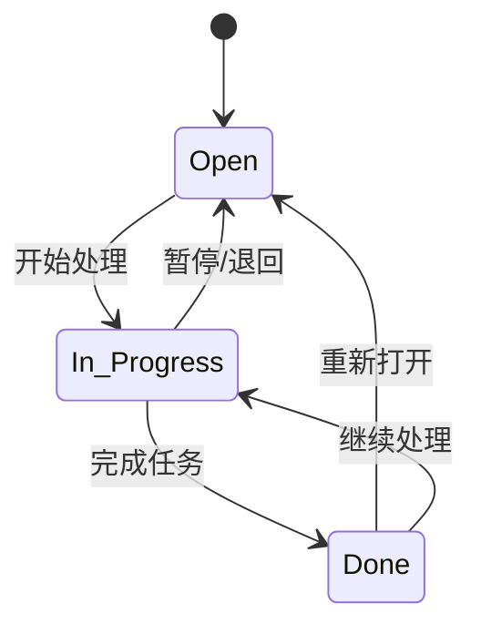
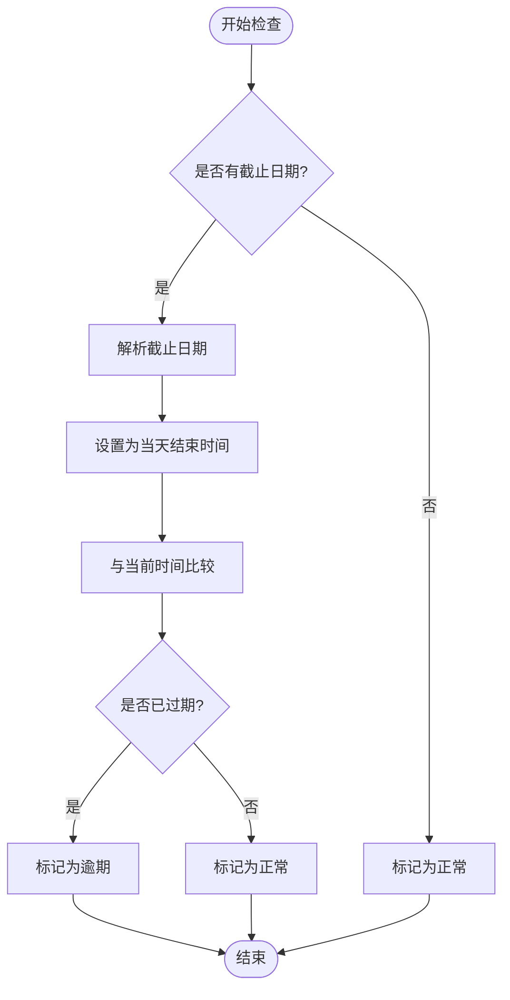
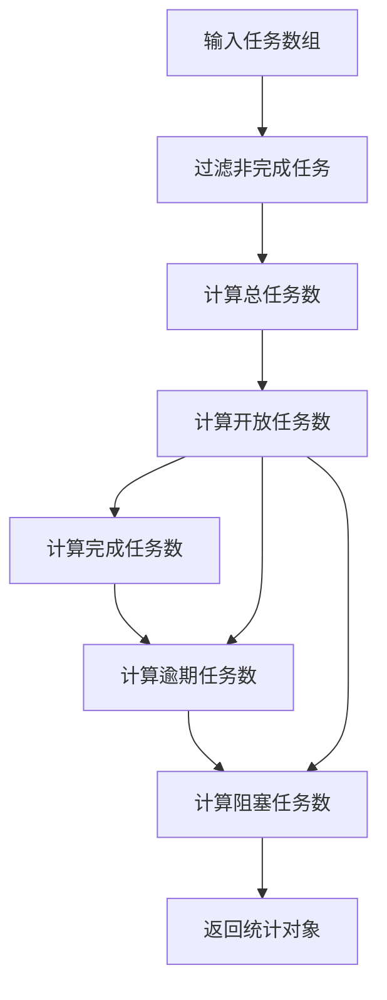
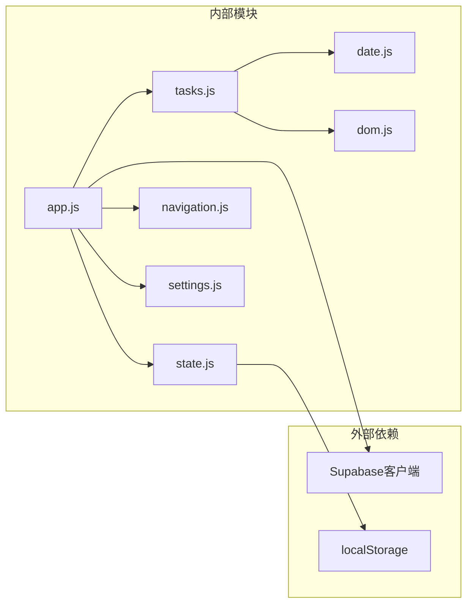

# 任务管理系统

<cite>
**本文档引用的文件**
- [app.js](file://v16/src/app.js)
- [tasks.js](file://v16/src/features/tasks.js)
- [state.js](file://v16/src/data/state.js)
- [defaults.js](file://v16/src/data/defaults.js)
- [date.js](file://v16/src/utils/date.js)
- [dom.js](file://v16/src/utils/dom.js)
- [index.js](file://v16/src/utils/index.js)
- [navigation.js](file://v16/src/features/navigation.js)
- [settings.js](file://v16/src/features/settings.js)
- [README.md](file://v16/README.md)
- [app.css](file://v16/styles/app.css)
- [index.html](file://v16/index.html)
</cite>

## 目录
1. [简介](#简介)
2. [项目结构](#项目结构)
3. [核心组件](#核心组件)
4. [架构概览](#架构概览)
5. [详细组件分析](#详细组件分析)
6. [依赖关系分析](#依赖关系分析)
7. [性能考虑](#性能考虑)
8. [故障排除指南](#故障排除指南)
9. [结论](#结论)
10. [附录](#附录)

## 简介

ROV任务管理系统v16是一个基于本地优先（local-first）理念的任务管理应用，专为ROV（遥控潜水器）团队设计。该系统提供了完整的任务生命周期管理功能，包括任务创建、状态管理、删除和统计分析。

### 主要特性
- **本地持久化**：基于localStorage的任务数据存储
- **实时统计**：动态计算开放任务、完成任务、过期任务和阻塞任务
- **过期提醒**：智能的逾期任务检测和视觉提醒
- **多页面导航**：仪表板、任务管理、竞赛中心、设置中心
- **安全同步**：与Supabase数据库的安全读写同步机制
- **国际化支持**：中英文双语界面

## 项目结构

项目采用模块化架构，按照功能层次组织代码：



**图表来源**
- [index.html:1-15](file://v16/index.html#L1-L15)
- [app.js:1-50](file://v16/src/app.js#L1-L50)
- [state.js:1-45](file://v16/src/data/state.js#L1-L45)

**章节来源**
- [README.md:10-26](file://v16/README.md#L10-L26)
- [index.html:1-15](file://v16/index.html#L1-L15)

## 核心组件

### 任务管理核心API

系统提供了以下核心任务管理函数：

#### 任务创建
- `createTaskFromForm(formData)`: 从表单数据创建任务对象
- `addTask(state, task)`: 将新任务添加到状态管理中

#### 任务状态管理
- `updateTaskStatus(state, id, status)`: 更新任务状态
- `deleteTask(state, id)`: 删除指定任务

#### 统计分析
- `getTaskStats(tasks)`: 计算任务统计信息

#### 表格渲染
- `renderTaskTable(tasks)`: 生成任务表格HTML
- `renderTasksPage(state)`: 渲染任务管理页面

**章节来源**
- [tasks.js:5-112](file://v16/src/features/tasks.js#L5-L112)

## 架构概览

系统采用分层架构设计，确保关注点分离和模块化：



**图表来源**
- [app.js:34-352](file://v16/src/app.js#L34-L352)
- [tasks.js:1-112](file://v16/src/features/tasks.js#L1-L112)

## 详细组件分析

### 任务表单处理

任务表单处理是系统的核心功能之一，负责将用户输入转换为标准化的任务对象。

#### 表单字段映射

| 字段名 | 类型 | 默认值 | 描述 |
|--------|------|--------|------|
| id | number | 当前时间戳 | 任务唯一标识符 |
| name | string | 'Untitled task' | 任务名称 |
| owner | string | 'Unassigned' | 任务负责人 |
| due | string | '' | 截止日期（YYYY-MM-DD） |
| priority | string | 'Medium' | 任务优先级 |
| status | string | 'Open' | 任务状态 |
| category | string | 'General' | 任务分类 |
| blocked | boolean | false | 是否被阻塞 |
| notes | string | '' | 任务备注 |

#### 表单提交流程



**图表来源**
- [app.js:346-352](file://v16/src/app.js#L346-L352)
- [tasks.js:5-22](file://v16/src/features/tasks.js#L5-L22)

**章节来源**
- [tasks.js:5-17](file://v16/src/features/tasks.js#L5-L17)

### 任务状态管理

系统支持三种基本任务状态：Open（待办）、In Progress（进行中）、Done（完成）。

#### 状态转换规则



#### 状态更新机制

状态更新通过DOM事件触发，使用数据属性标识目标任务：

**章节来源**
- [tasks.js:24-30](file://v16/src/features/tasks.js#L24-L30)
- [app.js:354-359](file://v16/src/app.js#L354-L359)

### 过期提醒逻辑

系统实现了智能的过期任务检测机制，提供视觉和统计提醒。

#### 过期判断算法



**图表来源**
- [date.js:30-35](file://v16/src/utils/date.js#L30-L35)

#### 视觉提醒实现

系统通过CSS类实现过期任务的视觉提醒：
- 红色背景强调逾期任务
- 红色字体突出显示截止日期
- 动画效果吸引注意力

**章节来源**
- [tasks.js:59-70](file://v16/src/features/tasks.js#L59-L70)
- [date.js:30-44](file://v16/src/utils/date.js#L30-L44)

### 优先级和分类管理

#### 优先级系统

| 优先级 | CSS类 | 颜色 | 用途 |
|--------|-------|------|------|
| High | urgent | 红色 | 紧急任务 |
| Medium | mid | 黄色 | 普通任务 |
| Low | done | 绿色 | 低优先级任务 |

#### 分类管理

任务分类通过主数据（Master Data）系统管理，支持动态配置：
- 任务类型：Urgent, High, Medium, Low, Mission Run, Presentation, Travel Docs, Gear, Pre-Dive
- 支持自定义分类添加和删除

**章节来源**
- [tasks.js:102-105](file://v16/src/features/tasks.js#L102-L105)
- [settings.js:7-12](file://v16/src/features/settings.js#L7-L12)

### 任务统计功能

`getTaskStats`函数提供全面的任务统计分析：

#### 统计指标计算



**图表来源**
- [tasks.js:39-48](file://v16/src/features/tasks.js#L39-L48)

#### 统计结果结构

| 指标 | 计算方式 | 用途 |
|------|----------|------|
| total | 所有任务数量 | 总体规模评估 |
| open | status !== 'Done' | 工作负载分析 |
| done | total - open | 完成度统计 |
| overdue | open中due < 当前时间 | 逾期风险监控 |
| blocked | open中blocked === true | 阻塞问题识别 |

**章节来源**
- [tasks.js:39-48](file://v16/src/features/tasks.js#L39-L48)

### 任务表格渲染

`renderTaskTable`函数负责生成任务管理界面的HTML表格。

#### 表格列结构

| 列名 | 内容 | 功能 |
|------|------|------|
| 任务 | 名称 + 分类 + 阻塞标识 | 任务基本信息展示 |
| 负责人 | owner字段 | 团队成员分配 |
| 截止日期 | due + 天数差 | 时间管理提醒 |
| 优先级 | badge标签 | 重要性标识 |
| 状态 | 下拉选择框 | 状态变更入口 |
| 操作 | 删除按钮 | 数据维护 |

#### 样式定制

系统提供丰富的CSS类用于样式定制：

```css
/* 任务行样式 */
.task-overdue td { background: #FFF0F0 !important; }
.task-done td { opacity: .55; text-decoration: line-through; }

/* 优先级徽章 */
.badge.urgent { background: #FFD6D6; color: var(--red); }
.badge.high { background: #FCE4D6; color: var(--orange); }
.badge.mid { background: #FFF3CD; color: #856404; }
.badge.done { background: var(--lgreen); color: #375623; }

/* 表格样式 */
table { width: 100%; border-collapse: collapse; }
th { background: var(--navy); color: #fff; }
tr:hover td { background: var(--table-hover); }
```

**章节来源**
- [tasks.js:50-82](file://v16/src/features/tasks.js#L50-L82)
- [app.css:191-214](file://v16/styles/app.css#L191-L214)

## 依赖关系分析

系统采用模块化设计，各组件间依赖关系清晰：



**图表来源**
- [app.js:1-15](file://v16/src/app.js#L1-L15)
- [tasks.js:1-4](file://v16/src/features/tasks.js#L1-L4)

### 关键依赖链

1. **应用启动** → 加载应用状态 → 初始化功能模块
2. **任务操作** → 表单验证 → 状态更新 → 本地存储
3. **数据同步** → 状态管理 → Supabase客户端 → 数据库

**章节来源**
- [app.js:38-64](file://v16/src/app.js#L38-L64)
- [state.js:16-44](file://v16/src/data/state.js#L16-L44)

## 性能考虑

### 内存管理
- 使用结构化克隆避免深拷贝开销
- 及时清理DOM事件监听器
- 合理的数据缓存策略

### 渲染优化
- 条件渲染减少DOM节点数量
- CSS动画替代JavaScript动画
- 防抖处理频繁状态更新

### 存储策略
- localStorage批量写入
- 脏标志模式减少不必要的保存
- 数据压缩和序列化优化

## 故障排除指南

### 常见问题及解决方案

#### 任务无法保存
**症状**：添加任务后刷新页面丢失
**原因**：localStorage不可用或权限问题
**解决**：检查浏览器隐私设置，清除过期数据

#### 状态更新失败
**症状**：更改任务状态无响应
**原因**：DOM事件绑定错误或ID不匹配
**解决**：确认数据属性正确设置，检查控制台错误

#### 过期提醒不准确
**症状**：逾期任务未正确标记
**原因**：时区设置或日期格式问题
**解决**：检查系统时间和日期格式

#### 同步问题
**症状**：本地数据与服务器不同步
**解决**：使用同步预览功能检查差异，执行受保护的写入同步

**章节来源**
- [app.js:201-299](file://v16/src/app.js#L201-L299)

## 结论

ROV任务管理系统v16展现了现代前端应用的最佳实践，通过模块化设计、本地优先架构和智能的用户体验设计，为ROV团队提供了强大而易用的任务管理解决方案。

### 系统优势
- **可靠性**：本地持久化确保数据安全
- **效率**：实时统计和提醒提升工作效率
- **可扩展性**：模块化架构便于功能扩展
- **安全性**：受保护的数据库同步机制

### 技术亮点
- 智能的过期任务检测和视觉提醒
- 灵活的主数据管理系统
- 完善的备份和恢复机制
- 双语国际化支持

## 附录

### 最佳实践建议

#### 任务创建最佳实践
1. **明确截止日期**：为每个任务设置合理的截止时间
2. **合理分配优先级**：根据紧急程度和重要性设置优先级
3. **详细描述任务**：在备注中包含关键信息和要求
4. **及时更新状态**：保持任务状态的实时准确性

#### 任务管理最佳实践
1. **定期审查**：每周检查逾期任务和阻塞任务
2. **团队协作**：确保任务负责人清晰明确
3. **分类管理**：使用合适的任务分类提高组织性
4. **数据备份**：定期导出设置包作为备份

#### 系统使用建议
1. **浏览器兼容性**：使用最新版本的现代浏览器
2. **网络环境**：稳定的网络连接确保数据同步
3. **存储空间**：定期清理不需要的历史数据
4. **安全意识**：妥善保管设置包文件

### 快速参考

#### 核心功能快捷键
- **Ctrl + Enter**：快速添加新任务
- **Tab键**：在表单字段间切换
- **回车键**：确认状态变更

#### 常用操作
- **任务创建**：填写表单并点击"添加任务"
- **状态更新**：在下拉菜单中选择新状态
- **任务删除**：点击删除按钮确认操作
- **数据导入**：通过设置中心导入备份文件