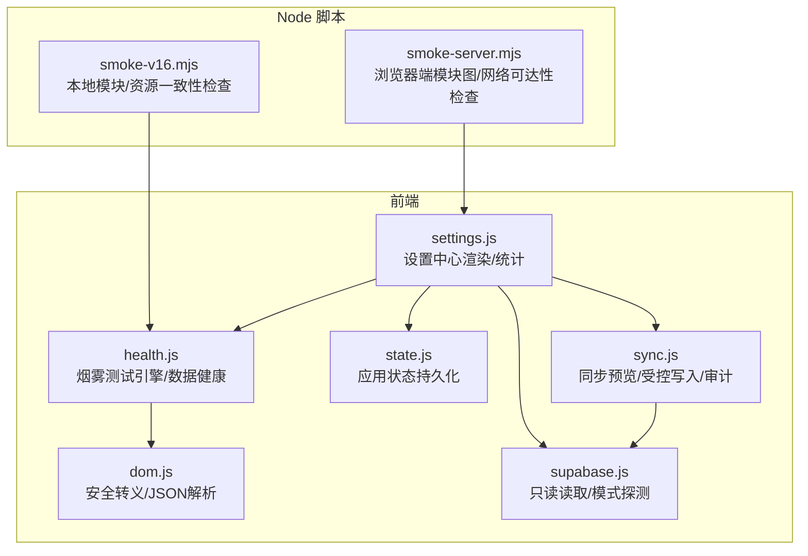
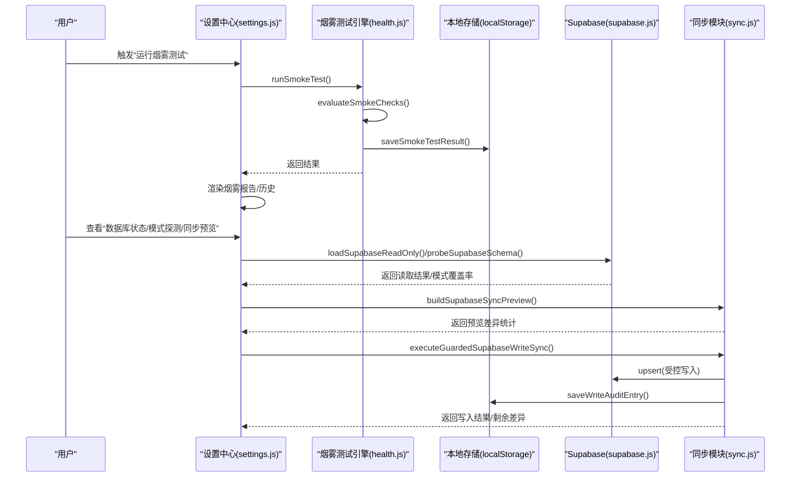
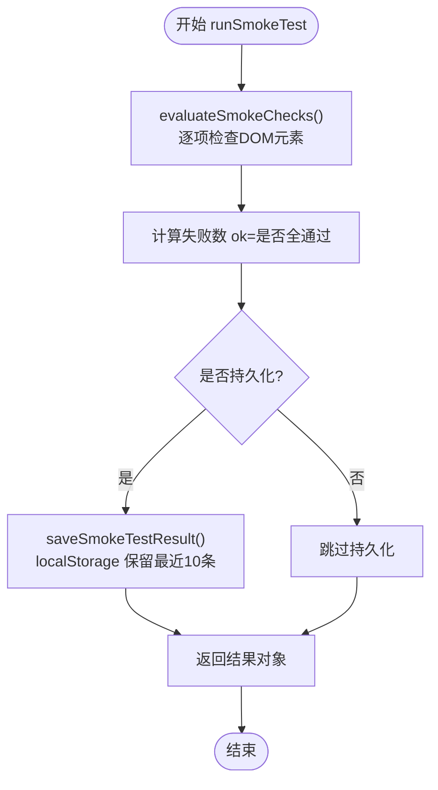
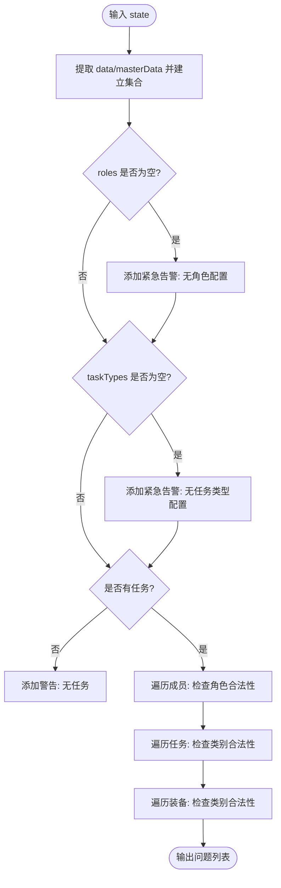
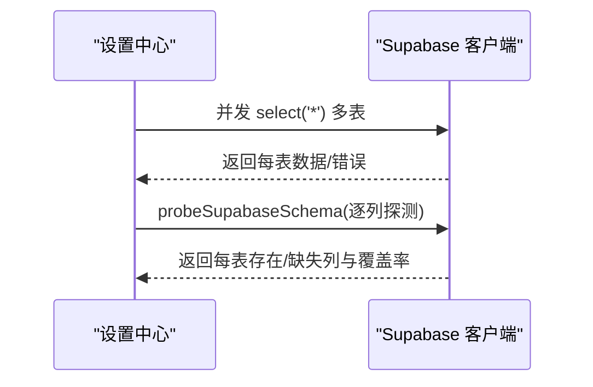
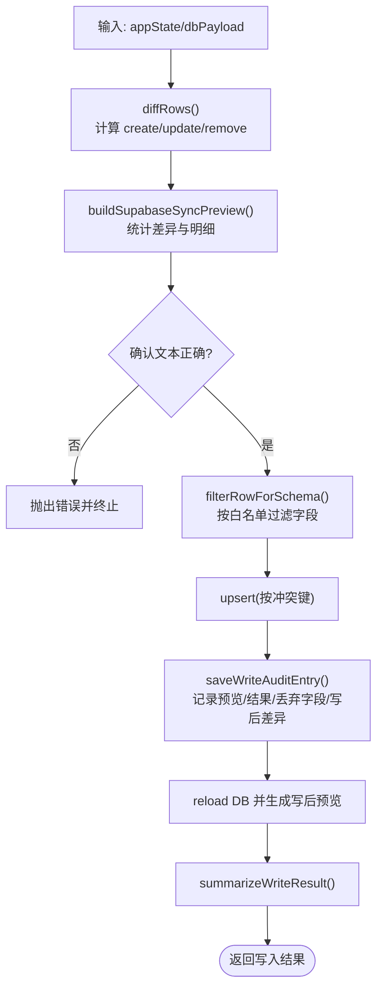
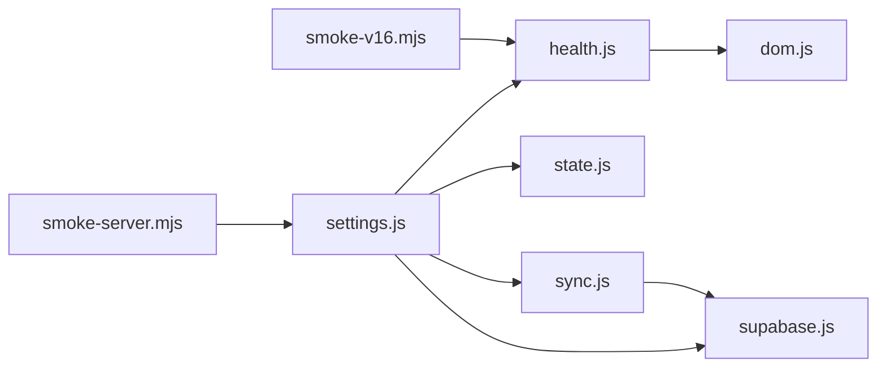

# 健康检查系统

<cite>
**本文引用的文件**
- [health.js](file://v16/src/features/health.js)
- [smoke-v16.mjs](file://v16/smoke-v16.mjs)
- [smoke-server.mjs](file://v16/smoke-server.mjs)
- [sync.js](file://v16/src/data/sync.js)
- [state.js](file://v16/src/data/state.js)
- [supabase.js](file://v16/src/data/supabase.js)
- [settings.js](file://v16/src/features/settings.js)
- [dom.js](file://v16/src/utils/dom.js)
- [README.md](file://v16/README.md)
- [MIGRATION_MANIFEST.md](file://v16/MIGRATION_MANIFEST.md)
</cite>

## 目录
1. [简介](#简介)
2. [项目结构](#项目结构)
3. [核心组件](#核心组件)
4. [架构总览](#架构总览)
5. [详细组件分析](#详细组件分析)
6. [依赖分析](#依赖分析)
7. [性能考虑](#性能考虑)
8. [故障排查指南](#故障排查指南)
9. [结论](#结论)
10. [附录](#附录)

## 简介
本文件面向健康检查系统，系统性阐述烟雾测试（Smoke Test）、数据健康监控与系统状态检查的实现机制。内容覆盖：
- 烟雾测试的自动化执行流程与报告格式
- 数据完整性验证逻辑与告警级别
- 系统性能指标监控方法（如加载耗时）
- 具体功能示例：数据同步状态检查、本地存储完整性验证、网络连接状态监控
- 异常处理机制与与烟雾测试脚本的集成关系
- 维护与故障诊断实践建议

## 项目结构
v16 健康检查体系由前端模块与 Node 脚本共同组成，围绕“烟雾测试引擎”“数据健康检查”“同步与审计日志”“Supabase 只读读取与模式探测”展开，并在设置中心集中呈现健康状态与历史记录。

图表来源
- [health.js:1-127](file://v16/src/features/health.js#L1-L127)
- [settings.js:1-592](file://v16/src/features/settings.js#L1-L592)
- [state.js:1-45](file://v16/src/data/state.js#L1-L45)
- [dom.js:1-21](file://v16/src/utils/dom.js#L1-L21)
- [supabase.js:1-157](file://v16/src/data/supabase.js#L1-L157)
- [sync.js:1-341](file://v16/src/data/sync.js#L1-L341)
- [smoke-v16.mjs:1-111](file://v16/smoke-v16.mjs#L1-L111)
- [smoke-server.mjs:1-72](file://v16/smoke-server.mjs#L1-L72)

章节来源
- [README.md:1-68](file://v16/README.md#L1-L68)
- [MIGRATION_MANIFEST.md:1-76](file://v16/MIGRATION_MANIFEST.md#L1-L76)

## 核心组件
- 烟雾测试引擎：负责页面元素存在性检查、结果持久化与可视化面板渲染。
- 数据健康检查：基于主数据集合与业务实体进行一致性校验，输出不同严重级别的问题清单。
- 同步与审计：提供只读数据预览、受控写入（白名单/字段过滤/禁止删除）与写入审计日志。
- Supabase 集成：只读批量读取、按列探测数据库模式、构建写前预览与写后验证。
- 设置中心：汇总数据量、系统健康、数据库状态、同步预览、写入结果、审计日志与回滚摘要，并渲染到 UI。

章节来源
- [health.js:37-54](file://v16/src/features/health.js#L37-L54)
- [health.js:56-84](file://v16/src/features/health.js#L56-L84)
- [sync.js:150-178](file://v16/src/data/sync.js#L150-L178)
- [sync.js:221-284](file://v16/src/data/sync.js#L221-L284)
- [sync.js:300-317](file://v16/src/data/sync.js#L300-L317)
- [supabase.js:79-121](file://v16/src/data/supabase.js#L79-L121)
- [supabase.js:131-156](file://v16/src/data/supabase.js#L131-L156)
- [settings.js:121-146](file://v16/src/features/settings.js#L121-L146)

## 架构总览
健康检查系统采用“前端引擎 + Node 辅助脚本”的双轨设计：
- 前端运行时：在浏览器中执行烟雾测试，检查页面元素与交互入口；同时进行数据健康检查，生成问题列表；通过设置中心聚合展示。
- Node 环境：提供零依赖的本地模块一致性检查与服务器端模块图/网络可达性检查，确保开发与部署环境稳定。

图表来源
- [health.js:37-54](file://v16/src/features/health.js#L37-L54)
- [health.js:14-25](file://v16/src/features/health.js#L14-L25)
- [settings.js:156-537](file://v16/src/features/settings.js#L156-L537)
- [supabase.js:79-121](file://v16/src/data/supabase.js#L79-L121)
- [supabase.js:131-156](file://v16/src/data/supabase.js#L131-L156)
- [sync.js:150-178](file://v16/src/data/sync.js#L150-L178)
- [sync.js:221-284](file://v16/src/data/sync.js#L221-L284)
- [sync.js:300-317](file://v16/src/data/sync.js#L300-L317)

## 详细组件分析

### 烟雾测试引擎（health.js）
- 检查项定义：默认包含应用根节点、仪表盘、准备页、任务页、竞赛页、设置页与烟雾报告面板。
- 执行流程：遍历检查项，使用 DOM 查询是否存在目标元素，汇总失败数量，生成结果对象。
- 结果持久化：将最近 10 条结果保存至本地存储，便于历史查看与趋势分析。
- 报告渲染：支持摘要行渲染与完整面板渲染，颜色区分成功/失败，时间戳本地化显示。

图表来源
- [health.js:37-54](file://v16/src/features/health.js#L37-L54)
- [health.js:14-25](file://v16/src/features/health.js#L14-L25)
- [health.js:27-35](file://v16/src/features/health.js#L27-L35)

章节来源
- [health.js:3-12](file://v16/src/features/health.js#L3-L12)
- [health.js:14-25](file://v16/src/features/health.js#L14-L25)
- [health.js:27-35](file://v16/src/features/health.js#L27-L35)
- [health.js:37-54](file://v16/src/features/health.js#L37-L54)
- [health.js:86-94](file://v16/src/features/health.js#L86-L94)
- [health.js:96-122](file://v16/src/features/health.js#L96-L122)

### 数据健康检查（getDataHealthIssues）
- 输入：应用状态对象（含 data/masterData）。
- 校验规则：
  - 主数据为空时发出紧急告警（角色、任务类型必须至少各一个）。
  - 无任务时发出警告（竞赛流程依赖任务）。
  - 成员角色不在主数据中发出警告。
  - 任务类别不在主数据中发出警告。
  - 装备类别不在主数据中发出警告。
- 输出：问题数组，包含严重级别、标题与详情，用于设置中心展示。

图表来源
- [health.js:56-84](file://v16/src/features/health.js#L56-L84)

章节来源
- [health.js:56-84](file://v16/src/features/health.js#L56-L84)

### 设置中心（settings.js）中的健康视图
- 统计卡片：数据总量、主数据总数、系统健康状态（基于最新烟雾测试）。
- 数据健康：展示任务/成员/运行/清单/装备数量与主数据维度。
- 数据库状态：展示只读加载时间、每表行数与错误信息。
- 模式探测：展示每表存在的列、缺失列与覆盖率。
- 同步预览：展示创建/更新/删除（跳过）数量与每表明细。
- 写入结果与审计：展示写入结果、丢弃字段与写后验证差异。
- 回滚摘要：展示从本地备份恢复后的数据量与时间戳。

章节来源
- [settings.js:121-146](file://v16/src/features/settings.js#L121-L146)
- [settings.js:156-537](file://v16/src/features/settings.js#L156-L537)

### Supabase 只读读取与模式探测（supabase.js）
- 只读读取：并发查询多张表，标准化数据结构，记录每表加载状态与错误。
- 模式探测：对候选列逐一进行只读探测，统计存在/缺失列与覆盖率，返回耗时。

图表来源
- [supabase.js:79-121](file://v16/src/data/supabase.js#L79-L121)
- [supabase.js:131-156](file://v16/src/data/supabase.js#L131-L156)

章节来源
- [supabase.js:79-121](file://v16/src/data/supabase.js#L79-L121)
- [supabase.js:131-156](file://v16/src/data/supabase.js#L131-L156)

### 同步与审计（sync.js）
- 表映射与白名单：定义可同步表与字段白名单，写入确认文本与审计日志键。
- 差异计算：基于 ID 与可比较字段集，识别新增/更新/删除三类变更。
- 预览构建：在不写库的前提下，统计每表差异数量与明细。
- 受控写入：要求确认文本、禁止删除、按冲突键 upsert，过滤字段以适配当前数据库模式。
- 审计日志：记录预览、写入结果、丢弃字段与写后验证差异，最多保留最近 20 条。

图表来源
- [sync.js:150-178](file://v16/src/data/sync.js#L150-L178)
- [sync.js:221-284](file://v16/src/data/sync.js#L221-L284)
- [sync.js:300-317](file://v16/src/data/sync.js#L300-L317)

章节来源
- [sync.js:1-17](file://v16/src/data/sync.js#L1-L17)
- [sync.js:43-64](file://v16/src/data/sync.js#L43-L64)
- [sync.js:150-178](file://v16/src/data/sync.js#L150-L178)
- [sync.js:221-284](file://v16/src/data/sync.js#L221-L284)
- [sync.js:300-317](file://v16/src/data/sync.js#L300-L317)

### Node 烟雾测试脚本（smoke-v16.mjs）
- 功能：检查 HTML 是否包含应用根节点与模块加载标记；检查主模块导入链；检查关键动作与 i18n 键；检查同步安全字符串与 Supabase 读取/探测片段；统计失败并退出码。
- 适用场景：本地开发/CI 的零依赖模块一致性检查。

章节来源
- [smoke-v16.mjs:1-111](file://v16/smoke-v16.mjs#L1-L111)

### Node 服务器烟雾测试脚本（smoke-server.mjs）
- 功能：拉取首页与主模块，解析模块导入图，断言模块图规模与关键模块已下载；对关键路径进行 GET 请求并断言响应状态。
- 适用场景：验证本地服务可访问性与模块图完整性。

章节来源
- [smoke-server.mjs:1-72](file://v16/smoke-server.mjs#L1-L72)

## 依赖分析
- 前端模块耦合：
  - health.js 依赖 dom.js 的安全转义与 JSON 解析工具。
  - settings.js 依赖 health.js 的烟雾测试结果与数据健康问题，依赖 state.js 的应用状态，依赖 supabase.js 的只读读取与模式探测，依赖 sync.js 的同步预览与受控写入结果。
  - sync.js 依赖 supabase.js 的客户端与表映射。
- Node 脚本与前端的集成：
  - smoke-v16.mjs 通过静态读取源码进行断言，间接验证 health.js 的可用性与关键字符串存在性。
  - smoke-server.mjs 通过实际请求验证前端模块图与网络可达性。

图表来源
- [health.js:1](file://v16/src/features/health.js#L1)
- [settings.js:1](file://v16/src/features/settings.js#L1)
- [state.js:1](file://v16/src/data/state.js#L1)
- [supabase.js:1](file://v16/src/data/supabase.js#L1)
- [sync.js:1](file://v16/src/data/sync.js#L1)
- [smoke-v16.mjs:1](file://v16/smoke-v16.mjs#L1)
- [smoke-server.mjs:1](file://v16/smoke-server.mjs#L1)

章节来源
- [health.js:1](file://v16/src/features/health.js#L1)
- [settings.js:1](file://v16/src/features/settings.js#L1)
- [state.js:1](file://v16/src/data/state.js#L1)
- [supabase.js:1](file://v16/src/data/supabase.js#L1)
- [sync.js:1](file://v16/src/data/sync.js#L1)
- [smoke-v16.mjs:1](file://v16/smoke-v16.mjs#L1)
- [smoke-server.mjs:1](file://v16/smoke-server.mjs#L1)

## 性能考虑
- 只读读取并发：supabase.js 使用 Promise.allSettled 并发查询多表，减少总等待时间，同时保留每表错误信息。
- 模式探测：逐列探测仅做 limit(1) 的只读查询，避免大表扫描，但需注意列数较多时的总耗时。
- 同步预览：diffRows 与 diffRowDetails 在本地计算，复杂度与数据量线性相关；建议控制单次同步的数据规模或分批执行。
- 烟雾测试：DOM 查询与本地存储读写开销极低，适合频繁运行。

章节来源
- [supabase.js:82-103](file://v16/src/data/supabase.js#L82-L103)
- [supabase.js:131-156](file://v16/src/data/supabase.js#L131-L156)
- [sync.js:43-64](file://v16/src/data/sync.js#L43-L64)
- [sync.js:66-88](file://v16/src/data/sync.js#L66-L88)

## 故障排查指南
- 烟雾测试失败
  - 现象：烟雾报告面板显示失败数量或“未运行”。
  - 排查：检查页面元素 ID/选择器是否正确；确认设置中心的“运行烟雾测试”按钮是否可用；查看本地存储中最近 10 条结果。
  - 参考
    - [health.js:14-25](file://v16/src/features/health.js#L14-L25)
    - [health.js:27-35](file://v16/src/features/health.js#L27-L35)
    - [health.js:86-94](file://v16/src/features/health.js#L86-L94)
    - [health.js:96-122](file://v16/src/features/health.js#L96-L122)
- 数据健康告警
  - 现象：设置中心“系统/QA”卡片显示 FAIL 或“无角色/无任务类型/成员角色/任务类别/装备类别不匹配”等警告。
  - 排查：在“主数据”区域补充角色与任务类型；为成员/任务/装备分配合法值；重新运行烟雾测试验证修复。
  - 参考
    - [health.js:56-84](file://v16/src/features/health.js#L56-L84)
    - [settings.js:521-531](file://v16/src/features/settings.js#L521-L531)
- Supabase 只读读取失败
  - 现象：数据库状态卡片显示错误或部分表为空。
  - 排查：确认 Supabase 凭据有效；检查网络连通性；查看模式探测覆盖率；必要时降低并发或分表查询。
  - 参考
    - [supabase.js:79-121](file://v16/src/data/supabase.js#L79-L121)
    - [supabase.js:131-156](file://v16/src/data/supabase.js#L131-L156)
- 受控写入失败
  - 现象：写入结果卡片显示错误或被丢弃字段。
  - 排查：确认输入确认文本；检查白名单与字段映射；使用模式探测结果缩小字段范围；查看审计日志定位具体表与字段。
  - 参考
    - [sync.js:221-284](file://v16/src/data/sync.js#L221-L284)
    - [sync.js:300-317](file://v16/src/data/sync.js#L300-L317)
- Node 脚本失败
  - 现象：本地模块检查或服务器烟雾检查输出失败行并退出非零码。
  - 排查：对照脚本输出的失败项，检查对应文件是否存在、模块导入是否正确、网络是否可达。
  - 参考
    - [smoke-v16.mjs:98-111](file://v16/smoke-v16.mjs#L98-L111)
    - [smoke-server.mjs:58-72](file://v16/smoke-server.mjs#L58-L72)

## 结论
健康检查系统通过“前端烟雾测试 + 数据健康检查 + Supabase 只读读取/模式探测 + 受控写入与审计”的组合，实现了对应用运行状态、数据完整性与系统性能的全面监控。Node 脚本进一步保障了开发与部署环境的稳定性。建议在持续集成中加入本地与服务器烟雾测试，在生产切换前进行受控写入演练，并定期审查审计日志与烟雾历史，以尽早发现并解决问题。

## 附录
- 健康检查结果报告字段说明
  - 烟雾测试：时间戳、是否全部通过、逐项检查结果（标签/ID/是否找到）。
  - 数据健康：问题数组（严重级别/标题/详情）。
  - 数据库状态：加载时间、每表行数、错误信息。
  - 模式探测：每表存在列、缺失列、覆盖率。
  - 同步预览：每表本地/远程数量、创建/更新/删除（跳过）数量与明细。
  - 写入结果：每表写入数量、跳过删除数量、丢弃字段、错误信息。
  - 审计日志：预览/写入/丢弃字段/写后差异摘要与错误列表。
- 与烟雾测试脚本的集成
  - 本地模块一致性：smoke-v16.mjs 通过静态扫描确保关键模块/动作/i18n/同步安全字符串存在。
  - 服务器模块图与网络：smoke-server.mjs 通过实际请求验证首页与模块图完整性及网络可达性。
- 维护与故障诊断实践
  - 将烟雾测试纳入 CI，确保每次变更后快速发现问题。
  - 对照迁移清单（MIGRATION_MANIFEST.md）逐项核验模块所有权与功能边界。
  - 使用设置中心的“系统/QA”卡片与审计日志进行日常巡检与回溯。

章节来源
- [health.js:46-50](file://v16/src/features/health.js#L46-L50)
- [settings.js:121-146](file://v16/src/features/settings.js#L121-L146)
- [MIGRATION_MANIFEST.md:58-76](file://v16/MIGRATION_MANIFEST.md#L58-L76)