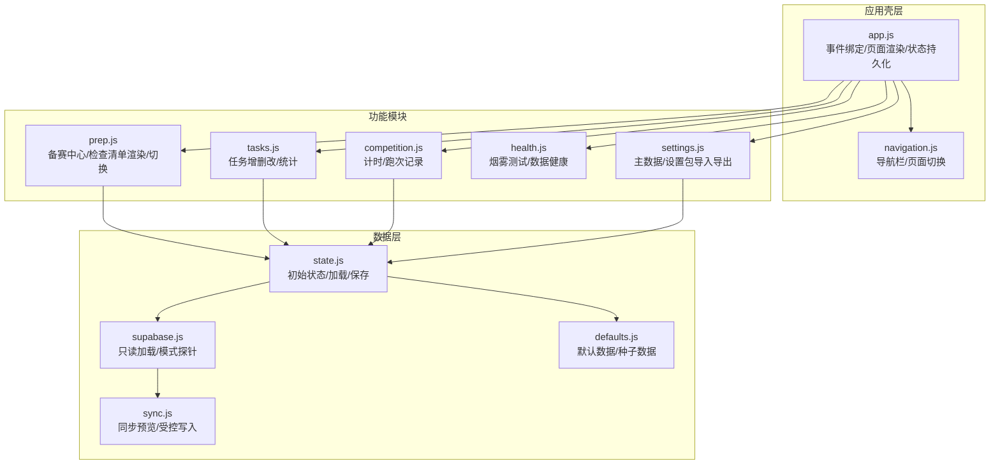
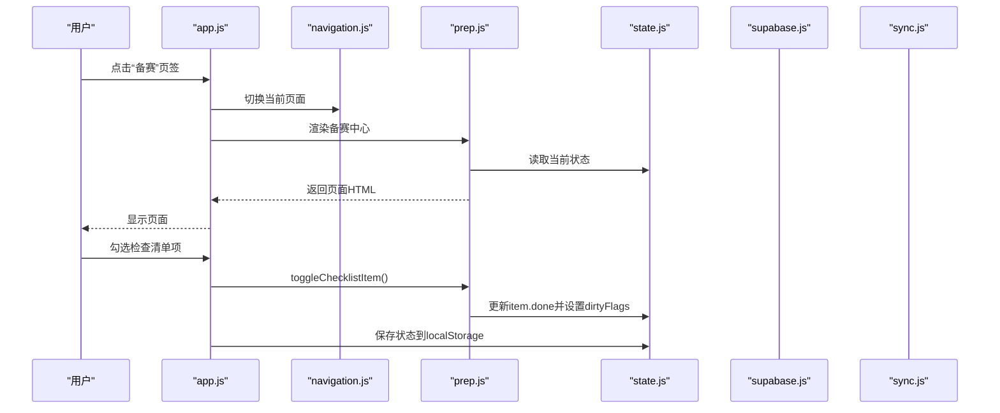
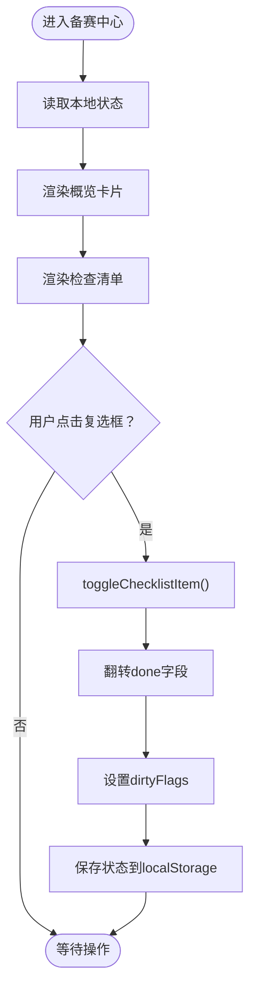
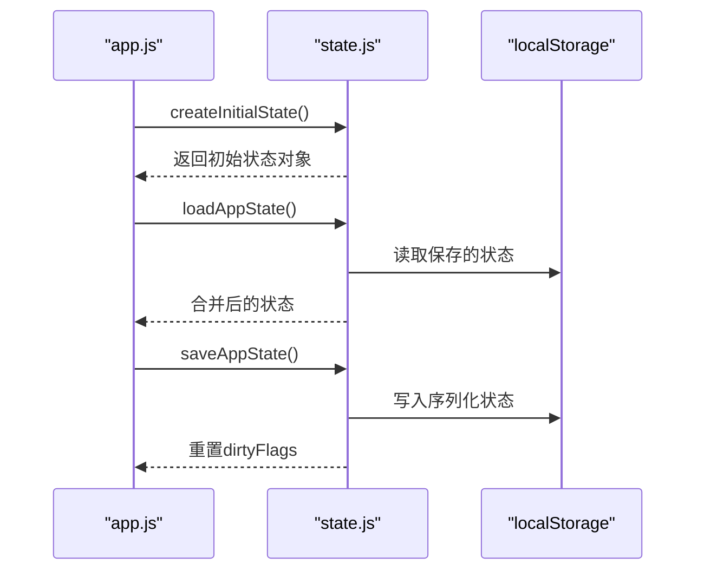
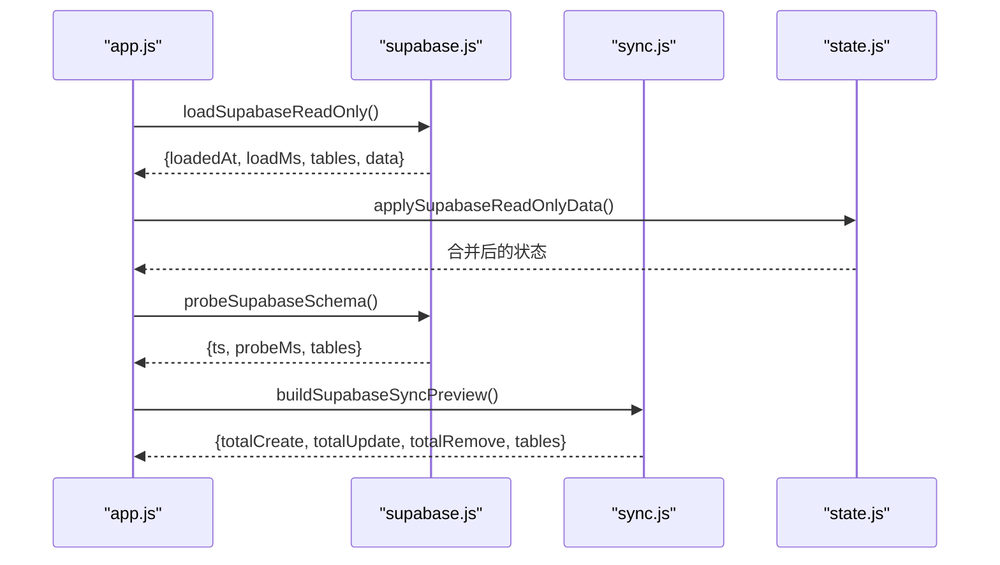
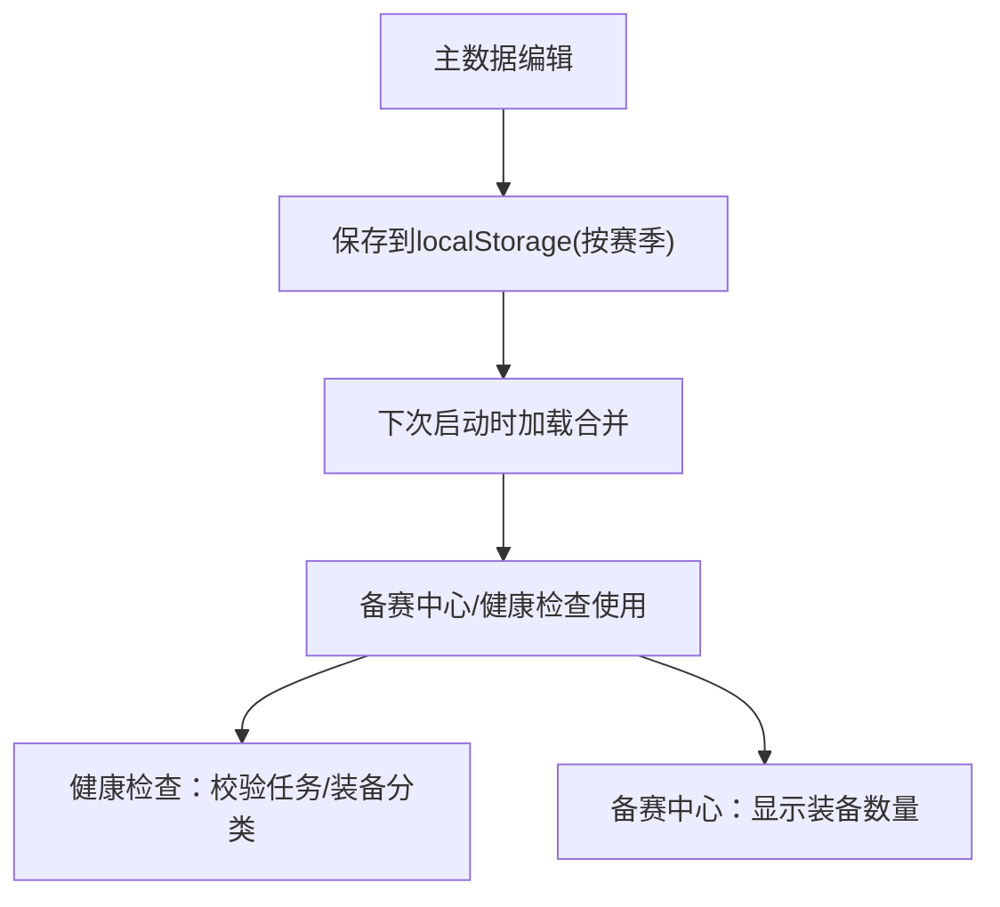
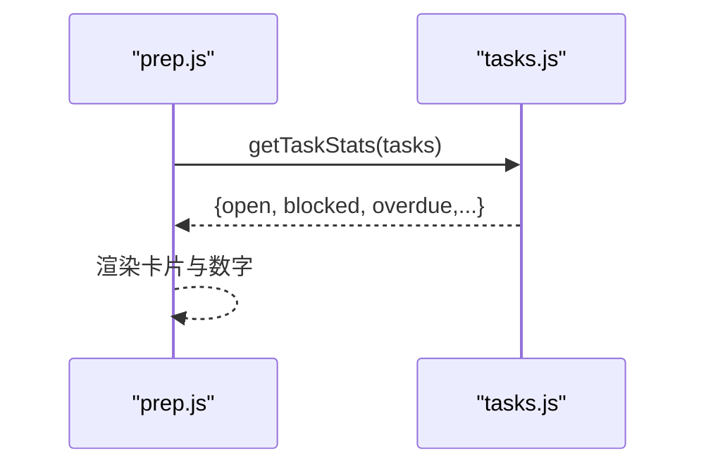
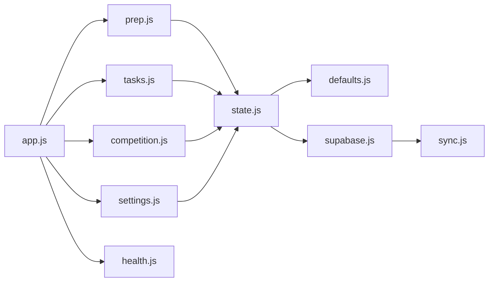

# 备赛管理中心

<cite>
**本文引用的文件**
- [v16/src/features/prep.js](file://v16/src/features/prep.js)
- [v16/src/data/state.js](file://v16/src/data/state.js)
- [v16/src/data/defaults.js](file://v16/src/data/defaults.js)
- [v16/src/data/supabase.js](file://v16/src/data/supabase.js)
- [v16/src/data/sync.js](file://v16/src/data/sync.js)
- [v16/src/features/tasks.js](file://v16/src/features/tasks.js)
- [v16/src/features/competition.js](file://v16/src/features/competition.js)
- [v16/src/features/settings.js](file://v16/src/features/settings.js)
- [v16/src/features/health.js](file://v16/src/features/health.js)
- [v16/src/features/navigation.js](file://v16/src/features/navigation.js)
- [v16/src/app.js](file://v16/src/app.js)
- [v16/README.md](file://v16/README.md)
</cite>

## 目录
1. [简介](#简介)
2. [项目结构](#项目结构)
3. [核心组件](#核心组件)
4. [架构总览](#架构总览)
5. [详细组件分析](#详细组件分析)
6. [依赖关系分析](#依赖关系分析)
7. [性能考量](#性能考量)
8. [故障排查指南](#故障排查指南)
9. [结论](#结论)
10. [附录](#附录)

## 简介
备赛管理中心是 ROV Task Manager v16 的核心工作台之一，负责检查清单管理、预赛准备工作跟踪与装备物品准备状态的可视化与操作。它通过本地状态持久化与可选的 Supabase 只读加载，结合任务系统与竞赛计时模块，形成完整的备赛准备闭环。用户可以在“备赛”页面中查看任务概览、检查清单完成度、预赛清单完成度与装备物品数量，并直接勾选检查清单项以更新状态。

本文件将系统性说明备赛中心的数据结构、状态流转、UI 渲染、与主数据系统（master data）及 Supabase 的集成关系，并提供最佳实践与使用指南。

## 项目结构
v16 采用“本地优先”的单页应用架构，按功能模块拆分为 features 与 data 层，配合 utils 提供通用工具与国际化支持。备赛中心位于 features/prep，依赖 data/state 进行状态初始化与持久化，依赖 data/supabase 与 data/sync 实现与云端数据库的只读加载与受控写入预览。

图表来源
- [v16/src/app.js:104-131](file://v16/src/app.js#L104-L131)
- [v16/src/features/prep.js:25-57](file://v16/src/features/prep.js#L25-L57)
- [v16/src/data/state.js:6-44](file://v16/src/data/state.js#L6-L44)
- [v16/src/data/supabase.js:79-121](file://v16/src/data/supabase.js#L79-L121)
- [v16/src/data/sync.js:150-178](file://v16/src/data/sync.js#L150-L178)

章节来源
- [v16/README.md:10-44](file://v16/README.md#L10-L44)
- [v16/src/app.js:104-131](file://v16/src/app.js#L104-L131)

## 核心组件
- 备赛中心页面与检查清单渲染
  - 渲染函数根据当前状态计算任务开放数、检查清单完成度、预赛清单完成度与装备物品数量，并输出卡片式概览与两个清单区域。
  - 支持点击复选框切换检查清单项的完成状态，并标记对应列表的脏标志位以便持久化。
- 本地状态管理
  - 初始化状态来自默认数据，支持从 localStorage 加载与保存；保存时重置脏标志位。
- Supabase 集成
  - 只读加载多表数据（任务、成员、检查清单、预赛清单、情报、笔记、策略、跑次），并进行规范化处理。
  - 提供模式探针（schema probe）检测候选列存在性，用于受控写入前的字段合法性校验。
- 主数据系统
  - 角色、组、任务类型、装备分类等主数据可编辑并持久化到当前赛季命名空间，用于约束任务与装备的分类一致性。
- 任务系统
  - 提供任务创建、状态更新、删除与统计（开放/逾期/阻塞）。
- 竞赛计时
  - 提供计时器与跑次记录，与备赛中心并行存在，共同支撑备赛到竞赛的流程。

章节来源
- [v16/src/features/prep.js:5-57](file://v16/src/features/prep.js#L5-L57)
- [v16/src/data/state.js:6-44](file://v16/src/data/state.js#L6-L44)
- [v16/src/data/supabase.js:79-121](file://v16/src/data/supabase.js#L79-L121)
- [v16/src/features/tasks.js:39-48](file://v16/src/features/tasks.js#L39-L48)
- [v16/src/features/competition.js:6-19](file://v16/src/features/competition.js#L6-L19)

## 架构总览
备赛中心在应用中的位置与交互如下：

图表来源
- [v16/src/app.js:189-364](file://v16/src/app.js#L189-L364)
- [v16/src/features/prep.js:5-11](file://v16/src/features/prep.js#L5-L11)
- [v16/src/data/state.js:35-44](file://v16/src/data/state.js#L35-L44)

## 详细组件分析

### 备赛中心页面与检查清单管理
- 页面概览
  - 统计任务开放数、阻塞数；显示检查清单与预赛清单的完成比例；显示装备物品数量。
  - 使用卡片网格展示关键指标，便于快速掌握备赛状态。
- 检查清单渲染
  - 通过模板字符串渲染每个清单项为带复选框的标签元素，复选框绑定数据属性以识别清单名与条目ID。
- 状态切换
  - 点击复选框触发 toggleChecklistItem，定位目标清单与条目，翻转 done 字段，设置对应列表的脏标志位。
- 数据来源
  - 默认数据包含 checklist 与 prediveChecklist 的种子项；Supabase 只读加载后会合并到本地状态。

图表来源
- [v16/src/features/prep.js:25-57](file://v16/src/features/prep.js#L25-L57)
- [v16/src/features/prep.js:5-11](file://v16/src/features/prep.js#L5-L11)
- [v16/src/data/state.js:35-44](file://v16/src/data/state.js#L35-L44)

章节来源
- [v16/src/features/prep.js:13-57](file://v16/src/features/prep.js#L13-L57)

### 本地状态与持久化
- 初始状态
  - createInitialState 从 DEFAULT_STATE 结构化克隆默认数据，初始化当前页面、模式、赛季与脏标志位。
- 加载与保存
  - loadAppState 合并本地存储与默认状态，确保 masterData 的完整性；saveAppState 将状态序列化并重置脏标志位。
- 脏标志位
  - 各模块在修改数据后设置对应键的脏标志位，用于提示需要持久化的变更。

图表来源
- [v16/src/data/state.js:6-44](file://v16/src/data/state.js#L6-L44)
- [v16/src/app.js:60-64](file://v16/src/app.js#L60-L64)

章节来源
- [v16/src/data/state.js:6-44](file://v16/src/data/state.js#L6-L44)

### Supabase 只读加载与模式探针
- 只读加载
  - 并发查询多个表，返回标准化后的数据与加载时间戳；applySupabaseReadOnlyData 合并到本地状态并标记脏标志。
- 模式探针
  - 对候选列逐一探测是否存在，统计覆盖率，用于受控写入前的字段合法性校验。
- 同步预览与受控写入
  - buildSupabaseSyncPreview 计算本地与远程差异，给出创建/更新/移除数量；受控写入要求确认文本与表白名单，并在写入后下载本地备份与二次验证。

图表来源
- [v16/src/app.js:226-241](file://v16/src/app.js#L226-L241)
- [v16/src/app.js:201-212](file://v16/src/app.js#L201-L212)
- [v16/src/app.js:243-261](file://v16/src/app.js#L243-L261)
- [v16/src/data/supabase.js:79-121](file://v16/src/data/supabase.js#L79-L121)
- [v16/src/data/supabase.js:131-156](file://v16/src/data/supabase.js#L131-L156)
- [v16/src/data/sync.js:150-178](file://v16/src/data/sync.js#L150-L178)

章节来源
- [v16/src/data/supabase.js:79-121](file://v16/src/data/supabase.js#L79-L121)
- [v16/src/data/sync.js:150-178](file://v16/src/data/sync.js#L150-L178)

### 主数据系统与备赛中心的集成
- 主数据类型
  - 角色、组、任务类型、装备分类，支持添加、删除与排序去重。
- 集成点
  - 备赛中心概览卡片显示“gearItems”数量；健康检查模块会校验任务与装备分类是否在主数据中定义，避免不一致。
- 季节化存储
  - 主数据按当前赛季命名空间存储，避免跨季节污染。

图表来源
- [v16/src/features/settings.js:34-52](file://v16/src/features/settings.js#L34-L52)
- [v16/src/features/health.js:56-84](file://v16/src/features/health.js#L56-L84)
- [v16/src/features/prep.js:42](file://v16/src/features/prep.js#L42)

章节来源
- [v16/src/features/settings.js:34-52](file://v16/src/features/settings.js#L34-L52)
- [v16/src/features/health.js:56-84](file://v16/src/features/health.js#L56-L84)

### 任务系统与备赛中心的关系
- 任务统计
  - 备赛中心顶部显示“开放任务/阻塞任务”，来源于任务模块的统计函数。
- 任务表单
  - 任务页面提供表单创建新任务，选择类别时可从主数据的任务类型中选取。
- 状态联动
  - 在备赛中心可看到任务概览，实际状态变更在任务页面完成。

图表来源
- [v16/src/features/prep.js:26](file://v16/src/features/prep.js#L26)
- [v16/src/features/tasks.js:39-48](file://v16/src/features/tasks.js#L39-L48)

章节来源
- [v16/src/features/tasks.js:39-48](file://v16/src/features/tasks.js#L39-L48)

### 装备物品跟踪（基于主数据与迁移）
- 数据结构
  - 默认状态包含 gearItems 数组，每项含名称、分类、数量与是否装箱等字段。
- 迁移兼容
  - v15 备份导入时对 gearItems 进行规范化映射，确保字段一致性。
- 与主数据的约束
  - 健康检查会校验装备分类是否在主数据中定义，避免不一致导致的筛选与展示问题。

章节来源
- [v16/src/data/defaults.js:34-37](file://v16/src/data/defaults.js#L34-L37)
- [v16/src/data/migration.js:40-48](file://v16/src/data/migration.js#L40-L48)
- [v16/src/features/health.js:78-82](file://v16/src/features/health.js#L78-L82)

## 依赖关系分析
- 模块耦合
  - prep.js 仅依赖 tasks.js 的统计函数与本地状态；与 Supabase 无直接耦合，保持轻量。
  - app.js 作为调度中心，统一处理事件、页面切换与持久化。
- 外部依赖
  - Supabase 客户端用于只读加载与模式探针；localStorage 用于本地持久化。
- 可能的循环依赖
  - 当前模块间为单向依赖（app -> features -> data），未见循环。

图表来源
- [v16/src/app.js:13-36](file://v16/src/app.js#L13-L36)
- [v16/src/features/prep.js:1-3](file://v16/src/features/prep.js#L1-L3)

章节来源
- [v16/src/app.js:13-36](file://v16/src/app.js#L13-L36)

## 性能考量
- 并发加载
  - Supabase 只读加载使用 Promise.allSettled 并发查询多表，减少总等待时间。
- 渲染优化
  - 检查清单与任务表格均采用模板字符串拼接，避免复杂虚拟 DOM 开销。
- 脏标志位
  - 仅在有变更时触发保存，降低频繁写入带来的抖动。
- 建议
  - 大型清单或表格建议分页或懒加载；对超大数组的排序与过滤可在后台线程处理。

[本节为通用指导，无需列出章节来源]

## 故障排查指南
- 检查清单无法勾选
  - 确认事件委托正确绑定到[data-checklist]与[data-check-id]；检查 toggleChecklistItem 的参数是否正确。
- 状态未持久化
  - 确认 persistAndRender 是否被调用；检查 saveAppState 是否执行；确认 dirtyFlags 是否被重置。
- Supabase 加载失败
  - 查看错误信息面板；确认客户端可用与网络连通；使用模式探针检查列是否存在。
- 主数据不生效
  - 确认主数据已保存到当前赛季命名空间；检查健康检查报告中关于分类缺失的警告。

章节来源
- [v16/src/app.js:354-364](file://v16/src/app.js#L354-L364)
- [v16/src/app.js:226-241](file://v16/src/app.js#L226-L241)
- [v16/src/features/health.js:56-84](file://v16/src/features/health.js#L56-L84)

## 结论
备赛管理中心以简洁高效的方式整合了检查清单、任务概览与装备物品统计，配合本地持久化与 Supabase 只读加载，满足备赛阶段的快速检查与协作需求。通过主数据系统与健康检查，系统在运行期持续保障数据一致性。建议在团队内推广使用主数据规范与烟雾测试，确保跨季节与跨版本的稳定性。

[本节为总结性内容，无需列出章节来源]

## 附录

### 最佳实践与使用指南
- 创建与管理检查清单
  - 在备赛中心直接勾选复选框即可标记完成；如需批量管理，建议在任务页面进行更细粒度的分类与优先级设置。
- 标记项目完成状态
  - 使用[data-checklist]与[data-check-id]的事件绑定机制，确保切换逻辑与状态持久化链路完整。
- 跟踪装备物品准备情况
  - 在设置中心维护主数据（角色、组、任务类型、装备分类），并在备赛中心关注“gearItems”数量变化；健康检查会提示分类缺失风险。
- 与主数据系统的关联
  - 所有分类字段（任务类别、装备分类）应先在主数据中定义，避免后续筛选与报表异常。
- 备赛流程建议
  - 先完成任务梳理与阻塞解除，再推进检查清单与预赛清单，最后核对装备物品并完成打包。
  - 使用烟雾测试定期验证页面结构与关键元素可见性。

章节来源
- [v16/src/features/prep.js:5-11](file://v16/src/features/prep.js#L5-L11)
- [v16/src/features/settings.js:34-52](file://v16/src/features/settings.js#L34-L52)
- [v16/src/features/health.js:56-84](file://v16/src/features/health.js#L56-L84)
- [v16/README.md:27-44](file://v16/README.md#L27-L44)