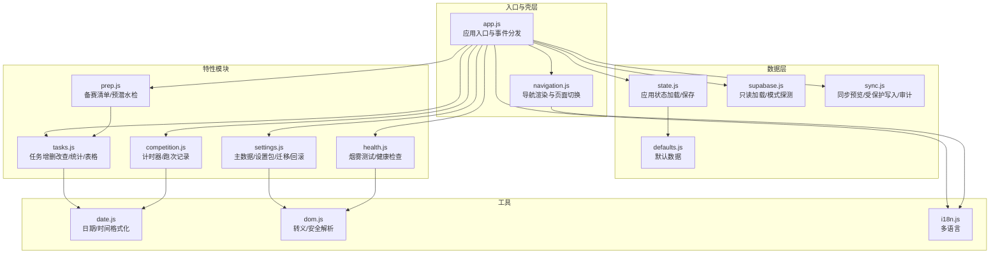
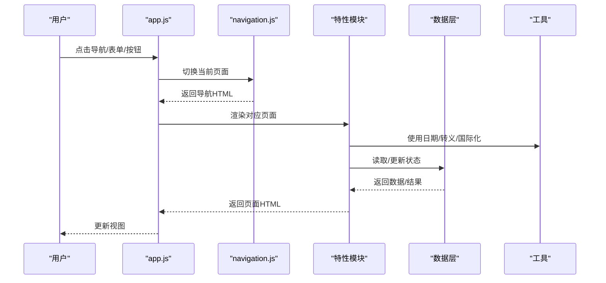
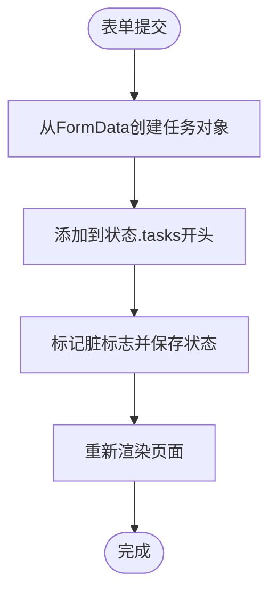
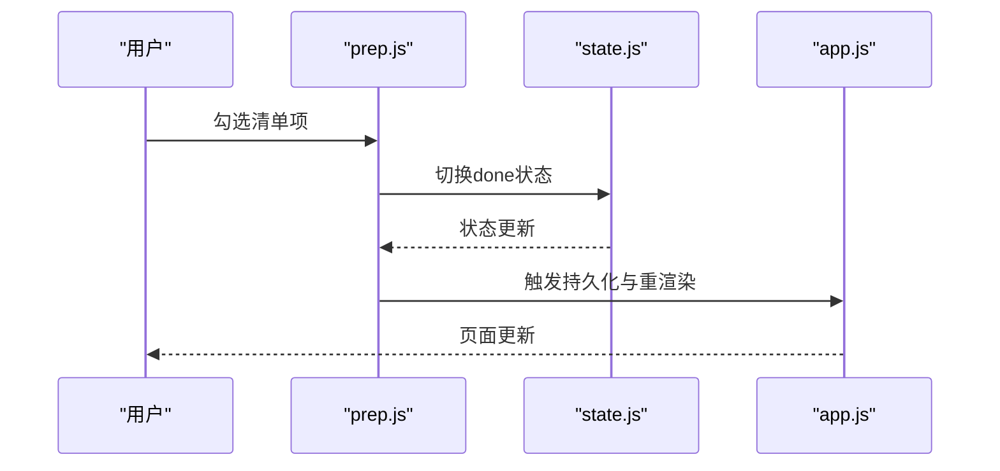
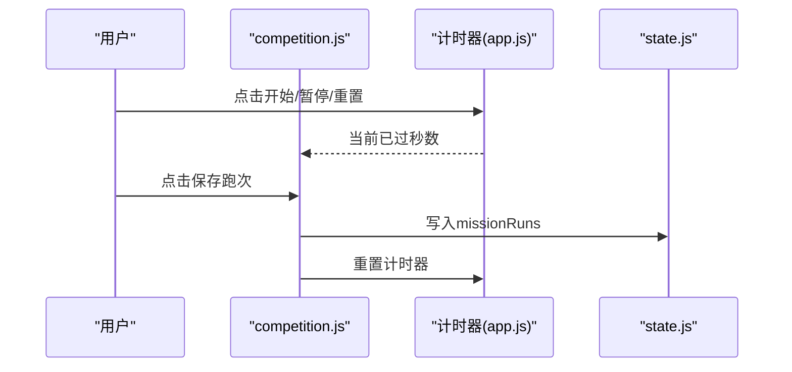
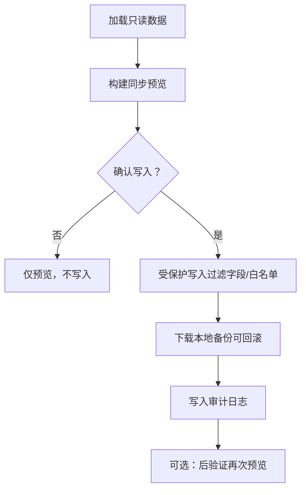
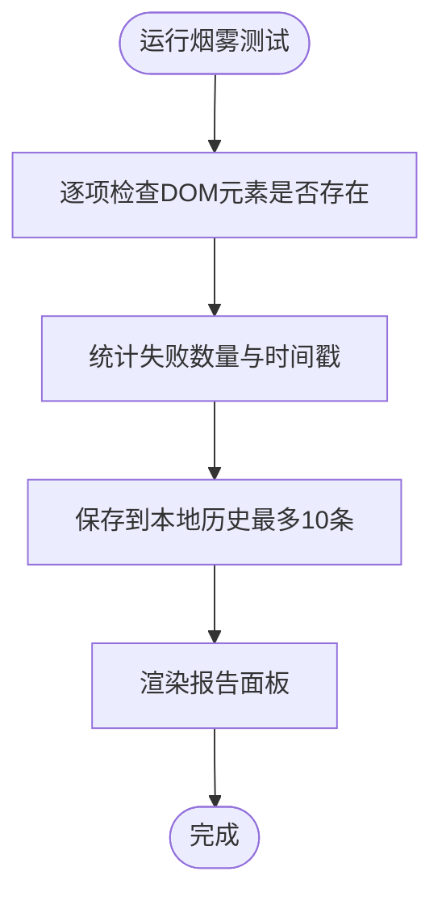
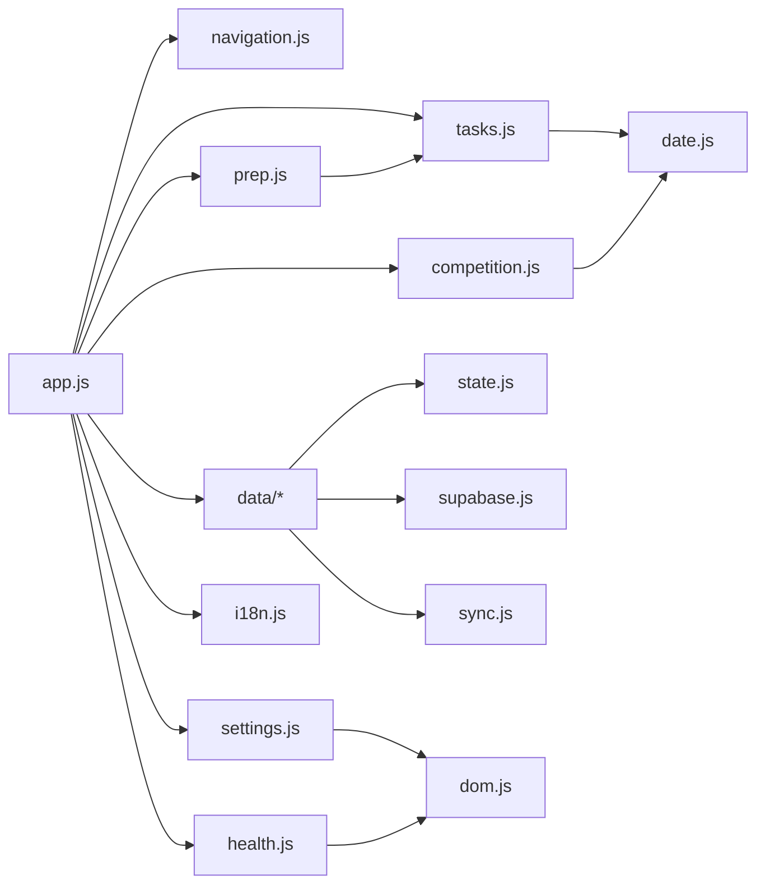

# 核心功能模块

<cite>
**本文引用的文件**
- [README.md](file://README.md)
- [app.js](file://src/app.js)
- [state.js](file://src/data/state.js)
- [defaults.js](file://src/data/defaults.js)
- [supabase.js](file://src/data/supabase.js)
- [sync.js](file://src/data/sync.js)
- [tasks.js](file://src/features/tasks.js)
- [prep.js](file://src/features/prep.js)
- [competition.js](file://src/features/competition.js)
- [settings.js](file://src/features/settings.js)
- [health.js](file://src/features/health.js)
- [navigation.js](file://src/features/navigation.js)
- [date.js](file://src/utils/date.js)
- [dom.js](file://src/utils/dom.js)
- [i18n.js](file://src/utils/i18n.js)
- [utils/README.md](file://src/utils/README.md)
</cite>

## 目录
1. [简介](#简介)
2. [项目结构](#项目结构)
3. [核心组件](#核心组件)
4. [架构总览](#架构总览)
5. [详细组件分析](#详细组件分析)
6. [依赖分析](#依赖分析)
7. [性能考虑](#性能考虑)
8. [故障排查指南](#故障排查指南)
9. [结论](#结论)
10. [附录](#附录)

## 简介
本文件面向 ROV 任务管理 v16 的核心功能模块，系统性梳理任务管理、备赛中心、竞赛指挥、设置中心与健康检查五大模块的目标、实现细节与使用模式。文档解释模块间的关系与依赖，提供配置项、参数说明、返回值与典型使用场景，并通过图示帮助不同背景的读者快速上手。

## 项目结构
v16 采用“本地优先”的单页应用（SPA）架构，将 v15 的功能拆分为独立模块：数据层（state、defaults、supabase、sync）、特性模块（tasks、prep、competition、settings、health、navigation），以及通用工具（date、dom、i18n）。入口文件负责页面渲染、事件分发与状态持久化。

图表来源
- [app.js:1-402](file://src/app.js#L1-L402)
- [navigation.js:1-37](file://src/features/navigation.js#L1-L37)
- [state.js:1-45](file://src/data/state.js#L1-L45)
- [defaults.js:1-46](file://src/data/defaults.js#L1-L46)
- [supabase.js:1-157](file://src/data/supabase.js#L1-L157)
- [sync.js:1-341](file://src/data/sync.js#L1-L341)
- [tasks.js:1-112](file://src/features/tasks.js#L1-L112)
- [prep.js:1-58](file://src/features/prep.js#L1-L58)
- [competition.js:1-68](file://src/features/competition.js#L1-L68)
- [settings.js:1-592](file://src/features/settings.js#L1-L592)
- [health.js:1-127](file://src/features/health.js#L1-L127)
- [date.js:1-55](file://src/utils/date.js#L1-L55)
- [dom.js:1-21](file://src/utils/dom.js#L1-L21)
- [i18n.js:1-217](file://src/utils/i18n.js#L1-L217)

章节来源
- [README.md:1-68](file://README.md#L1-L68)
- [app.js:1-402](file://src/app.js#L1-L402)

## 核心组件
- 应用壳层与事件中枢：负责页面渲染、定时器控制、事件监听与状态持久化。
- 数据层：应用状态管理、默认数据、Supabase 只读加载与模式探测、受保护写入与审计。
- 特性模块：任务管理、备赛中心、竞赛指挥、设置中心、健康检查。
- 工具库：日期/时间处理、DOM 转义与安全解析、国际化。

章节来源
- [app.js:1-402](file://src/app.js#L1-L402)
- [state.js:1-45](file://src/data/state.js#L1-L45)
- [supabase.js:1-157](file://src/data/supabase.js#L1-L157)
- [sync.js:1-341](file://src/data/sync.js#L1-L341)
- [tasks.js:1-112](file://src/features/tasks.js#L1-L112)
- [prep.js:1-58](file://src/features/prep.js#L1-L58)
- [competition.js:1-68](file://src/features/competition.js#L1-L68)
- [settings.js:1-592](file://src/features/settings.js#L1-L592)
- [health.js:1-127](file://src/features/health.js#L1-L127)
- [date.js:1-55](file://src/utils/date.js#L1-L55)
- [dom.js:1-21](file://src/utils/dom.js#L1-L21)
- [i18n.js:1-217](file://src/utils/i18n.js#L1-L217)

## 架构总览
v16 以 app.js 为中心，围绕“状态驱动 + 事件驱动”的模式组织。页面渲染由导航模块与特性模块协作完成；数据层提供只读加载、模式探测、同步预览与受保护写入；工具模块提供跨域功能支持。

图表来源
- [app.js:104-131](file://src/app.js#L104-L131)
- [navigation.js:21-36](file://src/features/navigation.js#L21-L36)
- [tasks.js:84-112](file://src/features/tasks.js#L84-L112)
- [prep.js:25-58](file://src/features/prep.js#L25-L58)
- [competition.js:38-68](file://src/features/competition.js#L38-L68)
- [settings.js:156-537](file://src/features/settings.js#L156-L537)
- [health.js:96-122](file://src/features/health.js#L96-L122)

## 详细组件分析

### 任务管理（tasks）
- 目标：提供任务的创建、状态更新、删除、到期显示与本地持久化。
- 关键流程：
  - 表单提交 → 创建任务对象 → 添加到状态 → 持久化 → 重新渲染。
  - 状态变更 → 更新任务状态 → 标记脏标志 → 持久化 → 重新渲染。
  - 删除任务 → 过滤列表 → 标记脏标志 → 持久化 → 重新渲染。
- 统计与展示：计算开放/完成/逾期/阻塞数量，生成任务表格，显示到期天数与阻塞标记。
- 交互事件：选择状态、删除按钮、表单提交。
- 配置与参数：
  - 表单字段：名称、负责人、截止日期、优先级、分类、状态、阻塞标记。
  - 默认分类来自主数据（settings）。
- 返回值：
  - addTask：无（副作用修改状态）。
  - updateTaskStatus：布尔（是否找到并更新）。
  - deleteTask：布尔（是否实际删除）。
  - getTaskStats：对象（total/open/done/overdue/blocked）。
  - renderTaskTable：字符串（HTML 表格）。
  - renderTasksPage：字符串（页面HTML）。

图表来源
- [tasks.js:5-22](file://src/features/tasks.js#L5-L22)
- [tasks.js:19-37](file://src/features/tasks.js#L19-L37)
- [tasks.js:84-112](file://src/features/tasks.js#L84-L112)

章节来源
- [tasks.js:1-112](file://src/features/tasks.js#L1-L112)
- [date.js:21-28](file://src/utils/date.js#L21-L28)

### 备赛中心（prep）
- 目标：每日准备、清单与预潜水检的可视化与勾选控制。
- 关键流程：
  - 切换清单项 done 状态 → 标记脏标志 → 持久化 → 重新渲染。
  - 统计任务开放数、阻塞数，以及清单与预潜水检完成进度。
- 交互事件：复选框切换。
- 返回值：
  - toggleChecklistItem：布尔（是否找到并切换）。
  - renderChecklist：字符串（HTML 清单）。
  - renderPrepCenter：字符串（页面HTML）。

图表来源
- [prep.js:5-11](file://src/features/prep.js#L5-L11)
- [prep.js:25-58](file://src/features/prep.js#L25-L58)
- [app.js:360-364](file://src/app.js#L360-L364)

章节来源
- [prep.js:1-58](file://src/features/prep.js#L1-L58)

### 竞赛指挥（competition）
- 目标：提供任务计时器、跑次记录与历史查看。
- 关键流程：
  - 启动/暂停/重置计时器 → 每秒刷新渲染。
  - 保存跑次：读取分数与备注 → 生成运行记录 → 插入到历史顶部 → 标记脏标志 → 持久化 → 重置计时器。
- 交互事件：计时器动作、保存跑次。
- 返回值：
  - createMissionRun：对象（最新跑次）。
  - renderRunHistory：字符串（最近若干条跑次）。
  - renderCompetitionCenter：字符串（页面HTML）。

图表来源
- [competition.js:6-19](file://src/features/competition.js#L6-L19)
- [competition.js:38-68](file://src/features/competition.js#L38-L68)
- [app.js:147-171](file://src/app.js#L147-L171)

章节来源
- [competition.js:1-68](file://src/features/competition.js#L1-L68)
- [date.js:46-54](file://src/utils/date.js#L46-L54)

### 设置中心（settings）
- 目标：主数据管理、设置包导入导出、v15/v16 备份迁移、Supabase 只读加载/模式探测/同步预览/受保护写入/审计日志/回滚。
- 主要能力：
  - 主数据：角色、组、任务类型、装备分类，支持去重排序与持久化。
  - 设置包：导出/导入 v16 主数据与烟雾测试历史；兼容 v15 设置包。
  - 数据健康：汇总任务/成员/跑次/清单/装备数量与主数据总数。
  - 系统/QA：烟雾测试运行与历史记录。
  - 数据库：只读加载、模式探测、同步预览、受保护写入、写入审计、回滚。
  - 迁移：v15 备份导入，标准化映射到 v16 结构。
- 交互事件：滚动到指定区域、运行烟雾测试、加载只读数据、探测模式、构建同步预览、执行受保护写入、导入/导出设置包、导入 v15 备份、恢复 v16 备份。
- 返回值：
  - getMasterData/saveMasterData：对象/对象。
  - buildSettingsPack/importSettingsPackPayload：对象。
  - exportSettingsPack：对象（下载文件）。
  - getSettingsCenterStats：对象（汇总统计）。
  - renderSettingsHub：字符串（页面HTML）。

图表来源
- [settings.js:156-537](file://src/features/settings.js#L156-L537)
- [sync.js:150-178](file://src/data/sync.js#L150-L178)
- [sync.js:221-284](file://src/data/sync.js#L221-L284)
- [supabase.js:79-121](file://src/data/supabase.js#L79-L121)

章节来源
- [settings.js:1-592](file://src/features/settings.js#L1-L592)
- [supabase.js:1-157](file://src/data/supabase.js#L1-L157)
- [sync.js:1-341](file://src/data/sync.js#L1-L341)

### 健康检查（health）
- 目标：运行烟雾测试（DOM 元素存在性检查），记录历史，评估数据健康问题（主数据缺失、引用不一致）。
- 关键流程：
  - 执行烟雾测试 → 记录结果到本地存储 → 渲染报告面板。
  - 评估数据健康：检查角色/任务类型/装备分类是否配置，成员/任务/装备的角色/分类是否在主数据中。
- 返回值：
  - runSmokeTest：对象（时间戳、是否通过、检查项）。
  - getDataHealthIssues：数组（问题列表）。
  - renderSmokeTestPanel：字符串（报告HTML）。

图表来源
- [health.js:14-54](file://src/features/health.js#L14-L54)
- [health.js:56-84](file://src/features/health.js#L56-L84)
- [health.js:96-122](file://src/features/health.js#L96-L122)

章节来源
- [health.js:1-127](file://src/features/health.js#L1-L127)

### 导航（navigation）
- 目标：渲染主导航栏，支持页面切换与语言切换。
- 返回值：
  - renderNavigation：字符串（导航HTML）。
  - showPage/showMode：更新状态并返回。

章节来源
- [navigation.js:1-37](file://src/features/navigation.js#L1-L37)
- [i18n.js:204-216](file://src/utils/i18n.js#L204-L216)

## 依赖分析
- 模块耦合：
  - app.js 作为中枢，依赖所有特性模块与数据层；特性模块之间尽量低耦合，仅在必要处共享工具（如 tasks 与 prep 的统计共享）。
  - 数据层内部职责清晰：state 负责持久化，supabase 提供只读加载与模式探测，sync 提供预览与受保护写入。
- 外部依赖：
  - Supabase 客户端（通过全局 window.supabase 注入）。
  - 浏览器原生 API（localStorage、FileReader、Blob、URL）。
- 循环依赖：
  - 未发现直接循环；特性模块通过 app.js 间接交互，避免循环。

图表来源
- [app.js:1-37](file://src/app.js#L1-L37)
- [tasks.js:1-4](file://src/features/tasks.js#L1-L4)
- [prep.js:1-3](file://src/features/prep.js#L1-L3)
- [competition.js:1-4](file://src/features/competition.js#L1-L4)
- [settings.js:1-3](file://src/features/settings.js#L1-L3)
- [health.js:1-2](file://src/features/health.js#L1-L2)
- [state.js:1-2](file://src/data/state.js#L1-L2)
- [supabase.js:26-29](file://src/data/supabase.js#L26-L29)
- [sync.js:1-17](file://src/data/sync.js#L1-L17)
- [date.js:1-55](file://src/utils/date.js#L1-L55)
- [dom.js:1-21](file://src/utils/dom.js#L1-L21)
- [i18n.js:1-217](file://src/utils/i18n.js#L1-L217)

章节来源
- [app.js:1-402](file://src/app.js#L1-L402)

## 性能考虑
- 渲染频率：计时器每秒触发一次渲染，建议在长页面或大量数据时减少不必要的重渲染（当前实现按需渲染页面主体）。
- 异步操作：Supabase 只读加载使用并发查询，注意网络延迟与错误处理。
- 字段过滤：受保护写入前对字段进行白名单过滤，避免无效写入与错误。
- 本地存储：状态与设置包均使用 JSON 存储，注意大小限制与序列化开销。

## 故障排查指南
- 烟雾测试失败：
  - 检查 DOM 元素是否正确挂载（页面ID/选择器）。
  - 查看历史记录定位具体失败项。
- 数据健康告警：
  - 检查主数据（角色/任务类型/装备分类）是否为空。
  - 核对成员/任务/装备的引用字段是否存在于主数据。
- Supabase 只读加载：
  - 确认客户端可用与网络连通。
  - 查看加载耗时与错误信息。
- 同步预览/写入：
  - 确保先加载只读数据再构建预览。
  - 受保护写入需要输入确认文本，且删除被禁用。
  - 若出现字段被丢弃，使用模式探测确认数据库列存在性。
- 回滚与迁移：
  - v16 备份回滚不会写入数据库，确保备份文件格式正确。
  - v15 备份导入会替换本地数据，请提前备份。

章节来源
- [health.js:14-54](file://src/features/health.js#L14-L54)
- [health.js:56-84](file://src/features/health.js#L56-L84)
- [supabase.js:79-121](file://src/data/supabase.js#L79-L121)
- [sync.js:221-284](file://src/data/sync.js#L221-L284)
- [sync.js:300-317](file://src/data/sync.js#L300-L317)

## 结论
v16 将 v15 的复杂逻辑拆分为高内聚、低耦合的功能模块，配合本地优先的数据策略与严格的受保护写入机制，既保证了易用性，又提升了安全性与可维护性。通过设置中心与健康检查，团队可以稳定地管理主数据、迁移历史与系统状态。

## 附录

### 配置与参数速查
- 应用状态键名：rov_v16_app_state
- 主数据存储键前缀：rov_v16_master_data_
- 设置包类型标识：rov_v16_settings_pack
- 受保护写入确认字串：SYNC V16
- 写入表白名单：tasks、members、checklist_items、predive_checklist_items
- 写入字段白名单（部分）：tasks(id,name,owner,due,priority,status,cat)、members(id,name,role)、checklist_items(item_id,label,done,order_index)
- 语言键：rov_v16_locale

章节来源
- [state.js:4](file://src/data/state.js#L4)
- [settings.js:4](file://src/features/settings.js#L4)
- [settings.js:5](file://src/features/settings.js#L5)
- [sync.js:9](file://src/data/sync.js#L9)
- [sync.js:10](file://src/data/sync.js#L10)
- [sync.js:12-17](file://src/data/sync.js#L12-L17)
- [i18n.js:204-216](file://src/utils/i18n.js#L204-L216)