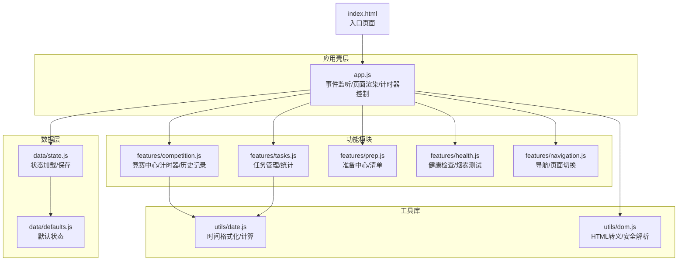
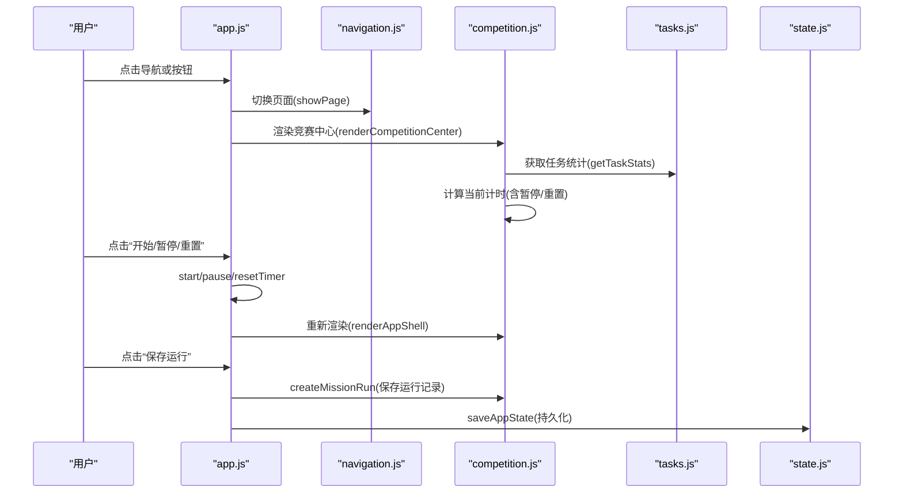
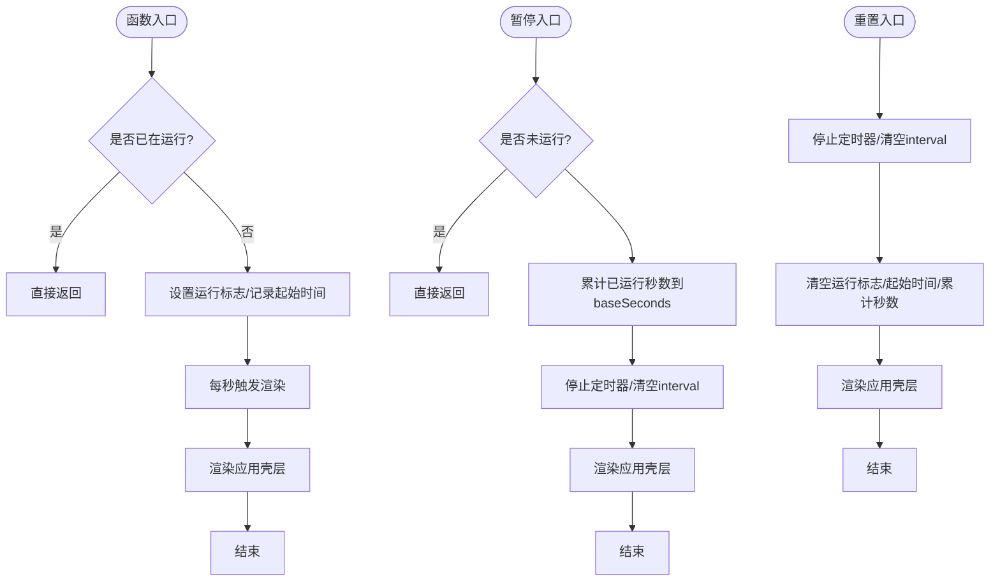
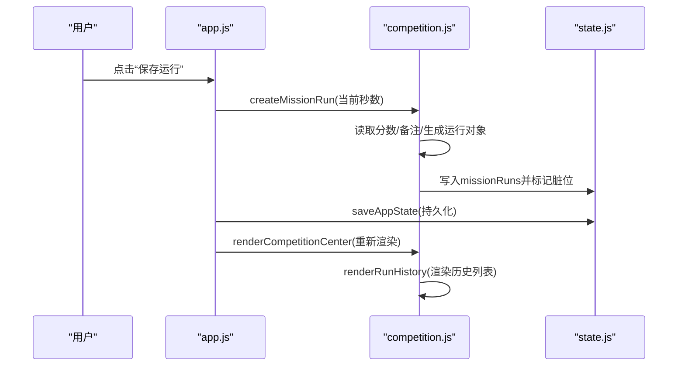
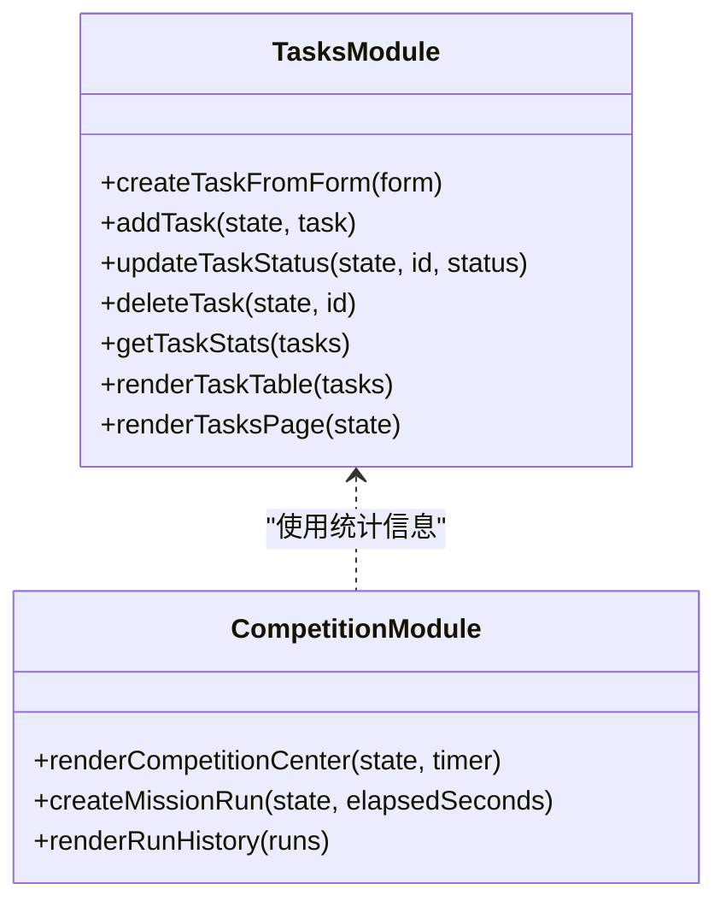
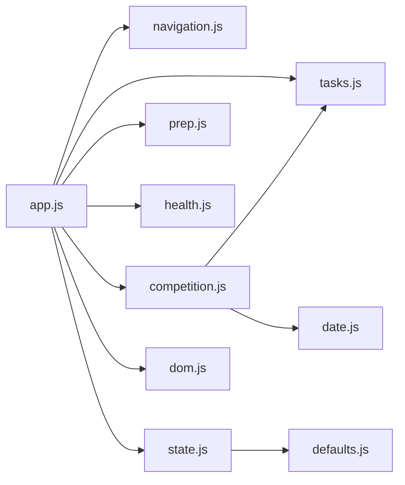

# 竞赛指挥系统

<cite>
**本文档引用的文件**
- [v16/src/app.js](file://v16/src/app.js)
- [v16/src/features/competition.js](file://v16/src/features/competition.js)
- [v16/src/features/tasks.js](file://v16/src/features/tasks.js)
- [v16/src/features/prep.js](file://v16/src/features/prep.js)
- [v16/src/features/health.js](file://v16/src/features/health.js)
- [v16/src/features/navigation.js](file://v16/src/features/navigation.js)
- [v16/src/data/state.js](file://v16/src/data/state.js)
- [v16/src/data/defaults.js](file://v16/src/data/defaults.js)
- [v16/src/utils/date.js](file://v16/src/utils/date.js)
- [v16/src/utils/dom.js](file://v16/src/utils/dom.js)
- [v16/index.html](file://v16/index.html)
</cite>

## 目录
1. [简介](#简介)
2. [项目结构](#项目结构)
3. [核心组件](#核心组件)
4. [架构总览](#架构总览)
5. [详细组件分析](#详细组件分析)
6. [依赖关系分析](#依赖关系分析)
7. [性能考虑](#性能考虑)
8. [故障排除指南](#故障排除指南)
9. [结论](#结论)
10. [附录](#附录)

## 简介
本文件面向竞赛指挥系统（v16），聚焦以下核心能力：
- 实时计时器：启动、暂停、重置与显示逻辑
- 快速计分面板：界面设计与数据处理
- 运行历史记录：记录、查询与管理
- 计时器与任务管理系统的集成：竞赛期间的任务调度与状态更新
- 使用指南与故障排除

该系统采用模块化前端架构，通过事件驱动的方式在应用壳层统一渲染页面，并以状态持久化机制保障数据一致性。

## 项目结构
系统采用按功能域划分的目录组织方式，核心模块包括：
- 应用壳层与事件总线：负责页面渲染、事件监听与状态持久化
- 功能模块：竞赛中心、任务管理、准备中心、健康检查等
- 数据层：默认状态、本地存储封装、同步与迁移工具
- 工具库：日期格式化、DOM 安全转义、国际化等

**图表来源**
- [v16/src/app.js:1-402](file://v16/src/app.js#L1-L402)
- [v16/src/features/competition.js:1-68](file://v16/src/features/competition.js#L1-L68)
- [v16/src/features/tasks.js:1-112](file://v16/src/features/tasks.js#L1-L112)
- [v16/src/features/prep.js:1-58](file://v16/src/features/prep.js#L1-L58)
- [v16/src/features/health.js:1-127](file://v16/src/features/health.js#L1-L127)
- [v16/src/features/navigation.js:1-36](file://v16/src/features/navigation.js#L1-L36)
- [v16/src/data/state.js:1-45](file://v16/src/data/state.js#L1-L45)
- [v16/src/data/defaults.js:1-46](file://v16/src/data/defaults.js#L1-L46)
- [v16/src/utils/date.js:1-55](file://v16/src/utils/date.js#L1-L55)
- [v16/src/utils/dom.js:1-21](file://v16/src/utils/dom.js#L1-L21)
- [v16/index.html:1-15](file://v16/index.html#L1-L15)

**章节来源**
- [v16/src/app.js:104-131](file://v16/src/app.js#L104-L131)
- [v16/src/features/navigation.js:13-36](file://v16/src/features/navigation.js#L13-L36)
- [v16/src/data/state.js:6-44](file://v16/src/data/state.js#L6-L44)
- [v16/src/data/defaults.js:1-46](file://v16/src/data/defaults.js#L1-L46)
- [v16/src/utils/date.js:46-55](file://v16/src/utils/date.js#L46-L55)
- [v16/src/utils/dom.js:1-21](file://v16/src/utils/dom.js#L1-L21)
- [v16/index.html:1-15](file://v16/index.html#L1-L15)

## 核心组件
- 实时计时器：在应用壳层维护计时状态，提供启动、暂停、重置与每秒刷新渲染的能力；竞赛中心页面展示当前计时并提供操作按钮。
- 快速计分面板：在竞赛中心页面提供分数输入与备注输入，用于记录每次任务运行的得分与说明。
- 运行历史记录：将每次保存的运行记录写入状态数据，支持历史列表渲染与截断展示。
- 任务管理系统：提供任务统计、状态变更与任务表单渲染，为竞赛期间的任务调度与状态更新提供基础。
- 导航与页面切换：统一的导航栏与页面路由，支持在不同功能页之间切换。
- 状态持久化：基于本地存储的状态加载与保存，确保数据在刷新后不丢失。

**章节来源**
- [v16/src/app.js:49-177](file://v16/src/app.js#L49-L177)
- [v16/src/features/competition.js:6-67](file://v16/src/features/competition.js#L6-L67)
- [v16/src/features/tasks.js:39-48](file://v16/src/features/tasks.js#L39-L48)
- [v16/src/features/navigation.js:13-36](file://v16/src/features/navigation.js#L13-L36)
- [v16/src/data/state.js:16-44](file://v16/src/data/state.js#L16-L44)

## 架构总览
系统采用“应用壳层 + 功能模块 + 数据层 + 工具库”的分层架构。应用壳层集中处理事件、状态与渲染；功能模块负责各自业务逻辑；数据层提供状态持久化与默认值；工具库提供通用能力。

**图表来源**
- [v16/src/app.js:147-177](file://v16/src/app.js#L147-L177)
- [v16/src/app.js:332-343](file://v16/src/app.js#L332-L343)
- [v16/src/features/competition.js:38-67](file://v16/src/features/competition.js#L38-L67)
- [v16/src/features/tasks.js:39-48](file://v16/src/features/tasks.js#L39-L48)
- [v16/src/data/state.js:35-44](file://v16/src/data/state.js#L35-L44)

## 详细组件分析

### 实时计时器组件
- 计时状态结构：包含运行标志、起始时间戳、累计秒数与定时器句柄。
- 启动流程：若未运行则标记运行、记录起始时间、每秒触发一次渲染。
- 暂停流程：计算本次已运行秒数累加到累计秒数，停止定时器。
- 重置流程：清空运行状态与累计秒数，停止定时器。
- 显示逻辑：根据运行状态动态计算当前秒数，格式化为 HH:MM:SS 或 MM:SS。

**图表来源**
- [v16/src/app.js:147-177](file://v16/src/app.js#L147-L177)

**章节来源**
- [v16/src/app.js:49-177](file://v16/src/app.js#L49-L177)
- [v16/src/utils/date.js:46-55](file://v16/src/utils/date.js#L46-L55)

### 快速计分面板与运行历史记录
- 计分面板：在竞赛中心页面提供分数输入框与备注输入框，用于记录每次运行的得分与说明。
- 历史记录：保存运行时会创建包含时间戳、累计秒数、得分与备注的对象，插入到运行记录数组头部，并标记对应脏位。
- 历史渲染：最多展示最近若干条记录，格式化显示耗时、时间戳、备注与得分。

**图表来源**
- [v16/src/app.js:339-343](file://v16/src/app.js#L339-L343)
- [v16/src/features/competition.js:6-36](file://v16/src/features/competition.js#L6-L36)
- [v16/src/data/state.js:35-44](file://v16/src/data/state.js#L35-L44)

**章节来源**
- [v16/src/features/competition.js:6-67](file://v16/src/features/competition.js#L6-L67)
- [v16/src/data/state.js:35-44](file://v16/src/data/state.js#L35-L44)

### 任务管理系统与竞赛集成
- 任务统计：统计总数、开放、完成、逾期与阻塞数量，用于竞赛中心顶部摘要。
- 任务表单：提供新增任务的表单字段（名称、负责人、截止日期、优先级、分类、状态、阻塞标记）。
- 状态更新：通过下拉框更新任务状态，触发持久化与重新渲染。
- 竞赛集成：竞赛中心顶部显示开放任务与阻塞任务数量，便于在竞赛期间关注任务状态。

**图表来源**
- [v16/src/features/tasks.js:5-112](file://v16/src/features/tasks.js#L5-L112)
- [v16/src/features/competition.js:38-67](file://v16/src/features/competition.js#L38-L67)

**章节来源**
- [v16/src/features/tasks.js:39-48](file://v16/src/features/tasks.js#L39-L48)
- [v16/src/features/tasks.js:84-112](file://v16/src/features/tasks.js#L84-L112)
- [v16/src/features/competition.js:38-67](file://v16/src/features/competition.js#L38-L67)

### 准备中心与健康检查
- 准备中心：提供清单与预潜水检查清单的勾选功能，统计完成情况。
- 健康检查：执行烟雾测试，记录结果并提供可视化面板；检测主数据与数据完整性问题。

**章节来源**
- [v16/src/features/prep.js:25-58](file://v16/src/features/prep.js#L25-L58)
- [v16/src/features/health.js:37-127](file://v16/src/features/health.js#L37-L127)

## 依赖关系分析
- 应用壳层依赖导航模块进行页面切换，依赖竞赛模块渲染竞赛中心，依赖任务模块获取统计信息，依赖状态模块进行持久化。
- 竞赛模块依赖任务模块的统计函数、日期工具进行时间格式化。
- 数据模块依赖默认状态提供初始数据，依赖工具库进行安全解析。
- 工具库被广泛复用，提供安全转义与日期处理。

**图表来源**
- [v16/src/app.js:1-402](file://v16/src/app.js#L1-L402)
- [v16/src/features/competition.js:1-68](file://v16/src/features/competition.js#L1-L68)
- [v16/src/features/tasks.js:1-112](file://v16/src/features/tasks.js#L1-L112)
- [v16/src/features/prep.js:1-58](file://v16/src/features/prep.js#L1-L58)
- [v16/src/features/health.js:1-127](file://v16/src/features/health.js#L1-L127)
- [v16/src/features/navigation.js:1-36](file://v16/src/features/navigation.js#L1-L36)
- [v16/src/data/state.js:1-45](file://v16/src/data/state.js#L1-L45)
- [v16/src/data/defaults.js:1-46](file://v16/src/data/defaults.js#L1-L46)
- [v16/src/utils/date.js:1-55](file://v16/src/utils/date.js#L1-L55)
- [v16/src/utils/dom.js:1-21](file://v16/src/utils/dom.js#L1-L21)

**章节来源**
- [v16/src/app.js:1-402](file://v16/src/app.js#L1-L402)
- [v16/src/features/competition.js:1-68](file://v16/src/features/competition.js#L1-L68)
- [v16/src/features/tasks.js:1-112](file://v16/src/features/tasks.js#L1-L112)
- [v16/src/features/prep.js:1-58](file://v16/src/features/prep.js#L1-L58)
- [v16/src/features/health.js:1-127](file://v16/src/features/health.js#L1-L127)
- [v16/src/features/navigation.js:1-36](file://v16/src/features/navigation.js#L1-L36)
- [v16/src/data/state.js:1-45](file://v16/src/data/state.js#L1-L45)
- [v16/src/data/defaults.js:1-46](file://v16/src/data/defaults.js#L1-L46)
- [v16/src/utils/date.js:1-55](file://v16/src/utils/date.js#L1-L55)
- [v16/src/utils/dom.js:1-21](file://v16/src/utils/dom.js#L1-L21)

## 性能考虑
- 计时器频率：每秒渲染一次，开销极低；仅在运行时启用定时器，避免不必要的循环。
- 渲染范围：应用壳层统一渲染，避免重复挂载；页面切换时仅渲染目标页面。
- 数据持久化：状态保存在本地存储，避免频繁网络请求；仅在需要时写入。
- DOM 安全：所有输出均通过安全转义，防止 XSS 攻击。
- 时间格式化：使用纯 JavaScript 计算，避免额外依赖。

[本节为通用性能建议，无需特定文件来源]

## 故障排除指南
- 计时器无法启动/暂停/重置
  - 检查事件绑定是否生效（应用壳层的点击事件处理器）。
  - 确认计时器状态未被意外覆盖。
  - 参考路径：[v16/src/app.js:332-343](file://v16/src/app.js#L332-L343)，[v16/src/app.js:147-177](file://v16/src/app.js#L147-L177)
- 运行历史未显示或为空
  - 确认“保存运行”按钮已被点击且成功写入状态。
  - 检查状态持久化是否成功。
  - 参考路径：[v16/src/app.js:339-343](file://v16/src/app.js#L339-L343)，[v16/src/features/competition.js:21-36](file://v16/src/features/competition.js#L21-L36)，[v16/src/data/state.js:35-44](file://v16/src/data/state.js#L35-L44)
- 页面切换异常
  - 检查导航模块的页面标识与事件绑定。
  - 参考路径：[v16/src/features/navigation.js:13-36](file://v16/src/features/navigation.js#L13-L36)，[v16/src/app.js:141-145](file://v16/src/app.js#L141-L145)
- 数据未持久化
  - 确认状态保存调用与本地存储可用性。
  - 参考路径：[v16/src/data/state.js:35-44](file://v16/src/data/state.js#L35-L44)
- 任务统计不准确
  - 检查任务状态与阻塞标记是否正确更新。
  - 参考路径：[v16/src/features/tasks.js:24-30](file://v16/src/features/tasks.js#L24-L30)，[v16/src/features/tasks.js:39-48](file://v16/src/features/tasks.js#L39-L48)

**章节来源**
- [v16/src/app.js:332-343](file://v16/src/app.js#L332-L343)
- [v16/src/app.js:147-177](file://v16/src/app.js#L147-L177)
- [v16/src/features/competition.js:21-36](file://v16/src/features/competition.js#L21-L36)
- [v16/src/data/state.js:35-44](file://v16/src/data/state.js#L35-L44)
- [v16/src/features/navigation.js:13-36](file://v16/src/features/navigation.js#L13-L36)
- [v16/src/features/tasks.js:24-30](file://v16/src/features/tasks.js#L24-L30)
- [v16/src/features/tasks.js:39-48](file://v16/src/features/tasks.js#L39-L48)

## 结论
竞赛指挥系统通过清晰的模块划分与事件驱动架构，实现了竞赛期间对计时、计分与历史记录的高效管理。计时器与任务管理系统的紧密集成，使得指挥员能够在竞赛过程中实时掌握任务状态与运行表现。状态持久化与安全转义保证了数据可靠性与安全性。建议在实际部署中结合烟雾测试与健康检查模块，持续验证系统稳定性。

[本节为总结性内容，无需特定文件来源]

## 附录

### 使用指南（竞赛场景）
- 启动计时：在竞赛中心点击“开始”，计时器开始运行。
- 暂停计时：在竞赛中心点击“暂停”，累计已运行时间。
- 重置计时：在竞赛中心点击“重置”，清空计时状态。
- 记录运行：填写分数与备注，点击“保存运行”，系统自动记录并清空计时。
- 关注任务：竞赛中心顶部显示开放任务与阻塞任务数量，便于统筹安排。

**章节来源**
- [v16/src/app.js:147-177](file://v16/src/app.js#L147-L177)
- [v16/src/app.js:339-343](file://v16/src/app.js#L339-L343)
- [v16/src/features/competition.js:38-67](file://v16/src/features/competition.js#L38-L67)
- [v16/src/features/tasks.js:39-48](file://v16/src/features/tasks.js#L39-L48)