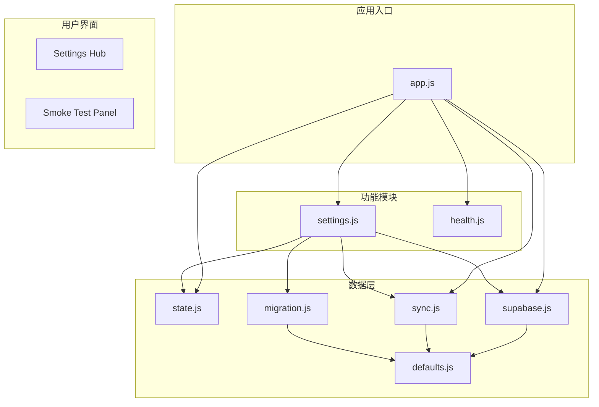
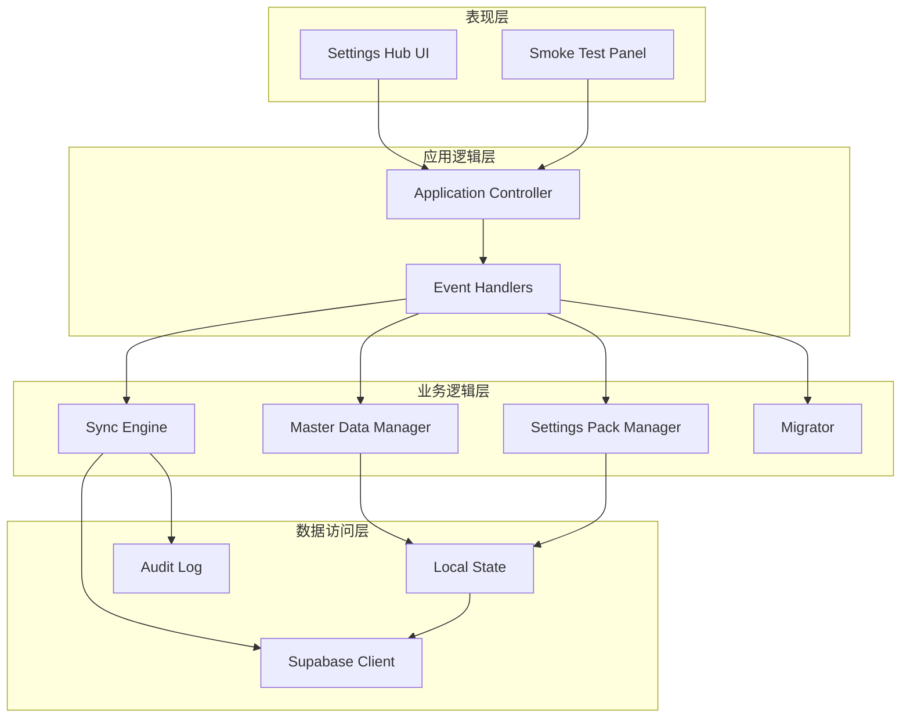
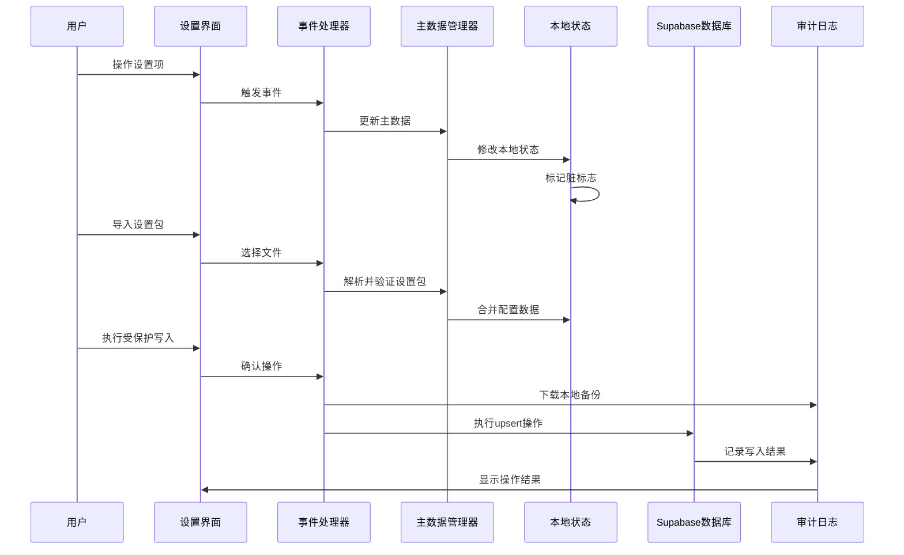
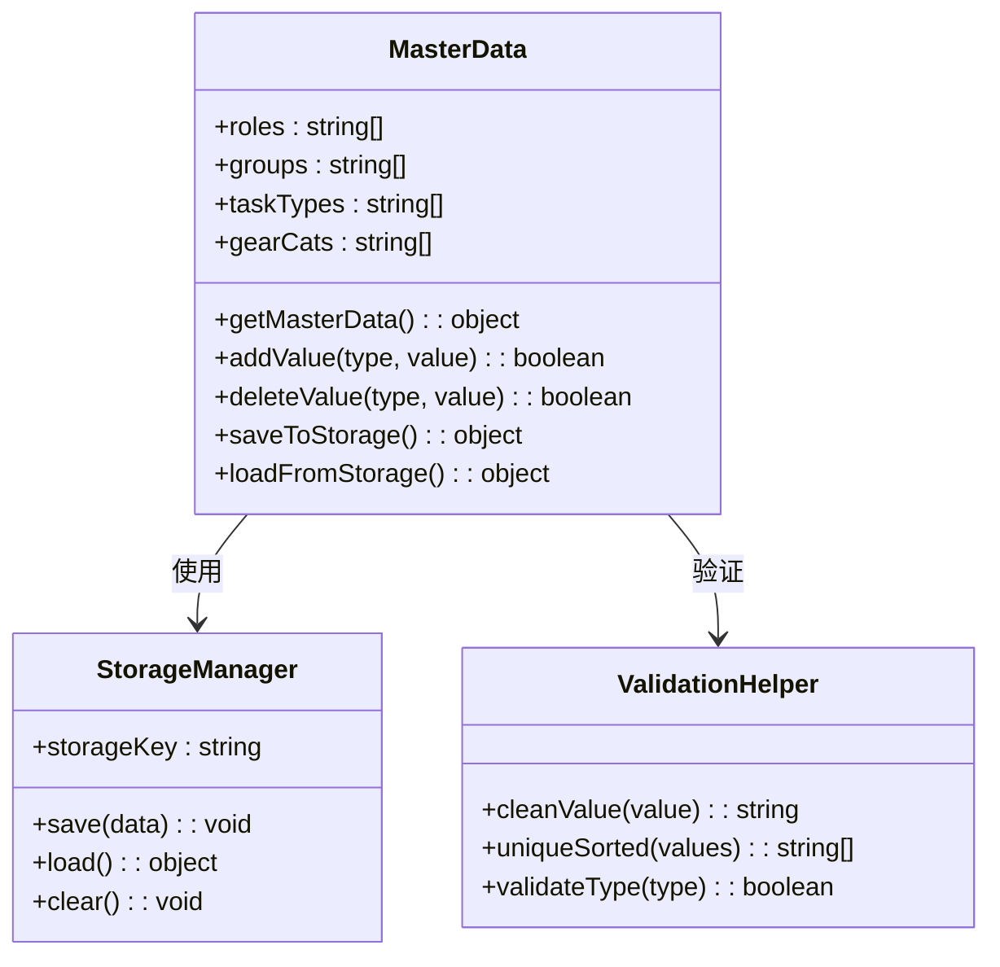
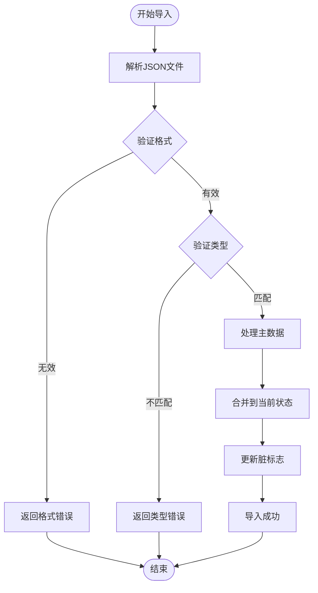
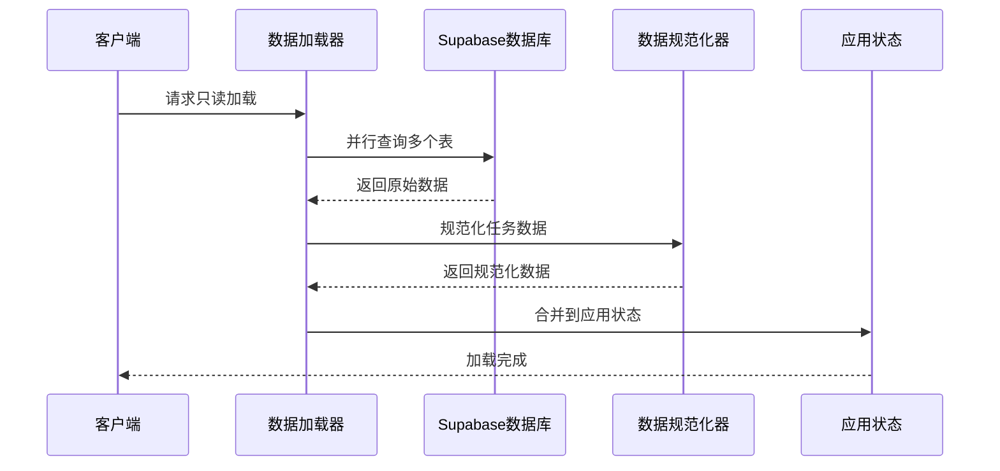
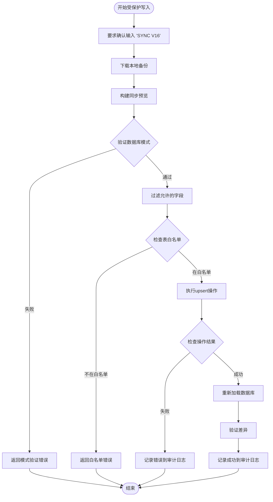
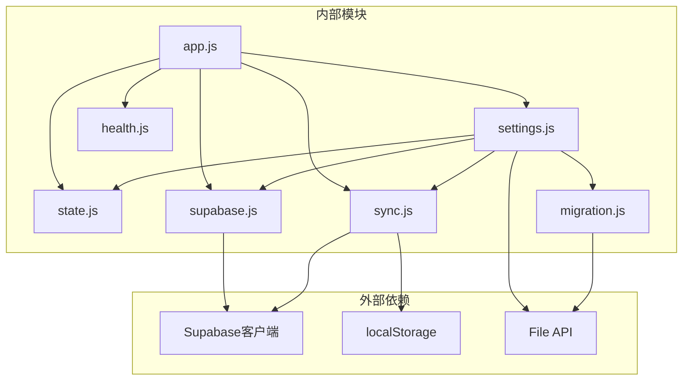

# 设置管理中心

<cite>
**本文档引用的文件**
- [supabase.js](file://v16/src/data/supabase.js)
- [sync.js](file://v16/src/data/sync.js)
- [state.js](file://v16/src/data/state.js)
- [settings.js](file://v16/src/features/settings.js)
- [migration.js](file://v16/src/data/migration.js)
- [defaults.js](file://v16/src/data/defaults.js)
- [app.js](file://v16/src/app.js)
- [health.js](file://v16/src/features/health.js)
- [README.md](file://v16/README.md)
- [MIGRATION_MANIFEST.md](file://v16/MIGRATION_MANIFEST.md)
</cite>

## 目录
1. [简介](#简介)
2. [项目结构](#项目结构)
3. [核心组件](#核心组件)
4. [架构概览](#架构概览)
5. [详细组件分析](#详细组件分析)
6. [依赖关系分析](#依赖关系分析)
7. [性能考虑](#性能考虑)
8. [故障排除指南](#故障排除指南)
9. [结论](#结论)
10. [附录](#附录)

## 简介

设置管理中心是 ROV Task Manager v16 的核心管理模块，负责主数据管理、设置包导入导出和系统配置选项的实现机制。该系统采用本地优先（local-first）架构，通过 Supabase 数据库进行只读数据加载和受保护的写入操作，确保生产环境的安全性和稳定性。

系统的主要功能包括：
- 主数据管理：角色、组别、任务类型、装备分类等配置数据的维护
- 设置包导入导出：完整的配置数据备份和恢复机制
- 系统配置选项：数据库同步、审计日志、版本兼容性处理
- 安全同步机制：受保护的数据库写入操作，防止意外数据丢失

## 项目结构

设置管理中心采用模块化的文件组织结构，按照功能和职责进行清晰分离：



**图表来源**
- [app.js:1-402](file://v16/src/app.js#L1-L402)
- [settings.js:1-592](file://v16/src/features/settings.js#L1-L592)

**章节来源**
- [README.md:1-68](file://v16/README.md#L1-L68)
- [MIGRATION_MANIFEST.md:1-76](file://v16/MIGRATION_MANIFEST.md#L1-L76)

## 核心组件

设置管理中心由多个相互协作的核心组件构成，每个组件都有明确的职责和接口：

### 主数据管理系统
- **角色管理**：支持添加、删除和编辑团队成员角色
- **组别管理**：维护团队分组和部门信息
- **任务类型管理**：定义任务分类和优先级标准
- **装备分类管理**：管理装备和工具的分类体系

### 设置包管理器
- **设置包导出**：将当前配置状态保存为可移植的 JSON 文件
- **设置包导入**：从外部文件恢复配置数据
- **版本兼容性**：支持 v15 和 v16 格式的设置包

### 数据库同步引擎
- **只读数据加载**：从 Supabase 读取生产数据到本地状态
- **同步预览**：计算本地数据与数据库的差异
- **受保护写入**：执行安全的数据库写入操作

**章节来源**
- [settings.js:7-120](file://v16/src/features/settings.js#L7-L120)
- [sync.js:1-341](file://v16/src/data/sync.js#L1-L341)

## 架构概览

设置管理中心采用分层架构设计，确保各层之间的职责清晰分离：



**图表来源**
- [app.js:189-393](file://v16/src/app.js#L189-L393)
- [settings.js:156-592](file://v16/src/features/settings.js#L156-L592)

### 数据流架构

系统采用双向数据流设计，确保数据的一致性和安全性：



**图表来源**
- [app.js:218-299](file://v16/src/app.js#L218-L299)
- [sync.js:221-284](file://v16/src/data/sync.js#L221-L284)

## 详细组件分析

### 主数据管理系统

主数据管理系统是设置管理中心的核心，负责维护所有配置数据的基础框架。

#### 主数据类型定义

系统支持四种主要的主数据类型：

| 类型 | 描述 | 存储键 | 示例值 |
|------|------|--------|--------|
| roles | 团队角色 | `masterData.roles` | Lead, Pilot, Mechanical, Electrical |
| groups | 组别/部门 | `masterData.groups` | Operations, Drive Team, Engineering |
| taskTypes | 任务类型 | `masterData.taskTypes` | Urgent, High, Medium, Low, Mission Run |
| gearCats | 装备分类 | `masterData.gearCats` | Required, Spare, Tools, Docs |

#### 数据结构设计

主数据采用标准化的数据结构，确保一致性和可扩展性：



**图表来源**
- [settings.js:23-77](file://v16/src/features/settings.js#L23-L77)
- [settings.js:47-52](file://v16/src/features/settings.js#L47-L52)

#### 数据验证和清理

系统实现了严格的数据验证机制，确保主数据的质量和一致性：

**章节来源**
- [settings.js:14-21](file://v16/src/features/settings.js#L14-L21)
- [settings.js:34-52](file://v16/src/features/settings.js#L34-L52)

### 设置包导入导出系统

设置包系统提供了完整的配置数据备份和恢复能力，支持版本兼容性处理。

#### 设置包格式规范

设置包采用标准化的 JSON 格式，包含以下关键字段：

| 字段名 | 类型 | 必需 | 描述 |
|--------|------|------|------|
| type | string | 是 | 设置包类型标识符 |
| version | number | 是 | 设置包版本号 |
| appVersion | string | 是 | 应用版本信息 |
| season | string | 是 | 当前赛季标识 |
| exportedAt | string | 是 | 导出时间戳 |
| masterData | object | 是 | 主数据配置 |
| smokeHistory | array | 否 | 烟雾测试历史记录 |

#### 导入流程分析



**图表来源**
- [settings.js:91-105](file://v16/src/features/settings.js#L91-L105)
- [app.js:370-392](file://v16/src/app.js#L370-L392)

#### 版本兼容性处理

系统支持多版本设置包的兼容性处理：

**章节来源**
- [settings.js:79-119](file://v16/src/features/settings.js#L79-L119)
- [migration.js:75-99](file://v16/src/data/migration.js#L75-L99)

### 数据库同步机制

数据库同步机制是设置管理中心最复杂的功能模块，实现了安全的数据同步和审计功能。

#### 只读数据加载

只读数据加载功能从 Supabase 数据库获取生产数据，但不进行任何写入操作：



**图表来源**
- [supabase.js:79-121](file://v16/src/data/supabase.js#L79-L121)
- [supabase.js:31-70](file://v16/src/data/supabase.js#L31-L70)

#### 受保护写入同步

受保护写入同步是系统最安全的功能，确保数据库操作的可控性和可追溯性：



**图表来源**
- [sync.js:221-284](file://v16/src/data/sync.js#L221-L284)
- [sync.js:300-340](file://v16/src/data/sync.js#L300-L340)

#### 审计日志系统

审计日志系统记录所有受保护写入操作的详细信息：

| 字段名 | 类型 | 描述 |
|--------|------|------|
| ts | string | 操作时间戳 |
| mode | string | 操作模式（guarded-write） |
| tables | string[] | 涉及的表列表 |
| preview | object | 同步预览摘要 |
| write | object | 写入结果摘要 |
| droppedFields | array | 被丢弃的字段列表 |
| postWrite | object | 写入后验证摘要 |

**章节来源**
- [sync.js:286-298](file://v16/src/data/sync.js#L286-L298)
- [sync.js:300-340](file://v16/src/data/sync.js#L300-L340)

### 系统配置选项

系统提供了丰富的配置选项，支持灵活的运行时调整：

#### 数据库配置

| 配置项 | 默认值 | 描述 |
|--------|--------|------|
| SUPABASE_URL | 生产数据库URL | Supabase服务地址 |
| SUPABASE_KEY | API密钥 | 数据库访问密钥 |
| DB_TABLES | 8个表 | 支持的数据库表列表 |
| SCHEMA_PROBE_COLUMNS | 列定义 | 模式探测的列映射 |

#### 同步配置

| 配置项 | 默认值 | 描述 |
|--------|--------|------|
| WRITE_CONFIRM_TEXT | "SYNC V16" | 受保护写入确认文本 |
| WRITE_TABLE_WHITELIST | 4个表 | 允许写入的表列表 |
| WRITE_SCHEMA | 字段映射 | 表级别的字段白名单 |

**章节来源**
- [supabase.js:1-29](file://v16/src/data/supabase.js#L1-L29)
- [sync.js:9-17](file://v16/src/data/sync.js#L9-L17)

## 依赖关系分析

设置管理中心的依赖关系体现了清晰的模块化设计原则：



**图表来源**
- [app.js:1-36](file://v16/src/app.js#L1-L36)
- [settings.js:1-33](file://v16/src/features/settings.js#L1-L33)

### 模块耦合度分析

系统的模块耦合度控制在合理范围内，主要体现在以下几个方面：

1. **应用控制器与功能模块**：通过事件处理器解耦，降低直接依赖
2. **数据层与业务逻辑**：通过接口抽象，支持数据源切换
3. **UI层与业务逻辑**：通过状态管理，实现松散耦合

**章节来源**
- [app.js:189-393](file://v16/src/app.js#L189-L393)
- [settings.js:156-592](file://v16/src/features/settings.js#L156-L592)

## 性能考虑

设置管理中心在设计时充分考虑了性能优化，采用了多种策略来提升用户体验：

### 异步数据加载

系统使用 Promise.allSettled 实现并行数据加载，避免单点阻塞：

```javascript
// 并行加载多个数据库表
const results = await Promise.allSettled([
  selectTable(client, 'tasks'),
  selectTable(client, 'members'),
  selectTable(client, 'checklist_items', 'order_index'),
  // ... 其他表
]);
```

### 内存优化策略

1. **增量更新**：只更新发生变化的数据
2. **对象冻结**：使用 structuredClone 避免引用污染
3. **垃圾回收**：及时释放临时对象和URL对象

### 缓存机制

系统实现了多层次的缓存策略：

1. **本地存储缓存**：持久化主数据和应用状态
2. **会话缓存**：临时存储数据库状态和同步结果
3. **UI缓存**：避免重复渲染相同内容

## 故障排除指南

### 常见问题诊断

#### 数据库连接问题

**症状**：只读加载失败，显示连接错误
**可能原因**：
- 网络连接不稳定
- Supabase密钥过期
- 数据库服务不可用

**解决方案**：
1. 检查网络连接状态
2. 验证 Supabase 凭据
3. 查看数据库服务状态

#### 同步冲突处理

**症状**：受保护写入被拒绝或部分失败
**可能原因**：
- 数据库模式不匹配
- 字段不在白名单中
- 表名不在允许列表

**解决方案**：
1. 运行模式探测获取最新列信息
2. 检查字段白名单配置
3. 验证表名是否在白名单中

#### 设置包导入失败

**症状**：设置包导入时报错
**可能原因**：
- 文件格式不正确
- 版本不兼容
- 数据验证失败

**解决方案**：
1. 验证 JSON 文件格式
2. 检查设置包版本兼容性
3. 清理数据格式问题

**章节来源**
- [supabase.js:131-156](file://v16/src/data/supabase.js#L131-L156)
- [sync.js:221-284](file://v16/src/data/sync.js#L221-L284)
- [settings.js:91-105](file://v16/src/features/settings.js#L91-L105)

### 调试工具和技巧

1. **浏览器开发者工具**：监控网络请求和JavaScript错误
2. **控制台日志**：查看详细的错误信息和调试输出
3. **审计日志**：分析所有数据库操作的历史记录

## 结论

设置管理中心作为 ROV Task Manager v16 的核心管理模块，展现了现代前端应用的设计理念和最佳实践。系统通过模块化架构、安全的数据同步机制和完善的配置管理，为用户提供了一个强大而易用的配置管理平台。

### 主要优势

1. **安全性**：受保护的数据库写入机制确保生产环境的安全性
2. **灵活性**：支持多种数据格式和版本兼容性处理
3. **可维护性**：清晰的模块划分和依赖关系便于维护
4. **用户体验**：直观的界面设计和实时的状态反馈

### 技术亮点

1. **本地优先架构**：减少对服务器的依赖，提升响应速度
2. **异步数据处理**：充分利用现代浏览器的并发能力
3. **完整的审计系统**：记录所有重要操作，便于追踪和调试
4. **健壮的错误处理**：提供友好的错误提示和恢复机制

## 附录

### 最佳实践指南

#### 系统维护建议

1. **定期备份**：建议每周执行一次完整的设置包导出
2. **版本升级**：在升级前先导出当前配置，确保可以回滚
3. **数据验证**：定期检查主数据的完整性和一致性
4. **性能监控**：关注数据库加载时间和同步操作的性能

#### 配置迁移指南

**从 v15 升级到 v16**：
1. 导出 v15 备份文件
2. 在 v16 中导入备份文件
3. 验证数据完整性
4. 更新主数据配置
5. 测试所有功能模块

**跨版本迁移**：
1. 检查设置包的版本兼容性
2. 验证目标版本的数据库模式
3. 执行数据转换和映射
4. 进行功能测试和回归测试

#### 安全操作指南

1. **受保护写入**：始终使用受保护的写入机制
2. **确认操作**：在执行危险操作前仔细确认
3. **备份优先**：任何可能影响生产数据的操作都应先备份
4. **审计跟踪**：定期检查审计日志，监控异常操作

**章节来源**
- [MIGRATION_MANIFEST.md:58-76](file://v16/MIGRATION_MANIFEST.md#L58-L76)
- [README.md:46-68](file://v16/README.md#L46-L68)