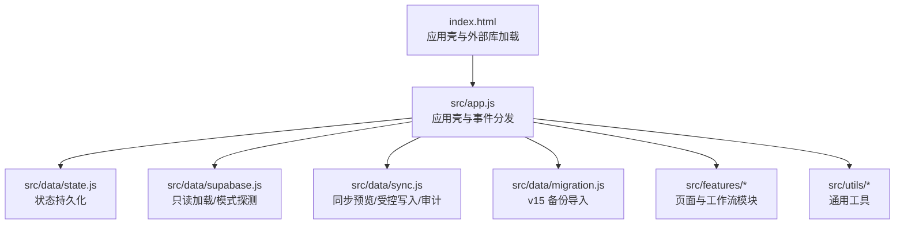
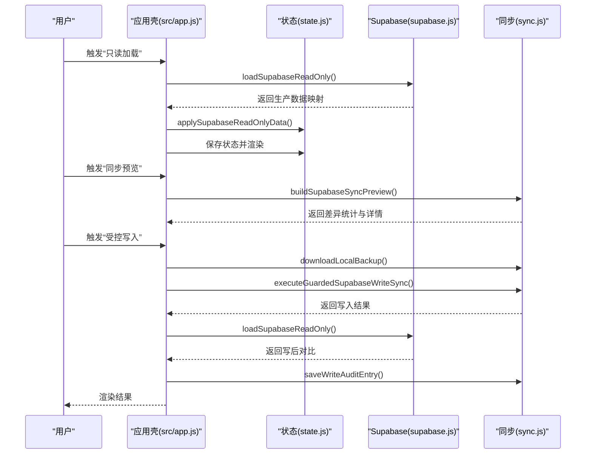
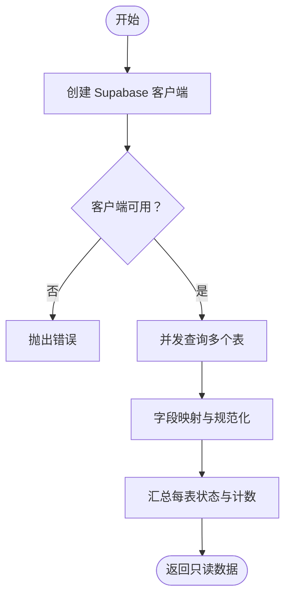
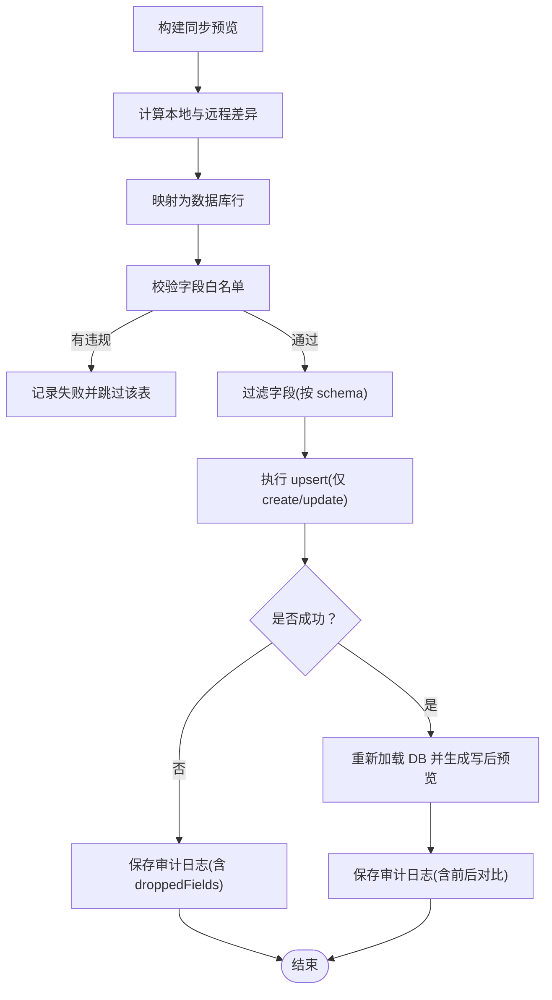
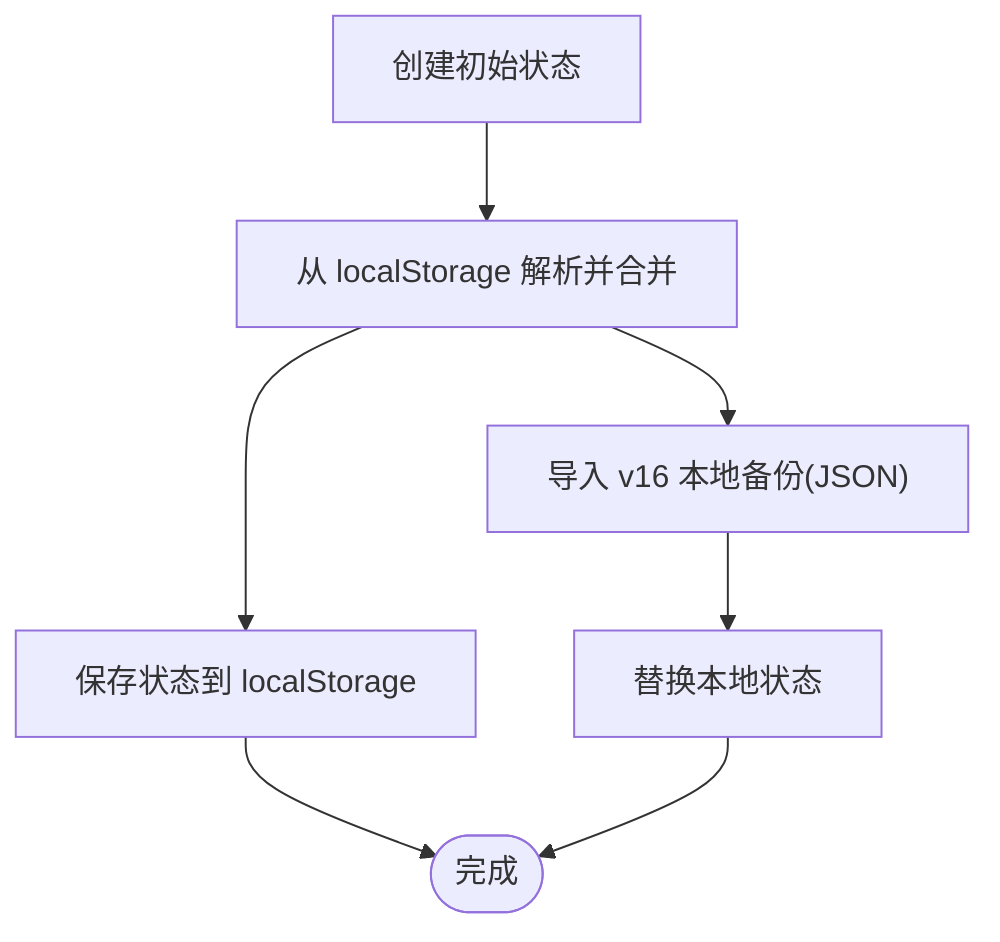
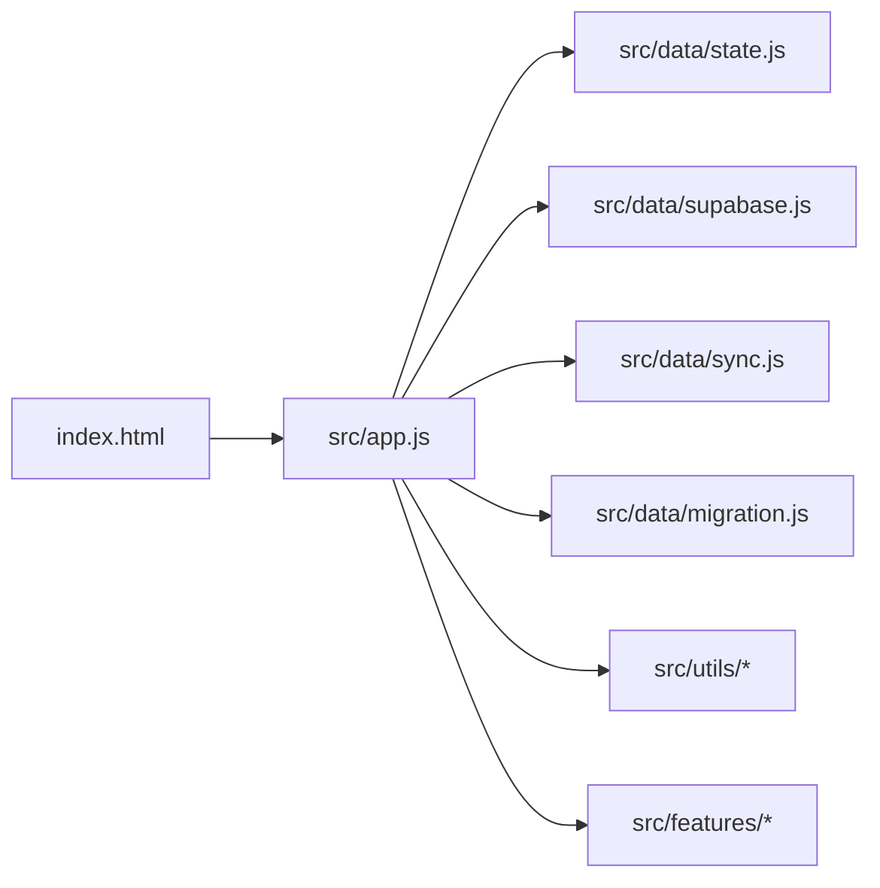

# 部署与维护

<cite>
**本文引用的文件**
- [README.md](file://v16/README.md)
- [MIGRATION_MANIFEST.md](file://v16/MIGRATION_MANIFEST.md)
- [index.html](file://v16/index.html)
- [src/app.js](file://v16/src/app.js)
- [src/data/defaults.js](file://v16/src/data/defaults.js)
- [src/data/state.js](file://v16/src/data/state.js)
- [src/data/supabase.js](file://v16/src/data/supabase.js)
- [src/data/migration.js](file://v16/src/data/migration.js)
- [src/data/sync.js](file://v16/src/data/sync.js)
- [src/utils/README.md](file://v16/src/utils/README.md)
- [smoke-v16.mjs](file://v16/smoke-v16.mjs)
- [smoke-server.mjs](file://v16/smoke-server.mjs)
</cite>

## 目录
1. [简介](#简介)
2. [项目结构](#项目结构)
3. [核心组件](#核心组件)
4. [架构总览](#架构总览)
5. [详细组件分析](#详细组件分析)
6. [依赖关系分析](#依赖关系分析)
7. [性能考虑](#性能考虑)
8. [故障排查指南](#故障排查指南)
9. [结论](#结论)
10. [附录](#附录)

## 简介
本指南面向运维人员，提供 ROV 任务管理 v16 的完整部署与维护手册。v16 是一个本地优先（local-first）的单页应用，采用浏览器端 localStorage 持久化，并通过 Supabase 只读加载生产数据库，支持受控写入同步与回滚机制。本文覆盖生产环境部署、数据备份策略、版本升级流程、Supabase 集成要求与安全配置、性能优化、系统监控与日志管理、故障恢复策略、维护计划与数据迁移、版本兼容性指导以及安全最佳实践与容量规划建议。

## 项目结构
v16 采用模块化组织，核心目录与职责如下：
- 根页面与入口：index.html 引入样式与模块脚本，加载 Supabase 客户端。
- 应用壳与路由：src/app.js 负责状态加载、页面渲染、事件分发与功能入口。
- 数据层：
  - defaults.js 默认数据模板
  - state.js 应用状态初始化、加载与保存
  - supabase.js Supabase 客户端、只读加载、模式探测
  - migration.js v15 备份导入与摘要
  - sync.js 同步预览、受控写入、审计日志与回滚
- 功能模块：features/*（导航、准备中心、任务、竞赛、设置、健康）
- 工具模块：utils/*（DOM、日期、国际化等）
- 测试与验证：smoke-v16.mjs、smoke-server.mjs

图表来源
- [index.html:1-15](file://v16/index.html#L1-L15)
- [src/app.js:1-402](file://v16/src/app.js#L1-L402)

章节来源
- [README.md:10-44](file://v16/README.md#L10-L44)
- [MIGRATION_MANIFEST.md:13-29](file://v16/MIGRATION_MANIFEST.md#L13-L29)

## 核心组件
- 应用壳与事件分发：负责页面渲染、用户交互、状态持久化与功能入口（只读加载、模式探测、同步预览、受控写入、回滚）。
- 状态管理：默认状态、从 localStorage 加载与保存、主数据合并策略。
- Supabase 集成：只读加载、模式探测、受控写入与审计。
- 同步与回滚：构建差异、映射到数据库行、字段白名单过滤、下载本地备份、执行受控 upsert、记录审计日志、回滚本地状态。
- v15 备份导入：标准化导入、摘要统计、主数据保留。

章节来源
- [src/app.js:1-402](file://v16/src/app.js#L1-L402)
- [src/data/state.js:1-45](file://v16/src/data/state.js#L1-L45)
- [src/data/supabase.js:1-157](file://v16/src/data/supabase.js#L1-L157)
- [src/data/sync.js:1-341](file://v16/src/data/sync.js#L1-L341)
- [src/data/migration.js:1-100](file://v16/src/data/migration.js#L1-L100)

## 架构总览
v16 采用“本地优先 + 受控同步”的架构：
- 浏览器端运行，使用 localStorage 存储应用状态。
- 通过 Supabase 客户端进行只读查询，将生产表映射为本地状态。
- 支持同步预览（dry-run），在确认后执行受控 upsert（仅 create/update，禁用删除），并生成审计日志。
- 提供 v16 本地备份与回滚能力，确保可逆性与可恢复性。

图表来源
- [src/app.js:201-299](file://v16/src/app.js#L201-L299)
- [src/data/supabase.js:79-121](file://v16/src/data/supabase.js#L79-L121)
- [src/data/sync.js:150-284](file://v16/src/data/sync.js#L150-L284)

## 详细组件分析

### 组件一：Supabase 只读加载与模式探测
- 只读加载：并发查询多张表，按约定字段映射为本地结构，记录每表加载状态与计数。
- 模式探测：对候选列执行只读 select(column).limit(1)，统计存在/缺失列与覆盖率。
- 安全性：不写入数据库，仅用于预览与受控写入前的 schema 基线。

图表来源
- [src/data/supabase.js:26-29](file://v16/src/data/supabase.js#L26-L29)
- [src/data/supabase.js:79-121](file://v16/src/data/supabase.js#L79-L121)
- [src/data/supabase.js:131-156](file://v16/src/data/supabase.js#L131-L156)

章节来源
- [src/data/supabase.js:1-157](file://v16/src/data/supabase.js#L1-L157)

### 组件二：受控写入同步与审计
- 同步预览：基于本地与只读 DB 的数据计算 create/update/remove 数量与详情。
- 行映射：将本地行映射为数据库行，处理不同表的字段差异。
- 字段白名单：静态 schema 与模式探测结果共同决定允许字段，自动丢弃未确认字段。
- 写入策略：仅 upsert（onConflict=id 或 item_id），禁用删除；失败时记录审计日志。
- 写后校验：成功后重新加载 DB 并生成“写后”预览，对比差异。

图表来源
- [src/data/sync.js:150-178](file://v16/src/data/sync.js#L150-L178)
- [src/data/sync.js:90-118](file://v16/src/data/sync.js#L90-L118)
- [src/data/sync.js:120-148](file://v16/src/data/sync.js#L120-L148)
- [src/data/sync.js:221-284](file://v16/src/data/sync.js#L221-L284)
- [src/data/sync.js:300-340](file://v16/src/data/sync.js#L300-L340)

章节来源
- [src/data/sync.js:1-341](file://v16/src/data/sync.js#L1-L341)

### 组件三：状态持久化与回滚
- 初始化与加载：从 localStorage 结构化克隆默认状态，合并主数据，清空脏标记。
- 保存：序列化当前状态并写入 localStorage，记录保存时间戳。
- 回滚：支持 v16 本地备份 JSON 导入，恢复本地状态，不涉及数据库写入。

图表来源
- [src/data/state.js:6-14](file://v16/src/data/state.js#L6-L14)
- [src/data/state.js:16-33](file://v16/src/data/state.js#L16-L33)
- [src/data/state.js:35-44](file://v16/src/data/state.js#L35-L44)
- [src/data/sync.js:190-205](file://v16/src/data/sync.js#L190-L205)

章节来源
- [src/data/state.js:1-45](file://v16/src/data/state.js#L1-L45)
- [src/data/sync.js:180-205](file://v16/src/data/sync.js#L180-L205)

### 组件四：v15 备份导入与摘要
- 类型校验：检查备份类型与结构完整性。
- 标准化：将 v15 字段映射到 v16 字段，处理布尔、数值与字符串转换。
- 摘要：统计各类实体数量与导出时间、赛季信息。

章节来源
- [src/data/migration.js:1-100](file://v16/src/data/migration.js#L1-L100)

## 依赖关系分析
- 运行时依赖：Supabase 客户端（CDN 引入）、浏览器模块系统。
- 模块依赖：应用壳聚合数据层、功能模块与工具模块；数据层内部协作完成只读加载、同步与回滚。
- 外部接口：localStorage（持久化）、Supabase REST/Realtime（只读查询与 upsert）。

图表来源
- [src/app.js:1-36](file://v16/src/app.js#L1-L36)
- [index.html:11-12](file://v16/index.html#L11-L12)

章节来源
- [src/app.js:1-402](file://v16/src/app.js#L1-L402)
- [index.html:1-15](file://v16/index.html#L1-L15)

## 性能考虑
- 只读加载并发：Promise.allSettled 并发查询多表，减少总等待时间；按需排序（如清单类表）避免无谓排序。
- 字段映射与白名单：在写入前过滤字段，降低无效列传输与数据库开销。
- 本地持久化：localStorage 读写在前端完成，减少网络往返；注意存储上限与序列化成本。
- 审计日志限制：最多保留最近 20 条写入审计，避免无限增长。

章节来源
- [src/data/supabase.js:82-92](file://v16/src/data/supabase.js#L82-L92)
- [src/data/sync.js:300-317](file://v16/src/data/sync.js#L300-L317)

## 故障排查指南
- 只读加载失败
  - 现象：加载状态显示错误信息。
  - 排查：确认 Supabase URL 与密钥可用；检查网络连通性；查看浏览器控制台错误。
  - 处理：重试或切换网络；核对 Supabase 服务状态。
- 同步预览异常
  - 现象：预览构建报错或为空。
  - 排查：确保已先执行只读加载；检查本地数据结构一致性。
  - 处理：重新只读加载后再构建预览。
- 受控写入失败
  - 现象：upsert 报错或被拒绝。
  - 排查：确认输入确认文本；检查字段白名单与 schema 探测结果；查看审计日志中的 droppedFields。
  - 处理：修正字段或等待 schema 更新；必要时回滚本地备份。
- 回滚失败
  - 现象：导入 v16 本地备份失败。
  - 排查：确认备份 JSON 类型与结构正确；检查浏览器控制台错误。
  - 处理：重新导出有效备份；核对备份版本兼容性。

章节来源
- [src/app.js:226-241](file://v16/src/app.js#L226-L241)
- [src/app.js:243-261](file://v16/src/app.js#L243-L261)
- [src/app.js:262-299](file://v16/src/app.js#L262-L299)
- [src/data/sync.js:190-205](file://v16/src/data/sync.js#L190-L205)

## 结论
v16 通过本地优先与受控同步实现了生产数据的安全接入与可控变更。结合只读加载、模式探测、字段白名单与审计日志，能够在保障数据一致性的前提下进行增量更新。配合本地备份与回滚能力，运维可在变更前获得充分的安全缓冲。建议在生产环境中严格遵循“先预览、再确认、后写入、再校验”的流程，并定期进行健康检查与备份演练。

## 附录

### 生产环境部署步骤
- 准备静态服务器：部署 index.html 与 src/、styles/ 下的资源，确保模块脚本可被浏览器解析。
- 配置 Supabase：确保 Supabase URL 与匿名访问密钥可用；若需自定义密钥，请在部署前替换相应常量。
- 启动与验证：
  - 使用零依赖 smoke 脚本验证模块装配与功能入口。
  - 使用 smoke-server 脚本验证模块图与静态资源可访问性。
- 首次使用：在设置面板执行只读加载，随后进行同步预览与受控写入。

章节来源
- [README.md:55-67](file://v16/README.md#L55-L67)
- [smoke-v16.mjs:1-111](file://v16/smoke-v16.mjs#L1-L111)
- [smoke-server.mjs:1-72](file://v16/smoke-server.mjs#L1-L72)

### 数据备份策略
- v15 备份导入：支持从 v15 备份 JSON 导入，标准化字段并保留主数据。
- v16 本地备份：导出当前本地状态为 JSON，命名包含赛季与日期，便于归档与回滚。
- 审计日志：记录每次受控写入的预览、结果、丢弃字段与写后对比，最多保留最近 20 条。

章节来源
- [src/data/migration.js:75-99](file://v16/src/data/migration.js#L75-L99)
- [src/data/sync.js:180-219](file://v16/src/data/sync.js#L180-L219)
- [src/data/sync.js:300-340](file://v16/src/data/sync.js#L300-L340)

### 版本升级流程
- 升级前准备：执行一次 v16 本地备份，确保可回滚。
- 执行受控写入：在设置面板进行同步预览，确认差异后输入确认文本，执行受控 upsert。
- 写后校验：重新加载 DB 并生成“写后”预览，比对差异，确认无误后完成升级。
- 回滚路径：若升级失败，使用 v16 本地备份 JSON 回滚至升级前状态。

章节来源
- [src/app.js:262-299](file://v16/src/app.js#L262-L299)
- [src/data/sync.js:221-284](file://v16/src/data/sync.js#L221-L284)

### Supabase 集成要求与安全配置
- 集成要求：在 index.html 中引入 Supabase 客户端；在数据层提供 URL 与密钥常量。
- 安全配置：匿名访问密钥仅用于只读加载与受控 upsert；受控写入禁用删除，字段白名单过滤，写后校验。
- 性能优化：并发只读查询、按需排序、字段白名单过滤、最小化传输。

章节来源
- [index.html:11-12](file://v16/index.html#L11-L12)
- [src/data/supabase.js:1-3](file://v16/src/data/supabase.js#L1-L3)
- [src/data/sync.js:9-17](file://v16/src/data/sync.js#L9-L17)
- [src/data/sync.js:221-284](file://v16/src/data/sync.js#L221-L284)

### 系统监控、日志管理与故障恢复
- 监控：利用设置面板的健康检查与烟雾测试报告，关注数据健康问题与模块装配状态。
- 日志：受控写入审计日志记录预览、结果、丢弃字段与写后对比；可通过设置面板查看。
- 故障恢复：使用 v16 本地备份 JSON 回滚至任意历史状态；若写入失败，可立即回滚并重新评估。

章节来源
- [src/app.js:66-102](file://v16/src/app.js#L66-L102)
- [src/app.js:133-139](file://v16/src/app.js#L133-L139)
- [src/data/sync.js:300-340](file://v16/src/data/sync.js#L300-L340)

### 维护计划、数据迁移与版本兼容
- 维护计划：定期执行只读加载与健康检查；在变更窗口内进行受控写入与写后校验。
- 数据迁移：v15 备份导入支持任务、成员、清单、预潜水检、运行、装备、笔记与策略等实体的标准化迁移。
- 版本兼容：受控写入通过字段白名单与 schema 探测保证兼容性；审计日志记录字段变化，便于追踪。

章节来源
- [src/data/migration.js:60-99](file://v16/src/data/migration.js#L60-L99)
- [src/data/sync.js:120-148](file://v16/src/data/sync.js#L120-L148)

### 安全最佳实践与容量规划
- 安全最佳实践：
  - 仅使用匿名访问密钥进行只读与受控 upsert。
  - 严格启用字段白名单与 schema 探测，避免未知字段写入。
  - 在受控写入前下载本地备份，确保可回滚。
- 容量规划：
  - localStorage 存储有限，建议控制单次备份体积与审计日志条目数量。
  - 并发只读查询应根据表规模与网络状况调整，避免超时。

章节来源
- [src/data/sync.js:9-17](file://v16/src/data/sync.js#L9-L17)
- [src/data/sync.js:300-317](file://v16/src/data/sync.js#L300-L317)