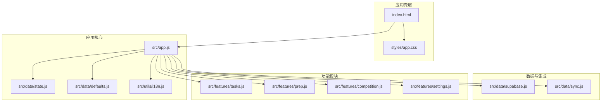
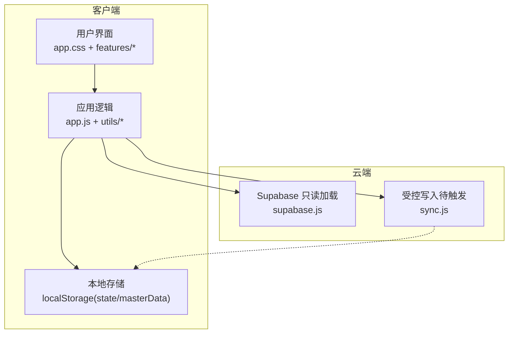
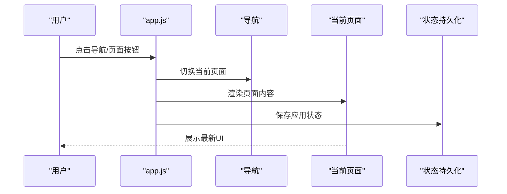
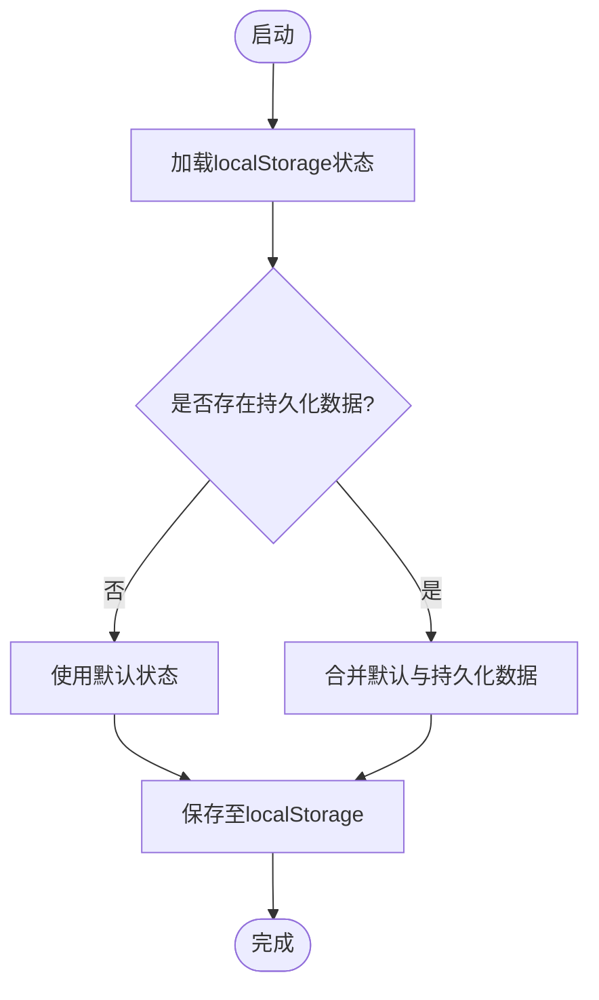
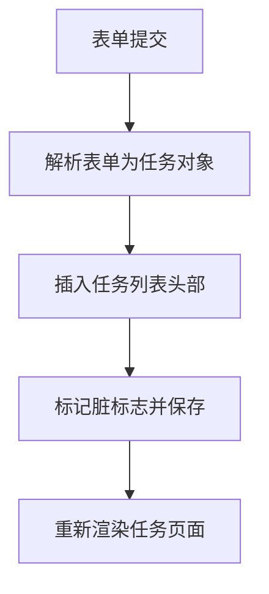
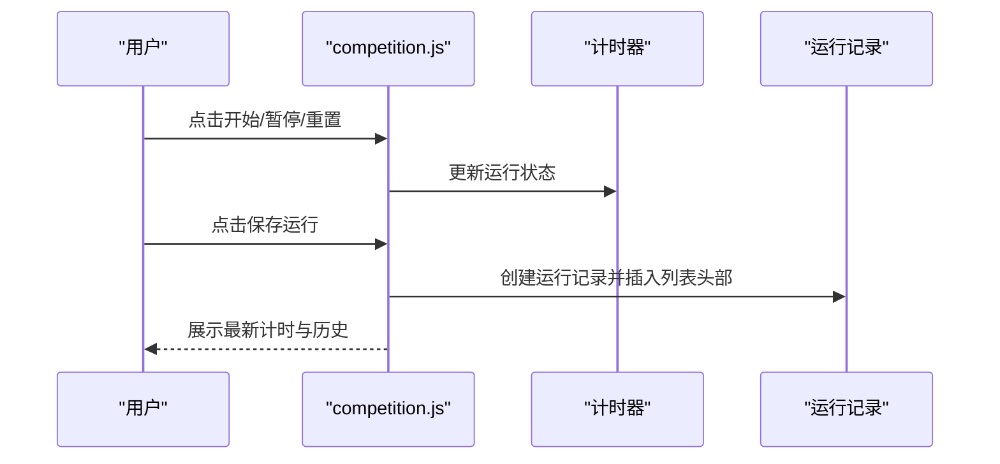
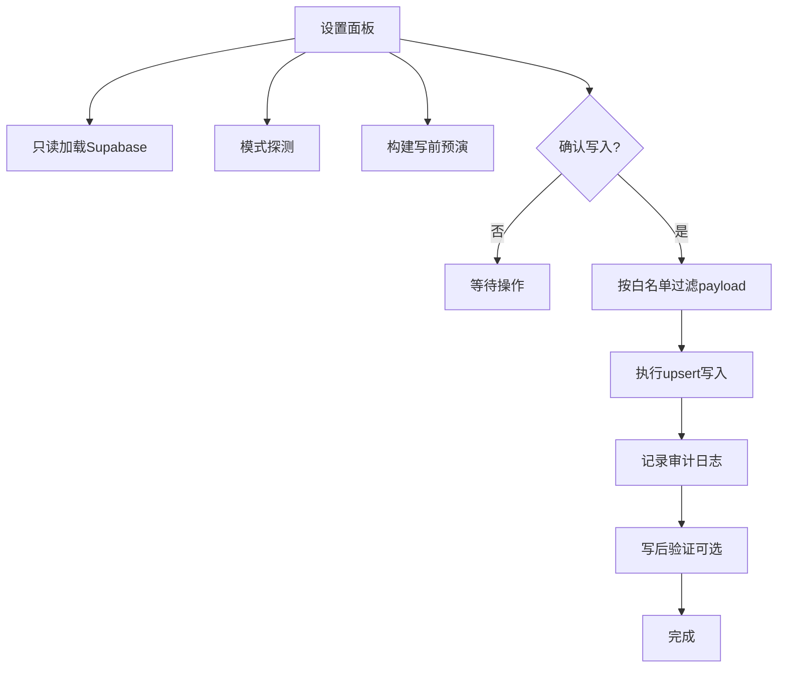
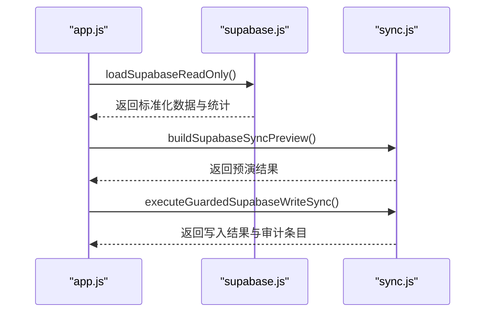
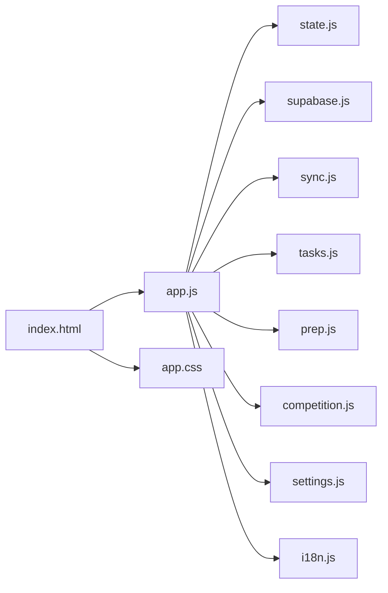

# 项目概述

<cite>
**本文档引用的文件**
- [README.md](file://v16/README.md)
- [MIGRATION_MANIFEST.md](file://v16/MIGRATION_MANIFEST.md)
- [index.html](file://v16/index.html)
- [app.js](file://v16/src/app.js)
- [state.js](file://v16/src/data/state.js)
- [defaults.js](file://v16/src/data/defaults.js)
- [supabase.js](file://v16/src/data/supabase.js)
- [sync.js](file://v16/src/data/sync.js)
- [tasks.js](file://v16/src/features/tasks.js)
- [competition.js](file://v16/src/features/competition.js)
- [settings.js](file://v16/src/features/settings.js)
- [i18n.js](file://v16/src/utils/i18n.js)
- [app.css](file://v16/styles/app.css)
- [smoke-v16.mjs](file://v16/smoke-v16.mjs)
- [smoke-server.mjs](file://v16/smoke-server.mjs)
</cite>

## 目录
1. [引言](#引言)
2. [项目结构](#项目结构)
3. [核心组件](#核心组件)
4. [架构总览](#架构总览)
5. [详细组件分析](#详细组件分析)
6. [依赖关系分析](#依赖关系分析)
7. [性能考量](#性能考量)
8. [故障排除指南](#故障排除指南)
9. [结论](#结论)
10. [附录](#附录)

## 引言
ROV任务管理v16是一个本地优先（local-first）的单页应用（SPA），旨在为ROV团队提供任务管理、准备检查清单、竞赛计时与记录、设置中心与数据迁移等核心能力。该项目从v15的单文件应用中拆分出更小、更安全的模块，采用纯前端架构，结合localStorage持久化与可选的Supabase只读加载与受保护写入同步机制，确保在生产环境中的安全性与可追溯性。

- 设计理念：本地优先（离线可用、数据主权）、模块化（按功能域拆分）、安全可控（只读加载、写前预演、白名单过滤、审计日志）。
- 技术架构：HTML/CSS/JS单页应用，ES模块组织，浏览器原生localStorage持久化，Supabase只读查询与受控写入。
- 与v15的关系：v15保持不变作为生产回退；v16是独立的本地优先构建，二者通过备份导入/回滚实现数据互通。

章节来源
- [README.md:1-68](file://v16/README.md#L1-L68)
- [MIGRATION_MANIFEST.md:1-76](file://v16/MIGRATION_MANIFEST.md#L1-L76)

## 项目结构
v16采用清晰的功能域划分与职责分离：
- 根入口：index.html加载样式与模块脚本，挂载应用根节点。
- 数据层：state（状态持久化）、defaults（默认数据）、supabase（只读加载/模式探测）、sync（写前预演/受控写入/审计）。
- 功能模块：tasks（任务）、prep（准备/预潜水清单）、competition（竞赛计时与运行历史）、settings（设置中心/设置包/迁移）。
- 工具层：i18n（多语言）、date（日期工具）、dom（DOM辅助）、index（通用工具）。
- 样式：app.css（主题变量、布局、卡片、表格、响应式与竞赛模式样式）。

图表来源
- [index.html:1-15](file://v16/index.html#L1-L15)
- [app.js:1-402](file://v16/src/app.js#L1-L402)
- [state.js:1-45](file://v16/src/data/state.js#L1-L45)
- [supabase.js:1-157](file://v16/src/data/supabase.js#L1-L157)
- [sync.js:1-341](file://v16/src/data/sync.js#L1-L341)
- [tasks.js:1-112](file://v16/src/features/tasks.js#L1-L112)
- [competition.js:1-68](file://v16/src/features/competition.js#L1-L68)
- [settings.js:1-592](file://v16/src/features/settings.js#L1-L592)
- [i18n.js:1-217](file://v16/src/utils/i18n.js#L1-L217)
- [app.css:1-429](file://v16/styles/app.css#L1-L429)

章节来源
- [README.md:10-26](file://v16/README.md#L10-L26)
- [MIGRATION_MANIFEST.md:13-29](file://v16/MIGRATION_MANIFEST.md#L13-L29)

## 核心组件
- 应用壳与路由：index.html提供应用根节点与样式加载；app.js负责页面渲染调度、事件绑定、状态持久化与Supabase交互。
- 状态管理：state.js定义localStorage键、初始状态合并策略与保存逻辑；defaults.js提供种子数据。
- 功能模块：
  - 任务管理：tasks.js提供表单解析、增删改查、统计与表格渲染。
  - 竞赛计时：competition.js提供计时器、运行记录与历史展示。
  - 设置中心：settings.js提供主数据编辑、设置包导出/导入、迁移摘要、写入审计等。
- 数据集成：supabase.js提供只读加载、模式探测；sync.js提供写前预演、受控写入、审计日志与回滚支持。
- 国际化：i18n.js提供中英双语字符串与本地化切换。
- 样式系统：app.css提供主题变量、布局网格、卡片、表格、响应式与竞赛专注模式样式。

章节来源
- [app.js:38-187](file://v16/src/app.js#L38-L187)
- [state.js:4-44](file://v16/src/data/state.js#L4-L44)
- [defaults.js:1-46](file://v16/src/data/defaults.js#L1-L46)
- [tasks.js:5-112](file://v16/src/features/tasks.js#L5-L112)
- [competition.js:6-68](file://v16/src/features/competition.js#L6-L68)
- [settings.js:79-592](file://v16/src/features/settings.js#L79-L592)
- [supabase.js:79-157](file://v16/src/data/supabase.js#L79-L157)
- [sync.js:150-341](file://v16/src/data/sync.js#L150-L341)
- [i18n.js:1-217](file://v16/src/utils/i18n.js#L1-L217)
- [app.css:1-429](file://v16/styles/app.css#L1-L429)

## 架构总览
v16采用“本地优先 + 受控云端”的混合架构：
- 本地优先：所有用户操作与状态变更首先在浏览器内完成，通过localStorage持久化，保证离线可用与数据主权。
- 受控云端：Supabase仅用于只读加载与模式探测，写入路径通过“写前预演 + 白名单过滤 + 审计日志 + 回滚”四重保障。
- 单页应用：基于模块脚本与事件委托，实现页面级渲染与导航切换，避免整页刷新。

图表来源
- [app.js:14-344](file://v16/src/app.js#L14-L344)
- [supabase.js:79-157](file://v16/src/data/supabase.js#L79-L157)
- [sync.js:221-284](file://v16/src/data/sync.js#L221-L284)
- [state.js:35-44](file://v16/src/data/state.js#L35-L44)

## 详细组件分析

### 应用壳与页面渲染（app.js）
- 职责：初始化状态、加载主数据、渲染导航与当前页面、处理用户交互、持久化状态。
- 关键流程：事件委托处理导航、任务状态变更、清单切换、计时器控制、Supabase只读加载、写前预演与受控写入。
- 持久化：统一保存应用状态与主数据，支持即时渲染更新。

图表来源
- [app.js:104-131](file://v16/src/app.js#L104-L131)
- [app.js:141-145](file://v16/src/app.js#L141-L145)
- [app.js:60-64](file://v16/src/app.js#L60-L64)

章节来源
- [app.js:14-344](file://v16/src/app.js#L14-L344)

### 状态管理（state.js + defaults.js）
- 职责：提供初始状态、合并持久化数据、保存状态到localStorage。
- 默认数据：包含任务、成员、清单、预潜水清单、运行记录、装备等种子数据。
- 主数据：按赛季隔离存储，支持主数据编辑与去重排序。

图表来源
- [state.js:16-44](file://v16/src/data/state.js#L16-L44)
- [defaults.js:1-46](file://v16/src/data/defaults.js#L1-46)

章节来源
- [state.js:4-44](file://v16/src/data/state.js#L4-L44)
- [defaults.js:1-46](file://v16/src/data/defaults.js#L1-L46)

### 任务管理（tasks.js）
- 职责：表单解析、任务增删改、状态变更、统计计算、表格渲染。
- 特性：支持优先级徽章、逾期高亮、阻塞标记、分类筛选与删除确认。

图表来源
- [tasks.js:5-37](file://v16/src/features/tasks.js#L5-L37)
- [tasks.js:84-112](file://v16/src/features/tasks.js#L84-L112)

章节来源
- [tasks.js:5-112](file://v16/src/features/tasks.js#L5-L112)

### 竞赛计时（competition.js）
- 职责：计时器运行/暂停/重置、运行记录保存、历史展示。
- 特性：秒数格式化、分数输入、备注记录、最近运行历史展示。

图表来源
- [app.js:147-177](file://v16/src/app.js#L147-L177)
- [app.js:332-343](file://v16/src/app.js#L332-L343)
- [competition.js:6-68](file://v16/src/features/competition.js#L6-L68)

章节来源
- [competition.js:6-68](file://v16/src/features/competition.js#L6-L68)

### 设置中心（settings.js）
- 职责：主数据编辑（角色、组、任务类型、装备分类）、设置包导出/导入、v15备份导入、Supabase只读加载、模式探测、写前预演、受控写入、审计日志、v16本地回滚。
- 安全机制：写入需确认文本、表白名单过滤、字段白名单、禁用删除、写后验证、审计日志最多20条。

图表来源
- [settings.js:156-592](file://v16/src/features/settings.js#L156-L592)
- [sync.js:221-284](file://v16/src/data/sync.js#L221-L284)
- [supabase.js:131-157](file://v16/src/data/supabase.js#L131-L157)

章节来源
- [settings.js:121-592](file://v16/src/features/settings.js#L121-L592)
- [sync.js:9-341](file://v16/src/data/sync.js#L9-L341)
- [supabase.js:15-157](file://v16/src/data/supabase.js#L15-L157)

### Supabase集成（supabase.js + sync.js）
- 只读加载：并发查询多个表，标准化数据结构，记录加载耗时与错误。
- 模式探测：对候选列执行select(column).limit(1)探测，统计覆盖率。
- 写前预演：对比本地状态与只读数据，统计create/update/remove数量与详情。
- 受控写入：白名单过滤payload，按冲突键upsert，禁用删除，记录审计日志，支持写后验证。

图表来源
- [app.js:226-241](file://v16/src/app.js#L226-L241)
- [app.js:243-260](file://v16/src/app.js#L243-L260)
- [app.js:262-299](file://v16/src/app.js#L262-L299)
- [supabase.js:79-121](file://v16/src/data/supabase.js#L79-L121)
- [sync.js:150-284](file://v16/src/data/sync.js#L150-L284)

章节来源
- [supabase.js:79-157](file://v16/src/data/supabase.js#L79-L157)
- [sync.js:150-341](file://v16/src/data/sync.js#L150-L341)

### 国际化（i18n.js）
- 支持中英双语，提供本地化字符串与切换逻辑，UI中大量文案来自该模块。
- 本地存储键用于记住用户语言偏好。

章节来源
- [i18n.js:1-217](file://v16/src/utils/i18n.js#L1-L217)

### 样式系统（app.css）
- 提供主题变量、布局网格、卡片、表格、响应式设计与竞赛专注模式样式。
- 支持浅色/深色主题与系统偏好适配。

章节来源
- [app.css:1-429](file://v16/styles/app.css#L1-L429)

## 依赖关系分析
- 模块依赖：app.js集中导入各功能模块与数据模块，形成清晰的依赖图。
- 外部依赖：仅通过CDN引入Supabase JS库，其余均为原生模块与本地资源。
- 事件驱动：通过事件委托处理导航、任务、清单、计时器与设置面板操作。

图表来源
- [app.js:1-36](file://v16/src/app.js#L1-L36)
- [index.html:11-12](file://v16/index.html#L11-L12)

章节来源
- [app.js:1-36](file://v16/src/app.js#L1-L36)
- [index.html:11-12](file://v16/index.html#L11-L12)

## 性能考量
- 模块化加载：通过ES模块按需加载，减少首屏负担。
- 本地优先：大部分操作在浏览器内完成，避免网络往返。
- 批量只读加载：Supabase只读加载采用Promise.allSettled并发查询，提升整体性能。
- 写前预演：先计算差异再发起写入，减少无效请求。
- 本地持久化：localStorage读写开销低，适合频繁交互场景。

## 故障排除指南
- 启动失败（模块未找到）：使用服务器烟雾测试脚本验证模块图是否完整。
  - 运行：node smoke-server.mjs
- 模块导入问题：使用零依赖烟雾测试脚本检查模块片段是否存在。
  - 运行：node smoke-v16.mjs
- Supabase连接失败：检查CDN加载与客户端初始化，确认URL与密钥配置。
- 写入被拒绝：确认已输入正确的确认文本、未勾选删除表、字段符合白名单。
- 审计日志异常：检查localStorage键与条目数量限制。

章节来源
- [smoke-server.mjs:1-72](file://v16/smoke-server.mjs#L1-L72)
- [smoke-v16.mjs:1-111](file://v16/smoke-v16.mjs#L1-L111)
- [sync.js:300-317](file://v16/src/data/sync.js#L300-L317)

## 结论
v16以本地优先为核心，通过模块化与受控云端集成，实现了安全、可追溯且易维护的任务管理平台。其单页应用架构与严格的写入安全机制，使其既能满足日常高效工作流，又能应对生产环境的合规要求。与v15并行存在，既保证了生产稳定性，又为后续演进提供了实验空间。

## 附录
- 实际使用场景与功能演示建议：
  - 日常任务管理：在任务页面创建任务、分配负责人、设置截止日期与优先级，实时查看逾期与阻塞状态。
  - 准备与预潜水：在准备中心勾选每日清单与预潜水清单，记录完成情况。
  - 竞赛计时：在竞赛中心启动计时器，记录每次运行的分数与备注，查看历史运行。
  - 设置中心：在设置中心进行主数据编辑、导出/导入设置包、只读加载Supabase数据、构建写前预演、执行受控写入并查看审计日志。
  - v15迁移：通过设置中心导入v15备份JSON，将旧数据映射到v16本地状态。
  - 回滚恢复：在设置中心从v16本地备份JSON恢复，不涉及云端写入。

章节来源
- [README.md:27-44](file://v16/README.md#L27-L44)
- [MIGRATION_MANIFEST.md:58-76](file://v16/MIGRATION_MANIFEST.md#L58-L76)